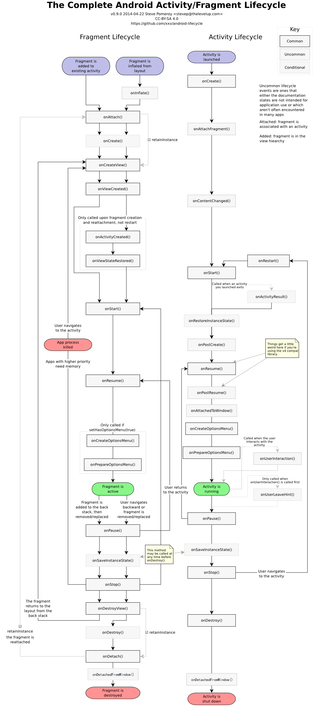
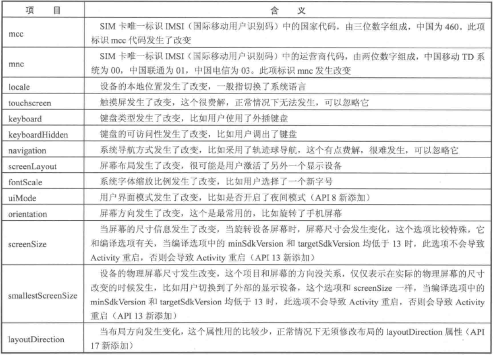
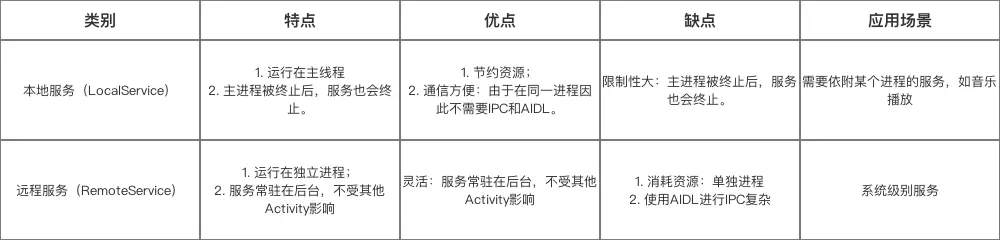

<!-- TOC -->

- [一、生命周期](#%E4%B8%80%E7%94%9F%E5%91%BD%E5%91%A8%E6%9C%9F)
  - [1.1 Activity 的生命周期](#11-activity-%E7%9A%84%E7%94%9F%E5%91%BD%E5%91%A8%E6%9C%9F)
  - [1.2 Fragment 的生命周期](#12-fragment-%E7%9A%84%E7%94%9F%E5%91%BD%E5%91%A8%E6%9C%9F)
    - [1.2.1 Fragment 之间切换](#121-fragment-%E4%B9%8B%E9%97%B4%E5%88%87%E6%8D%A2)
  - [1.3 onSaveInstanceState() 和 onRestoreInstanceState()](#13-onsaveinstancestate-%E5%92%8C-onrestoreinstancestate)
  - [1.4 其余情况补充](#14-%E5%85%B6%E4%BD%99%E6%83%85%E5%86%B5%E8%A1%A5%E5%85%85)
  - [1.5 Application 的生命周期](#15-application-%E7%9A%84%E7%94%9F%E5%91%BD%E5%91%A8%E6%9C%9F)
- [二、Activity 标签属性](#%E4%BA%8Cactivity-%E6%A0%87%E7%AD%BE%E5%B1%9E%E6%80%A7)
- [三、Activity LaunchMode](#%E4%B8%89activity-launchmode)
  - [3.1 FLAG](#31-flag)
  - [3.2 补充说明](#32-%E8%A1%A5%E5%85%85%E8%AF%B4%E6%98%8E)
- [四、IntentFilter 的匹配规则](#%E5%9B%9Bintentfilter-%E7%9A%84%E5%8C%B9%E9%85%8D%E8%A7%84%E5%88%99)
  - [4.1 action 的匹配规则](#41-action-%E7%9A%84%E5%8C%B9%E9%85%8D%E8%A7%84%E5%88%99)
  - [4.2 category 的匹配规则](#42-category-%E7%9A%84%E5%8C%B9%E9%85%8D%E8%A7%84%E5%88%99)
  - [4.3 data 的匹配规则](#43-data-%E7%9A%84%E5%8C%B9%E9%85%8D%E8%A7%84%E5%88%99)
  - [4.4 注意事项](#44-%E6%B3%A8%E6%84%8F%E4%BA%8B%E9%A1%B9)
- [五、Service](#%E4%BA%94service)
  - [5.1 Androidmanifest Serivce 属性说明](#51-androidmanifest-serivce-%E5%B1%9E%E6%80%A7%E8%AF%B4%E6%98%8E)
  - [5.2 前台 Service 和后台 Service](#52-%E5%89%8D%E5%8F%B0-service-%E5%92%8C%E5%90%8E%E5%8F%B0-service)
  - [5.3 远程 Service](#53-%E8%BF%9C%E7%A8%8B-service)
  - [5.4 IntentSerivce](#54-intentserivce)
- [六、BroadcastReceiver](#%E5%85%ADbroadcastreceiver)
  - [6.1 BroadcastReceiver 的使用](#61-broadcastreceiver-%E7%9A%84%E4%BD%BF%E7%94%A8)
  - [6.2 广播类型](#62-%E5%B9%BF%E6%92%AD%E7%B1%BB%E5%9E%8B)
- [参考资料](#%E5%8F%82%E8%80%83%E8%B5%84%E6%96%99)

<!-- /TOC -->


# 一、生命周期

以下描述是正常情况下 Fragment 直接写在 Activity xml 文件下的生命周期图：

<div align ="center">  </div><br>

## 1.1 Activity 的生命周期

正常情况下，Activity 会经历以下生命周期。

（1）onCreate：
Activity 正在被创建，一般做一些初始化的操作，如果在该方法调用 **finish()**，下一个生命周期方法会运行 **onDestroy()**。

 (2) onAttachFragment()：执行于 Fragment onAttach() 后，即与 Fragment 关联后。

（3）onRestart：Activity 从 **不可见** 重新变为 **可见状态** 时调用。

（4）onStart：Activity 处于 **可见** 的，但还没有出现在 **前台**，不可交互。

（5）onResume：Activity 处于 **可见** 的，并出现在 **前台**，可交互。

（6）onPause：Activity 正在停止，但还处于 **可见的**。该方法不能太耗时，因为该方法先于新 Activity 的 **onResume** 执行。

（6）onStop：Activity 即将停止，Activity 处于 **不可见** 的。
 
（7）onDestroy：Activity 即将销毁，回收工作以及资源释放。

而非正常情况下（App 被系统强杀），onStop()，onDestory() 就不会执行。

## 1.2 Fragment 的生命周期

（1）onAttach：Fragment 和 Activity 相关联时回调。

（2）onCreate：初始化 Fragment，该方法在整个 Fragment 生命周期期间只调用一次。

（3）onCreateView：创建 Fragment 视图。

（4）onViewCreated：Fragment 视图创建完成，执行于 Activity 的 super.onCreate() 中。

（5）onActivityCreated：Activity 的 onCreate() 已经执行完成，该方法执行于 Activity 的 super.onStart() 期间。

（6）onStart：Fragment 处于 **可见** 的，但还没有出现在 **前台**，不可交互。

（7）onResume：Fragment 处于 **可见** 的，但还没有出现在 **前台**，可交互。

（8）onPause：Fragment 正在停止，但还处于 **可见的**。该方法不能太耗时，因为该方法先于新 Activity 的 **onResume** 执行。

（9）onStop：Fragment 即将停止，Fragment 处于 **不可见** 的。

（10）onDestroyView：销毁 Fragment 的视图时回调。

（11）onDestroy：销毁 Fragment 时回调。

（12）onDetach：Fragment 与 Activity 解除关联时回调。

若 Fragment 在 Activity super.onCreate() 后调用 commitNow() add Fragment，则 Activity onCreate() 到 onContentChanged() 之间的 Fragment 生命周期执行顺序向后顺延，不同在于 onViewCreated 执行在 Activity super.onStart() 期间。

同样的场景，若调用 commit(),则被 Hanlder post 出去直至 Activity super.onStart() 期间顺延执行所有 Fragment onStart() 之前的生命周期。

其它时候的调用，同理按照 Fragment action 执行的时机去变化相应 Fragment 的生命周期执行时机。

- isAdded：Fragment 被添加到 Activity 中时，返回 true。
- isDetached：Fragment 从 UI 中分离，返回 true。（注：此字段只在 commit FragmentTransaction.detach 中被置为 true）。
- isRemoving：Fragment 从 Activity 中移除，返回 true，（注：此字段只在 commit FragmentTransaction.remove 中被置为 true，源码逻辑和 detach 几乎一模一样）。
- isHidden（onHiddenChanged）：只在 FragmentTransaction.show（hide）修改或回调。

### 1.2.1 Fragment 之间切换

（1）通过 add、show、hide 方式切换 Fragment。

在两个 Fragment 都已经 add 后的情况下，使用 show、hide 切换显示 Fragment，不走任何生命周期方法但是会回调 onHiddenChanged()。

（2）通过 replace 方式切换 Fragment。

在先 replace 为 FragmentA 的基础上，replace FragmentB。

FragmentB onAttach -> FragmentB onCreate -> FragmentA onPause -> FragmentA onStop -> FragmentA onDestroyView ->FragmentA onDestroy -> FragmentA onDetach -> FragmentB onCreateView -> FragmentB onViewCreated -> FragmentB onActivityCreated 

若将该次事务加入 Fragment 栈 (调用 addToBackStack())，不会调用 FragmentA onDestroy() 和 onDetach()，replace 回 FragmentA 时则从 onCreateView() 开始。

（3）通过 ViewPager 切换 Fragment。

在 Fragment 没有被销毁的情况切换（需使用 FragmentPagerAdapter），只会回调 setUserVisVleHint(boolean isVisibleToUser) 方法。

## 1.3 onSaveInstanceState() 和 onRestoreInstanceState()

当 Activity 被意外终止时或容易被销毁时，Activity 调用 onSaveInstanceState() 去保存数据，然后 Activity 委托 Window 去保存数据，接着 Window 再委托它上面的顶级容器去保存数据，一般是 DecordView。顶层容器再去一一通知它的子元素保存数据（写在 super 上面先于子元素保存，反之后于）。

onSaveInstanceState() 的调用时机：Activity 容易被销毁的时候调用, 注意是容易被销毁, 也可能没有销毁就调用了。因此一定在 onDestroy() 之前，onPause() 之后（停止与用户交互以正确的保存信息），一般在 onStop() 之后。

例如以下情况皆会调用：

- 按下 Home 键 : Activity 进入了后台, 此时会调用该方法;
- 按下电源键 : 屏幕关闭, Activity 进入后台;
- 启动其它 Activity : Activity 被压入了任务栈的栈底;
- 横竖屏切换 : 会销毁当前 Activity 并重新创建;

## 1.4 其余情况补充

（1）异常重建（包括系统配置发送改变）的生命周期：

onPause -> onStop-> onSaveInstanceState -> onDestroy -> onCreate -> onStart -> onRestoreInstanceState -> onResume

若不想在某个系统配置发生变化时重建 Activity，可给指定 Activity 配置 **configChanges**。并在配置发生变化时回调 onConfigurationChanged。

（2）除了 Fragment 通过设置 setRetainInstance(true) 可以在 **系统配置发送改变** 导致的重建时保留原来的实例对象之外。其它情况（例如被系统杀死或系统配置发生变化）的 Activity 和 Fragment 发生的重建，都是生成新的实例对象，这些情况若要对数据进行恢复，依旧需要使用 onSaveInstanceState() 和 onRestoreInstanceState()。此外若想在 **系统配置发送改变** 导致的重建保留想要的数据还可以通过 ViewModel 去实现。

（3）对于异常重建的 Fragment，Fragment onCreate() 之前（包括 onCreate()）的生命周期按照 **生命周期图** 走，之后的生命周期（onCreateView() - onStart()）执行于 Activity onStart() 期间。

（4）各种复杂场景下的方法执行顺序：

onCreate（onConfigurationChanged）-> onActivityResult（A）-> onNewIntent -> onRestart -> onStart -> onRestoreInstanceState -> onActivityResult（B）-> onResume

使用 startActivityForResult 开启目标 Activity 时，将忽略目标 Activity 设置的启动模式，统一以 standard 处理。若 Intent 添加 FLAG_ACTIVITY_NEW_TASK ，则 startActivityForResult 后会立即回调 onActivityResult（对应 onActivityResult（A）），并以目标 Activity 的启动模式启动目标 Activity。其它正常使用的情况皆为 onActivityResult（B），注意若 Activity 是重建后的 Activity，那么会先初始化 Activity ，再执行 onRestoreInstanceState，再执行 onActivityResult（B），此时应该针对实际业务需求，再 onActivityResult 中进行判断，最后的结果应当是要不完全恢复正确的结果，要不不恢复保留初始化后的结果（即在 onActivityResult 判断当前界面是否是重建后的调用）。

（5） Activity A 跳转到 Activity B（不透明）的生命周期为：onPause（A）-> onCreate(B) -> onStart(B) -> onResume(B) -> onStop(A) ，在 onPause(A) post 出去的 Message 先于 onStop（B）执行，晚于 onResume(B) 执行。

## 1.5 Application 的生命周期

（1）onCreate：程序创建的时候执行。

（2）onTerminate：程序终止的时候执行。

（3）onLowMemory：系统正运行于低内存的状态并且你的进程正处于容易被杀死的位置，此处应该释放非必要的资源。

（4）onTrimMemory：程序在内存清理的时候执行。

（5）onConfigurationChanged：系统配置发送变化时回调。

这里重点记录一下 onTrimMemory(int level) 中的 level 含义。

- TRIM_MEMORY_COMPLETE：该进程正处于后台进程 LRU 列表中最容易被杀掉的位置, 你应该释放任何不影响你的 App 运行的资源。
- TRIM_MEMORY_MODERATE：该进程位于接近 LRU 列表的中部位置，释放内存可以帮助进程存活更久，并获得更好的整体性能。
- TRIM_MEMORY_BACKGROUND：该过程已进入 LRU 列表的上端。可以释放容易恢复的资源，如果用户返回应用程序，可以高效快速地重建这些资源。
- TRIM_MEMORY_UI_HIDDEN：该进程的 UI 已经不可见了。即用户点击了 Home 键或者 Back 键导致应用的 UI 界面不可见．这时候可以释放一些资源。
- TRIM_MEMORY_RUNNING_CRITICAL：该进程本不是一个将被杀死的后台进程，但设备的内存运行极低,无法保持任何后台进程运行。您的运行进程应该释放尽可能多的非关键资源，以便允许在其他地方使用该内存。
- TRIM_MEMORY_RUNNING_LOW：设备内存不足。您的运行进程应释放不需要的资源，以便在其他地方使用内存。
- TRIM_MEMORY_RUNNING_MODERATE：该设备的内存开始紧缺。您的正在运行的进程可能希望释放一些不需要的资源以便在其他地方使用。

# 二、Activity 标签属性

以下是常用的 Activity 标签属性。

- launchMode：Activity 启动模式

- taskAffinity：Activity 所属任务栈。

- configChanges：如果你不想因为某种系统配置变化而发生 Activity 重建，则可以通过配置这个属性并选择你想要阻止的配置，同时回调 onConfigurationChanged() 通知应用程序这些配置发生了变化。



- hardwareAccelerated：是否应为此 Activity 启用硬件加速渲染，默认为 false。

- process：创建一个名进程，且 Activity 会在该进程中运行。

- screenOrientation：Activity 在设备上的显示方向。如果 Activity 是在多窗口模式下运行，系统会忽略该属性。 

- allowTaskPeparenting：当应用 A 启动了应用 B 的某个 Activity（C） 后，如果这个 Activity（C）的 allowTaskPeparenting 属性为 true 的话，此 Activity（C）会直接从应用 A 的任务栈转移到应用 B 的任务栈中。此时回到桌面后，若打开应用 A，则 C 不再显示，若打开应用 B，则显示 C。默认值为 false。

- noHistory：用于标记当用户从 Activity 上离开并且它在屏幕上不再可见时 Activity 是否从 Activity stack 中清除并结束（调用 finish()），默认值为 false。

- alwaysRetainTaskState：这个属性用来标记应用的任务栈遇到异常状态时是否保持原来的状态。此属性只对当前任务栈的栈底 Activity 起作用。例如一个应用在后台执行过久被清理时，用户再次进入该应用时，能保持原来的栈顺序。默认值为 false。

- clearTaskOnLaunch：每次用户重新启动这个 Task 时，总是清除至它的根 Activity。此属性只对当前任务栈的栈底 Activity 起作用。默认值为 false。

- exported：是否支持其它应用调用当前组件。 默认值根据是否有 IntentFilter 来决定，包含为 true，反之为 false。

# 三、Activity LaunchMode

以下把每一个 Task 比作为一个任务栈。而 TaskAffinity 可以用来标识 Activity 所属的任务栈。默认情况下，Activity 的所属任务栈为应用包名，该值主要与 singleTask 或 allowTaskPeparenting 配对使用。

（1）standard：标准模式，系统的默认格式。每次启动 Activity 都在 **当前栈内** 创建新的 Activity。

（2）singleTop：栈顶复用模式，**当前栈顶** 存在同一个 Activity 则不再重新创建,并回调 onNewIntent()，其余情况同 standard。

（3）singleTask：栈内复用模式，只要 Activity **在栈内存在**，则不再重新创建，并移除该 Activity **所在栈内** 上面的其它 Activity，同时回调 onNewIntent()，若不存在，则创建在所属 TaskAffinity 的栈中，其余情况同 standard。

（4）singleInstance：单实例模式，该 Activity（它自身）独自在一个栈内，若不存在则创建一个新的任务栈，且 **所有栈** 都复用这一个 Activity，除非这个任务栈或 Activity 销毁了。

注：以 startActivityForResult 启动目标 activity 时，会忽略目标 activity 的 lanchMode。

## 3.1 FLAG

- FLAG_ACTIVITY_SINGLE_TOP：同启动模式 singleTop。
- FLAG_ACTIVITY_NEW_TASK：目标 Activity 放入一个新的任务栈。启动模式 singleTask 自带该 FLAG 的效果，反之不然。添加该 FLAG 在不同 taskAffinity 的 Activity 跳转时（没有设置启动模式），若目标 Activity 已在栈内存在，不会创建新实例，但也不会执行 onNewIntent()，而在同属一个 taskAffinity 的 Activity 跳转时（没有设置启动模式），则该 FLAG 没有效果。
- FLAG_ACTIVITY_CLEAR_TASK：启动 Activity 时，将目标 Activity 所属的的任务栈清空，再启动新的任务栈，并将该 Activity 放入新的任务栈。该 FLAG 需跟 FLAG_ACTIVITY_NEW_TASK 配合使用。
- FLAG_ACTIVITY_CLEAR_TOP：若目标 Activity 在栈内没有实例，则按照它的启动模式启动；若目标 Activity 在栈内有实例，则分以下三种清空：
  1. 目标 Activity 的启动模式为 standard，则该 Activity 连同它之上的 Activity 都出栈。
  2. singleTop 和 singleTask 则按照 singleTask 的逻辑处理。
  3. singleInstance 按照 singleInstance 的逻辑处理。
- FLAG_ACTIVITY_SINGLE_TOP：和启动模式 singleTop 效果一致。

## 3.2 补充说明

1. 当任务栈不同时，启动不同栈内的实例，会导致任务栈之间的切换，原后台任务栈会位于前台。

2. 若按手机的 Home 键，然后再次点击 Icon 启动应用，则会启动默认的任务栈。

3. 如果使用系统默认的出栈方式，则当前任务栈的所有 Activity 出栈完毕时，才切换到其他的任务栈。

# 四、IntentFilter 的匹配规则 

启动 Activity 分为两种，显示调用和隐式调用，两者如果共存的话以显示调用为主。隐式调用主要是匹配目标 Activity 的 IntentFilter，一个 Activity 可以有多个 IntentFilter。

IntentFilter 的过滤信息有 action、category、data，只有一个 Intent 同时匹配 action、category、data 的匹配规则才算完全匹配从而成功启动目标 Activity。

## 4.1 action 的匹配规则

aciton 是一个字符串，一个过滤规则可以有多个 action，只要 Intent 中的 action 与过滤规则中的任何一个 action 相同（区分大小写）即匹配成功。一般情况下 Intent 必须设置 action，如果设置了 data，可不用设置 action，则匹配所有 action。

## 4.2 category 的匹配规则

category 是一个字符串，一个 Intent 或 过滤规则中可以添加多个 category，如果 Intent 添加了 category，那么它的所有 category 都应该在过滤规则中添加，才算完全匹配从而成功启动目标 Activity；如果 Intent 中没有添加 category，则在 startActivity 的时候会默认添加 “android.intent.category.DEFAULT” 这个 category。

## 4.3 data 的匹配规则

如果过滤规则定义了 data，那么 Intent 中必须也要添加至少一个匹配过滤规则的 data。过滤规则的默认 data 的默认 URI 的 scheme 为 content 和 file

若要为 Intent 指定完整的 data，必须调用 **setDataAndType()**，单独调用 **setData()** 或 **setType()** 会将对方互相置 null。 

data 标签的结构如下：
```xml
<data
    android:scheme="string" 
    android:host="string"
    android:port="int"
    android:path="string"
    android:pathPattern="string"
    android:pathPrefix="string"
    android:mimeType="string"/>
```

data 由两部分组成，URI 和 mimeType。

mimeType 指媒体类型，例如 image/jpeg、text/plain、audio/mpeg4-generic、video/*等，用来表示图片、文本、视频等不同的媒体格式。

URI 也叫统一资源标识符，它在 data 的结构如下：
```
<scheme>://<host>:<port>/[<path>|<pathPrefix|<pathPattrin>]
```

- scheme：URI 的模式，例如 http、file、content 等;
- host：URI 的主机域名或 IP 地址;
- port：端口号;
- path：完整的路径信息；
- pathPattern：完整的路径信息，不过可包含通配符 “*”，它可以表示 0 个或多个任意字符，若想表示真实的字符串需在字符前加 “\\”。
- pathPrefix：路径的前缀信息。

## 4.4 注意事项

当我们通过隐式方式启动一个 Activity 时，若找不到匹配的 Activity，会抛出 ActivityNotFoundException，可以通过 PackageManager 的 resolveActivity() 或者 Intent 的 resolveActivity() 去提前验证是否存在匹配的 Activity，若不存在则返回值会为 null。

# 五、Service

Service 用于需要在后台长期运行的业务，它可以不与相应的界面所绑定。

服务的启动方式有两种：startService 和 bindService。

生命周期如下图所示：

 <div align="center">  </div>

```java

/**
 * 服务的方法都在主线程执行，因此有时需要在非主线程执行。
 */
public class MyService extends Service {
    // 

    @Override
    public void onCreate() {
        super.onCreate();
        // 若一个 Service 被 startService() 或 bindServivce() 多次启动或绑定，onCreate() 也只会调用一次。
        // 即在回调 onDestroy() 前，onCreate() 只会在启动时调用一次。
    }
    
    @Override
    public int onStartCommand(Intent intent, int flags, int startId) {
        // 每次调用 startService 都会回调 onStartCommand()。
        // 调用 bindService 不会回调 onStartCommand()。

        // 返回值用来描述系统在杀死服务后如何继续运行。
        // START_STICKY：重建服务并调用 onStartCommand()，但 intent 会为 null，未发送完的 intent 也会依次发送。该方式是默认的策略。
        // START_NOT_STICKY：不重建服务，除非还有启动服务的 Intent 未发送完。
        // START_REDELIVER_INTENT：重建服务并且用上一个已接受的 intent 作为参数调用 onStartCommand()，未发送完的 intent 也会依次发送。
        return super.onStartCommand(intent, flags, startId);
    }

    @Override
    public void onDestroy() {
        super.onDestroy();
        // 调用 stopService 后或 onUnbind 回调（绑定该 Service 的组件只有一个时才会顺便销毁 Service）。
        // 对已被绑定的 Service 调用 stopSerivce 是无法停止服务的。
    }

    private MyBinder mBinder = new MyBinder();

    @Nullable
    @Override
    public IBinder onBind(Intent intent) {
        // 调用 bindService 后回调 onBind()，但同一个 Intent 类型只会回调一次 onBind()。
        return null;
    }

    @Override
    public boolean onUnbind(Intent intent) {
        // 调用 unBindService 后回调。
        return false;
    }

    class MyBinder extends Binder {

        public void service_connect_Activity() {
            System.out.println("Service 关联了 Activity,并在 Activity 执行了 Service 的方法");
        }
    }
}
```

绑定服务代码示例：

```java
private ServiceConnection connection = new ServiceConnection() {

    @Override
    public void onServiceDisconnected(ComponentName name) {
        // 取消关联的时候调用。 
    }

    //在 Activity 与 Service 解除关联的时候调用
    @Override
    public void onServiceConnected(ComponentName name, IBinder service) {
        // 建立关联的时候调用（异步回调）。
        myBinder = (MyService.MyBinder) service;
        //在 Activity 调用 Service 类的方法
        myBinder.service_connect_Activity();
    }
};


Intent bindIntent = new Intent(this, MyService.class);
bindService(bindIntent,connection,BIND_AUTO_CREATE);
```

## 5.1 Androidmanifest Serivce 属性说明

- name：Service 的类名
- icon：Service 的图标
- permission：申明此 Service 的权限。
- process：申明该服务是否在另一个进程中运行（远程服务)。不设置默认为本地服务，设置为 :remote 则设置成远程服务。
- enable：true：Service 将会默认被系统启动；不设置则默认为 false。
- exported：该服务是否能够被其他应用程序所控制或连接，默认为 false。

## 5.2 前台 Service 和后台 Service

前台 Service 和 后台 Service（普通）最大的区别就在于：前台服务在通知栏中有显示通知。

除此之外，前台 Service 优先级较高，很难由于系统内存不足而被回收；后台 Service 优先级较低，当系统出现内存不足情况时，很有可能会被回收。

前台服务的使用方式：

```java
public class MyService extends Service {

    @Override
    public void onCreate() {
        super.onCreate();

        // 构建"点击通知后打开 MainActivity"的 Intent 对象。
        Intent notificationIntent = new Intent(this,MainActivity.class);
        PendingIntent pendingIntent = PendingIntent.getActivity(this,0,notificationIntent,0);

        // 新建 Builder 对象。
        Notification.Builder builer = new Notification.Builder(this);
        builer.setContentTitle("前台服务通知的标题");// 设置通知的标题
        builer.setContentText("前台服务通知的内容");// 设置通知的内容
        builer.setSmallIcon(R.mipmap.ic_launcher);// 设置通知的图标
        builer.setContentIntent(pendingIntent);// 设置点击通知后的操作

        Notification notification = builer.getNotification();
        // 让 Service 变成前台 Service,并在系统的状态栏显示出来。
        startForeground(1, notification);
    }
}
```

## 5.3 远程 Service

远程服务与本地服务最大的区别是：远程 Service 与调用者不在同一个进程里（即远程 Service 是运行在另外一个进程），而本地服务则是与调用者运行在同一个进程里。



即一个远程 Service 与多个应用程序的组件（四大组件）使用跨进程通信方式（IPC、ALDL 等）进行跨进程通信。

## 5.4 IntentSerivce

```java
public abstract class IntentService extends Service {
    private volatile Looper mServiceLooper;
    private volatile ServiceHandler mServiceHandler;
    private String mName;

    private final class ServiceHandler extends Handler {
        public ServiceHandler(Looper looper) {
            super(looper);
        }

        @Override
        public void handleMessage(Message msg) {
            // 抽象方法，处理启动时的 Intent，即只要在 onHandleIntent() 执行完毕之前又调了 startService 便会继续执行。
            onHandleIntent((Intent)msg.obj);
            // 执行完调用 stopSelf() 结束服务。只有 startId 和最后启动该 service 的 startId 一致时停止服务。
            stopSelf(msg.arg1);
        }
    }

    @Override
    public void onCreate() {
        super.onCreate();
        // 实例化 HandlerThread 中新建一个新线程并开启 Looper 循环。
        HandlerThread thread = new HandlerThread("IntentService[" + mName + "]");
        thread.start();

        mServiceLooper = thread.getLooper();
        // 新线程所对应的 Looper 对象，只维护 mServiceHandler 一个对象。
        mServiceHandler = new ServiceHandler(mServiceLooper);
    }

    @Override
    public void onStart(@Nullable Intent intent, int startId) {
        // 每调一次 startSerivce 就执行一次该方法，即发送一次 Message。
        // startId 为启动服务的唯一整数。与 {@link #stopSelfResult（int）} 一起使用。
        Message msg = mServiceHandler.obtainMessage();
        msg.arg1 = startId;
        // 把 Intent 参数 包装到 message 的 obj 发送消息中，这里的 Intent 为启动服务时 startService(Intent) 里传入的 Intent。
        msg.obj = intent;
        // 发送消息，添加到消息队列里。
        mServiceHandler.sendMessage(msg);
    }

    @Override
    public int onStartCommand(@Nullable Intent intent, int flags, int startId) {
        onStart(intent, startId);
        return mRedelivery ? START_REDELIVER_INTENT : START_NOT_STICKY;
    }

    @Override
    public void onDestroy() {
        mServiceLooper.quit();
    }

    @Override
    @Nullable
    public IBinder onBind(Intent intent) {
        return null;
    }

    @WorkerThread
    protected abstract void onHandleIntent(@Nullable Intent intent);
}
```

# 六、BroadcastReceiver

广播用于 监听 / 接收 App、系统发出的广播消息，并做出响应。

因此广播常用于：

1. Android 应用内通信。
2. Android 进程间（多进程、应用间）通信。
3. 监听系统广播，例如网络变化。

## 6.1 BroadcastReceiver 的使用

```java
public class MyBroadcastReceiver extends BroadcastReceiver {

    /**
     * 复写 onReceive() 方法，接收到广播后，则自动调用该方法。
     * @param context 启动广播时的 Context（context.registerReceiver()）。
     * @param intent 启动广播时的 Context。
     */
    @Override
    public void onReceive(Context context, Intent intent) {
        // 执行逻辑
    }   
}
```

**动态注册**：

```java
protected void onCreate(){
    super.onCreate();
    // 1. 实例化广播，该广播对象可以在界面内复用。
     MyBroadcastReceiver mMyBroadcastReceiver = new MyBroadcastReceiver();
     IntentFilter intentFilter = new IntentFilter();

    // 2. 设置接收广播的类型。
    intentFilter.addAction(android.net.conn.CONNECTIVITY_CHANGE);

    // 3. 动态注册：调用 Context.registerReceiver()。
     registerReceiver(mBroadcastReceiver, intentFilter);
 }


// 
 @Override
protected void onPause() {
     super.onPause();
      // 注册广播后，要在合适的位置销毁广播，以避免造成内存泄漏。
     unregisterReceiver(mMyBroadcastReceiver);
     }
}
```

**静态注册**：

若被注册了的广播接收者中注册时 intentFilter 的 action 与上述匹配，则会接收此广播（即回调 onReceive()）。

若发送广播有相应权限，那么广播接收者也需要相应权限。

```
<receiver 
    android:name=".MyBroadcastReceiver" >
    // 用于接收网络状态改变时发出的广播
    <intent-filter>
        <action android:name="BROADCAST_ACTION" />
    </intent-filter>
</receiver>
```

## 6.2 广播类型

广播的类型主要分为 5 类：

1. 普通广播（Normal Broadcast）
2. 系统广播（System Broadcast）
3. 有序广播（Ordered Broadcast）
4. App 应用内广播（Local Broadcast）
5. 粘性广播（Sticky Broadcast）

**（1）普通广播**

普通广播也是我们最常用的方式，在 **6.1** 节便是普通广播的使用方式。

**（2）系统广播**

Android 中内置了多个系统广播：只要涉及到手机的基本操作（如开机、网络状态变化、拍照等等），系統都会发出相应的广播，每个广播都有特定的 Intent - Filter（包括具体的 action），Android 系统广播 action 如下：

- 监听网络变化：android.net.conn.CONNECTIVITY_CHANGE
- 关闭或打开飞行模式：Intent.ACTION_AIRPLANE_MODE_CHANGED
- 充电时或电量发生变化：Intent.ACTION_BATTERY_CHANGED
- 电池电量低：Intent.ACTION_BATTERY_LOW
- 电池电量充足（即从电量低变化到饱满时会发出广播：Intent.ACTION_BATTERY_OKAY
- 系统启动完成后 (仅广播一次)：Intent.ACTION_BOOT_COMPLETED
- 按下照相时的拍照按键 (硬件按键) 时：Intent.ACTION_CAMERA_BUTTON
- 屏幕锁屏：Intent.ACTION_CLOSE_SYSTEM_DIALOGS
- 设备当前设置被改变时 (界面语言、设备方向等)：Intent.ACTION_CONFIGURATION_CHANGED
- 插入耳机时：Intent.ACTION_HEADSET_PLUG
- 未正确移除 SD 卡但已取出来时 (正确移除方法:设置--SD 卡和设备内存--卸载 SD 卡)：Intent.ACTION_MEDIA_BAD_REMOVAL
- 插入外部储存装置（如 SD 卡）：Intent.ACTION_MEDIA_CHECKING
- 成功安装 APK：Intent.ACTION_PACKAGE_ADDED
- 成功删除 APK：Intent.ACTION_PACKAGE_REMOVED
- 重启设备：Intent.ACTION_REBOOT
- 屏幕被关闭：Intent.ACTION_SCREEN_OFF
- 屏幕被打开：Intent.ACTION_SCREEN_ON
- 关闭系统时：Intent.ACTION_SHUTDOWN
- 重启设备：Intent.ACTION_REBOOT

**（3）有序广播**

有序广播的顺序规则：

- 发送出去的广播被广播接收者按照 Priority 属性值从大-小的排序先后顺序接收，Priority 属性相同者，动态注册的广播优先。

有序广播的特点：

- 先接收的广播接收者可以对广播进行截断，即后接收的广播接收者不再接收到此广播；
- 先接收的广播接收者可以对广播进行修改，那么后接收的广播接收者将接收到被修改后的广播。

**（4）应用内广播**

当广播只打算在应用内使用时，推荐使用应用内广播，因为它的效率和安全性更高。因为其它广播可以被其它 APP 监听（exported 对于有 intent-filter 情况下默认值为 true）。

应用内广播，有 2 种实现方式，分别如下：

**1. 全局广播设置成局部广播**：

1. 注册广播时将 exported 属性设置为 false，使得非本 App 内部发出的此广播不被接收；
2. 在广播发送和接收时，增设相应权限 permission，用于权限验证；
3. 发送广播时指定该广播接收器所在的包名，此广播将只会发送到此包中的 App 内与之相匹配的有效广播接收器中。

**2. LocalBroadcastManager**

```java
MyBroadcastReceiver mMyBroadcastReceiver = new MyBroadcastReceiver();
IntentFilter intentFilter = new IntentFilter();

// 获取 LocalBroadcastManager 的实例（单例）。
LocalBroadcastManager localBroadcastManager = LocalBroadcastManager.getInstance(this);

// 设置接收广播的类型。
intentFilter.addAction(android.net.conn.CONNECTIVITY_CHANGE);

// 调用 LocalBroadcastManager 的 registerReceiver（）方法进行动态注册（也只支持动态注册）。
localBroadcastManager.registerReceiver(mBroadcastReceiver, intentFilter);

// 取消注册应用内广播接收器。
localBroadcastManager.unregisterReceiver(mBroadcastReceiver);

// 发送应用内广播。
Intent intent = new Intent();
intent.setAction(BROADCAST_ACTION);
localBroadcastManager.sendBroadcast(intent);
```

**（5）粘性广播**

在 Android5.0 & API 21 中已经失效，所以不建议使用，在这里也不作过多的总结。

# 参考资料

- [Carson_Ho 的笔记](https://www.jianshu.com/u/383970bef0a0)