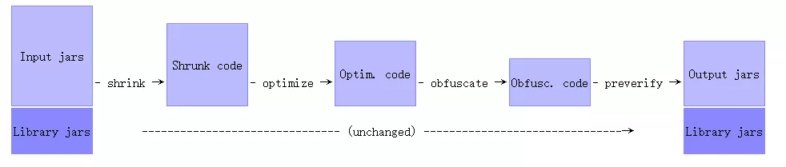
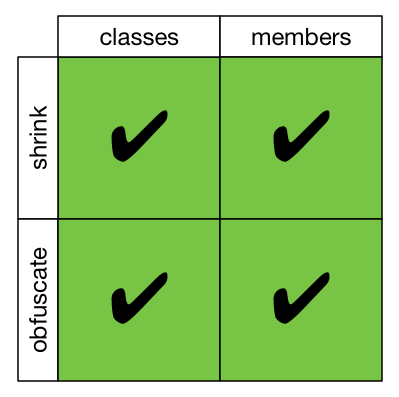
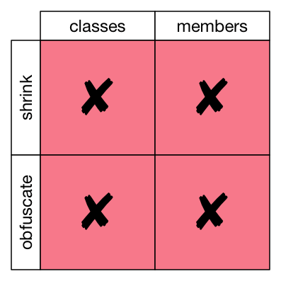
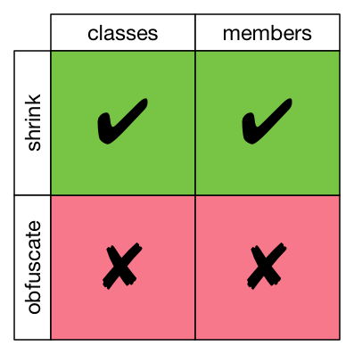
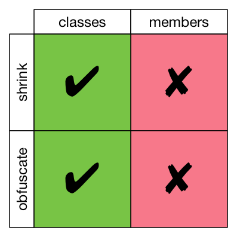
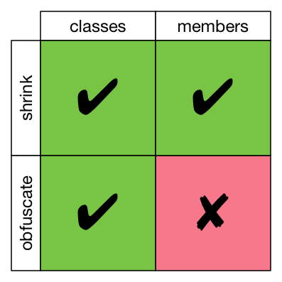

<!-- TOC -->

- [混淆的好处](#%E6%B7%B7%E6%B7%86%E7%9A%84%E5%A5%BD%E5%A4%84)
- [混淆配置](#%E6%B7%B7%E6%B7%86%E9%85%8D%E7%BD%AE)
  - [启动混淆](#%E5%90%AF%E5%8A%A8%E6%B7%B7%E6%B7%86)
  - [自定义混淆规则](#%E8%87%AA%E5%AE%9A%E4%B9%89%E6%B7%B7%E6%B7%86%E8%A7%84%E5%88%99)
    - [通配符](#%E9%80%9A%E9%85%8D%E7%AC%A6)
    - [输入输出选项 (Input/Output Options)](#%E8%BE%93%E5%85%A5%E8%BE%93%E5%87%BA%E9%80%89%E9%A1%B9-inputoutput-options)
    - [保留选项（Keep Options）](#%E4%BF%9D%E7%95%99%E9%80%89%E9%A1%B9keep-options)
      - [无规则](#%E6%97%A0%E8%A7%84%E5%88%99)
      - [keep](#keep)
      - [keepname](#keepname)
      - [keepclassmembers](#keepclassmembers)
      - [keepclassmembernames](#keepclassmembernames)
      - [keepclasseswithmembers](#keepclasseswithmembers)
      - [keepclasseswithmembernames](#keepclasseswithmembernames)
    - [压缩选择（Shrinking Options）](#%E5%8E%8B%E7%BC%A9%E9%80%89%E6%8B%A9shrinking-options)
    - [优化选项（Optimization Options）](#%E4%BC%98%E5%8C%96%E9%80%89%E9%A1%B9optimization-options)
    - [混淆选项（Obfuscation Options）](#%E6%B7%B7%E6%B7%86%E9%80%89%E9%A1%B9obfuscation-options)
      - [混淆字典](#%E6%B7%B7%E6%B7%86%E5%AD%97%E5%85%B8)
    - [预校验选项（Preverification Options）](#%E9%A2%84%E6%A0%A1%E9%AA%8C%E9%80%89%E9%A1%B9preverification-options)
    - [常规选项（General Options）](#%E5%B8%B8%E8%A7%84%E9%80%89%E9%A1%B9general-options)
    - [混淆黑名单](#%E6%B7%B7%E6%B7%86%E9%BB%91%E5%90%8D%E5%8D%95)
    - [Android 混淆模板以及其它常用指令](#android-%E6%B7%B7%E6%B7%86%E6%A8%A1%E6%9D%BF%E4%BB%A5%E5%8F%8A%E5%85%B6%E5%AE%83%E5%B8%B8%E7%94%A8%E6%8C%87%E4%BB%A4)
- [混淆结果](#%E6%B7%B7%E6%B7%86%E7%BB%93%E6%9E%9C)
  - [恢复混淆后错误堆栈信息](#%E6%81%A2%E5%A4%8D%E6%B7%B7%E6%B7%86%E5%90%8E%E9%94%99%E8%AF%AF%E5%A0%86%E6%A0%88%E4%BF%A1%E6%81%AF)
    - [通过 retrace 脚本工具](#%E9%80%9A%E8%BF%87-retrace-%E8%84%9A%E6%9C%AC%E5%B7%A5%E5%85%B7)
    - [通过 retrace 命令](#%E9%80%9A%E8%BF%87-retrace-%E5%91%BD%E4%BB%A4)

<!-- /TOC -->


# 混淆的好处

Java 平台为我们提供了 Proguard 混淆工具来帮助我们快速地对代码进行混淆，它是一个包含代码文件压缩、优化、混淆和校验等功能的工具。混淆具有以下好处：

1. 移除无用资源，减小 APK 体积。
2. 检测并删除无用的类、变量、方法和属性。
3. 它能够优化字节码并删除未使用的指令。
4. 它能够将类、变量和方法的名字重命名为无意义的名称从而达到混淆效果，增加阅读难度，从而增加逆向难度。

# 混淆配置

proguard 包括四个功能，shrinker（压缩）, optimizer（优化）,obfuscator（混淆）,preverifier（预校验）。

 

## 启动混淆

```groovy
android {
    buildTypes {
        release {
            minifyEnabled true
            shrinkResources true
            proguardFiles getDefaultProguardFile('proguard-android.txt'), 'proguard-rules.pro'
        }
    }
}
```

## 自定义混淆规则

```
[@annotationtype] [[!]public|final|abstract|@ ...] [!]interface|class|enum classname[extends|implements [@annotationtype] classname]
[{
    [@annotationtype] [[!]public|private|protected|static|volatile|transient ...] <fields> | (fieldtype fieldname);
    [@annotationtype] [[!]public|private|protected|static|synchronized|native|abstract|strictfp ...] <methods> | <init>(argumenttype,...) | classname(argumenttype,...) | (returntype methodname(argumenttype,...));
    [@annotationtype] [[!]public|private|protected|static ... ] *;
    ...
}]
```

- []：可选可不选；
- ···：还有更多选项可以配置；
- |：分隔的部分代表多选一；  
- ()：是一个整体，不能分割。
- class :可以匹配 class 类或 interface 类,但是 interface 关键字只能匹配 interface 类，enum 关键字只能匹配 enum 类。在 interface 或 enum 关键字前加一个!，可以表示非该类型。
- classname 必须写全名，比如 java.lang.String。内部类用 $ 间隔，例如，java.lang.Thread$State。

### 通配符

- *：匹配任意长度字符，但不含包含分隔符。
- \*\*：匹配任意长度字符，并包含包名分隔符 **.** 。
- \*\*\*：匹配任意参数类型。例如 \*\*\* getName(***) 可匹配 String getName(String)。
- ？：匹配一个字符
- ...：匹配任意长度的任意类型参数。
- \<init>：匹配类中所有构造函数。 
- \<fileds>：匹配类、接口中所有字段。
- \<methods>：匹配类、接口中所有方法。

### 输入输出选项 (Input/Output Options)

```
# 从给定的文件名中递归的读取配置选项
-include filename
# 为在这些配置参数里面的后续的相对文件名或这些配置文件指定一个相对目录。
-basedirectory directoryname
# 当读取 library jars 跳过 non-public 类，以加快运行和减少 proguard 的使用内存。
# 指定应用程序的要处理的 jars(or wars, ears, zips, or directories) 路径，这些 jar 里面的 class 文件将被处理和写入到输出 jar 中。
-injars class_path
# 指定处理完后要输出的 jar,war,ear 和目录的名称。
-outjars class_path
# 指定应用程序的要处理的 jars(or wars, ears, zips, or directories) 路径，这些 jar 里面的文件不会输入到输出 jar 中。
-libraryjars 
# 过滤掉 library jars 的 non-public 类。
-skipnonpubliclibraryclasses
# 不忽略 library jars 的 non-public 类。
-dontskipnonpubliclibraryclasses
# 不忽略 library jars 的  non-public 的库类成员 (变量和方法)
-dontskipnonpubliclibraryclassmembers
#指定要保持的目录结构，默认情况下会删除部分目录以减小 jar 的大小。
-keepdirectories [directory_filter] 
# 在被处理的 class 文件的版本号。默认情况下不需要设置。
-target version
```

### 保留选项（Keep Options）

- classes：类名
- merbers：成员变量和方法
- shrink：压缩，即移除未使用的类、成员变量或方法。
- obfuscate：混淆代码。

打 √ 代表执行相关操作，× 则反之。

#### 无规则

 

#### keep

 

#### keepname

 

#### keepclassmembers

 

#### keepclassmembernames

 

#### keepclasseswithmembers

 

keepclasseswithmembers 和 keep 作用范围一致。前提是指定的类、变量或方法在压缩阶段没有被删除。

#### keepclasseswithmembernames

 

keepclasseswithmembernames 与 keepnames 一致。前提是指定的类、变量或方法在压缩阶段没有被删除。

### 压缩选择（Shrinking Options）

```
# 关闭压缩
-dontshrink
# 列出被那些未使用的代码，并可输出到指定文件。仅用于压缩阶段
-printusage [filename]
# 打印指定的类在压缩阶段为什么会保留其类、类成员的详细信息。
-whyareyoukeeping class_specification
```

### 优化选项（Optimization Options）

优化是默认情况下启用的。所有方法都在字节码阶段进行优化。

```
# 关闭优化
-dontoptimize
# 混淆采用的算法
-optimizations optimization_filter
# 指定优化次数，默认情况下 1 次，多次可以更进一步优化代码，如果在一次优化后没有改进则优化结束。
-optimizationpasses n，
# 指示没有任何副作用的类方法。优化过程中如果确定这些方法没有被调用或者返回值没有被使用则删除它们。ProGuard 会分析出库代码以外的程序代码。如指定 System.currentTimeMillis（）方法，任何对他的空闲调用将被删除。慎用！
-assumenosideeffects class_specification
# 允许修改类和类成员的访问修饰符，这可以改进优化结果。
-allowaccessmodification
# 允许合并接口，及时他们的实现类没有实现所有接口方法。这个可以减少类的总数来减小输出的大小。
-mergeinterfacesaggressively
```

### 混淆选项（Obfuscation Options）

```
# 关闭混淆
-dontobfuscate
# 打印旧名称到重命名的类、类成员的新名称的映射关系，可输出到指定文件。
-printmapping [filename]
# 指定文件为映射文件，混淆时映射文件中列出的类和类成员接收指定的名称，文件未提及的类和类成员接收新名称。
-applymapping [filename]
# 开启侵入性重载混淆。多个字段及方法允许同名，只要它们的参数及返回值类型不同。该选项可使处理后的代码更小 (及更难阅读)。只有开启混淆时可用。注：Dalvik 不能处理重载的静态字段。
-overloadaggressively
# 方法同名混淆后亦同名，方法不同名混淆后亦不同名。不使用该选项时，类成员可被映射到相同的名称。
-useuniqueclassmembernames
# 不使用大小写混合类名
-dontusemixedcaseclassnames
# 不混淆指定的包名
-keeppackagenames [package_filter]
```

#### 混淆字典

APK 在经过代码混淆处理后，包名、类名、成员名被转化为无意义、难以理解的名称，增加反编译的成本。这其实是 Android ProGuard 为我们提供了默认的"混淆字典"，因此我们也可以定义自己的混淆字典。具体指令如下：

```
# 使用文件中的关键字作方法及字段混淆后的名称
-obfuscationdictionary proguard-dictionary.txt
# 使用文件中的关键字作为类混淆后的名称
-classobfuscationdictionary proguard-dictionary.txt
# 使用文件中的关键字作为包混淆后的名称
-packageobfuscationdictionary proguard-dictionary.txt
```

当然，若设置过于长的字典也会相应增加 APK 的体积。

### 预校验选项（Preverification Options）

```
# 不做预校验，如果类文件的目标平台是 JavaMicro Edition 或 Java 6 或更高时会进行预校验，Android 不需要做预校验，去除这一步可以加快混淆速度.
-dontpreverify

# 指定处理后的类文件目标平台是 Java Micro Edition。  
-microedition
```

### 常规选项（General Options）

```
# Proguard 期间输出更多信息。添加这项配置之后，如果处理过程中出现异常，会输出整个 StackTrace 而不是一条简单的异常说明。
-verbose
# 指定配置中潜在错误或遗漏时不打印相关信息。class_filter 是一个可选的正则表达式。类名匹配时 ProGuard 不会输出这些类的相关信息。
-dontnote [class_filter]
# 指定找不到引用或其他重要问题时不打印警告信息。class_filter 是一个可选的正则表达式。类名匹配时 ProGuard 不会输出这些类的相关信息。
-dontwarn [class_filter]
# 忽略警告
-ignorewarnings
# 将已解析过的配置标准输出到指定的文件。该选项可用于调试配置。
-printconfiguration [filename]
# 标准输出类文件的内部结构到给定的文件中。例如，你可能要输出一个 jar 文件的内容而不需要进行任何处理。
-dump [filename]
```

### 混淆黑名单

（1）枚举

枚举类内部存在 values 和 valueOf 方法，混淆后该方法会被重新命名，并抛出 NoSuchMethodException（反射）。

（2）被反射的元素

被反射使用的类（不包括 newInstance()）、变量、方法、包名等不应该被混淆。

原因在于：代码混淆过程中，被反射使用的元素会被重命名，然而反射依旧是按照混淆前的字符串路径去寻找元素，所以混淆后会抛出 NoSuchMethodException 和 NoSuchFiledException 等异常。

（3）部分实体类

涉及到序列化的实体类不能被混淆。混淆后，序列化之后的 key 变为没有意义的字段，与服务器下发的 key 不一致,导致反序列化失败。

同时，反序列化的过程实例化对象的原理是反射，混淆之后 key 会被改变，所以也会违背我们预期的效果。

（4）四大组件

- 四大组件使用前都需要在 AndroidManifest.xml 文件中进行注册声明，然而混淆处理之后，四大组件的类名就会被篡改，实际使用的类与 manifest 中注册的类并不匹配，故而出错。
- 其他应用程序访问组件时可能会用到类的包名加类名，如果经过混淆，可能会无法找到对应组件或者产生异常。

（5）JNI 调用的 Java 方法

当 JNI 调用的 Java 方法被混淆后，方法名会变成无意义的名称，这就与 C++ 中原本的 Java 方法名不匹配，因而会无法找到所调用的方法。

（6）JavaScript 调用 Java 的方法

（7）Parcelable 或 Serializable 的实现类

Parcelable 的实现类和 Creator 静态成员变量不混淆，否则会产生 Android.os.BadParcelableException 异常

Serializable 在序列化的过程需存储 key-value 到文件中，不可被混淆。

（8）第三方框架、SDK 的混淆说明。

### Android 混淆模板以及其它常用指令

```
# 设置混淆的压缩比率 0 ~ 7
-optimizationpasses 5
# 在处理过程中输出更多信息。添加这项配置之后，如果处理过程中出现异常，会输出整个 StackTrace 而不是一条简单的异常说明。
# 不使用大小写混合类名
-dontusemixedcaseclassnames
# 指定不忽略库类库中的非 public 成员（成员变量和方法）。
-dontskipnonpubliclibraryclasses
# 关闭优化
-dontoptimize
# 不做预校验
-dontpreverify
# 日志记录
-verbose

# 不混淆注解类
-keepattributes *Annotation*
# 异常
-keepattributes Exceptions
# 不混淆泛型
-keepattributes Signature
# 不混淆 JavaScript Interface
-keepattributes *JavascriptInterface*


# 保留枚举的 values 和 valueOf 方法
-keepclassmembers enum * {
    public static **[] values();
    public static ** valueOf(java.lang.String);
}

# 属性动画会通过反射修改调用相应的 get、set 方法。
-keep public class * extends android.view.View {
    void set*(***);
    *** get*();
    public <init>(android.content.Context);
    public <init>(android.content.Context,android.util.AttributeSet);
    public <init>(android.content.Context,android.util.AttributeSet,int);
}

- XML 中 android:onClick 标签通过反射方法名调用
-keepclassmembers class * extends android.app.Activity {
   public void *(android.view.View);
}

-keepclassmembers class * implements android.os.Parcelable {
  public static final android.os.Parcelable$Creator CREATOR;
}
-keepclassmembers class * implements java.io.Serializable {
    static final long serialVersionUID;
    private static final java.io.ObjectStreamField[] serialPersistentFields;
    private void writeObject(java.io.ObjectOutputStream);
    private void readObject(java.io.ObjectInputStream);
    java.lang.Object writeReplace();
    java.lang.Object readResolve();
}
# 保持 R 类静态成员不被混淆
-keepclassmembers class **.R$* {
    public static <fields>;
}
# native 方法不混淆
-keepclasseswithmembernames class * {
    native <methods>;
}

# 保留源文件名和具体代码行号
-keepattributes SourceFile,LineNumberTable

```

# 混淆结果

 混淆后打包，会在 **module/build/outputs/mapping/release(debug)** 目录下生成如下文件：

 - dump.txt：描述 APK 文件中所有类的内部结构。
 - mapping.txt：混淆前后的类、类成员、方法的对照关系（重要，追溯 Crash 堆栈信息要用到）。
 - resources.txt：资源文件的压缩信息。
 - seeds.txt：未被混淆的类和成员。
 - usage.txt：被移除的代码。

## 恢复混淆后错误堆栈信息

建议加上以下混淆规则以避免出现行数为 **Unknown Source** 问题。

```
# 保留源文件名和具体代码行号
-keepattributes SourceFile,LineNumberTable
```

### 通过 retrace 脚本工具

打开 Android SDK 路径/tools/proguard/bin/proguardgui.bat(Mac 为 proguardgui.sh 文件，拖入终端回车即可运行) -> 选中 retrace 选项卡并填入混淆后的堆栈信息以及相应的 mapping file -> 点击确认（ReTrace!）

### 通过 retrace 命令

先将崩溃信息复制到 txt 格式的文件（如：proguard_stacktrace.txt）中保存。

然后在终端输入 retrace.bat -verbose mapping.txt proguard_stacktrace.txt

