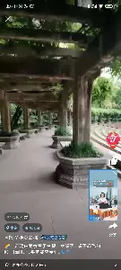
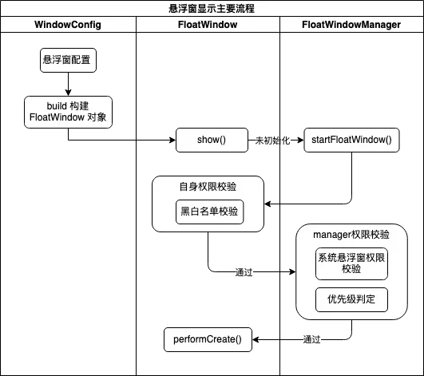
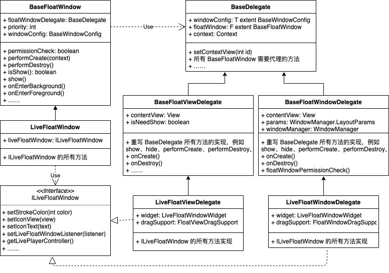
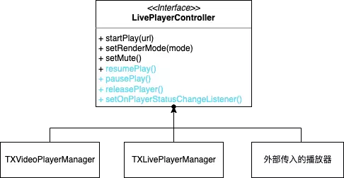

## 背景

直播悬浮窗由于历史原因，存在着一定的问题和隐患：

- 业务上，存在直播偶现后台播放、视频悬浮窗和直播悬浮窗同时出现，无法动态处理小窗关闭时机等问题；
- 代码上，存在代码堆积、使用临时方案去堵住临时的坑等问题，导致代码维护难度大、改动易出 BUG。

例如：

 

因此对直播悬浮窗进行重构，并入悬浮窗组件进行统一管理去解决上述问题。

## 目标

### 组件方面

业务层面：

- 统一管理所有悬浮窗，通过权限校验、页面黑名单、悬浮窗优先级等方式管控悬浮窗的显示和隐藏；
- 支持 Window、View 类型的悬浮窗接入；
- 支持直播、回放的功能以及秒开。

代码层面：

- 整理一套悬浮窗管理方案，提供基类像写一个页面一样去写悬浮窗业务，支持接入方自定义悬浮窗；
- API 使用简单，切换悬浮窗类型只需修改一个配置属性，对外提供的都是同一个悬浮窗类。

### 直播接入方面

- 接入直播悬浮窗，包括「Bus 直出」和「直播间延续」两种场景；
- 对悬浮窗逻辑进行梳理、改造，删除所有临时解决方案的代码，重构堆积的代码。

## 详细设计

### 悬浮窗显示主要流程

<div align ="center">  </div><br>

### FloatWindow UML 图

<div align ="center">  </div><br>

## 悬浮窗层级

Window：作为一个单独的 Window，类型为系统 Window。

缺点：Android 6.0 及以上需要悬浮窗权限。

View：悬浮控件添加到 Activity 所属 Window 的顶级视图 DecorView 上。在 Activity.onResume
（页面处于前台）时，将悬浮控件从上一个页面 remove 掉，add 到当前页面的 DecorView 上。

缺点：①可能被页面其他元素遮挡 ②页面跳转会消失再显示 ③不支持 pip。

## 播放器控制类与秒开

为了方便管理多个播放器的行为（拥有相同的行为）以及支持秒开，故抽象出一个播放器控制类。

<div align ="center">  </div><br>

若直接实例化一个新的播放器，会导致声音和画面出现几秒间断，除此之外，还涉及到与连麦之间的切换，故需要支持秒开。

秒开的实现方案是通过直接复用传入的播放器，也就是直播间的播放器，从而实现声音、画面无缝衔接的效果。

## 直播悬浮窗的调用

```java
CTFloatWindow.newLiveConfig(LiveWindowConfig.PLAY_URL_TYPE_LIVE) // 指定直播还是回放
                .windowType(BaseWindowConfig.WINDOW_TYPE_FLOAT_VIEW) // 指定是 window 还是 view
                .blacklistList(getBlackPageList()) // 该次悬浮窗所生效的黑名单
                .biztype("biztype")
                .pageId("pageId")
                .source("source")
                .isPip(true) // 是否是 pip，仅支持 window。
                .nextPageShow(true) // 下一个 pageId 显示
                .playUrl("playUrl")
                .coverImageUrl("coverImageUrl")
                .screenMarginLimit(Rect(limit, limit, limit, limit)) // 吸边时距离屏幕的边距
                .bottom(0) // 初始位置
                .playerView(playerView, floatLivePlayerController) // 通过复用播放器的方式，实现秒开。
                .listener(new LiveFloatWindowListener() {
                    @Override
                    public void onCreate(@NonNull LiveFloatWindow liveFloatWindow) {
                        // 悬浮窗创建
                    }
                     
                    @Override
                    public void onClickFloatWindow(@NonNull LiveFloatWindow liveFloatWindow) {
                        // 点击悬浮窗
                    }
 
                    /**
                     *
                     * @return true 拦截默认实现
                     */
                    @Override
                    public boolean onClickClose() {
                        return false;
                    }
 
                    @Override
                    public void onDuration(long duration) {
                        // 悬浮窗每次显示的时间
                    }
 
                    @Override
                    public void onDestroy(@NonNull LiveFloatWindow liveFloatWindow) {
                        // 悬浮窗销毁
                    }
                })
                .build()
                .show();
```

## 后续计划

**支持单个页面的 floatView**

- 现在直播小窗的 Bus 接入方，需求暂时都是希望在单个页面出现。支持单页面 FloatView，可以减少接入方的接入成本和出现问题的可能；
- 方便实现新需求，例如直播 Icon 单页面悬浮控件，可复用 show、hide、close、拖拽等基础支持的代码。