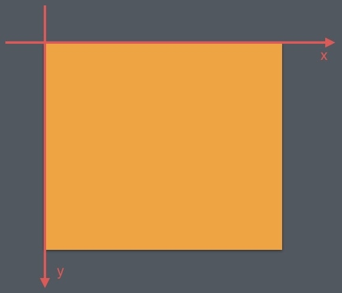
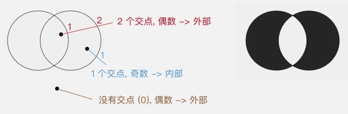
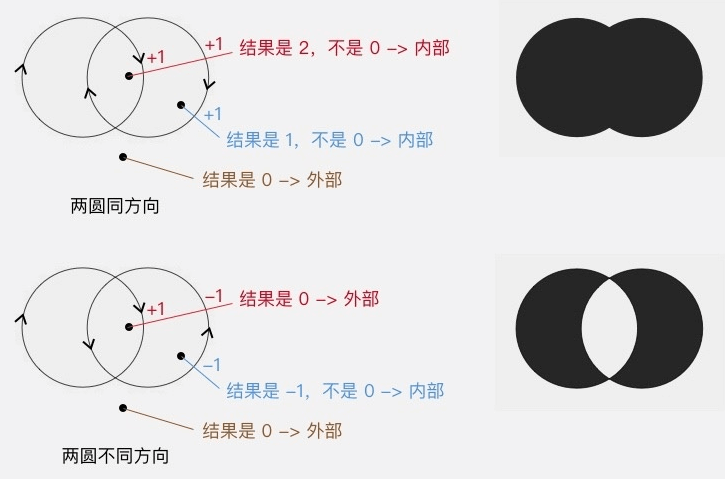

# Canvas

<!-- TOC -->

- [Canvas](#canvas)
    - [坐标系](#坐标系)
    - [绘制颜色](#绘制颜色)
    - [绘制图形](#绘制图形)
        - [圆](#圆)
        - [矩形](#矩形)
        - [点](#点)
        - [椭圆](#椭圆)
        - [线](#线)
        - [圆角矩形](#圆角矩形)
        - [弧形或扇形](#弧形或扇形)
        - [Bitmap](#bitmap)
        - [文字](#文字)
        - [自定义图形](#自定义图形)
    - [Path](#path)
        - [添加子图形](#添加子图形)
        - [添加直线或曲线](#添加直线或曲线)
            - [直线](#直线)
            - [二次贝塞尔曲线](#二次贝塞尔曲线)
            - [三次贝塞尔曲线](#三次贝塞尔曲线)
            - [弧形](#弧形)
            - [移动到目标位置](#移动到目标位置)
        - [封闭已绘制图形](#封闭已绘制图形)
        - [填充方式](#填充方式)
            - [EVEN_ODD](#even_odd)
            - [WINDING](#winding)
        - [](#)
- [参考资料](#参考资料)

<!-- /TOC -->

## 坐标系

在 Android 里，每个 View 都有一个自己的坐标系，彼此之间是不影响的。这个坐标系的原点是 View 左上角的那个点；水平方向是 x 轴，右正左负；竖直方向是 y 轴。

<div align="center">  </div><br>


## 绘制颜色

这类颜色填充方法一般用于在绘制之前设置底色，或者在绘制之后为界面设置半透明蒙版。

Canvas.drawColor(@ColorInt int color)

Canvas.drawRGB(int r, int g, int b)

Canvas.drawARGB(int a, int r, int g, int b) 

## 绘制图形

以下 RectF 皆可用矩形坐标（左上右下）代替。

### 圆

Canvas.drawCircle(float centerX, float centerY, float radius, Paint paint) 

### 矩形

Canvas.drawRect(RectF rect, Paint paint) 

### 点

画一个点

Canvas.drawPoint(float x, float y, Paint paint)

画多个点

Canvas.drawPoints(float[] pts, int offset, int count, Paint paint) 

```java
float[] points = {0, 0, 50, 50, 50, 100, 100, 50, 100, 100, 150, 50, 150, 100};  

canvas.drawPoints(points, 2 /* 跳过两个数，即前两个 0 */,  
          8 /* 一共绘制 8 个数（4 个点）*/, paint);
```

### 椭圆

Canvas.drawOval(RectF rect, Paint paint) 

### 线

由于直线不是封闭图形，所以 setStyle(style) 对直线没有影响

画一条线

Canvas.drawLine(float startX, float startY, float stopX, float stopY, Paint paint) 

画多条线（四个数一条线）

Canvas.drawLines(float[] pts, int offset, int count, Paint paint)

### 圆角矩形

Canvas.drawRoundRect(RectF rect, float rx, float ry, Paint paint) 

### 弧形或扇形

Canvas.drawArc(RectF rect, float startAngle, float sweepAngle, boolean useCenter, Paint paint)

startAngle 是弧形的起始角度（x 轴的正向，即正右的方向，是 0 度的位置；顺时针为正角度，逆时针为负角度），sweepAngle 是弧形划过的角度；useCenter 表示是否连接到圆心，如果不连接到圆心，就是弧形，如果连接到圆心，就是扇形。

### Bitmap

Canvas.drawBitmap(Bitmap bitmap, float left, float top, Paint paint)

Canvas.drawBitmap(Bitmap bitmap, Rect src, Rect dst, Paint paint)

src：提取 Bitmap 的某个区域进行绘制。
dst：绘制 Bitmap 的区域（可能会对 Bitmap 进行缩放）。

Canvas.drawBitmap(Bitmap bitmap, Matrix matrix, Paint paint)

以（0.0）坐标为基准利用 Matrix 对 Bitmap 进行几何变换。

### 文字

Canvas.drawText(String text, float x, float y, Paint paint);  

- 直接使用该方法绘制文字，文字并不会自动换行。

- 文字的坐标以文字的左下角为基准。

更多文字的绘制相关请点击 [文字的绘制 ](https://github.com/passin95/LearningNotes/blob/master/notes/文字的绘制.md)。

### 自定义图形

Canvas.drawPath(Path path, Paint paint) 

这里将 Path 抽出来作为一个章节。

## Path

### 添加子图形

Path.addXxx()，Xxx 为绘图图形章节的图形，这里以 addCircle 举例。

addCircle(float x, float y, float radius, Direction dir) 

x, y, radius 这三个参数是圆的基本信息，最后一个参数 dir 是画圆的路径的方向，它只是在需要填充图形 (Paint.Style 为 FILL 或 FILL_AND_STROKE) ，并且图形出现自相交时，用于判断填充范围。[详细说明 ](#填充方式)

path.AddCircle(x, y, radius, dir) + canvas.drawPath(path, paint) 和 canvas.drawCircle(x, y, radius, paint) 的效果是一样的。

### 添加直线或曲线

Path.xxxTo()

#### 直线

lineTo(float x, float y) / rLineTo(float x, float y) 

```java
path.lineTo(100, 100); // 由当前位置 (0, 0) 向 (100, 100) 画一条直线  
path.rLineTo(100, 0); // 由当前位置 (100, 100) 向正右方 100 像素的位置画一条直线  
```

#### 二次贝塞尔曲线

quadTo(float x1, float y1, float x2, float y2) / rQuadTo(float dx1, float dy1, float dx2, float dy2)

x1, y1 和 x2, y2 则分别是控制点和终点的坐标。

#### 三次贝塞尔曲线

cubicTo(float x1, float y1, float x2, float y2, float x3, float y3) / rCubicTo(float x1, float y1, float x2, float y2, float x3, float y3)

#### 弧形

arcTo(RectF rect, float startAngle, float sweepAngle, boolean forceMoveTo) 

这个方法只用来来画弧形，所以不再需要 useCenter 参数；而多出来的这个 forceMoveTo 参数的意思是，绘制是要「抬一下笔移动过去」（true），还是「直接拖着笔过去」（false），区别在于是否留下移动的痕迹。

addArc() 为 forceMoveTo = true 的简化版 arcTo()。

#### 移动到目标位置

moveTo(float x, float y) / rMoveTo(float x, float y) 
 
### 封闭已绘制图形

Path.close() ,它和 lineTo(起点坐标) 是完全等价的。

当 Paint.Style 为 FILL 或 FILL_AND_STROKE，绘制时会自动封口。

### 填充方式

Path.setFillType(Path.FillType ft)

FillType 的取值有四个：

- EVEN_ODD
- WINDING （默认值）
- INVERSE_EVEN_ODD
- INVERSE_WINDING

其中后面的两个带有 INVERSE_ 前缀的，只是前两个的反色版本。


#### EVEN_ODD

even-odd rule （奇偶原则）：对于平面中的任意一点，向任意方向射出一条射线，这条射线和图形相交的次数（相交才算，相切不算）如果是奇数，则这个点被认为在图形内部，是要被涂色的区域；如果是偶数，则这个点被认为在图形外部，是不被涂色的区域。还以左右相交的双圆为例：

  </div>

#### WINDING

路径方向有两种：顺时针 (CW clockwise) 和逆时针 (CCW counter-clockwise) 

non-zero winding rule （非零环绕数原则）：首先，它需要你图形中的所有线条都是有绘制方向的；然后，同样是从平面中的点向任意方向射出一条射线，但计算规则不一样：以 0 为初始值，对于射线和图形的所有交点，遇到每个顺时针的交点（图形从射线的左边向右穿过）把结果加 1，遇到每个逆时针的交点（图形从射线的右边向左穿过）把结果减 1，最终把所有的交点都算上，得到的结果如果不是 0，则认为这个点在图形内部，是要被涂色的区域；如果是 0，则认为这个点在图形外部，是不被涂色的区域。

  </div>


####


# 参考资料
- [绘制基础 - HenCoder](https://hencoder.com/ui-1-1/)
