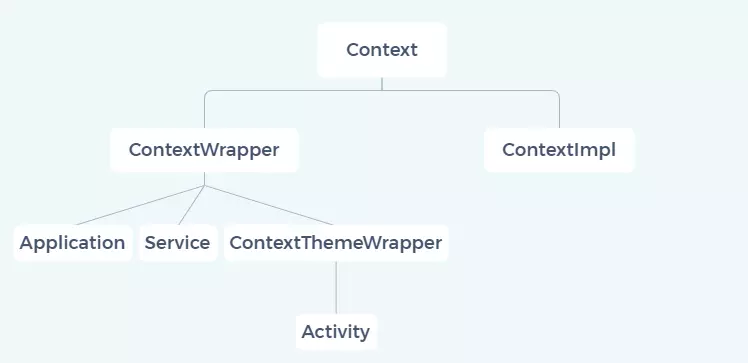

<!-- TOC -->

- [一、Context 类](#%E4%B8%80context-%E7%B1%BB)
- [二、Context 继承结构](#%E4%BA%8Ccontext-%E7%BB%A7%E6%89%BF%E7%BB%93%E6%9E%84)
  - [2.1 ContextWrapper](#21-contextwrapper)
  - [2.2 ContextThemeWrapper](#22-contextthemewrapper)

<!-- /TOC -->


## 一、Context 类

```java
public abstract class Context {

    // 四大组件相关。
    public abstract void startActivity(@RequiresPermission Intent intent);
    public abstract void sendBroadcast(@RequiresPermission Intent intent);
    public abstract Intent registerReceiver(@Nullable BroadcastReceiver receiver,
                                            IntentFilter filter);
    public abstract void unregisterReceiver(BroadcastReceiver receiver);
    public abstract ComponentName startService(Intent service);
    public abstract boolean stopService(Intent service);
    public abstract boolean bindService(@RequiresPermission Intent service,
            @NonNull ServiceConnection conn, @BindServiceFlags int flags);
    public abstract void unbindService(@NonNull ServiceConnection conn);
    public abstract ContentResolver getContentResolver();
    
    // 获取系统、应用资源。
    public abstract AssetManager getAssets();
    public abstract Resources getResources();
    public abstract PackageManager getPackageManager();
    public abstract Context getApplicationContext();
    public abstract ClassLoader getClassLoader();
    public final @Nullable <T> T getSystemService(@NonNull Class<T> serviceClass) { ... }
    
    public final String getString(@StringRes int resId) { ... }
    public final int getColor(@ColorRes int id) { ... }
    public final Drawable getDrawable(@DrawableRes int id) { ... }
    public abstract Resources.Theme getTheme();
    public abstract void setTheme(@StyleRes int resid);
    public final TypedArray obtainStyledAttributes(@StyleableRes int[] attrs) { ... }
    
    // 获取应用相关信息。
    public abstract ApplicationInfo getApplicationInfo();
    public abstract String getPackageName();
    public abstract Looper getMainLooper();
    public abstract int checkPermission(@NonNull String permission, int pid, int uid);
    
    // 文件目录相关。
    public abstract File getSharedPreferencesPath(String name);
    public abstract File getDataDir();
    public abstract boolean deleteFile(String name);
    public abstract File getExternalFilesDir(@Nullable String type);
    public abstract File getCacheDir();
    ...
    public abstract SharedPreferences getSharedPreferences(String name, @PreferencesMode int mode);
    public abstract boolean deleteSharedPreferences(String name);
    
    // 数据库相关。
    public abstract SQLiteDatabase openOrCreateDatabase(...);
    public abstract boolean deleteDatabase(String name);
    public abstract File getDatabasePath(String name);
    ...
    
    // 其它。
    public void registerComponentCallbacks(ComponentCallbacks callback) { ... }
    public void unregisterComponentCallbacks(ComponentCallbacks callback) { ... }
}
```

Context 的作用可以总结为以下几个方面：

1. 与四大组件的交互；
2. 获取系统、应用资源；
3. 获取应用相关的文件目录；
4. 官方存储相关，例如数据库、SharedPreference；
5. 其它功能，例如设置 ComponentCallbacks。

## 二、Context 继承结构

<div align="center">  </div><br>

从 Context 类继承结构来看，继承关系并不复杂，所涉及到的类也不多。

### 2.1 ContextWrapper

Context 有两个子类 ContextWrapper 和 ContextImpl，这里主要说明一下 ContextWrapper。

ContextWrapper 实际上只是 Context 的一个包装类，所实现的所有方法都是通过内部成员 mBase 完成的，因此 ContextWrapper 的关键点在于成员变量 mBase 的赋值，对于 Application、Service、Activity 来说 mBase 的实现都是 ContextImpl（源码在 ActivityThread 可查看，本文不做详细说明）。

```java
public class ContextWrapper extends Context {
    Context mBase;

    public ContextWrapper(Context base) {
        mBase = base;
    }
    
    protected void attachBaseContext(Context base) {
        if (mBase != null) {
            throw new IllegalStateException("Base context already set");
        }
        mBase = base;
    }

    public Context getBaseContext() {
        return mBase;
    }

    // 下面方法全是直接调用 mBase.XXX()。
    @Override
    public AssetManager getAssets() {
        return mBase.getAssets();
    }

    @Override
    public Resources getResources() {
        return mBase.getResources();
    }

    // 
}
```

### 2.2 ContextThemeWrapper

ContextThemeWrapper 定义了关于主题（界面显示）相关的功能，由于只有 Activity 显示界面，因此继承的是 ContextThemeWrapper。关于 Activity（包括 Service） 的实例化、初始化以及设置主题的代码都在 ActivityThread.performLaunchActivity() 方法中。

凡是跟 UI 有关的 Context，都应该用 Activity 作为 Context 来处理，否则要么会报错，要么会使用 Application 所设置的默认主题。

```java
public class ContextThemeWrapper extends ContextWrapper {
    private int mThemeResource;
    private Resources.Theme mTheme;
    private LayoutInflater mInflater;
    private Configuration mOverrideConfiguration;
    private Resources mResources;

    public ContextThemeWrapper() {
        super(null);
    }

    public ContextThemeWrapper(Context base, @StyleRes int themeResId) {
        super(base);
        mThemeResource = themeResId;
    }
    
    public ContextThemeWrapper(Context base, Resources.Theme theme) {
        super(base);
        mTheme = theme;
    }

    /**
     * Activity 会调用该方法关联 mBase。
     */
    @Override
    protected void attachBaseContext(Context newBase) {
        super.attachBaseContext(newBase);
    }

    
    /**
     * Activity 会调用该方法设置主题。
     */
    @Override
    public void setTheme(int resid) {
        if (mThemeResource != resid) {
            mThemeResource = resid;
            initializeTheme();
        }
    }

    protected void onApplyThemeResource(Resources.Theme theme, int resId, boolean first) {
        theme.applyStyle(resId, true);
    }

    private void initializeTheme() {
        final boolean first = mTheme == null;
        if (first) {
            mTheme = getResources().newTheme();
            final Resources.Theme theme = getBaseContext().getTheme();
            if (theme != null) {
                mTheme.setTo(theme);
            }
        }
        onApplyThemeResource(mTheme, mThemeResource, first);
    }
}
```
