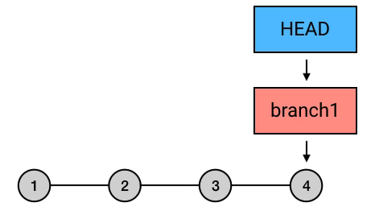
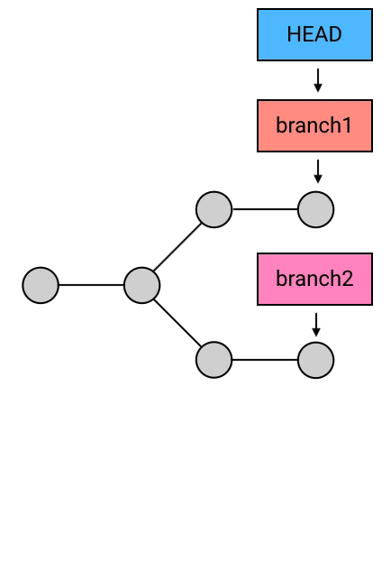
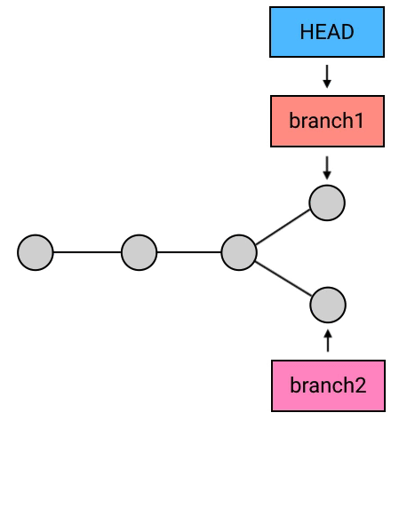

#Git

<!-- TOC -->

- [Git](#git)
    - [基本概念](#基本概念)
    - [Git 常用命令](#git-常用命令)
        - [全局配置](#全局配置)
            - [git diff](#git-diff)
        - [远程操作](#远程操作)
            - [git remote](#git-remote)
            - [git clone](#git-clone)
            - [git push](#git-push)
            - [git fetch](#git-fetch)
        - [git pull](#git-pull)
        - [管理变动](#管理变动)
            - [git add](#git-add)
            - [git checkout (撤销文件修改)](#git-checkout-撤销文件修改)
            - [git rm](#git-rm)
            - [git commit](#git-commit)
        - [git revert](#git-revert)
        - [版本穿梭](#版本穿梭)
            - [git reset](#git-reset)
            - [git checkout](#git-checkout)
            - [git stash](#git-stash)
        - [分支操作](#分支操作)
            - [git branch](#git-branch)
            - [git checkout](#git-checkout-1)
            - [git merge](#git-merge)
            - [git rebase](#git-rebase)
        - [标签管理](#标签管理)
    - [本质解析](#本质解析)
        - [merge](#merge)
        - [rebase](#rebase)
        - [reset](#reset)
        - [checkout](#checkout)
    - [SSH 传输设置](#ssh-传输设置)
    - [.gitignore 文件](#gitignore-文件)
- [参考资料](#参考资料)

<!-- /TOC -->

## 基本概念

commit id：对提交的信息数据进行一个 SHA1 算法所得，该 id 几乎不会重复。

工作区：日常情况下，工作使用的目录和文件。

版本库：工作区的隐藏目录.git。版本库有一个重要的区域叫 stage(暂存区),当我们使用 git add 文件时，会将文件的变动添加到暂存区。

staged changes：所有 add 进暂存区的修改。

unstaged changes：Git 跟踪的（在版本库中存在的）但并未添加到暂存区的修改。

untracked files：在工作目录中新添加的文件。

HEAD：它所指向的 commit 永远是我们所看到的该次 commit 的内容。

master：本地仓库默认分支，一般作为主分支使用。

origin/master：远程仓库 origin 的 master 分支镜像。

origin/HEAD：远程仓库 origin 的 HEAD 镜像，它永远指向默认分支 origin/master。

HEAD，master，origin/master，origin/HEAD 等概念都类似于内存中的指针，区别在于它们指向的是 commit。


## Git 常用命令

### 全局配置

```
git config --global user.name "your name"

告诉 git 你的名字。

git config --global user.email "email@example.com"

告诉 git 你的邮箱。

git config -l

查看 git 所有配置信息。

### 查看信息

#### git status

git status 

查看当前所有文件的状态。

git status 文件

查看指定文件名的状态。

#### git log

git log

查看所有的 commit 日志。

git log 文件

查看指定文件的 commit 日志。

git log -p

查看所有 commit 的日志详情。

git log --graph

查看以 ASCII 图形表示的分支合并历史。

git log -n

显示最近 n 条 commit 日志。

git log --no-merges 

过滤 merge commit。

git log --oneline

输出所有 commit id 的前几位值以及 commit 描述。

git reflog

查看所有引用的移动过程。
```

#### git diff 

```
git diff 文件

查看工作区与暂存区的区别。

git diff --staged

查看工作区与上一条 commit 的区别。

git diff HEAD

查看工作目录和当前 commit 的区别。
```

### 远程操作

#### git remote 

```
git remote -v

显示本地仓库所关联远程仓库地址名和对应的别名。

git remote add <远程仓库别名 origin> <地址 url>

将本地仓库和该地址的远程仓库地址 url 关联，并设置别名 origin。
```

#### git clone 

```
git clone url 

将远程代码仓库克隆到本地。
```

#### git push

```
git push <仓库地址别名 origin> <分支名 feature>

将本地代码仓库的 feature 分支的 commit 推送至远程仓库 origin。
```

#### git fetch
```
git fetch <仓库别名 origin>

拉取远程仓库 origin 相对于本地新的 commit，并将 origin/master 指向最新的 commit。
```

### git pull

```
git pull <远程仓库别名 origin> <分支名 feature>

将远程仓库 origin 的 feature 分支的 commit 合并到当前分支。

git pull 等价于（git fetch + git merge feature）
```

### 管理变动

#### git add 

```
git add .

将该工作区所有文件的修改添加到暂存区。

git add 文件

将该文件的修改添加到暂存区。
```

#### git checkout (撤销文件修改)

```
git checkout 文件

把文件在工作区的修改全部撤销，这里有两种情况：

一种是 readme.txt 自修改后还没有被放到暂存区，现在，撤销修改就回到和版本库一模一样的状态；

一种是 readme.txt 已经添加到暂存区后，又作了修改，现在，撤销修改就回到添加到暂存区后的状态。
```

#### git rm

```
git rm 文件

从版本库中删除该文件。
```

#### git commit 

```
git commit -m "描述"

将暂存区的更改进行提交，生成一个新的 commit，HEAD 指向该 commit。

git commit --amend

修改当前的 commit 内容。
```

### git revert

```
git revert HEAD 

将 HEAD 指向的 commit 的操作生成一个相反操作的的 commit（用于对已经不能修改的内容进行修改 例如修改 master 分支上的旧 commit）。

git revert <commit id>

将该 commit 的操作生成一个相反操作的的 commit。
```

### 版本穿梭

#### git reset

git reset 命令都会带着 HEAD 所指向的分支一起移动，例如 HEAD 此时指向 master，执行
git reset HEAD^ 命令，则此时 master 指向该 commit，HEAD 指向 master。

```
git reset HEAD^(HEAD~1)

将 HEAD 指向上一个 commit，若工作区和暂存区存在文件修改需先处理。reset 成功后，会保留工作目录，并清空暂存区。

git reset <commid id>

将 HEAD 指向指定 commit

git reset --hard HEAD^

将 HEAD 指向上一个 commit，并清空工作区和暂存区的修改。

git reset --soft HEAD^

将 HEAD 指向上一个 commit，保留工作目录，并把因为保留工作目录内容所带来的新的文件差异放进暂存区。
```

#### git checkout

以下命令 HEAD 不会携带分支引用一起移动。

```
git checkout HEAD^

将 HEAD 指向上一个 commit，若工作区和暂存区存在修改需先处理

git checkout <commid id>

将 HEAD 指向指定 commit
```

#### git stash

```
git stash

临时存放当前分支 staged changes 和 unstaged changes 的变动。

git stash -u

临时存放当前分支 staged changes、 unstaged changes、untracked files 的变动。

git stash pop

恢复当前分支临时存放的变动
```

### 分支操作

#### git branch 

```
git branch

查看本地分支

git branch -r

查看远程仓库镜像分支

git branch <name>

创建一个名为 name 的分支

git branch -d <name>

删除名为 name 的分支（只能删除已合并的分支，若要强制删除使用-D）
```

#### git checkout 

```
git checkout <name>

切换到分支 name

git checkout <commit id>

切换到具体的 commit

git checkout -b <name>

创建新分支 name 并切换到新分支 name（实质为 HEAD 指向新分支 name）

git checkout --detach

把 HEAD 和 当前所指向的分支脱离，直接指向当前 commit
```

#### git merge 

```
git merge <name>

合并分支 name 到当前 HEAD 所指向的分支

git merge --abort

用于处理合并冲突，取消该次 merge。

git merge --continue 

用于处理 merge 冲突，已修改完冲突文件，继续 merge。
```

#### git rebase 

```
git rebase <name>

将 HEAD 所指向的分支上的所有新的 commit（两分支共同的 commit 分叉之后的 commit）“拷贝”一份新的 commit,并接上分支 name 所指向的 commit，

git rebase --abort

特殊情况下，用于取消该次 rebase。

git rebase --continue 

特殊情况下，处理完之后，继续执行 rebase。例如 rebase 合并冲突，已修改完冲突文件，继续 rebase。
```

### 标签管理

```
git tag

查看所有 tag

git tag <tagname>

在当前分支的当前 commit 打一个名为 name 的 tag。

git tag <tagname> <commit id>

对 commit id 所对应的 commit 打一个名为 name 的 tag

git tag -a <tagname> -m <描述> <commit id>

对 commit id 所对应的 commit 打一个名为 name 且有描述的的 tag

git show <tagname>

查看名为 name 的标签信息
```

## 本质解析

### merge


此图含义：当前 HEAD 指向 master 分支，使用命令如下:

```
git merge branch1
```

本质：branch1 的路径上的所有 commit 的内容一并应用到当前分支 master，然后自动生成一个新的 commit，HEAD 和 HEAD 所指向的分支 master 指向新的 commit。

### rebase


此图含义：当前 HEAD 指向 master 分支，使用命令如下:

```
git checkout branch1

git rebase master
```

本质：将 commit 序列重新设置基础点也就是父 commit）, branch1 的路径上的所有 commit 的内容一并应用到当前分支 master，然后自动生成一个个新的 commit，HEAD 和 HEAD 所指向的分支 master 指向最新的 commit。

### reset



此图含义：当前 HEAD 指向 branch1 分支，使用命令如下:

```
git reset 第三个 commit id
```



此图含义：当前 HEAD 指向 branch1 分支，使用命令如下:

```
git reset branch2
```

本质：将 HEAD 以及它所指向的 branch 指向具体的某个 commit（若不指向任何 branch 则只有 HEAD 移动）。

### checkout



此图含义：当前 HEAD 指向 branch1 分支，使用命令如下:

```
git chekout branch2
```

本质：将 HEAD 指向某个 commit 或者 branch（不携带所指向的分支一起移动）。
git chekout 文件的本质是：回到所指向 commit 的该文件内容（视觉上便是清空了工作区的变动，因此暂存区内容是不清理的）。

## SSH 传输设置

Git 仓库和 Github 中心仓库之间的传输是通过 SSH 加密。

在用户主目录下，看看有没有.ssh 目录，或者该目录下有没有 id_rsa 和 id_rsa.pub 这两个文件，如果没有，可以通过以下命令来创建 SSH Key：

$ ssh-keygen -t rsa -C "youremail@example.com"

你需要把邮件地址换成你自己的邮件地址，然后一路回车，使用默认值即可，由于这个 Key 也不是用于军事目的，所以也无需设置密码。

然后把公钥 id_rsa.pub 的内容复制到 Github "Account settings" 的 SSH Keys 中。

## .gitignore 文件

使用 git add 命令时会忽略.gitignore 文件中的文件或目录。

不需要全部自己编写，可以到 [https://github.com/github/gitignore](https://github.com/github/gitignore) 中进行查询。


# 参考资料

- [Git 教程 - 廖雪峰 ](https://www.liaoxuefeng.com/wiki/0013739516305929606dd18361248578c67b8067c8c017b000)
- [Git 原理详解及实用指南 - 扔物线 ](https://juejin.im/book/5a124b29f265da431d3c472e)