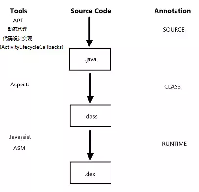

# Gradle

- [Groovy 语法](./Groovy%20语法.md)

- [Gradle](./Gradle.md)

  Gradle 的工作流程、Task、Extension、自定义 Plugin、Transform。

# AOP

- [APT](./APT.md)

- [AspectJ](./AspectJ.md)

- [ASM](./ASM.md)

  Android 打包流程、字节码、ASM。

## 什么是 AOP

平常开发一般都是以 OOP（Object Oriented Programming 面向对象编程）思维去编写代码，把单个功能内聚到一个类或一个模块中以方便维护和管理，这也是主要的编程思维。而 AOP（Aspect-Oriented Programming 面向切面编程）则是把涉及到众多模块的某一类问题进行统一管理。

从织入的运行期来说，可以分为静态织入和动态织入（dexposed、Xposed），由于动态织入不适用在常规的应用开发，因此本文只讨论静态织入：

  

## AOP 方案对比

  

可以通过对比不同 AOP 方案优缺点再结合实际的需求去选择 AOP 方案即可。

  

