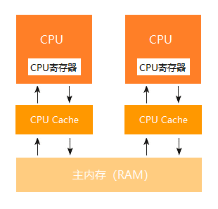
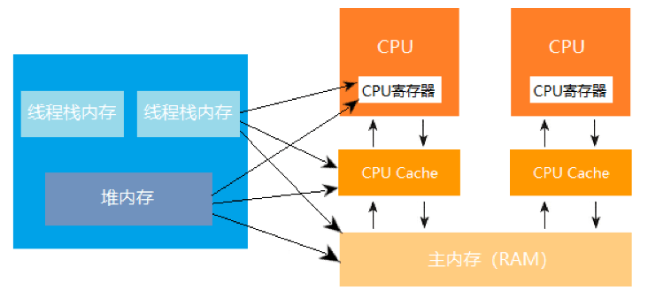
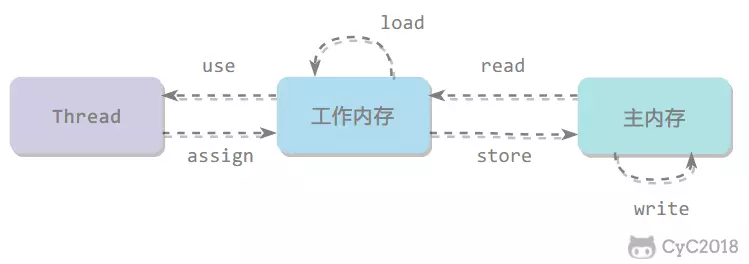

<!-- TOC -->

- [一、基本概念](#一基本概念)
    - [1.1 线程和进程](#11-线程和进程)
    - [1.2 线程的状态（生命周期）](#12-线程的状态生命周期)
    - [1.3 并发和并行](#13-并发和并行)
- [二、Thread](#二thread)
    - [2.1 Thread 的构造函数](#21-thread-的构造函数)
    - [2.2 守护线程](#22-守护线程)
    - [2.3 Thread API](#23-thread-api)
        - [2.3.1 sleep](#231-sleep)
            - [2.3.1.1 TimeUnit 代替 sleep](#2311-timeunit-代替-sleep)
        - [2.3.2 yield](#232-yield)
        - [2.3.3 interrupt](#233-interrupt)
            - [2.3.3.1 interrupt() 和 InterruptedException](#2331-interrupt-和-interruptedexception)
            - [2.3.3.2 thread.isInterrupted() 和 Thread.interrupted()](#2332-threadisinterrupted-和-threadinterrupted)
        - [2.3.4 join](#234-join)
    - [2.4 ThreadLocal](#24-threadlocal)
        - [2.4.1 ThreadLocal 内存泄漏](#241-threadlocal-内存泄漏)
    - [2.5 线程间协作](#25-线程间协作)
        - [2.5.1 wait()、notify()、notifyAll()](#251-waitnotifynotifyall)
        - [2.5.2 await()、signal()、signalAll()](#252-awaitsignalsignalall)
- [三、Java 内存模型](#三java-内存模型)
    - [3.1 CPU Cache 模型](#31-cpu-cache-模型)
    - [3.2 Java 内存模型](#32-java-内存模型)
        - [3.2.1 内存间交互操作](#321-内存间交互操作)
    - [3.3 内存模型三大特性](#33-内存模型三大特性)
        - [3.3.1 原子性](#331-原子性)
        - [3.3.2 可见性](#332-可见性)
        - [3.3.3 有序性](#333-有序性)
    - [3.4 volatile](#34-volatile)
- [四、线程安全和锁](#四线程安全和锁)
    - [4.1 线程安全问题的本质](#41-线程安全问题的本质)
    - [4.2 不可变的对象](#42-不可变的对象)
    - [4.3 互斥同步（阻塞同步）](#43-互斥同步阻塞同步)
        - [4.3.1 synchronized](#431-synchronized)
            - [4.3.1.1 synchronized 锁优化](#4311-synchronized-锁优化)
        - [4.3.2 ReentrantLock](#432-reentrantlock)
        - [4.3.3 比较](#433-比较)
    - [4.4 非阻塞同步](#44-非阻塞同步)
        - [4.4.1 CAS（Compare-and-Swap）](#441-cascompare-and-swap)
            - [4.4.1.1 ABA 问题](#4411-aba-问题)
        - [4.4.2 Atomic 原子类](#442-atomic-原子类)
            - [4.4.2.1 原子类方法、原理浅析](#4421-原子类方法原理浅析)
    - [4.5 无同步方案](#45-无同步方案)
    - [4.6 线程安全方案的选择](#46-线程安全方案的选择)
    - [4.7 死锁](#47-死锁)
        - [4.7.1 死锁产生条件](#471-死锁产生条件)
        - [4.7.2 简单的死锁 Demo](#472-简单的死锁-demo)
        - [4.7.3 死锁的解决办法](#473-死锁的解决办法)
- [五、线程池](#五线程池)
    - [5.1 ExecutorService](#51-executorservice)
    - [5.2 ThreadPoolExecutor](#52-threadpoolexecutor)
        - [5.2.1 构造参数](#521-构造参数)
        - [5.2.2 ThreadPoolExecutor 的执行顺序](#522-threadpoolexecutor-的执行顺序)
        - [5.2.3 BlockingQueue](#523-blockingqueue)
        - [5.2.4 rejectedExecutionHandler](#524-rejectedexecutionhandler)
        - [5.2.5 主要成员变量](#525-主要成员变量)
            - [5.2.5.1 ctl](#5251-ctl)
            - [5.2.5.2 workers](#5252-workers)
        - [5.2.6 execute() 源码分析](#526-execute-源码分析)
            - [5.2.6.1 addWorker()](#5261-addworker)
            - [5.2.6.2 runWorker()](#5262-runworker)
            - [5.2.6.3 getTask()](#5263-gettask)
            - [5.2.6.4 processWorkerExit()](#5264-processworkerexit)
    - [5.3 Executors](#53-executors)
        - [5.3.1 CachedThreadPool](#531-cachedthreadpool)
        - [5.2.2 FixedThreadPool](#522-fixedthreadpool)
        - [5.2.3 SingleThreadExecutor](#523-singlethreadexecutor)
        - [5.2.4 不推荐直接使用 Executors](#524-不推荐直接使用-executors)
- [六、多线程开发建议](#六多线程开发建议)
- [参考资料](#参考资料)

<!-- /TOC -->

# 一、基本概念

## 1.1 线程和进程

- 进程是操作系统「资源」分配的基本单位，而线程是「任务」调度和执行的基本单位，它依赖于进程创建，是进程中的实际运作单位；

- 进程拥有一个完整的资源平台，而线程只独享必不可少的资源，如寄存器和栈，也因此一个线程的开销要远小于进程；

- 线程和进程同样具有就绪、阻塞、执行三种基本状态，同样具有状态之间的转换关系；

- 同一进程的各线程间共享内存和文件资源，那么在线程之间进行数据传递的时候，就不需要经过内核了。

## 1.2 线程的状态（生命周期）

[](https://www.cnblogs.com/huangzejun/p/7908898.html)
 
**（1）新建（New）**

创建 Thread 对象，在 start 启动之前，该线程不存在。

**（2）可运行（Runnable）**

该状态可细分为可运行（Runnable）和运行中（Running）两个状态。

由于线程和进程的运行都听令于 CPU 的调度，在 CPU 没有通过轮询或其他方式从任务可执行队列选中该线程前，处于 Runnable 状态，选中之后处于 Running 状态。

Running 状态的线程也属于 Runnable 状态，反之不成立。

**（3）阻塞（Blocked）**

Blocked 状态一般在以下几种情况发生：

- 调用了 Thread.sleep() 方法；
- 为了获取某个锁资源，从而加入到该锁的阻塞队列时；
- 正在进行某个阻塞的 IO 操作，例如网络数据的读写。

**（4）无限期等待（Watting）**

等待其它线程显式地唤醒，否则不会被分配 CPU 时间片。

**（5）有限期等待（Timed Waiting）**

无需等待其它线程显式地唤醒，在一定时间之后会被系统自动唤醒。

**（6）死亡（Terminated）**

线程结束任务之后自己结束，或者产生了异常而结束。

## 1.3 并发和并行

- 并发：单个 CPU 核心利用线程的概念交替执行不同线程中运行的代码；
- 并行：多个 CPU 核心同时执行不同线程中运行的代码。

# 二、Thread

## 2.1 Thread 的构造函数

```java
private void init(ThreadGroup group, Runnable target, String name, long stackSize, AccessControlContext acc) {
    // 线程组 ThreadGroup 默认为 null。
    // 线程名 name 默认为"Thread-" + 数字 (递增)，在进程销毁后重新数字从 0 重新开始。
    // 一般情况下，stackSize 越大，方法可递归调用的深度越深，
    // 但由于实际情况和具体的软硬件有关，因此 stackSize 一般使用默认值 0。
    // AccessControlContext 默认为 null。

    if (name == null) {
        throw new NullPointerException("name cannot be null");
    } else {
        this.name = name;
        // currentThread() 方法的作用为获取当前线程，在线程调用 start() 前并没有创建线程，
        // 因此可以发现一个线程的创建一个线程的创建由另一个线程完成，并且被创建线程的父线程为创建它的线程。
        // 即：父线程为实例化 Thread 对象时的线程。
        Thread parent = currentThread(); 
        SecurityManager securityManager = System.getSecurityManager();

        // 如果没有指定线程组。
        if (group == null) {
                if (securityManager != null) {
                    group = securityManager.getThreadGroup();
                }

                // 默认使用父线程所在的的线程组。
                if (group == null) {
                    group = parent.getThreadGroup();
                }
            }

            // 省略部分代码。

            // 默认线程下，新线程和父线程是同一个线程组，
            // 优先级和是否为守护线程和父线程一致。
            this.group = group;
            this.daemon = parent.isDaemon();
            this.priority = parent.getPriority();

            // 省略部分代码
    }
}
```

## 2.2 守护线程

守护线程是一种比较特殊的线程，一般用于处理一些后台的工作，比如垃圾回收（GC）线程。当 JVM 中没有一个非守护线程时，则 JVM 的进程会退出。

调用 Thread.setDaemon() 方法便可设置线程类型，true 代表守护线程，false 代表正常线程。该方法只在线程启动之前有效。

## 2.3 Thread API

- Thread.xx：代表静态方法；
- thread.xx：代表实例方法。

### 2.3.1 sleep

Thread.sleep(millis) 会休眠当前线程一定的毫秒，该方法不会放弃 monitor 锁的所有权。

该方法可能抛出 InterruptedException，因为异常不能跨线程传递，所以必须在所处线程进行处理，同时线程中抛出的其它异常也同样需要在所处线程进行处理。

#### 2.3.1.1 TimeUnit 代替 sleep

TimeUnit 对 sleep 提供了很好的封装，且可读性更强，推荐用 TimeUnit 代替 sleep。

```java
Thread.sleep(12257088L);
// 上面的代码等价于下面的代码
TimeUnit.HOURS.sleep(3);
TimeUnit.MINUTES.sleep(24);
TimeUnit.SECONDS.sleep(17);
TimeUnit.MILLISECONDS.sleep(88);
```

### 2.3.2 yield

Thread.yield() 方法用于告知 CPU 调度器当前线程愿意放弃所占用 CPU 资源，如果 CPU 资源不紧张，则可能会忽略提醒。

Thread.yield() 会使当前线程从 Running 状态转换为 Runnable 状态。

### 2.3.3 interrupt

在说 interrupt 之前，先简单说说 thread.stop() 为何被弃用，在调用 thread.stop() 后，线程会立即停止当前的线程的执行并永不再执行，使得软件具有非常大的不确定性，因此更推荐使用 interrupt，在线程的执行过程中 **让该线程自己选择在什么时候结束运行**。

#### 2.3.3.1 interrupt() 和 InterruptedException

通过 thread.interrupt() 来中断该线程，如果该线程处于阻塞、限期等待或者无限期等待状态，那么就会抛出 InterruptedException，并从当前状态脱离到可运行状态。但是不能中断 I/O 阻塞和 synchronized 锁阻塞。

除了上述情况之外，仅仅主动调用 thread.interrupt() 并不会对线程造成任何影响,它仅仅是将 interrupt 标识为 **已打断** 状态。也就是说，当外部调用 thread.interrupt() 时，线程是否中断执行，取决于线程自身是否愿意结束（结合 thread.isInterrupted() 使用），interrupt 标识仅仅作为参考作用。

```java
public class InterruptExample {
    
    public static void main(String[] args) throws InterruptedException {
        // 测试在阻塞状态抛出 InterruptedException。
        Thread thread1 = new MyThread1();
        thread1.start();
        thread1.interrupt();
        System.out.println("Main run");
    }

    private static class MyThread1 extends Thread {
        @Override
        public void run() {
            try {
                TimeUnit.MINUTES.sleep(2);
                System.out.println("Thread run");
            } catch (InterruptedException e) {
                e.printStackTrace();
            }
        }
    }
}
```

```java
Main run
java.lang.InterruptedException: sleep interrupted
	at java.lang.Thread.sleep(Native Method)
	at java.lang.Thread.sleep(Thread.java:340)
	at java.util.concurrent.TimeUnit.sleep(TimeUnit.java:386)
	at me.passin.demo.InterruptExample$MyThread1.run(InterruptExample.java:24)
```

值得注意的是线程执行的 run() 方法中若捕捉到 InterruptedException 异常，会擦除该线程的 interrupt 标识（即 thread.isInterrupted() 返回 false）。

```java
public class InterruptExample {
    public static void main(String[] args) throws InterruptedException {
        Thread thread = new Thread(){
            @Override
            public void run() {
                try {
                    System.out.println("Thread is interrupted ? "+ isInterrupted());
                    Thread.sleep(100);
                } catch (InterruptedException e) {
                    System.out.println("Thread InterruptedException");
                    e.printStackTrace();
                }
                System.out.println("Thread run");
            }
        };
        thread.start();
        thread.interrupt();
        TimeUnit.MILLISECONDS.sleep(100);
        System.out.println("Thread is interrupted ? "+ thread.isInterrupted());
    }
}
```

```
Thread is interrupted ? true
Thread InterruptedException
Thread run
Thread is interrupted ? false
```

#### 2.3.3.2 thread.isInterrupted() 和 Thread.interrupted()

这 2 个方法的返回值都为当前线程是否被打断，不同在于：

thread.isInterrupted() 不会影响 interrupt 标识的改变，而 Thread.interrupted() 在调用结束后会擦除掉当前线程的 interrupt 标识，即线程处于 **被打断状态**，则第一次调用 Thread.interrupted() 会返回 true，然后 interrupt 标识会被擦除，第二次再调用 Thread.interrupted() 则会返回 false，除非该线程在两次调用 Thread.interrupted() 期间线程又处于被打断状态。

```java
public class InterruptExample {
    public static void main(String[] args) throws InterruptedException {
        // 测试
        Thread thread = new Thread(){
            @Override
            public void run() {
                while (true) {
                    System.out.println("Thread run");
                    if (isInterrupted()) {
                        // 线程是否终止，由线程自身决定。
                        System.out.println("Thread active acceptance of interruption");
                        return;
                    }
                }
            }
        };
        thread.start();
        thread.interrupt();
        TimeUnit.MILLISECONDS.sleep(100);
        System.out.println("Thread is interrupted ? "+ thread.isInterrupted());
    }
}
```

```
Thread run
Thread active acceptance of interruption
Thread is interrupted ? false
```

### 2.3.4 join

在线程中调用另一个线程的 join() 方法，会将当前线程挂起 (处于 Watting 状态)，直到目标线程执行结束或到达给定的时间或被打断。

对于以下代码，虽然 b 线程先启动，但是因为在 b 线程中调用了 a 线程的 join() 方法，b 线程会等待 a 线程结束才继续执行，因此最后能够保证 a 线程的输出先于 b 线程的输出。

```java
public class JoinExample {

    public static void main(String[] args) {
        A a = new A();
        B b = new B(a);
        b.start();
        a.start();
//      b.interrupt();
    }

    private static class A extends Thread {
        @Override
        public void run() {
            System.out.println("A");
        }
    }

    private static class B extends Thread {
        private A a;

        B(A a) {
            this.a = a;
        }

        @Override
        public void run() {
            try {
                a.join();
            } catch (InterruptedException e) {
                System.out.println("ThreadB InterruptedException");
            }
            System.out.println("B");
        }
    }
}
```

```
A
B
```

取消注释 b.interrupt() 后的结果：
```
ThreadB InterruptedException
B
A
```

## 2.4 ThreadLocal

ThreadLocal 为每一个使用该变量的线程都提供了独立的副本，做到了线程间的数据隔离。

ThreadLocal 的原理类似于 Map，我们以 get() 方法为例分析它的原理：

```java
public T get() {
    // 获取当前线程。
    Thread t = Thread.currentThread();
    // 取出当前线程的 ThreadLocalMap 变量，以懒加载的形式在 setInitialValue() 中实例化。
    // ThreadLocalMap 维护着一个 Entry[] 数组，以不同的 ThreadLocal 作为 key 存储着多个在当前线程中存储的值。
    ThreadLocalMap map = getMap(t);
    if (map != null) {
        // 以当前 ThreadLocal 对象作为 key，提取相应的 value（T）。即同一个 ThreadLocal 对象在不同线程存在着不同的映射。
        ThreadLocalMap.Entry e = map.getEntry(this);
        if (e != null) {
            @SuppressWarnings("unchecked")
            T result = (T)e.value;
            return result;
        }
    }
    return setInitialValue();
}

private T setInitialValue() {
    // 获取 value 的初始值，initialValue() 可被重写。
    T value = initialValue();
    Thread t = Thread.currentThread();
    ThreadLocalMap map = getMap(t);
    if (map != null)
        // 以当前 ThreadLocal 对象作为 key 设置 value。
        map.set(this, value);
    else
    // 创建 ThreadLocalMap 并赋值给 Thread.threadLocals。
        createMap(t, value);
    return value;
}

```

```java
static class ThreadLocalMap {
    
    static class Entry extends WeakReference<ThreadLocal<?>> {
        Object value;

        Entry(ThreadLocal<?> k, Object v) {
            super(k);
            value = v;
        }
    }
}
```

### 2.4.1 ThreadLocal 内存泄漏

ThreadLocal 在 ThreadLocalMap 中是以一个弱引用身份被 Entry 中的 Key 引用的，若 ThreadLocal 没有了外部强引用来引用它，那么 ThreadLocal 会在下次 GC 被回收，从而导致 Entry 中的 Key 被回收，出现 null Key 的情况，如果某个线程的生命周期很长（例如主线程），则会一直存在一条强引用链：Thread --> ThreadLocalMap--> Entry --> Value，这条强引用链会导致 Entry、Value 不会回收，造成内存泄漏。

ThreadLocal 也添加了一些措施来保证 ThreadLocal 尽量不会内存泄漏：在 ThreadLocal 的 get()、set()、remove() 方法调用的时候会清除掉线程 ThreadLocalMap 中所有 Entry 中 Key 为 null 的 Value，但是也应该在每次使用完 ThreadLocal 后手动调用 remove()。

## 2.5 线程间协作

### 2.5.1 wait()、notify()、notifyAll()

这三个方法都不是 Thread 特有的方法，而是 Object 的方法，因为设计之初便是为了在多线程情况下，以 Object 为单位保持资源的安全和同步（锁的是对象），而不是锁线程。

调用 wait() 会使当前线程挂起 (处于 Watting 状态)，并释放该 Object 的 Monitor 的所有权并进入该 Monitor 关联的 wait set（等待队列）中，待有其它线程调用 notify() 或 notifyAll() 才能将其唤醒，或到达了 wait() 设置的 timeout 时间自动唤醒。被唤醒的线程需重新获取到该 Object 所关联的 Monitor 的 lock 才会继续执行。

notify() 只能唤醒 wait set 其中的一个线程（没有强制要求按照某一种具体方式选择将要唤醒的线程，即具体唤醒的线程不可控），因此 notify() 方法相对来说并不常用。而 notifyAll() 可以同时唤醒 wait set 的所有线程，被唤醒的线程仍需要争抢 Monitor 的 lock。

只能用在同步方法或者同步控制块中使用，否则会在运行时抛出 IllegalMonitorStateException。

wait() 和 sleep() 一样同样会被打断。

### 2.5.2 await()、signal()、signalAll()

java.util.concurrent 类库中提供了 Condition 类来实现线程之间的协调，可以在 Condition 上调用 await() 方法使线程等待，其它线程调用 signal() 或 signalAll() 方法唤醒等待的线程。

相比于 wait() 这种等待方式，await() 可以指定等待的条件，因此更加灵活。

```java
public class AwaitSignalExample {

    private Lock lock = new ReentrantLock();
    private Condition condition = lock.newCondition();

    public void before() {
        lock.lock();
        try {
            System.out.println("before");
            condition.signalAll();
        } finally {
            lock.unlock();
        }
    }

    public void after() {
        lock.lock();
        try {
            condition.await();
            System.out.println("after");
        } catch (InterruptedException e) {
            e.printStackTrace();
        } finally {
            lock.unlock();
        }
    }
}
```

```java
public static void main(String[] args) {
    ExecutorService executorService = Executors.newCachedThreadPool();
    AwaitSignalExample example = new AwaitSignalExample();
    executorService.execute(() -> example.after());
    executorService.execute(() -> example.before());
}
```

```
before
after
```

# 三、Java 内存模型

## 3.1 CPU Cache 模型

在当下计算机硬件设备中，由于 CPU 的处理速度比内存读写速度快几个数量级，因此为了解决 CPU 资源利用严重受限于内存读写速度的问题，在它们之间加入了高速缓存的设计。

程序在运行的过程中，会将「运算所需要的数据」从主内存复制一份到 CPU Cache 中，使 CPU 在计算时能直接对 CPU Cache 中的数据进行读取和写入，当运算结束后某个时候，再将 CPU Cache 中的最新数据刷新到主内存中，从而极大提高了 CPU 的吞吐能力。

<div align="center"> </div>

高速缓存的设计极大的提高了 CPU 的吞吐能力，但当多线程读写同一个数据时，便会带来缓存不一致的问题，因此不同的 CPU 厂商都通过不同的方法去遵循 [缓存一致性协议](./操作系统.md#14-cpu-缓存一致性) 从而解决该问题。

## 3.2 Java 内存模型

Java 内存模型指定了 Java 虚拟机在计算机的软硬件上的工作方式，Java 内存模型是一个抽象的概念，但 JVM 应该遵守这些概念去设计：

- 共享变量储存于主内存中，每个线程皆可访问，主内存为「JVM 运行时数据区域」中的「堆」和「方法区」。
- 每个线程都有自己私有的工作内存，也称为线程本地内存，其实就是「JVM 运行时数据区域」中的「程序计数器」、「Java 虚拟机栈」和「本地方法栈」。
- 工作内存只拷贝共享变量中「运算所需要的数据」，然后再交给 CPU 运算，而不是拷贝整个引用对象。
- 线程不能直接操作主内存，只有先操作了工作内存后（包含了选择不使用或 CPU Cache 失效）才能写入主内存。
- 本地内存和 Java 内存模型一样也是一个抽象的概念，它覆盖了 CPU 缓存、寄存器、编译器优化以及实际硬件等。

在计算机物理内存不会存在栈内存和堆内存的划分，它们都对应到物理的主内存，也有一部分堆栈内存的数据存储在 CPU Cache 或寄存器中。

<div align="center">  </div>

### 3.2.1 内存间交互操作

Java 内存模型定义了 8 个操作来完成主内存和工作内存的交互操作。

<div align="center"> </div>

- read：把一个变量的值从主内存传输到工作内存中；
- load：在 read 之后执行，把 read 得到的值放入工作内存的变量副本中；
- use：把工作内存中一个变量的值传递给执行引擎；
- assign：把一个从执行引擎接收到的值赋给工作内存的变量；
- store：把工作内存的一个变量的值传送到主内存中；
- write：在 store 之后执行，把 store 得到的值写入主内存的变量中；
- lock：把一个主内存的变量标识为一条线程独占的状态；
- unlock：一个处于锁定状态的变量释放出来，释放后的变量才可以被其他线程锁定。

## 3.3 内存模型三大特性

### 3.3.1 原子性 

Java 内存模型保证了 read、load、use、assign、store、write、lock 和 unlock 操作具有原子性，例如对一个 int 类型的变量执行 assign 赋值操作，这个操作就是原子性的。但是 Java 内存模型允许虚拟机将没有被 volatile 修饰的 64 位数据（long，double）的读写操作划分为两次 32 位的操作来进行，即此时的 load、store、read 和 write 操作可以不具备原子性。

原子性类型的变量在多线程环境中依旧存在线程安全问题，多线程操作的原子性可以通过使用原子类或互斥锁来保证。

### 3.3.2 可见性

可见性指当一个线程修改了共享变量的值，其它线程能够得知这个修改。Java 内存模型是通过在变量修改后将新值同步回主内存，在变量读取前从主内存刷新变量值来实现可见性的。

主要有三种实现可见性的方式：

1. volatile；
2. synchronized，对一个变量执行 unlock 操作之前，必须把变量值同步回主内存；
3. final，被 final 关键字修饰的字段在构造器中一旦初始化完成，并且没有发生 this 逃逸（其它线程通过 this 引用访问到初始化了一半的对象），那么其它线程就能看见 final 字段的值。

### 3.3.3 有序性

有序性指在当前线程内观察的所有操作都是有序的。

在一个线程观察另一个线程的所有操作都是无序的，无序是因为发生了指令重排序。在 Java 内存模型中，允许编译器和处理器对指令进行重排序，重排序过程不会影响到单线程程序的执行，却会影响到多线程并发执行的正确性。

volatile 关键字通过添加内存屏障的方式来禁止指令重排，即重排序时不能把后面的指令放到内存屏障之前。

也可以通过 synchronized 来保证有序性，它保证每个时刻只有一个线程执行同步代码，相当于是让线程顺序执行同步代码。

## 3.4 volatile

为了解决 CPU 缓存一致性问题，于是研究了一个新的协议 MESI 协议，只是很多架构的 CPU 为了进一步优化引入了 store buffer 和 invalid queue，但是因为经过一些优化后，导致在某些情况下还是会存在缓存一致性问题，而 MESI 协议只有在两个队列被清空后才有效。

而 volatile 的本质是使用机器指令 **lock** ，**lock** 相当于一个内存屏障，可以清空队列从而禁用缓存优化。除此之外，还会为内存的执行提供以下几个保障：

- 确保指令重排序时不会将后面的代码排到内存屏障之前；
- 确保指令重排序时不会将前面的代码排到内存屏障之后；
- 确保执行到内存屏障修饰的指令时，前面的代码全部执行完成；
- 禁掉缓存优化，直接使用 MESI 协议保证 CPU 缓存一致性问题。

从 volatile 的原理简单总结 volatile 的作用和注意事项：

- 禁止指令的重排序优化；
- volatile 只能保持变量的可见性，不能保证变量的操作都是原子操作；
- volatile 只能修饰静态变量、实例变量，对于方法参数、局部变量、实例常量以及类常量都不能修饰；
- 部分虚拟机中，long 与 double 的读写不是原子操作，而是划分为两次 32 位的操作来进行，因此需要加上 volatile 后 long 和 double 类型的变量操作才是原子操作；
- volatile 若修饰的是变量是引用类型，则只能保证自身地址的可见性，不能保证对象内部资源的可见性。

# 四、线程安全和锁

## 4.1 线程安全问题的本质

我们先看一下为什么存在线程安全问题：

其原因和 Java 内存模型是息息相关的。由于线程只能操作资源的副本，这个副本什么时候刷入主内存全看 CPU 心情，因此可以从两个维度看这个问题：

1. 把这个刷入的时机无限放大去看，例如 CPU 就不刷到主内存，然后其它线程对自身资源副本的读写都仅在自己的线程可见，**观察不到其它线程的副本数据变化**；
2. 在某⼀个线程对资源进⾏写操作的中途（写⼊已经开始，但还没结束），其他线程对这个写了⼀半的资源进⾏了读操作，或者基于这个写了⼀半的资源再进⾏写操作，导致出现数据错误。

## 4.2 不可变的对象

不可变（Immutable）的对象一定是线程安全的，不需要采取任何的线程安全保障措施。在多线程环境下，应当尽量使对象成为不可变的，来满足线程安全。

不可变的类型：

1. final 关键字修饰的基本数据类型；
2. String；
3. 枚举类型；
4. Number 部分子类，如 Long 和 Double 等数值包装类型，BigInteger 和 BigDecimal 等大数据类型。但同为 Number 的原子类 AtomicInteger 和 AtomicLong 则是可变的；
5. Collections.unmodifiableXXX() 方法来获取一个不可变的集合。

## 4.3 互斥同步（阻塞同步）

互斥同步最主要的问题就是线程阻塞和唤醒所带来的性能问题，因此这种同步也称为阻塞同步。

互斥同步属于一种悲观的并发策略，总是认为只要不去做正确的同步措施，那就肯定会出现问题。即：无论共享数据是否真的会出现竞争，它都要进行加锁（这里指概念模型，实际上虚拟机会优化掉很大一部分不必要的加锁）、用户态核心态转换、维护锁计数器和检查是否有被阻塞的线程需要唤醒等操作。

Java 提供了两种锁机制来控制多个线程对共享资源的互斥访问，第一个是 JVM 实现的 synchronized，而另一个是 JDK 实现的 ReentrantLock。

### 4.3.1 synchronized

synchronized 关键字提供了一种锁的机制，它设计的初衷是锁资源对象，而不是某个方法或代码块。从本质上说主要提供了 2 种作用：

1. 确保共享变量的线程间互斥访问，原理是对于从一个 Monitor 所监视的所有代码块，只能有一个线程可以访问（拿到 Monitor 的 lock），使得在这些代码块中每次只能有一个线程对共享变量进行读写；
2. synchronized 包括两个 monitor enter 和 monitor exit 两个指令，它能够保证在任何时候任何线程执行到 monitor enter 成功之前都 **必须从主内存中获取数据**，而不是从缓存（CPU Cache）中取数据，在 monitor exit 执行之后，会将更新后的值刷入主内存中。

#### 4.3.1.1 synchronized 锁优化

重量级锁通过对象内部的监视器（monitor）实现，其中 monitor 的本质是依赖于底层操作系统的 Mutex Lock 实现，操作系统实现线程之间的切换需要从用户态到内核态的切换，切换成本非常高。

从 synchronized 的原理上看，synchronized 是重量级锁，不过在 JDK1.6 对 synchronized 的实现引入了大量的优化，如偏向锁、轻量级锁、自旋锁、自适应自旋锁、锁消除、锁粗化等技术来减少锁操作的开销。

锁主要存在四种状态，依次是：无锁状态、偏向锁状态、轻量级锁状态、重量级锁状态，他们会随着竞争的激烈而逐渐升级。注意锁可以升级不可降级，这种策略是为了提高获得锁和释放锁的效率。

**（1）锁消除**

为了保证数据的正确性，我们在进行操作时需要对这部分操作进行同步控制，但是在有些情况下，若 JVM 检测到不可能存在共享数据竞争，这是 JVM 会对这些同步锁进行锁消除。锁消除的依据是逃逸分析的数据支持。

锁消除的案例举例：StringBuffer 的 append()。

```java
private String test() {
     // 变量 stringBuffer 没有逃逸出方法 test() 之外，因此 JVM 会消除 stringBuffer 所有方法的锁。
    StringBuffer stringBuffer = new StringBuffer();
    for (int i = 0; i < 10; i++) {
        stringBuffer.append(i);
    }
    return stringBuffer.toString();
}
```

**（2）锁粗化**

就是将多个连续的加锁、解锁操作连接在一起，扩展成一个范围更大的锁，例如上面 Demo 的每一次 appmend()，会合并一个更大范围的加锁、解锁操作，即加锁解锁操作会移到 for 循环之外。

**（3）偏向锁**

偏向锁用于在无多线程竞争的情况下尽量减少不必要的轻量级锁执行路径。轻量级锁的加锁解锁操作是需要依赖多次 CAS 原子指令的，那么偏向锁是如何来减少不必要的 CAS 操作呢？

获取锁的步骤如下：

1. 检测 Mark Word 是否为可偏向状态，即是否为偏向锁 1，锁标识位为 01；
2. 若为可偏向状态，则测试线程 ID 是否为当前线程 ID，如果是，则执行步骤（5），否则执行步骤（3）；
3. 如果线程 ID 不为当前线程 ID，则通过 CAS 操作竞争锁，竞争成功，则将 Mark Word 的线程 ID 替换为当前线程 ID，否则执行线程（4）；
4. 通过 CAS 竞争锁失败，证明当前存在多线程竞争情况，当到达全局安全点，获得偏向锁的线程被挂起，偏向锁升级为轻量级锁，然后被阻塞在安全点的线程继续往下执行同步代码块；
5. 执行同步代码块。

偏向锁的释放采用了一种只有竞争才会释放锁的机制，线程不会主动去释放偏向锁，需要等待其他线程来竞争。其步骤如下：

1. 暂停拥有偏向锁的线程，判断锁对象是否还处于被锁定状态；
2. 撤销偏向锁，恢复到无锁状态（01）或者轻量级锁的状态。

**（4）轻量级锁**

轻量级锁的作用在于没有多线程竞争的前提下，减少传统的重量级锁使用操作系统互斥量产生的性能消耗，因为使用轻量级锁时，不需要申请互斥量。多个线程竞争偏向锁会导致偏向锁升级为轻量级锁，从而尝试获取轻量级锁，其步骤如下：

1. 判断当前对象是否处于无锁状态（hashcode、0、01），若是，则 JVM 首先将在当前线程的栈帧中建立一个名为锁记录（Lock Record）的空间，用于存储锁对象目前的 Mark Word 的拷贝（官方把这份拷贝加了一个 Displaced 前缀，即 Displaced Mark Word）；否则执行步骤（3）；
2. JVM 利用 CAS 操作尝试将对象的 Mark Word 更新为指向 Lock Record 的指正，如果成功表示竞争到锁，则将锁标志位变成 00（表示此对象处于轻量级锁状态），执行同步操作；如果失败则执行步骤（3）；
3. 判断当前对象的 Mark Word 是否指向当前线程的栈帧，如果是则表示当前线程已经持有当前对象的锁，则直接执行同步代码块；否则只能说明该锁对象已经被其他线程抢占了，这时轻量级锁需要膨胀为重量级锁，锁标志位变成 10，后面等待的线程将会进入阻塞状态。

轻量级锁的释放也是通过 CAS 操作来进行的，主要步骤如下：

1. 取出在获取轻量级锁保存在 Displaced Mark Word 中的数据；
2. 用 CAS 操作将取出的数据替换当前对象的 Mark Word 中，如果成功，则说明释放锁成功，否则执行（3）；
3. 如果 CAS 操作替换失败，说明有其他线程尝试获取该锁，则需要在释放锁的同时需要唤醒被挂起的线程。

轻量级锁能够提升程序同步性能的依据是“对于绝大部分锁，在整个同步周期内都是不存在竞争的”。如果没有竞争，轻量级锁使用 CAS 操作避免了使用互斥操作的开销。但如果存在锁竞争，除了互斥量开销外，还会额外发生 CAS 操作，因此在有锁竞争的情况下，轻量级锁比传统的重量级锁更慢。

**（5）自旋锁和自适应自旋锁**

轻量级锁失败后，虚拟机为了避免线程真实地在操作系统层面挂起，还会进行一项称为自旋锁的优化手段。

线程的阻塞和唤醒需要将 CPU 从用户态转为核心态，频繁的阻塞和唤醒对 CPU 来说是一件负担很重的工作。同时在许多应用上面，对象锁的锁状态只会持续很短一段时间，为了这一段很短的时间频繁地挂起和唤醒线程是非常不值得的，因此引入了自旋锁。

所谓自旋锁，就是让该线程等待一段时间，不会被立即挂起，看持有锁的线程是否会很快释放锁。怎么等待呢？执行一段无意义的循环即可，也因此叫做自旋锁。

虽然它可以避免线程切换带来的开销，但是它也占用了处理器。如果持有锁的线程很快就释放了锁，那么自旋的效率就非常好，反之，自旋的线程就会白白消耗掉处理的资源，这样反而会带来性能上的浪费。所以，自旋等待的时间（自旋的次数）必须要有一个限度，如果自旋超过了定义的时间仍然没有获取到锁，则应该被挂起。

自旋锁在 JDK 1.4.2 中引入，默认关闭，但是可以使用 -XX:+UseSpinning 开启；在 JDK1.6 中默认开启，同时自旋的默认次数为 10 次，可以通过参数 -XX:PreBlockSpin 来调整，但一般不推荐使用，因为这个参数很难适合整个项目的每一个地方，于是在 JDK1.6 引入自适应的自旋锁。

自适应就意味着自旋的次数不再是固定的，它是由前一次在同一个锁上的自旋时间及锁的拥有者的状态来决定。它怎么做呢？

- 线程如果自旋成功了，那么下次自旋的次数会更加多，因为虚拟机认为既然上次成功了，那么此次自旋也很有可能会再次成功，那么它就会允许自旋等待持续的次数更多。
- 反之，如果对于某个锁，很少有自旋能够成功的，那么在以后要或者这个锁的时候自旋的次数会减少甚至省略掉自旋过程，以免浪费处理器资源。

### 4.3.2 ReentrantLock

ReentrantLock 是 java.util.concurrent（J.U.C）包中的锁。它是 JDK 层面实现的，需要 lock() 和 unlock() 方法配合 try/finally 语句块来完成整个锁的过程。

若对共享资源的写操作没有读操作那么频繁，则可以使用 ReentrantReadWriteLock，它在并发条件下读读不互斥，其它情况都互斥。

```java
public class ReentrantReadWriteLockDemo {
    private int x = 0;

    ReentrantReadWriteLock lock = new ReentrantReadWriteLock();
    Lock readLock = lock.readLock();
    Lock writeLock = lock.writeLock();

    private void count() {
        writeLock.lock();
        try {
            x++;
        } finally {
            writeLock.unlock();
        }
    }

    private void print() {
        readLock.lock();
        try {
            System.out.print(x + " ");
        } finally {
            readLock.unlock();
        }
    }
}
```

ReentrantLock 和 ReentrantReadWriteLock 都是基于 AQS(AbstractQueuedSynchronizer) 实现的。

AQS 内部维护一个 state 状态位，尝试加锁的时候通过 CAS 修改值，如果成功设置为 1，并且把当前线程 ID 赋值，则代表加锁成功，一旦获取到锁，其他的线程将会进入阻塞队列自旋阻塞，获得锁的线程在释放锁的时候将会唤醒阻塞队列中的线程，并把 state 重新置为 0，同时当前线程 ID 置为空。

### 4.3.3 比较

**（1）实现**

synchronized 是 JVM 层面实现的，而 ReentrantLock 是 JDK 层面实现的。

**（2）都是可重入锁**

两者都是可重入锁。

可重入锁是指线程可以再次获取自己的内部锁。比如一个线程获得了某个对象的锁，此时这个对象锁还没有释放，当其再次想要获取这个对象的锁的时候还是可以获取的，如果不可锁重入的话，就会造成死锁。

**（3）性能**

JDK1.6 以后对 synchronized 进行了很多优化，因此 synchronized 与 ReentrantLock 的性能大致相同。

**（4）等待可中断**

当持有锁的线程长期不释放锁的时候，正在等待的线程可以选择放弃等待，改为处理其他事情。

ReentrantLock 可中断（lock.lockInterruptibly()），而 synchronized 不行。

**（5）公平锁**

公平锁是指多个线程在等待同一个锁时，必须按照申请锁的时间顺序来依次获得锁。

synchronized 中的锁是非公平的，ReentrantLock 默认情况下也是非公平的，也可以在实例化的时候设置为公平的。

**（6）锁绑定多个条件**

一个 ReentrantLock 可以同时绑定多个 Condition 对象，线程对象可以注册在指定的 Condition 中，从而可以有选择性的进行线程通知，在调度线程上更加灵活。而 synchronized 与 wait()、notify()/notifyAll() 方法进行通知时，被通知的线程是由 JVM 选择的。

## 4.4 非阻塞同步

### 4.4.1 CAS（Compare-and-Swap）

随着硬件指令集的发展，可以使用基于冲突检测的乐观并发策略：先进行操作，如果没有其它线程争用共享数据，那操作就成功了，否则采取补偿措施（不断地重试，直到成功为止）。这种乐观的并发策略的许多实现都不需要阻塞线程，因此这种同步操作称为非阻塞同步。

乐观锁需要操作和冲突检测这两个步骤具备原子性，这里就不能再使用互斥同步来保证了，只能靠硬件来完成。

硬件支持的原子性操作最典型的是：比较并交换（Compare-and-Swap，CAS）。CAS 指令需要有 3 个操作数，分别是内存地址 V、旧的预期值 A 和新值 B。当执行操作时，只有当 V 的值等于 A，才将 V 的值更新为 B。

#### 4.4.1.1 ABA 问题

如果一个变量初次读取的时候是 A 值，它的值被改成了 B，后来又被改回为 A，那 CAS 操作就会误认为它从来没有被改变过。

J.U.C 包提供了一个带有标记的原子引用类 AtomicStampedReference 来解决这个问题，它可以通过控制变量值的版本来保证 CAS 的正确性。大部分情况下 ABA 问题不会影响程序并发的正确性，因此根据业务的实际情况去处理和优化 ABA 问题。

### 4.4.2 Atomic 原子类

Atomic 是指一个操作是不可中断的，原子类就是具有原子/原子操作特征的类。

原子类都存放在 java.util.concurrent.atomic 下，根据操作的数据类型，可以将 J.U.C 包中的原子类分为 4 类。

**（1）基本类型**

- AtomicInteger：整型原子类；
- AtomicLong：长整型原子类；
- AtomicBoolean：布尔型原子类。

**（2）数组类型**

- AtomicIntegerArray：整型数组原子类；
- AtomicLongArray：长整型数组原子类；
- AtomicReferenceArray：引用类型数组原子类。

**（3）引用类型**

- AtomicReference：引用类型原子类；
- AtomicStampedReference：原子更新引用类型里的字段原子类；
- AtomicMarkableReference：原子更新带有标记位的引用类型。

**（4）对象的属性修改类型**

- AtomicIntegerFieldUpdater：原子更新整型字段的更新器；
- AtomicLongFieldUpdater：原子更新长整型字段的更新器；
- AtomicStampedReference：原子更新带有版本号的引用类型。该类将整数值与引用关联起来，可用于解决原子的更新数据和数据的版本号，可以解决使用 CAS 进行原子更新时可能出现的 ABA 问题；
- AtomicMarkableReference：原子更新带有标记的引用类型。该类将 boolean 标记与引用关联起来，也可以解决使用 CAS 进行原子更新时可能出现的 ABA 问题。

#### 4.4.2.1 原子类方法、原理浅析

原子类提供的方法和原理大都大同小异，所以我们这里以 AtomicInteger 为例子进行分析。

```java
public final int get() // 获取当前的值。
public final int getAndSet(int newValue)// 获取当前的值，并设置新的值。
public final int getAndIncrement()// 获取当前的值，并自增。
public final int getAndDecrement() // 获取当前的值，并自减。
public final int getAndAdd(int delta) // 获取当前的值，并加上预期的值。
boolean compareAndSet(int expect, int update) // 如果输入的数值等于预期值，则以原子方式将该值设置为输入值（update）。
public final void lazySet(int newValue)// 最终设置为 newValue，不保证值的改变被其他线程立即看到，相当于不加 volatile 的变量，目的是为了提高性能，优化不必要的 volatile 操作。
```

AtomicInteger 类主要利用 CAS (compare and swap) + volatile 和 native 方法来保证原子操作，从而避免 synchronized 的高开销，执行效率大为提升。

以下代码是 AtomicInteger 的部分源码，以 incrementAndGet() 为例简单分析它的原理。

```java
private static final Unsafe unsafe = Unsafe.getUnsafe();
private static final long valueOffset;

static {
    try {
        // valueOffset 的值是变量 value 的内存首地址的偏移量。
        // unsafe 就是通过偏移地址和当前 AtomicInteger 对象来得到数据的原值的。
        valueOffset = unsafe.objectFieldOffset
            (AtomicInteger.class.getDeclaredField("value"));
    } catch (Exception ex) { throw new Error(ex); }
}
// value 是被 volatile 修饰的，能保持它的可见性。
private volatile int value;

public final int incrementAndGet() {
    return unsafe.getAndAddInt(this, valueOffset, 1) + 1;
}
```

调用了 Unsafe 类的 getAndAddInt()。

```java
/**
 * 
 * @param var1 AtomicInteger 对象
 * @param var2 内存首地址的偏移量
 * @param var4 指示操作需要加的数值
 */
public final int getAndAddInt(Object var1, long var2, int var4) {
    int var5;
    do {
        // 得到旧的预期值
        var5 = this.getIntVolatile(var1, var2);
        // 调用 compareAndSwapInt() 来进行 CAS 比较，如果该字段内存地址中的值等于 var5，那么就更新 value 值为 var5 + var4。
        // 可以看到发生冲突的做法是不断的进行重试。
    } while(!this.compareAndSwapInt(var1, var2, var5, var5 + var4));

    return var5;
}
```

## 4.5 无同步方案

要保证线程安全，并不是一定就要进行同步。如果一个方法本来就不涉及共享数据，那它自然就无须任何同步措施去保证正确性。

**（1）局部变量（栈封闭）**

多个线程访问同一个方法的局部变量时，不会出现线程安全问题，因为局部变量存储在虚拟机栈中，属于线程私有的。

**（2）ThreadLocal**

ThreadLocal 为每一个使用该变量的线程都提供了独立的副本，做到了线程间的数据隔离。

## 4.6 线程安全方案的选择

我们先来看一下小例子：

```java
public class Demo1 {

    private static int value = 0;

    public static void main(String[] args) {
        runTest();
    }

    public static void count() {
        value++;
    }

    public static void calculate() {
        int x = value;
        int y = value;
        if (x != y) {
            System.out.println("x: " + x + ", y:" + y);
        }
    }

    public static void runTest() {
        new Thread() {
            @Override
            public void run() {
                for (int i = 0; i < 1_000_000; i++) {
                    count();
                    calculate();
                }
                System.out.println("final x from 1: " + value);
            }
        }.start();
        new Thread() {
            @Override
            public void run() {
                for (int i = 0; i < 1_000_000; i++) {
                    count();
                    calculate();
                }
                System.out.println("final x from 2: " + value);
            }
        }.start();
    }

}
```

这里抽取了某一次的运算结果：
```java
x: 15287, y:15290
final x from 1: 994169
final x from 2: 1897233
```

从该例子可以看出 2 个问题：
1. 单个共享资源 value 的线程安全问题（最终值不是 2000000）；
2. 由于并发的缘故，在使用 value 进行计算的时候随时可能变化，哪怕只间隔了一行代码。

因此从某种意义上来看，只有通过使用同步阻塞方案，或者控制相关的共享资源读写在同一个线程运行才能做到绝对化的线程安全。

而 volotile、非阻塞同步方案、并发容器的意义在哪里呢？其主要作用为 2 点：

1. 保证非阻塞同步方案、并发容器中的资源的线程安全。
2. 为了并发性能，通过一些兜底方案去保证相对的线程安全，且兜底方案的代码往往依旧需要使用同步阻塞方案或控制在同一线程执行。

**（1）volotile 的使用场景**

1. 单例优化：双重检查锁（保证可见性和有序性）；
2. long 和 double 在主内存和工作内存的交互不是原子操作，而是划分为两次 32 位的操作来进行，因此需要加上 volatile 后 long 和 double 类型的变量操作才是原子操作；
3. volatile + CAS 保证单个资源的线程安全（原子类）；
4. 多个线程读，只有单个线程写的情况下，同样能保证单个资源的线程安全。

**（2）非阻塞同步方案（原子类）的使用场景**

- 保证单个资源的线程安全，多用于表示状态的递进且不可逆的场景，例如线程池的状态标识变量 ctl 或者 RxJava 的订阅标识 Disposable。

**（3）并发容器的使用场景**

- 保证容器内资源的线程安全，多用于容器内的数据变化不直接参与线程安全兜底方案的代码判断，或者计算结果只对即时的数据负责。

上述并不能覆盖所有使用场景，多线程安全的控制往往是结合实际的代码和场景去考量的，因此需要掌握多并发方案的本质和所带来的作用才能写出真正线程安全的代码。

## 4.7 死锁

死锁是指两个或两个以上的进程（线程）在执行过程中，由于竞争资源或者由于彼此通信而造成的一种阻塞的现象，若无外力作用，它们都将无法推进下去。

### 4.7.1 死锁产生条件

死锁的发生必须具备以下四个必要条件：

**（1）互斥条件**

指进程对所分配到的资源进行排它性使用，即在一段时间内某资源只由一个进程占用。如果此时还有其它进程请求资源，则请求者只能等待，直至占有资源的进程用毕释放。

**（2）请求和保持条件**

指进程已经保持至少一个资源，但又提出了新的资源请求，而该资源已被其它进程占有，此时请求进程阻塞，但又对自己已获得的其它资源保持不放。

**（3）不剥夺条件**

指进程已获得的资源，在未使用完之前，不能被剥夺，只能在使用完时由自己释放。

**（4）环路等待条件**

指在发生死锁时，必然存在一个进程——资源的环形链，即进程集合 {P0，P1，P2，···，Pn} 中的 P0 正在等待一个 P1 占用的资源；P1 正在等待 P2 占用的资源，……，Pn 正在等待已被 P0 占用的资源。

### 4.7.2 简单的死锁 Demo

多线程操作时，交叉锁可能导致死锁。

```java
private final Object MONITOR_READ = new Object();
private final Object MONITOR_WRITE = new Object();

public void read() {
    synchronized (MONITOR_READ) {
        synchronized (MONITOR_WRITE) {
            // ……
        }
    }
}

public void write() {
    synchronized (MONITOR_WRITE) {
        synchronized (MONITOR_READ) {
            // ……
        }
    }
}   
```

### 4.7.3 死锁的解决办法

死锁问题的解决只要破坏掉四个必要条件之一即可，而最常见且好用的办法就是使用「资源有序分配法」，来破环「环路等待条件」。

既然多个线程都要获取同样的资源，那么可以将线程 A 和 线程 B 获取资源的顺序设计成一样的：

当线程 A 是先尝试获取资源 A，然后尝试获取资源  B 的时候，线程 B 同样也是先尝试获取资源 A，然后尝试获取资源 B。也就是说，线程 A 和 线程 B 总是以相同的顺序申请自己想要的资源。

# 五、线程池

## 5.1 ExecutorService

池化技术的思想主要是为了减少每次获取资源的消耗，提高对资源的利用率，还能对资源的管理有一层很好的封装。线程池、Http 连接池、对象池等等都是对这个思想的应用。

我们先看一下线程池具备的基本操作和方法。

```java
public interface Executor {
    
    // 执行该 Runnable 接口实现的方法。 
    void execute(Runnable command);
}
```

```java
public interface ExecutorService extends Executor {

    /**
     * 关闭线程池。
     *
     * 不会立即关闭线程池，而是将正在执行的或等待执行的任务全部执行完后关闭销毁，
     * 在此期间不能再添加新的任务。
     */
    void shutdown();

    /**
     * 立即强行关闭线程池的运作，并返回等待执行的任务列表。
     *
     * @return 等待执行的任务列表
     */
    List<Runnable> shutdownNow();

    /**
     * @return {@code true} 线程池已被关闭。
     */
    boolean isShutdown();

    /**
     * @return {@code true} 线程池已关闭且所有任务已完成或停止。
     */
    boolean isTerminated();

    /**
     * 在请求发起后，线程池中执行完任务的线程一直阻塞，直到以下三种情况：
     * 1. 所有任务执行完成；
     * 2. 超过超时时间；
     * 3. 当前线程被中断。
     * 以先发生者为准。
     *
     * @return {@code true} 超时前，所以任务执行完成。
     *         {@code false} 超过超时时间。
     */
    boolean awaitTermination(long timeout, TimeUnit unit) throws InterruptedException;

    /**
     * submit() 为 execute() 方法的拓展，返回值 Future 可用以取消任务的执行或者等待任务完成后拿到返回值
     *
     * @param task 任务
     * @param <T> 返回值类型
     * @return Future 
     * @throws RejectedExecutionException 拒绝执行，例如等待队列已满
     * @throws NullPointerException task == null
     */
    <T> Future<T> submit(Callable<T> task);

    <T> Future<T> submit(Runnable task, T result);

    /**
     * 如果任务执行结束则 future.get()== null。
     */
    Future<?> submit(Runnable task);

    /**
     * 执行给定的任务，在完成所有任务后返回 List<Future<T>>。且每一个 Future.isDeone == true。
     * 提交的任务容器列表和返回的 Future 列表存在顺序对应的关系。
     */
    <T> List<Future<T>> invokeAll(Collection<? extends Callable<T>> tasks)
        throws InterruptedException;

    /**
     * 未执行完成的任务被取消，完成的任务可能正常结束或者异常结束。
     * @param timeout 所有任务的总时间
     */
    <T> List<Future<T>> invokeAll(Collection<? extends Callable<T>> tasks,
                                  long timeout, TimeUnit unit)
        throws InterruptedException;

    /**
     * 执行给定的任务，当成功执行完一个任务（没有抛异常），就返回结果，并取消未完成的任务。
     */
    <T> T invokeAny(Collection<? extends Callable<T>> tasks)
        throws InterruptedException, ExecutionException;

    <T> T invokeAny(Collection<? extends Callable<T>> tasks,
                    long timeout, TimeUnit unit)
        throws InterruptedException, ExecutionException, TimeoutException;
}
```

## 5.2 ThreadPoolExecutor

### 5.2.1 构造参数

```java
public ThreadPoolExecutor(int corePoolSize,
                          int maximumPoolSize,
                          long keepAliveTime,
                          TimeUnit unit,
                          BlockingQueue<Runnable> workQueue,
                          ThreadFactory threadFactory,
                          RejectedExecutionHandler handler) {
        if (corePoolSize < 0 ||
            maximumPoolSize <= 0 ||
            maximumPoolSize < corePoolSize ||
            keepAliveTime < 0)
            throw new IllegalArgumentException();
        if (workQueue == null || threadFactory == null || handler == null)
            throw new NullPointerException();
        this.corePoolSize = corePoolSize;
        this.maximumPoolSize = maximumPoolSize;
        this.workQueue = workQueue;
        this.keepAliveTime = unit.toNanos(keepAliveTime);
        this.threadFactory = threadFactory;
        this.handler = handler;
}
```
- corePoolSize

  核心线程数。即使没有任务需要执行，核心线程也会一直存活，除非设置线程池的变量 allowCoreThreadTimeout 为 true，则核心线程也会在空闲一定时间后关闭。

  当线程池的线程数小于核心线程数时，即使有线程空闲，线程池也会优先创建新线程处理。

- maximumPoolSize 

  线程池所维护的最大线程数。

- keepAliveTime 和 unit

  当线程数量大于核心时，多余的空闲线程在销毁之前等待新任务的最大时间。
  若 allowCoreThreadTimeout=true，会销毁线程直至线程数量为 0，否则直至线程数量=corePoolSize。

- workQueue

  任务队列。当核心线程数达到最大时，新任务会放在队列中排队等待执行。

- rejectedExecutionHandler

  任务拒绝处理器。
  当线程池线程数 = maxPoolSize，并且任务队列已满时,会拒绝新任务；当线程池调用 shutdown() 后，在线程池真正关闭之前，再提交新任务，会拒绝新任务。

### 5.2.2 ThreadPoolExecutor 的执行顺序

1. 当线程数小于核心线程数时，创建线程；
2. 当线程数大于等于核心线程数，且任务队列未满时，将任务放入任务队列；
3. 当线程数大于等于核心线程数，且任务队列已满。若线程数小于最大线程数，创建线程；若线程数等于最大线程数，抛出异常，拒绝任务。

### 5.2.3 BlockingQueue

BlockingQueue 接口实现 Queue 接口，它支持两个附加操作：获取元素时等待队列变为非空，以及存储元素时等待空间变得可用。相对于同一操作他提供了四种机制：抛出异常、返回特殊值、阻塞等待、超时。

BlockingQueue 常用于生产者和消费者场景。这里简单说明一下常使用的阻塞队列。

- LinkedBlockingQueue：一个基于链表实现的无界阻塞队列。默认容量大小为 Integer.MAX_VALUE。

- SynchronousQueue：一个不存储元素的阻塞队列。每一个 put 操作必须要等待一个 take 操作，否则不能继续添加元素，反之亦然。

- ArrayBlockingQueue：一个基于数组实现的有界阻塞队列。其大小在构造时由构造函数来决定，确认之后就不能再改变了。

- PriorityBlockingQueue：一个支持优先级由二叉堆实现的无界阻塞队列。默认情况下元素采用自然顺序升序排序，当然我们也可以通过构造函数来指定 Comparator 来对元素进行排序。需要注意的是 PriorityBlockingQueue 不能保证同优先级元素的顺序。

- DelayQueue：一个支持延时获取元素的无界阻塞队列。里面的元素全部都是“可延期”的元素，列头的元素是最先“到期”的元素，如果队列里面没有元素到期，是不能从列头获取元素的，哪怕有元素也不行。也就是说只有在延迟期到时才能够从队列中取元素。

- LinkedTransferQueue：一个基于链表的无界阻塞队列，拥有 LinkedBolckingQueue（无界） 和 SynchronousQueue（性能高）两种队列的优点。

### 5.2.4 rejectedExecutionHandler

ThreadPoolTaskExecutor 内置了一些任务拒绝处理器:

```java
public static class AbortPolicy implements RejectedExecutionHandler {

    public void rejectedExecution(Runnable r, ThreadPoolExecutor e) {
        // 抛出 RejectedExecutionException 来拒绝新任务的处理。
        throw new RejectedExecutionException("Task " + r.toString() + " rejected from " + e.toString());
    }
}

public static class CallerRunsPolicy implements RejectedExecutionHandler {

    public void rejectedExecution(Runnable r, ThreadPoolExecutor e) {
        // 除非线程池已关闭，否则在调用 execute() 方法的线程中执行任务 r，即该 Runnable 不再是异步于线程中执行。
        if (!e.isShutdown()) {
            r.run();
        }
    }
}

public static class DiscardPolicy implements RejectedExecutionHandler {

    public void rejectedExecution(Runnable r, ThreadPoolExecutor e) {
        // 直接不处理新任务，相当于丢弃掉。
    }
}

public static class DiscardOldestPolicy implements RejectedExecutionHandler {

    public void rejectedExecution(Runnable r, ThreadPoolExecutor e) {
        // 除非线程池已关闭，否则丢弃当前任务队列头中的 Runable，再讲新任务加入队列中。
        if (!e.isShutdown()) {
            e.getQueue().poll();
            e.execute(r);
        }
    }
}
```

### 5.2.5 主要成员变量

#### 5.2.5.1 ctl

对于 ctl 需要注意的是：线程池的状态是一个递进不可逆的过程。

```java
// ctl 分位来表示线程池状态（高 3 位）和线程池中所支持的最大线程数（低 29 位）。
private final AtomicInteger ctl = new AtomicInteger(ctlOf(RUNNING, 0));

// Integer.SIZE 为 32，因此值为 29。
private static final int COUNT_BITS = Integer.SIZE - 3;
// 线程数量的表示范围为 0 ～ (2^29-1)。
private static final int CAPACITY   = (1 << COUNT_BITS) - 1;

// 最高三位为 111，运行状态，接受新任务，持续处理任务队列里的任务。
private static final int RUNNING    = -1 << COUNT_BITS;
// 最高三位为 000，不再接受新任务，但是会继续处理任务队列里的任务。
private static final int SHUTDOWN   =  0 << COUNT_BITS;
// 最高三位为 001，不接受新任务，不再处理任务队列里的任务，中断正在进行中的任务。
private static final int STOP       =  1 << COUNT_BITS;
// 最高三位为 010，表示线程池正在停止运作，中止所有任务，销毁所有工作线程。
private static final int TIDYING    =  2 << COUNT_BITS;
// 最高三位为 011，表示线程池已停止运作，所有工作线程已被销毁，所有任务已被清空或执行完毕。
private static final int TERMINATED =  3 << COUNT_BITS;

// 获取线程池状态。
private static int runStateOf(int c)     { return c & ~CAPACITY; }
// 获取当前线程总数。
private static int workerCountOf(int c)  { return c & CAPACITY; }
```

#### 5.2.5.2 workers

ThreadPoolExecutor 对 Thread 包了一层，以 Worker 类作为体现。

```java
private final HashSet<Worker> workers = new HashSet<>();

private final class Worker
    extends AbstractQueuedSynchronizer
    implements Runnable
{
    // 该 Wroker 的实际工作者。
    final Thread thread;
    // 伴随着 Worker 生成的任务。
    Runnable firstTask;
    // 该 Worker 完成的任务数。
    volatile long completedTasks;

    Worker(Runnable firstTask) {
        setState(-1);
        this.firstTask = firstTask;
        // 一个 Worker 对应一个 Thread，
        // 传入线程构造函数的 Runnable 就是 Worker 自己本身，
        // 说明线程开启后执行的是下面的 run() 方法。
        this.thread = getThreadFactory().newThread(this);
    }

    public void run() {
        runWorker(this);
    }
}
```

### 5.2.6 execute() 源码分析

以 execute() 为例，去分析 ThreadPoolExecutor 的原理。

```java
public void execute(Runnable command) {
    // 不支持 null 任务。
    if (command == null)
        throw new NullPointerException();
    // 获取获取当前 ctl 值。
    int c = ctl.get();

    // 1、当前线程数如果少于最大核心线程数。
    if (workerCountOf(c) < corePoolSize) {
        // 直接创建新的线程处理任务，若成功则直接返回。
        // 由于存在并发的原因，可能会创建失败，
        // 此处创建失败的原因一般是核心线程数已满，或者线程池处于非 Runnable 状态。
        if (addWorker(command, true))
            return;
        // 刷新一下 ctl 的值，因为 ctl 的值变了才会添加失败。
        c = ctl.get();
    }
    // 2.如果当前线程池的状态是 Runnable（还支持添加新任务），且向工作队列添加任务成功。
    if (isRunning(c) && workQueue.offer(command)) {
        int recheck = ctl.get();
        // 再次获取线程池状态，如果线程池状态不是 RUNNING 状态，并且移除刚刚添加的任务成功（说明还未执行），则执行拒绝策略。
        if (!isRunning(recheck) && remove(command))
            reject(command);
        else if (workerCountOf(recheck) == 0)
            // 执行到这里线程总数还为 0，说明最大核心线程数设置为 0，
            // 因此需要提前创建一个非核心线程去执行任务，不这么做的话等到任务队列满前任务都无法执行。
            addWorker(null, false);
    }
    // 3、如果核心线程已满，任务队列已满，生成非核心线程来执行任务。
    else if (!addWorker(command, false))
    // 执行到这里失败，一般情况下为线程总数已为最大线程数，且无空闲线程。
        reject(command);
}
```

#### 5.2.6.1 addWorker()

接着看 addWorker() 的细节。

```java
private boolean addWorker(Runnable firstTask, boolean core) {
    retry:
    // 注意这是一个死循环。
    for (;;) {
        int c = ctl.get();
        // 获取当前线程池状态。
        int rs = runStateOf(c);

        // 可以翻译为以下 2 个情况：
        // 1. 当线程池状态处于 STOP、TIDYING、TERMINATED 时，直接返回 false。
        // 2. 当线程池状态处于 SHUTDOWN，还继续想添加任务（firstTask != null）或任务队列为空（workQueue.isEmpty()）时，则直接返回 false。
        // 第二种情况说明关闭线程池（处于 SHUTDOWN）还会继续处理任务队列的任务且不再支持新增任务。
        if (rs >= SHUTDOWN &&
            ! (rs == SHUTDOWN &&
                firstTask == null &&
                ! workQueue.isEmpty()))
            return false;

        for (;;) {
            // 获取线程数。
            int wc = workerCountOf(c);
            // 线程数超过所能表示的最大线程数；
            // 或者 core 为 true，超过核心线程数；
            // 或者 core 为 false，超过最大线程数时；
            // 直接返回 false。
            if (wc >= CAPACITY ||
                wc >= (core ? corePoolSize : maximumPoolSize))
                return false;

            // 通过 CAS 增加线程数，成功则跳出循环。
            if (compareAndIncrementWorkerCount(c))
                break retry;
            // 上面的 CAS 操作没成功，检查线程池状态与进入该循环时一致，
            // 如果一致，继续执行此 for 循环，继续尝试增加线程数
            // 否则跳出该循环，因为接下来的线程池状态很有可能不再支持处理任务。
            c = ctl.get();  
            if (runStateOf(c) != rs)
                continue retry;
            // else CAS failed due to workerCount change; retry inner loop
        }
    }
    // 执行到这里满足添加新线程的要求，开始创建新线程。
    boolean workerStarted = false;
    boolean workerAdded = false;
    Worker w = null;
    try {
        // 创建线程。
        w = new Worker(firstTask);
        final Thread t = w.thread;
        if (t != null) {
            final ReentrantLock mainLock = this.mainLock;
            // 对 workers、largestPoolSize 的操作都会加同一个锁，保证核心资源的并发安全。
            mainLock.lock();
            try {
                int rs = runStateOf(ctl.get());

                if (rs < SHUTDOWN ||
                    (rs == SHUTDOWN && firstTask == null)) {
                    // 新建的线程未在线程池的控制下就已经启动处于活跃中，直接抛出异常。
                    if (t.isAlive()) // precheck that t is startable
                        throw new IllegalThreadStateException();
                    // 添加进 workers 集合统一管理。
                    workers.add(w);
                    int s = workers.size();
                    // 如果现在的线程总数超过了之前的总数，则修改一下线程池的线程数。与 workerCountOf() 的区别在于，该值在并发环境访问时是正确的。
                    if (s > largestPoolSize)
                        largestPoolSize = s;
                    // 标记添加线程成功。
                    workerAdded = true;
                }
            } finally {
                mainLock.unlock();
            }
            // 开启线程。
            if (workerAdded) {
                t.start();
                workerStarted = true;
            }
        }
    } finally {
        // 如果线程启动失败，从 workers 中移除 work，销毁线程。
        if (! workerStarted)
            addWorkerFailed(w);
    }
    return workerStarted;
}
```

#### 5.2.6.2 runWorker()

从上文介绍 workers 可得知，线程开启后执行的是 Worker 的 run()，最后都调用 ThreadPoolExecutor.runWorker() 方法。

```java
final void runWorker(Worker w) {
    // 获取当前线程。
    Thread wt = Thread.currentThread();
    Runnable task = w.firstTask;
    w.firstTask = null;
    w.unlock();
    boolean completedAbruptly = true;
    try {
        // task 一开始是 firstTask，后面就通过 getTask() 从任务队列里拿任务。
        // 这里可以看出任务是可以插队的，跟着创建线程走的 Runnable（firstTask） 可以提前执行。
        // 当 getTask() 返回 null 时，也就代表该线程准备死亡。
        while (task != null || (task = getTask()) != null) {
            w.lock();
            // 线程池状态检查。当线程池状态为 STOP、TIDYING、TERMINATED 时，
            // 不接受新任务，不再处理任务队列里的任务，并尝试中断正在进行中的任务。
            if ((runStateAtLeast(ctl.get(), STOP) ||
                    (Thread.interrupted() &&
                    runStateAtLeast(ctl.get(), STOP))) &&
                !wt.isInterrupted())
                wt.interrupt();
            try {
                // 任务执行前的回调，该方法可重写。
                beforeExecute(wt, task);
                Throwable thrown = null;
                try {
                    // 在当前线程直接调用 Runnable.run() 方法。
                    task.run();
                } catch (RuntimeException x) {
                    thrown = x; throw x;
                } catch (Error x) {
                    thrown = x; throw x;
                } catch (Throwable x) {
                    thrown = x; throw new Error(x);
                } finally {
                    // 任务执行结束的回调，该方法可重写。
                    afterExecute(task, thrown);
                }
            } finally {
                task = null;
                w.completedTasks++;
                w.unlock();
            }
        }
        // 执行到这里说明线程是正常结束，并没有在运行时抛出异常或被打断。
        completedAbruptly = false;
    } finally {
        // 线程池已没有任务了，工作线程达到了可退出的状态。
        processWorkerExit(w, completedAbruptly);
    }
}
```

#### 5.2.6.3 getTask()

我们先看一下线程是如何从任务队列读取任务的，这里涉及到了线程是如何存活一段时间的原理。

```java
 private Runnable getTask() {
    // 超时标志。
    boolean timedOut = false; 

    // 可以发现这是一个死循环，直到执行 return 终止循环。
    for (;;) {
        int c = ctl.get();
        int rs = runStateOf(c);

        // 检查线程池和阻塞队列状态。
        // 当线程池状态为 STOP、TIDYING、TERMINATED 
        // 或线程池状态为 SHUTDOWN 且任务队列为空时，直接返回 null，终止该线程。
        if (rs >= SHUTDOWN && (rs >= STOP || workQueue.isEmpty())) {
            // 线程数减一。
            decrementWorkerCount();
            return null;
        }

        // 获取线程数。
        int wc = workerCountOf(c);

        // allowCoreThreadTimeOut 代表核心线程是否可以在线程池运行期间可死亡。
        // 当线程数超过核心线程数时，该值为 true，则当前线程在一定时间获取不到任务则返回 null，销毁线程。
        boolean timed = allowCoreThreadTimeOut || wc > corePoolSize;

     
        // 当线程数超过所设置的最大线程数
        // 或超时且线程数超过核心线程数则返回 null，销毁线程。
        if ((wc > maximumPoolSize || (timed && timedOut))
            // 第 2 个判断是为了核心线程数设为 0 时的处理，以保证至少有线程可以执行任务（若任务队列不为空的话），一般都为 true。
            && (wc > 1 || workQueue.isEmpty())) {
                // 线程数建一。
            if (compareAndDecrementWorkerCount(c))
                return null;
            continue;
        }

        try {
            // 如果 timed 为 true，则调用 poll() 获取任务，通过挂起或阻塞当前线程（取决于具体的任务队列如何实现），直到从任务队列中获取到任务或等待 keepAliveTime 时间超时返回 null。
            // 如果 timed 为 false，则调用 take() 获取任务，通过挂起或阻塞当前线程，直到从任务队列中获取到任务。
            Runnable r = timed ?
                workQueue.poll(keepAliveTime, TimeUnit.NANOSECONDS) :
                workQueue.take();
            if (r != null)
                return r;
            // 执行到这里说明 r 为 null，表示超时，在下一次循环时直接返回 null。
            timedOut = true;
        } catch (InterruptedException retry) {
            timedOut = false;
        }
    }
}
```

我们可以看到线程池并不会标记哪个线程一定是核心线程或非核心线程，而是根据线程池的整体运行情况和线程的刚好所处的状态去决定是否销毁。

#### 5.2.6.4 processWorkerExit()

该方法是线程销毁前执行的最后一个方法，看一下做了哪些收尾操作。

```java
private void processWorkerExit(Worker w, boolean completedAbruptly) {
    // completedAbruptly 为 true，说明线程是异常结束，线程数量没有减一，因此先减一。
    if (completedAbruptly) 
            decrementWorkerCount();

    final ReentrantLock mainLock = this.mainLock;

    mainLock.lock();
    try {
        // completedTaskCount 记录线程池总共完成的任务
        // w.completedTasks 则是 w 中的线程所完成的任务数。
        completedTaskCount += w.completedTasks;
        workers.remove(w);
    } finally {
        mainLock.unlock();
    }

    // 若用户关闭了线程池，则尝试中止线程池（对所有线程进行打断）。
    tryTerminate();

    int c = ctl.get();
    // 检查线程池状态，线程池处于 RUNNABLE 或者 SHUTDOWN 则进入，因为线程池的状态不可逆，已停止执行任务的状态不用考虑。
    if (runStateLessThan(c, STOP)) {
        if (!completedAbruptly) {
            // 线程池长时间运行的最小线程数，取决于是否能释放核心线程。
            int min = allowCoreThreadTimeOut ? 0 : corePoolSize;
            // 如果任务队列还有线程，最起码都要有一个线程来处理任务。
            if (min == 0 && ! workQueue.isEmpty())
                min = 1;
            if (workerCountOf(c) >= min)
                return; 
        }
        // 因为线程中断或设置 allowCoreThreadTimeOut 为 true，可能导致没有线程来执行阻塞队列里的任务。此处的 addWorker() 也起到了一个兜底作用。
        addWorker(null, false);
    }
}
```

## 5.3 Executors

Executors 工具类包装了一些线程池，我们针对其中一些方法进行分析。

### 5.3.1 CachedThreadPool

```java
public static ExecutorService newCachedThreadPool() 
    return new ThreadPoolExecutor(0, Integer.MAX_VALUE,
                                    60L, TimeUnit.SECONDS,
                                    new SynchronousQueue<Runnable>());
}
```

从 CachedThreadPool 的实例化参数，我们可以看出，由于 SynchronousQueue 不存储 Runnable，在没有空闲线程时，每执行一个任务，便创建一个线程，当某个线程执行完任务后，会将该线程缓存下来一定的时间（60s），在此时间内，若有新的任务，则用缓存的线程执行该任务，此时不再创建新线程。若某个线程超过了缓存时间仍然没有新的任务，则销毁该线程。

### 5.2.2 FixedThreadPool

```java
public static ExecutorService newFixedThreadPool(int nThreads) {
    return new ThreadPoolExecutor(nThreads, nThreads,
                                    0L, TimeUnit.MILLISECONDS,
                                    new LinkedBlockingQueue<Runnable>());
}
```

创建一个固定数量线程的线程池。没执行任务则暂时没有线程，待执行任务时创建线程直到达到所设置的最大线程数量。

### 5.2.3 SingleThreadExecutor

```java
public static ExecutorService newSingleThreadExecutor() {
    return new FinalizableDelegatedExecutorService
        (new ThreadPoolExecutor(1, 1,
                                0L, TimeUnit.MILLISECONDS,
                                new LinkedBlockingQueue<Runnable>()));
}
```

创建一个固定数量为 1 的线程池。并用代理对象 FinalizableDelegatedExecutorService 对 ThreadPoolExecutor 进行了一层包装，只暴露部分 ThreadPoolExecutor 类中需要的方法，且该代理类重写了 finalize() 方法，待 GC 机制想回收该线程池时，调用线程池的 shutdown() 方法。

### 5.2.4 不推荐直接使用 Executors

不推荐使用 Executors 去创建线程池，Executors 所创建的线程池的区别从根本上说仅仅是参数的不同，而是通过自行填参的方式实例化 ThreadPoolExecutor 的方式，让使用的同学更加明确线程池的运行规则。

Executors 创建的线程池对象的弊端如下：

1. FixedThreadPool 和 SingleThreadPool：允许的请求队列长度为 Integer.MAX_VALUE，可能会堆积大量的请求，从而导致 OOM。
2. CachedThreadPool 和 ScheduledThreadPool：允许的创建线程数量为 Integer.MAX_VALUE，可能会创建大量的线程，从而导致 OOM。

# 六、多线程开发建议

- 为线程赋予一个有意义的名字有助于问题的排查和线程的追踪。
- 缩小同步范围，从而减少锁争用。例如对于 synchronized，应该尽量使用同步块而不是同步方法。
- 多用并发集合，少用同步集合，例如应该使用 ConcurrentHashMap 而不是 Hashtable。
- 多使用局部变量和不可变类来保证线程安全。
- 使用线程池而不是直接创建线程，因为线程是一个重量级的资源，直接创建线程资源利用率低，选择合适的线程池可以有效地利用有限的线程执行任务。
- 不推荐使用 Executors 去创建线程池。

# 参考资料

- 汪文君. Java 高并发编程详解 [M]. 机械工业出版社, 2018.
- 周志明. 深入理解 Java 虚拟机 [M]. 机械工业出版社, 2011.
- [死磕 Java 并发](http://cmsblogs.com/?p=2611)
