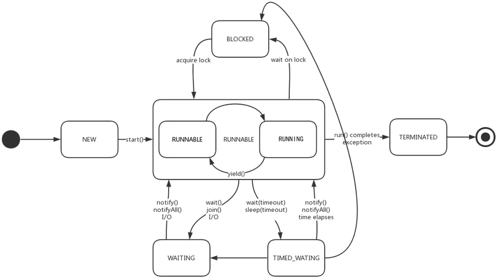

# 一、基础概念

## 线程和进程

- 线程是操作系统能够进行运算调度的最小单位，它依赖于进程创建，是进程中的实际运作单位。

- 每个进程都拥有自己独立的内存空间，且该进程下所有线程都共享该内存空间。

- 进程和线程都是独立的执行路径，但一个进程可以有多个线程。 

- 每个进程都有自己的内存空间、可执行代码和唯一的进程标识符（PID），而每个线程在Java中都有自己的私有栈，堆一般使用进程共享内存并与其他线程共享。

## 线程的状态（生命周期）

[](https://www.cnblogs.com/huangzejun/p/7908898.html)
<center>点击图片跳转图片出处</center>
 
###  新建(New）

创建Thread对象，在start启动之前，该线程不存在。

### 可运行（Runnable）

该状态可细分为可运行(Runnable)和运行中(Running)两个状态。

由于线程和进程的运行都听令于CPU的调度，在CPU没有通过轮询或其他方式从任务可执行队列选中该线程前，处于Runnable状态，选中之后处于Running状态。

Running状态的线程也是属于Runnable状态，反之不成立。

### 阻塞（Blocked）

Blocked状态一般为：
- 调用了sleep()或wait()或在run方法中其它线程的.join()方法。
- 为了获取某个锁资源，从而加入到该锁的阻塞队列时。
- 正在进行某个阻塞的IO操作，例如网络数据的读写。

### 无限期等待（Watting）

等待其它线程显式地唤醒，否则不会被分配 CPU 时间片。

### 限期等待（Timed Waiting）

无需等待其它线程显式地唤醒，在一定时间之后会被系统自动唤醒。

### 死亡（Terminated）

线程结束任务之后自己结束，或者产生了异常而结束。

# Thread

## Thread的构造函数

```java
private void init(ThreadGroup group, Runnable target, String name, long stackSize, AccessControlContext acc) {
    // 线程组 ThreadGroup 默认为null
    // 线程名name默认为"Thread-" + 数字(递增)，在进程销毁后重新数字从0重新开始。
    // 一般情况下，stackSize越大，方法可递归调用的深度越深，但和具体的软硬件有关，
    // 一般通过-xms设置栈大小，因此 stackSize 一般使用默认值 0。
    // AccessControlContext默认为null

    if (name == null) {
        throw new NullPointerException("name cannot be null");
    } else {
        this.name = name;
        // 父线程为实例化Thread对象时的线程。
        Thread parent = currentThread(); 
        SecurityManager securityManager = System.getSecurityManager();

        // 如果没有指定线程组
        if (group == null) {
                if (securityManager != null) {
                    group = securityManager.getThreadGroup();
                }

                // 默认使用父线程的线程组。
                if (group == null) {
                    group = parent.getThreadGroup();
                }
            }

            // 省略部分代码

            // 默认线程下，新线程的线程组和父线程是同一个
            // 优先级和是否是守护线程和父线程一致。
            this.group = group;
            this.daemon = parent.isDaemon();
            this.priority = parent.getPriority();

            // 省略部分代码
    }
}
```

- currentThread()方法为获取当前线程，在线程调用start()前并没有创建线程，因此可以发现一个线程的创建一个线程的创建由另一个线程完成，并且被创建线程的父线程为创建它的线程。

## 守护线程

守护线程是一种比较特殊的线程，一般用于处理一些后台的工作，比如垃圾回收（GC）线程。当JVM 中没有一个非守护线程时，则 JVM 的进程会推出。

调用Thread.setDaemon()方法便可设置线程类型，true代表守护线程，false 代表正常线程。该方法只在线程启动之前有效。

## Thread API

### sleep

Thread.sleep(millis)会休眠当前线程一定的毫秒，该方法不会放弃 monitor 锁的所有权。

该方法可能抛出InterruptedException,开发者可在T 中调用isInterrupted()

#### TimeUnit 代替 sleep

TimeUnit 对 sleep提供了很好的封装，且可读性更强，推荐用TimeUnit 代替 sleep。

```java
Thread.sleep(12257088L);
TimeUnit.HOURS.sleep(3);
TimeUnit.MINUTES.sleep(24);
TimeUnit.SECONDS.sleep(17);
TimeUnit.MILLISECONDS.sleep(88);
```

### yield

Thread.yield()方法用于告知CPU调度器当前线程愿意放弃所占用CPU资源，如果CPU资源不紧张，则可能会忽略提醒。

Thread.yield()会使当前线程从Running状态转换为Runnable状态。

### 中断

一个线程执行完毕之后会自动结束，如果在运行过程中发生异常也会提前结束。

#### interrupt()和InterruptedException

通过调用一个线程的 interrupt() 来中断该线程，如果该线程处于阻塞、限期等待或者无限期等待状态，那么就会抛出 InterruptedException，从而提前结束该线程。但是不能中断 I/O 阻塞和 synchronized 锁阻塞。

除了上述情况之外，仅仅主动调用interrupt()并不会对实际线程的执行代码造成任何影响,它仅仅是将 interrupt 标识为已打断状态。也就是说，当外部调用interrupt()时，线程是否中断执行，取决于线程自身是否愿意结束（结合isInterrupted()使用），标识仅仅作为参考作用。

```java
public class InterruptExample {
    public static void main(String[] args) throws InterruptedException {
        Thread thread1 = new MyThread1();
        thread1.start();
        thread1.interrupt();
        System.out.println("Main run");
    }

    private static class MyThread1 extends Thread {
        @Override
        public void run() {
            try {
                TimeUnit.MINUTES.sleep(2);
                System.out.println("Thread run");
            } catch (InterruptedException e) {
                e.printStackTrace();
            }
        }
    }
}
```

```java
Main run
java.lang.InterruptedException: sleep interrupted
	at java.lang.Thread.sleep(Native Method)
	at java.lang.Thread.sleep(Thread.java:340)
	at java.util.concurrent.TimeUnit.sleep(TimeUnit.java:386)
	at me.passin.demo.InterruptExample$MyThread1.run(InterruptExample.java:24)
```

值得注意的是线程执行的run方法中若捕捉了InterruptedException 异常之后会擦除该线程的 interrupt 标识。

```java
public class InterruptExample {
    public static void main(String[] args) throws InterruptedException {
        Thread thread = new Thread(){
            @Override
            public void run() {
                try {
                    System.out.println("Thread is interrupted ? "+ isInterrupted());
                    Thread.sleep(100);
                } catch (InterruptedException e) {
                    System.out.println("Thread InterruptedException");
                    e.printStackTrace();
                }
                System.out.println("Thread run");
            }
        };
        thread.start();
        thread.interrupt();
        TimeUnit.MILLISECONDS.sleep(100);
        System.out.println("Thread is interrupted ? "+ thread.isInterrupted());
    }
}
```

```
Thread is interrupted ? true
Thread InterruptedException
Thread run
Thread is interrupted ? false
```

#### isInterrupted()和Thread.interrupted()

这2个方法的返回值都用于当前线程是否被打断，不同在于，isInterrupted()不会影响 interrupt 标识的改变，而Thread.interrupted()在调用结束后会擦除掉当前线程的 interrupt 标识（标识为未打断状态），即如果当前被打断了（调用了interrupt()方法）,第一次调用Thread.interrupted() 会返回true，然后interrupt 标识会被擦除，第二次再调用Thread.interrupted()则会返回 false，除非该线程在两次调用Thread.interrupted()期间线程又一次被打断。

isInterrupted()和interrupt()结合使用

```java
public class InterruptExample {
    public static void main(String[] args) throws InterruptedException {
        Thread thread = new Thread(){
            @Override
            public void run() {
                while (true) {
                    System.out.println("Thread run");
                    if (isInterrupted()) {
                        System.out.println("Thread active acceptance of interruption");
                        return;
                    }
                }
            }
        };
        thread.start();
        thread.interrupt();
        TimeUnit.MILLISECONDS.sleep(100);
        System.out.println("Thread is interrupted ? "+ thread.isInterrupted());
    }
}
```

```
Thread run
Thread active acceptance of interruption
Thread is interrupted ? false
```

### join

在线程中调用另一个线程的 join() 方法，会将当前线程挂起(处于Watting状态)，直到目标线程执行结束或到达给定的时间或被打断。

对于以下代码，虽然 b 线程先启动，但是因为在 b 线程中调用了 a 线程的 join() 方法，b 线程会等待 a 线程结束才继续执行，因此最后能够保证 a 线程的输出先于 b 线程的输出。

```java
public class JoinExample {

    public static void main(String[] args) throws InterruptedException {
        A a = new A();
        B b = new B(a);
        b.start();
        a.start();
//      b.interrupt();
    }

    private static class A extends Thread {
        @Override
        public void run() {
            System.out.println("A");
        }
    }

    private static class B extends Thread {
        private A a;

        B(A a) {
            this.a = a;
        }

        @Override
        public void run() {
            try {
                a.join();
            } catch (InterruptedException e) {
                System.out.println("ThreadB InterruptedException");
            }
            System.out.println("B");
        }
    }
}
```

```
A
B
```

取消注释 b.interrupt() 后的结果：
```
ThreadB InterruptedException
B
A
```


# Java内存模型

Java内存模型和CPU缓存模型对理解线程安全与数据同步有很大的必要，因此这里先围绕Java内存模型展开讲解。


# 线程安全与数据同步

## synchronized

synchronized 关键字提供了一种锁的机制，它设计的初衷是锁方法中的资源，而不是某个方法或代码块。从本质上说主要提供了2种作用：

1.确保共享变量的线程间互斥访问，原理是对于从一个Monitor所监视的所有代码块，只能有一个线程可以访问（拿到Monitor的 lock），使得在这些代码块中每次只能有一个线程对变量进行读写。

2.synchronized 包括两个monitor enter 和 monitor exit 两个指令，它能够保证在任何时候任何线程执行到monitor enter成功之前都**必须从共享内存中获取数据**，而不是从缓存（CPU Cache）中取数据，在 monitor exit 运行成功之后，会将更新后的值刷入共享内存中。

## volatile

volatile的原理和实现机制：

volatile 实际尚使用机器指令 **lock** ，**lock**相当于一个内存屏障，它会为内存的执行提供以下几个保障：

- 确保指令重排序时不会将后面的代码排到内存屏障之前。
- 确保指令重排序时不会将前面的代码排到内存屏障之后。
- 确保执行到内存屏障修饰的指令时，前面的代码全部执行完成。
- 强制将线程工作内存（CPU Cache）中的值刷新到主内存中。
- 如果是写操作，会使其他线程的工作内存的volatile修饰的数据失效。
- 如果是读操作，线程会先查看本地工作内存（CPU Cache）的数据是否失效，如果未失效，直接使用；如果已失效，则到共享内存中重新读取。

从volatile的原理简单总结volatile的作用和注意事项：

- 禁止指令的重排序优化。

- volatile 只能保持变量的可见性，不能保证变量的操作都是原子操作。

- volatile 只能修饰静态变量、实例变量，对于方法参数、局部变量、实例常量以及类常量都不能修饰。

注：部分虚拟机中，long与double的读写不是原子操作，而是划分为两次32位的操作来进行，而加 volatile 后long 和double类型的变量操作将是原子操作。

## 死锁

死锁是指两个或两个以上的进程（线程）在执行过程中，由于竞争资源或者由于彼此通信而造成的一种阻塞的现象，若无外力作用，它们都将无法推进下去。

### 死锁产生条件

死锁的发生必须具备以下四个必要条件：

#### 互斥条件

指进程对所分配到的资源进行排它性使用，即在一段时间内某资源只由一个进程占用。如果此时还有其它进程请求资源，则请求者只能等待，直至占有资源的进程用毕释放。

#### 请求和保持条件

指进程已经保持至少一个资源，但又提出了新的资源请求，而该资源已被其它进程占有，此时请求进程阻塞，但又对自己已获得的其它资源保持不放。

#### 不剥夺条件

指进程已获得的资源，在未使用完之前，不能被剥夺，只能在使用完时由自己释放。

#### 环路等待条件

指在发生死锁时，必然存在一个进程——资源的环形链，即进程集合{P0，P1，P2，···，Pn}中的P0正在等待一个P1占用的资源；P1正在等待P2占用的资源，……，Pn正在等待已被P0占用的资源。

### 简单的死锁Demo

多线程操作时，交叉锁可能导致死锁的Demo

```java
private final Object MONITOR_READ = new Object();
private final Object MONITOR_WRITE = new Object();

public void read() {
    synchronized (MONITOR_READ) {
        synchronized (MONITOR_WRITE) {
            // ……
        }
    }
}

public void write() {
    synchronized (MONITOR_WRITE) {
        synchronized (MONITOR_READ) {
            // ……
        }
    }
}   
```

# 线程间协作

## wait()、notify()、notifyAll()

这三个方法都不是Thread特有的方法，而是Object的方法，因为设计的需求便是多线程情况下，以Object为单位保持数据的安全和同步（锁的是对象），而不是锁线程。

调用wait()方法会使当前线程挂起(处于Watting状态)，并释放该Object的Monitor的所有权并进入该Object 关联的wait set中，待有其它线程调用notify()或notifyAll()才能将其唤醒，或到达了wait()方法设置的timeout时间自动唤醒。
被唤醒的线程需重新获取到该Object所关联的Monitor的lock才会继续执行。

notify()只能唤醒wait set其中的一个线程（没有强制要求按照某一种方式选择将要唤醒的线程），notifyAll()可以同时唤醒wait set的所有线程，同样被唤醒的线程仍需要争抢 Monitor的 lock。

只能用在同步方法或者同步控制块中使用，否则会在运行时抛出 IllegalMonitorStateExeception。

wait()方法和sleep()一样同样会被打断。

# ExecutorService

由于线程的创建、启动以及销毁都是比较耗费系统资源的，因此设计了一个名为线程池的类，不仅能够对线程进行多次复用，还对线程的管理进行了很好的封装。

我们先看一下线程池应该具备的基本操作和方法。

```java
public interface Executor {
    
    // 执行该Runnable接口实现的方法。 
    void execute(Runnable command);
}
```

```java
public interface ExecutorService extends Executor {


    // 关闭线程池。
    // 调用该不会直接关闭线程池，而是将正在执行的或等待执行的任务全部执行完后关闭，
    // 在此期间也不能再添加新的任务。 
    void shutdown();

    // 调用立即强行关闭线程池，并返回等待执行的任务列表。
    List<Runnable> shutdownNow();

    // 线程池是否已经被关闭。
    boolean isShutdown();

    // 线程池已关闭或所有任务已完成或停止。
    boolean isTerminated();

    // 调用此方法，在shutdown请求发起后，除非以下任何一种情况发生，否则当前线程将一直到阻塞。 
    // 1.所有任务执行完成；
    // 2.超过超时时间；
    // 3.当前线程被中断。
    boolean awaitTermination(long timeout, TimeUnit unit)
        throws InterruptedException;

    // submit() 为execute()方法的拓展，返回值Future用以取消任务的执行或者等待完成得到返回值。
    // Callable可以理解为可以有返回值的Runnable。
    // Future.get()用以获取返回值，且该方法会堵塞当前线程。
    <T> Future<T> submit(Callable<T> task);


    <T> Future<T> submit(Runnable task, T result);

    // 如果任务结束执行则 future.get()== null。
    Future<?> submit(Runnable task);

    // 执行一组任务，返回一个Future的list，其中的Future持有任务执行完成的结果和状态对于每一个返回的结果，Future.isDone ＝ true。
    <T> List<Future<T>> invokeAll(Collection<? extends Callable<T>> tasks)
        throws InterruptedException;

    // 执行一组任务，返回一个Future的list，其中的Future持有任务执行完成的结果和状态，// 如果所有任务执行完成或者超时，对于每一个返回的结果中，Future.isDone ＝ true。
    // 未执行完成的任务被取消，完成的任务可能正常结束或者异常结束。
    <T> List<Future<T>> invokeAll(Collection<? extends Callable<T>> tasks,
                                  long timeout, TimeUnit unit)
        throws InterruptedException;

    // 执行一组任务，当成功执行完一个任务（没有抛异常），就返回结果，
    // 不论正常返回还是异常结束，未执行的任务都会被取消。
    <T> T invokeAny(Collection<? extends Callable<T>> tasks)
        throws InterruptedException, ExecutionException;

    // 执行一组任务，在未超时情况下，当成功执行完一个任务（没有抛异常），就返回结果，
    // 不论正常返回还是异常结束，未执行的任务都会被取消。  
    <T> T invokeAny(Collection<? extends Callable<T>> tasks,
                    long timeout, TimeUnit unit)
        throws InterruptedException, ExecutionException, TimeoutException;
}
```

## ThreadPoolExecutor

```java
public ThreadPoolExecutor(int corePoolSize,
                            int maximumPoolSize,
                            long keepAliveTime,
                            TimeUnit unit,
                            BlockingQueue<Runnable> workQueue,
                            ThreadFactory threadFactory,RejectedExecutionHandler handler) {
        if (corePoolSize < 0 ||
            maximumPoolSize <= 0 ||
            maximumPoolSize < corePoolSize ||
            keepAliveTime < 0)
            throw new IllegalArgumentException();
        if (workQueue == null || threadFactory == null || handler == null)
            throw new NullPointerException();
        this.corePoolSize = corePoolSize;
        this.maximumPoolSize = maximumPoolSize;
        this.workQueue = workQueue;
        this.keepAliveTime = unit.toNanos(keepAliveTime);
        this.threadFactory = threadFactory;
        this.handler = handler;
}
```
- corePoolSize

  核心线程数。核心线程会一直存活，即使没有任务需要执行,除非设置线程池的变量allowCoreThreadTimeout为true，则核心线程也会在空闲超时时关闭。

  当线程池的线程数小于核心线程数时，即使有线程空闲,线程池也会优先创建新线程处理。

- maximumPoolSize 

  最大线程数。线程池所维护的最大线程数。

- keepAliveTime 和 unit

  当线程数量大于核心时，多余的空闲线程在销毁之前等待新任务的最大时间。
  若allowCoreThreadTimeout=true，会销毁线程直至线程数量为0，否则直至线程数量=corePoolSize。

- workQueue

  任务队列。当核心线程数达到最大时，新任务会放在队列中排队等待执行。

- rejectedExecutionHandler

  任务拒绝处理器。
  
  当线程池线程数 = maxPoolSize，并且任务队列已满时,会拒绝新任务。

  当线程池调用shutdown()后，在线程池真正关闭之前，再提交新任务，会拒绝新任务。

### ThreadPoolExecutor的执行顺序

1. 当线程数小于核心线程数时，创建线程。
2. 当线程数大于等于核心线程数，且任务队列未满时，将任务放入任务队列。
3. 当线程数大于等于核心线程数，且任务队列已满。若线程数小于最大线程数，创建线程；若线程数等于最大线程数，抛出异常，拒绝任务。

### BlockingQueue

BlockingQueue接口实现Queue接口，它支持两个附加操作：获取元素时等待队列变为非空，以及存储元素时等待空间变得可用。相对于同一操作他提供了四种机制：抛出异常、返回特殊值、阻塞等待、超时。

BlockingQueue常用于生产者和消费者场景。这里简单说明一下线程池常使用的阻塞队列。

- LinkedBlockingQueue：一个由链表结构组成的无界阻塞队列。默认容量大小为Integer.MAX_VALUE。

- SynchronousQueue：一个不存储元素的阻塞队列。

## Executors

Executors工具类包装了一些线程池，我们针对其中一些方法进行分析。

### CachedThreadPool

```java
public static ExecutorService newCachedThreadPool() 
    return new ThreadPoolExecutor(0, Integer.MAX_VALUE,
                                    60L, TimeUnit.SECONDS,
                                    new SynchronousQueue<Runnable>());
}
```

从CachedThreadPool的实例化参数，我们可以看出，由于SynchronousQueue不存储Runnable，在没有空闲线程时，每执行一个任务，便创建一个线程，当某个线程执行完任务后，会将该线程缓存下来一定的时间（60s），在此时间内，若有新的任务，则用缓存的线程执行该任务，此时不再创建新线程。若某个线程超过了缓存时间仍然没有新的任务，则销毁该线程。

### FixedThreadPool

```java
public static ExecutorService newFixedThreadPool(int nThreads) {
    return new ThreadPoolExecutor(nThreads, nThreads,
                                    0L, TimeUnit.MILLISECONDS,
                                    new LinkedBlockingQueue<Runnable>());
}
```

创建一个固定数量线程的线程池。没执行任务则暂时没有线程，待执行任务时创建线程直到达到所设置的最大线程数量。

### SingleThreadExecutor

```java
    public static ExecutorService newSingleThreadExecutor() {
        return new FinalizableDelegatedExecutorService
            (new ThreadPoolExecutor(1, 1,
                                    0L, TimeUnit.MILLISECONDS,
                                    new LinkedBlockingQueue<Runnable>()));
    }
```

创建一个固定数量为1的线程池。并用代理对象FinalizableDelegatedExecutorService对ThreadPoolExecutor进行了一层包装，只暴露部分ThreadPoolExecutor类中需要的方法，且该代理类重写了finalize()方法，待GC机制想回收该线程池时，调用线程池的shutdown()方法。

### 不推荐直接使用Executors

不推荐使用Executors去创建线程池，而是通过ThreadPoolExecutor的方式，这样的处理方式让写的同学更加明确线程池的运行规则，规避资源耗尽的风险。
说明：Executors返回的线程池对象的弊端如下：
1）FixedThreadPool和SingleThreadPool:允许的请求队列长度为Integer.MAX_VALUE，可能会堆积大量的请求，从而导致OOM。
2）CachedThreadPool和ScheduledThreadPool:允许的创建线程数量为Integer.MAX_VALUE，可能会创建大量的线程，从而导致OOM。

# ThreadLocal

ThreadLocal为每一个使用该变量的线程都提供了独立的副本，做到线程间的数据隔离,每一个线程都有属于自己的一份副本变量。

# 多线程开发规范

- 为线程赋予一个有意义的名字有助于问题的排查和线程的追踪。
- 缩小同步范围，从而减少锁争用。例如对于 synchronized，应该尽量使用同步块而不是同步方法。
- 使用线程池而不是直接创建线程，因为线程是一个重量级的资源，直接创建线程资源利用率低，线程池可以有效地利用有限的线程执行任务。
- 不推荐使用Executors去创建线程池。

# 面试题解

### 什么是线程

### Thread类run()和start()的区别

Thread.run()运行在当前线程，start()启动新创建的线程,并在新线程执行run()方法。

# 参考资料
- 汪文君. Java高并发编程详解 [M]. 机械工业出版社, 2018.
- 周志明. 深入理解 Java 虚拟机 [M]. 机械工业出版社, 2011.
- [CS-Notes. Java 并发](https://github.com/CyC2018/CS-Notes/blob/master/notes/Java%20并发.md)