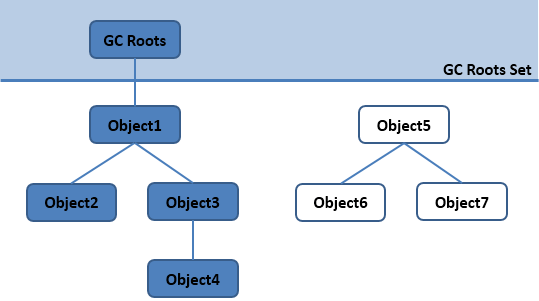

<!-- TOC -->

- [一、概述](#一概述)
- [二、运行时数据区域](#二运行时数据区域)
    - [2.1 程序计数器](#21-程序计数器)
    - [2.2 Java 虚拟机栈](#22-java-虚拟机栈)
        - [2.2.1 局部变量表](#221-局部变量表)
        - [2.2.2 操作数栈](#222-操作数栈)
    - [2.3 本地方法栈](#23-本地方法栈)
    - [2.4 堆](#24-堆)
    - [2.5 方法区](#25-方法区)
    - [2.6 运行时常量池](#26-运行时常量池)
    - [2.7 直接内存](#27-直接内存)
- [三、垃圾回收（GC）](#三垃圾回收gc)
    - [3.1 判断一个对象是否存活](#31-判断一个对象是否存活)
        - [3.1.2 引用计数算法](#312-引用计数算法)
        - [3.1.2 可达性分析算法](#312-可达性分析算法)
    - [3.2 引用类型](#32-引用类型)
    - [3.3 方法区的回收](#33-方法区的回收)
        - [3.3.1 常量池的回收](#331-常量池的回收)
        - [3.3.2 类的卸载](#332-类的卸载)
    - [3.4 垃圾收集算法](#34-垃圾收集算法)
        - [3.4.1 标记 - 清除](#341-标记---清除)
        - [3.4.2 标记 - 整理](#342-标记---整理)
        - [3.4.3 复制](#343-复制)
        - [3.4.4 分代收集](#344-分代收集)
    - [3.5 内存分配与回收策略](#35-内存分配与回收策略)
        - [3.5.1 Minor GC 和 Full GC](#351-minor-gc-和-full-gc)
        - [3.5.2 内存分配策略](#352-内存分配策略)
        - [3.5.3 Full GC 的触发条件](#353-full-gc-的触发条件)
- [四、类加载机制](#四类加载机制)
    - [4.1 类的生命周期](#41-类的生命周期)
    - [4.2 类加载过程](#42-类加载过程)
        - [4.2.1 加载](#421-加载)
        - [4.2.2 验证](#422-验证)
        - [4.2.3 准备](#423-准备)
        - [4.2.4 解析](#424-解析)
        - [4.2.5 初始化](#425-初始化)
    - [4.3 类初始化时机](#43-类初始化时机)
        - [4.3.1 主动引用](#431-主动引用)
        - [4.3.2 被动引用](#432-被动引用)
- [五、类加载器](#五类加载器)
        - [5.1 类与类加载器](#51-类与类加载器)
        - [5.2 加载器分类](#52-加载器分类)
        - [5.3 双亲委派模型](#53-双亲委派模型)
- [参考资料](#参考资料)

<!-- /TOC -->

# 一、概述

Java 虚拟机（JVM）是运行 Java 字节码的虚拟机。

在 Java 中，JVM 可以理解的代码就叫做字节码（即扩展名为 .class 的文件），它不面向任何特定的处理器，只面向虚拟机。JVM 会针对不同系统的特定实现（Windows，Linux，macOS），目的是使用相同的字节码，都会得到相同的结果，这也是 **一次编译，随处可以运行**的关键所在。

Java 语言通过编译成字节码的方式，在一定程度上解决了传统解释型语言执行效率低的问题，同时又保留了解释型语言可移植的特点，所以 Java 程序运行时比较高效。

# 二、运行时数据区域

JDK1.8 之前：

<div align="center">  </div><br>

JDK1.8 及之后：

<div align="center">  </div><br>

## 2.1 程序计数器

程序计数器用于记录正在执行的虚拟机字节码指令的地址（如果正在执行的是本地方法则为空）。通过字节码解释器改变这个计数器的值来选择下一条需要执行的字节码指令。例如分支、循环、跳转、异常处理、线程恢复等功能都需要依赖这个计数器来完成。

另外，为了线程切换后能恢复到正确的执行位置，每条线程都需要有一个独立的程序计数器，各线程之间计数器互不影响，独立存储，我们称这类内存区域为 **线程私有**的内存。

程序计数器是唯一一个不会出现 OutOfMemoryError 的内存区域，它的生命周期随着线程的创建而创建，随着线程的结束而死亡。

## 2.2 Java 虚拟机栈

每个 Java 方法在执行的同时会创建一个栈帧，用于存储局部变量表、操作数栈、常量池引用等信息。每一个方法从调用直至执行完成的过程，就对应着一个栈帧在 Java 虚拟机栈中入栈和出栈的过程。

<div align="center">  </div><br>

该区域可能抛出以下异常：

- 当线程请求的栈深度超过最大值，会抛出 StackOverflowError 异常；
- 栈进行动态扩展时如果无法申请到足够内存，会抛出 OutOfMemoryError 异常。

### 2.2.1 局部变量表

局部变量表存放了编译期可知的各种基本数据类型（boolean、byte、char、short、int、float、long、double）、对象引用（refrence）类型和 returnAddress 类型（指向了一条字节码指令的地址）。
系统不会为局部变量赋予初始值，也就是说不存在类变量那样的准备阶段。

### 2.2.2 操作数栈

虚拟机把操作数栈作为它的工作区——大多数指令都要从这里弹出数据，执行运算，然后把结果压回操作数栈。比如，iadd 指令就要从操作数栈中弹出两个整数，执行加法运算，其结果又压回到操作数栈中，看看下面的示例，它演示了虚拟机是如何把两个 int 类型的局部变量相加，再把结果保存到第三个局部变量的：

```java
    begin  
    iload_0    // push the int in local variable 0 onto the stack  
    iload_1    // push the int in local variable 1 onto the stack  
    iadd       // pop two ints, add them, push result  
    istore_2   // pop int, store into local variable 2  
    end  
```

## 2.3 本地方法栈

与 Java 虚拟机栈类似，它们之间的区别只不过是本地方法栈为 Native 方法服务。在 HotSpot 虚拟机中和 Java 虚拟机栈合二为一。

<div align="center">  </div><br>

## 2.4 堆

所有对象实例以及数组都在这里分配内存。是垃圾收集的主要区域（"GC 堆"）。

现代的垃圾收集器基本都是采用分代收集算法，针对不同类型的对象采取不同的垃圾回收算法。虚拟机把 Java 堆分成以下三块：

- 新生代（Young Generation）
- 老年代（Old Generation）

当一个对象被创建时，它首先进入新生代，之后有可能被转移到老年代中。

新生代存放着大量的生命很短的对象，因此新生代在三个区域中垃圾回收的频率最高。为了更高效地进行垃圾回收，把新生代继续划分成以下三个空间：

- Eden（伊甸园）
- From Survivor（幸存者）
- To Survivor

<div align="center">  </div><br>

Java 堆不需要连续内存，并且可以动态增加其内存，增加失败会抛出 OutOfMemoryError 异常。

## 2.5 方法区

方法区是 Java 虚拟机规范中的定义，而永久代是 HotSpot 虚拟机对方法区的实现方式。

该区域用于存放已被加载的类信息、常量、静态变量、即时编译器编译后的代码等数据。

对这块区域进行垃圾回收的主要目标是对常量池的回收和对类的卸载。

HotSpot 虚拟机把它当成永久代来进行垃圾回收。但很难确定永久代的大小，因为它受到很多因素影响，并且每次 Full GC 之后永久代的大小都会改变，所以经常会抛出 OutOfMemoryError 异常。为了更容易管理方法区，从 JDK 1.8 开始，移除永久代，并把原本由 JVM 管理内存的方法区的内存移到了虚拟机以外的计算机本地内存，并将其称为元空间（Metaspace）。

## 2.6 运行时常量池

在 JDK1.7 之前运行时常量池是方法区的一部分。JDK1.7 及之后将运行时常量池从方法区中移了出来，在 Java 堆（Heap）中开辟了一块区域存放运行时常量池。

Class 文件中的常量池（编译器生成的各种字面量、符号引用和类的描述信息）会在类加载后被放入这个区域。

除了在编译期生成的常量，还允许动态生成，例如 String 类的 intern()。

- 字面量：文本字符串、final 常量值、基本数据类型的值、其它。
- 符号引用：类和结构的完全限定名、字段名称和描述符、方法名称和描述符。

## 2.7 直接内存

直接内存并不是虚拟机运行时数据区的一部分，也不是虚拟机规范中定义的内存区域，但是这部分内存也被频繁地使用。而且也可能导致 OutOfMemoryError 异常出现。

在 JDK1.4 中新加入了 NIO 类，它可以使用 Native 函数库直接分配堆外内存，然后通过一个存储在 Java 堆里的 DirectByteBuffer 对象作为这块内存的引用进行操作。这样能在一些场景中显著提高性能，因为避免了在 Java 堆和 Native 堆中来回复制数据。

本机直接内存的分配不会受到 Java 堆的限制，但是，既然是内存就会受到本机总内存大小以及处理器寻址空间的限制。

# 三、垃圾回收（GC）

程序计数器、虚拟机栈和本地方法栈这三个区域属于线程私有的，只存在于线程的生命周期内，线程结束之后也会消失，因此不需要对这三个区域进行垃圾回收。垃圾回收主要是针对 Java 堆和方法区进行。

## 3.1 判断一个对象是否存活

### 3.1.2 引用计数算法

给对象添加一个引用计数器，当对象增加一个引用时计数器加 1，引用失效时计数器减 1。引用计数为 0 的对象可被回收。

两个对象出现循环引用的情况下，此时引用计数器永远不为 0，导致无法对它们进行回收。因此 Java 虚拟机不使用引用计数算法。

```java
public class ReferenceCountingGC {
    public Object instance = null;

    public static void main(String[] args) {
        ReferenceCountingGC objectA = new ReferenceCountingGC();
        ReferenceCountingGC objectB = new ReferenceCountingGC();
        objectA.instance = objectB;
        objectB.instance = objectA;
    }
}
```

### 3.1.2 可达性分析算法

通过 GC Roots 作为起始点进行搜索，能够到达到的对象都是存活的，不可达的对象可被回收。

Java 虚拟机使用该算法来判断对象是否可被回收，在 Java 中 GC Roots 一般包含以下内容：

- **运行中的线程**（包括了 Java 虚拟机栈和本地方法栈中引用的对象）
- 方法区中类静态属性引用的对象
- 方法区中的常量引用的对象

<div align="center">  </div><br>

## 3.2 引用类型

无论是通过引用计算算法判断对象的引用数量，还是通过可达性分析算法判断对象是否可达，判定对象是否可被回收都与引用有关。

Java 具有四种强度不同的引用类型。

**（一）强引用** 

被强引用关联的对象不会被垃圾收集器回收。

使用 new 一个新对象的方式来创建强引用。

```java
Object obj = new Object();
```

**（二）软引用** 

被软引用关联的对象，只有在内存不够的情况下才会被回收（前提是弱引用关联的对象已没有被强引用对象所引用）。

使用 SoftReference 类来创建软引用。

```java
Object obj = new Object();
SoftReference<Object> sf = new SoftReference<Object>(obj);
obj = null;  // 使对象只被软引用关联
```

**（三）弱引用** 

被弱引用关联的对象一定会被垃圾收集器回收，也就是说它只能存活到下一次垃圾收集发生之前（前提是弱引用关联的对象已没有被强引用对象所引用）。

使用 WeakReference 类来实现弱引用。

```java
Object obj = new Object();
WeakReference<Object> wf = new WeakReference<Object>(obj);
obj = null;
```

**（四）虚引用** 

又称为幽灵引用或者幻影引用。一个对象是否有虚引用的存在，完全不会对其生存时间构成影响，也无法通过虚引用取得一个对象实例。

为一个对象设置虚引用关联的唯一目的就是能在这个对象被收集器回收时收到一个系统通知（必须和 ReferenceQueue 联合使用）。

```java
Object obj = new Object();
PhantomReference<Object> pf = new PhantomReference<Object>(obj);
obj = null;
```

## 3.3 方法区的回收

因为方法区主要存放永久代对象，而永久代对象的回收率比新生代差很多，因此在方法区上进行回收性价比不高。

主要是对常量池的回收和对类的卸载。

### 3.3.1 常量池的回收

假如在常量池中存在字符串 "abc"，如果当前没有任何 String 对象引用该字符串常量的话，就说明常量 "abc" 就是废弃常量，如果这时发生内存回收的话而且有必要的话，"abc" 就会被系统清理出常量池。

### 3.3.2 类的卸载

类的卸载条件很多，需要满足以下三个条件，并且满足了也不一定会被卸载：

- 该类所有的实例都已经被回收，也就是 Java 堆中不存在该类的任何实例。
- 加载该类的 ClassLoader 已经被回收。
- 该类对应的 java.lang.Class 对象没有在任何地方被引用，也就无法在任何地方通过反射访问该类方法。

在大量使用反射、动态代理、CGLib 等 ByteCode 框架、动态生成 JSP 以及 OSGi 这类频繁自定义 ClassLoader 的场景都需要虚拟机具备类卸载功能，以保证不会出现内存溢出。

## 3.4 垃圾回收算法

### 3.4.1 标记 - 清除

<div align="center">  </div><br>

对存活的对象进行标记，然后清理掉未被标记的对象。

不足：

- 标记和清除过程效率都不高；
- 会产生大量不连续的内存碎片，导致无法给大对象分配内存。

### 3.4.2 标记 - 整理

<div align="center">  </div><br>

让所有存活的对象都向一端移动，然后直接清理掉端边界以外的内存。

### 3.4.3 复制

<div align="center">  </div><br>

将内存划分为大小相等的两块，每次只使用其中一块，当这一块内存用完了就将还存活的对象复制到另一块上面，然后再把使用过的内存空间进行一次清理。

不足：是只使用了内存的一半。

现在的商业虚拟机都采用这种收集算法来回收新生代，但是并不是将内存划分为大小相等的两块，而是分为一块较大的 Eden 空间和两块较小的 Survivor 空间，每次使用 Eden 空间和其中一块 Survivor。在回收时，将 Eden 和 Survivor 中还存活着的对象一次性复制到另一块 Survivor 空间上，最后清理 Eden 和使用过的那一块 Survivor。

HotSpot 虚拟机的 Eden 和 Survivor 的大小比例默认为 8:1，保证了内存的利用率达到 90%。如果每次回收有多于 10% 的对象存活，那么一块 Survivor 空间就不够用了，此时需要依赖于老年代进行分配担保，也就是借用老年代的空间存储放不下的对象。

### 3.4.4 分代收集

现在的商业虚拟机采用分代收集算法，它根据对象存活周期将内存划分为几块，不同块采用适当的收集算法。

一般将 Java 堆分为新生代和老年代。

- 新生代使用：复制算法
- 老年代使用：标记 - 清理 或者 标记 - 整理 算法

## 3.5 内存分配与回收策略

对象的内存分配，也就是在堆上分配。主要分配在新生代的 Eden 区上，少数情况下也可能直接分配在老年代中。

### 3.5.1 Minor GC 和 Full GC

- Minor GC：发生在新生代上，因为新生代对象存活时间很短，因此 Minor GC 会频繁执行，执行的速度一般也会比较快。
- Full GC：发生在老年代上，老年代对象和新生代的相反，其存活时间长，因此 Full GC 很少执行，而且执行速度会比 Minor GC 慢很多。

### 3.5.2 内存分配策略

**（1）对象优先在 Eden 分配** 

大多数情况下，对象在新生代 Eden 区分配，当 Eden 区空间不够时，发起 Minor GC。

**（2）大对象直接进入老年代** 

大对象是指需要连续内存空间的对象，最典型的大对象是那种很长的字符串以及数组。

经常出现大对象会提前触发垃圾收集以获取足够的连续空间分配给大对象。

-XX:PretenureSizeThreshold，大于此值的对象直接在老年代分配，避免在 Eden 区和 Survivor 区之间的大量内存复制。

**（3）长期存活的对象进入老年代** 

为对象定义年龄计数器，对象在 Eden 出生并经过 Minor GC 依然存活，将移动到 Survivor 中，年龄就增加 1 岁，增加到一定年龄（默认为 15 岁）则移动到老年代中。

-XX:MaxTenuringThreshold 用来定义年龄的阈值。

**（4）动态对象年龄判定** 

虚拟机并不是永远地要求对象的年龄必须达到 MaxTenuringThreshold 才能晋升老年代，如果在 Survivor 区中相同年龄所有对象大小的总和大于 Survivor 空间的一半，则年龄大于或等于该年龄的对象可以直接进入老年代，无需等到 MaxTenuringThreshold 中要求的年龄。

**（5）空间分配担保** 

在发生 Minor GC 之前，虚拟机先检查老年代最大可用的连续空间是否大于新生代所有对象总空间，如果条件成立的话，那么 Minor GC 可以确认是安全的；

如果不成立的话虚拟机会查看 HandlePromotionFailure 设置值是否允许担保失败，如果允许那么就会继续检查老年代最大可用的连续空间是否大于历次晋升到老年代对象的平均大小，如果大于，将尝试着进行一次 Minor GC，尽管这次 Minor GC 是有风险的；如果小于，或者 HandlePromotionFailure 设置不允许冒险，那这时也要改为进行一次 Full GC。

### 3.5.3 Full GC 的触发条件

对于 Minor GC，其触发条件非常简单，当 Eden 区空间满时，就将触发一次 Minor GC。而 Full GC 则相对复杂，有以下条件：

**（一）调用 System.gc()** 

此方法的调用是建议虚拟机进行 Full GC，虽然只是建议而非一定，但很多情况下它会触发 Full GC，从而增加 Full GC 的频率，也即增加了间歇性停顿的次数。因此建议不使用此方法，让虚拟机自己去管理它的内存。

**（二）老年代空间不足** 

老年代空间不足的常见场景为前文所讲的大对象直接进入老年代、长期存活的对象进入老年代等。

当执行 Full GC 后空间仍然不足，则抛出 Java.lang.OutOfMemoryError。为避免以上原因引起的 Full GC，调优时应尽量做到让对象在 Minor GC 阶段被回收、让对象在新生代多存活一段时间以及不要创建过大的对象及数组。

**（三）空间分配担保失败** 

使用复制算法的 Minor GC 需要老年代的内存空间作担保，如果出现了 HandlePromotionFailure 担保失败，则会触发 Full GC。

**（四）JDK 1.7 及以前的永久代空间不足** 

在 JDK 1.7 及以前，HotSpot 虚拟机中的方法区是用永久代实现的，永久代中存放的为一些 Class 的信息、常量、静态变量等数据。

当系统中要加载的类、反射的类和调用的方法较多时，永久代可能会被占满，在未配置为采用 CMS GC 的情况下也会执行 Full GC。如果经过 Full GC 仍然回收不了，那么虚拟机会抛出 java.lang.OutOfMemoryError。

为避免以上原因引起的 Full GC，可采用的方法为增大永久代空间或转为使用 CMS GC。

**（五）Concurrent Mode Failure** 

执行 CMS GC 的过程中同时有对象要放入老年代，而此时老年代空间不足（有时候“空间不足”是 CMS GC 时当前的浮动垃圾过多导致暂时性的空间不足），便会报 Concurrent Mode Failure 错误，并触发 Full GC。

# 四、类加载机制

类是在运行期间第一次使用时动态加载的，而不是一次性加载所有类，从而达到懒加载的优化效果。

## 4.1 类的生命周期

<div align="center">  </div><br>

包括以下 7 个阶段：

-  **加载（Loading）** 
-  **验证（Verification）** 
-  **准备（Preparation）** 
-  **解析（Resolution）** 
-  **初始化（Initialization）** 
- 使用（Using）
- 卸载（Unloading）

## 4.2 类加载过程

包含了加载、验证、准备、解析和初始化这 5 个阶段。

### 4.2.1 加载

加载是类加载的第一个阶段，主要完成以下三件事：

- 通过一个类的全限定名来获取定义此类的二进制字节流。
- 将这个字节流所代表的静态存储结构转化为方法区的运行时存储结构。
- 在内存中生成一个代表这个类的 Class 对象，作为方法区这个类的各种数据的访问入口。

其中二进制字节流可以从以下方式中获取：

- 从 ZIP 包读取，成为 JAR、EAR、WAR 格式的基础。
- 从网络中获取，这种场景最典型的应用是 Applet。
- 运行时计算生成，这种场景使用得最多得就是动态代理技术，在 java.lang.reflect.Proxy 中，就是用了 ProxyGenerator.generateProxyClass 的代理类的二进制字节流。
- 由其他文件生成，典型场景是 JSP 应用，即由 JSP 文件生成对应的 Class 类。

### 4.2.2 验证

确保 Class 文件的字节流中包含的信息符合当前虚拟机的要求，并且不会危害虚拟机自身的安全。

- 文件格式验证：验证字节流是否符合 Class 文件格式的规范，并且能被当前版本的虚拟机处理。
- 元数据验证：对字节码描述的信息进行语义分析，以保证其描述的信息符合 Java 语言规范的要求。
- 字节码验证：通过数据流和控制流分析，确保程序语义是合法、符合逻辑的。
- 符号引用验证：发生在虚拟机将符号引用转换为直接引用的时候，对类自身以外（常量池中的各种符号引用）的信息进行匹配性校验。

### 4.2.3 准备

类变量是被 static 修饰的变量，准备阶段为类变量分配内存并设置初始值，使用的是方法区的内存。

实例变量不会在这阶段分配内存，它将会在对象实例化时随着对象一起分配在 Java 堆中。（实例化不是类加载的一个过程，类加载发生在所有实例化操作之前，并且类加载只进行一次，实例化可以进行多次）

初始值一般为 0 值，例如下面的类变量 value 被初始化为 0 而不是 123。

```java
public static int value = 123;
```

如果类变量是常量，那么会按照表达式来进行初始化，而不是赋值为 0。

```java
public static final int value = 123;
```

### 4.2.4 解析

在常量池寻找类、接口、字段和方法的符号引用并替换为直接引用的过程。解析动作主要针对类或接口、字段、类方法、接口方法、方法类型、方法句柄和调用限定符 7 类符号引用进行。

解析过程在某些情况下可以在初始化阶段之后再开始，这是为了支持 Java 的动态绑定。

符号引用就是一组符号来描述目标，可以是任何字面量。直接引用就是直接指向目标的指针、相对偏移量或一个间接定位到目标的句柄。在程序实际运行时，只有符号引用是不够的，举个例子：在程序执行方法时，系统需要明确知道这个方法所在的位置。Java 虚拟机为每个类都准备了一张方法表来存放类中所有的方法。当需要调用一个类的方法的时候，只要知道这个方法在方发表中的偏移量就可以直接调用该方法了。通过解析操作符号引用就可以直接转变为目标方法在类中方法表的位置，从而使得方法可以被调用。

### 4.2.5 初始化

初始化阶段是类加载的最后一步，也是真正开始执行类中的定义的 Java 程序代码。初始化阶段即虚拟机执行类构造器 &lt;clinit>() 方法的过程。

在准备阶段，类变量已经赋过一次系统要求的初始值，而在初始化阶段，根据程序员通过程序制定的主观计划去初始化类变量和其它资源。

&lt;clinit>() 方法具有以下特点：

1. 由编译器自动收集类中所有类变量的赋值动作和静态语句块中的语句合并产生的，编译器收集的顺序由语句在源文件中出现的顺序决定。特别注意的是，静态语句块只能访问到定义在它之前的类变量，定义在它之后的类变量只能赋值，不能访问。例如：

```java
public class Test {
    static {
        i = 0;                // 给变量赋值可以正常编译通过
        System.out.print(i);  // 这句编译器会提示“非法向前引用”
    }
    static int i = 1;
}
```

2. 与类的构造函数（或者说实例构造器 &lt;init>()）不同，不需要显式的调用父类的构造器。虚拟机会自动保证在子类的 &lt;clinit>() 方法运行之前，父类的 &lt;clinit>() 方法已经执行结束。因此虚拟机中第一个执行 &lt;clinit>() 方法的类肯定为 java.lang.Object。由于父类的 &lt;clinit>() 方法先执行，也就意味着父类中定义的静态语句块要优于子类的变量赋值操作。例如以下代码：

```java
static class Parent {
    public static int A = 1;
    static {
        A = 2;
    }
}

static class Sub extends Parent {
    public static int B = A;
}

public static void main(String[] args) {
     System.out.println(Sub.B);  // 输出结果是父类中的静态变量 A 的值，也就是 2。
}
```

3. &lt;clinit>() 方法对于类或接口不是必须的，如果一个类中不包含静态语句块，也没有对类变量的赋值操作，编译器可以不为该类生成 &lt;clinit>() 方法。

4. 接口中不可以使用静态语句块，但仍然有类变量初始化的赋值操作，因此接口与类一样都会生成 &lt;clinit>() 方法。但接口与类不同的是，执行接口的 &lt;clinit>() 方法不需要先执行父接口的 &lt;clinit>() 方法。只有当父接口中定义的变量使用时，父接口才会初始化。另外，接口的实现类在初始化时也一样不会执行接口的 &lt;clinit>() 方法。

5. 虚拟机会保证一个类的 &lt;clinit>() 方法在多线程环境下被正确的加锁和同步，如果多个线程同时初始化一个类，只会有一个线程执行这个类的 &lt;clinit>() 方法，其它线程都会阻塞等待，直到活动线程执行 &lt;clinit>() 方法完毕。如果在一个类的 &lt;clinit>() 方法中有耗时的操作，就可能造成多个线程阻塞，在实际环境下此种阻塞很隐蔽。

## 4.3 类初始化时机

### 4.3.1 主动引用

虚拟机规范中并没有强制约束类何时进行类加载，但是严格规定了有且只有下列五种情况出现时必须加载类：

- 遇到 new、getstatic、putstatic、invokestatic 这四条字节码指令时，如果类没有进行过初始化，则必须先触发其初始化。最常见的生成这 4 条指令的场景是：使用 new 关键字实例化对象的时候；读取或设置一个类的静态字段（被 final 修饰、已在编译期把结果放入常量池的静态字段除外）的时候；以及调用一个类的静态方法的时候。

- 使用 java.lang.reflect 包的方法对类进行反射调用的时候，如果类没有进行初始化，则需要先触发其初始化。

- 当初始化一个类的时候，如果发现其父类还没有进行过初始化，则需要先触发其父类的初始化。

- 当虚拟机启动时，用户需要指定一个要执行的主类（包含 main() 方法的那个类），虚拟机会先初始化这个主类；

- 当使用 JDK 1.7 的动态语言支持时，如果一个 java.lang.invoke.MethodHandle 实例最后的解析结果为 REF_getStatic, REF_putStatic, REF_invokeStatic 的方法句柄，并且这个方法句柄所对应的类没有进行过初始化，则需要先触发其初始化；

### 4.3.2 被动引用

以上 5 种场景中的行为称为对一个类进行主动引用。除此之外，所有引用类的方式都不会触发初始化，称为被动引用。被动引用的常见例子包括：

- 通过子类引用父类的静态字段，不会导致子类初始化。

```java
System.out.println(SubClass.value);  // value 字段在 SuperClass 中定义
```

- 通过数组定义来引用类，不会触发此类的初始化。该过程会对数组类进行初始化，数组类是一个由虚拟机自动生成的、直接继承自 Object 的子类，其中包含了数组的属性和方法。

```java
SuperClass[] sca = new SuperClass[10];
```

- 常量在编译阶段会存入调用类的常量池中，本质上并没有直接引用到定义常量的类，因此不会触发定义常量的类的初始化。

```java
System.out.println(ConstClass.HELLOWORLD);
```

# 五、类加载器

类加载器用于类的加载。

一个非数组类的加载阶段（加载阶段获取类的二进制字节流的动作）是可控性最强的阶段，这一步我们可以去完成还可以自定义类加载器去控制字节流的获取方式（重写一个类加载器的 loadClass() 方法）。

数组类型不通过类加载器创建，它由 Java 虚拟机直接创建。

### 5.1 类与类加载器

两个类相等：类本身相等，并且使用同一个类加载器进行加载。这是因为每一个类加载器都拥有一个独立的类名称空间。

这里的相等，包括类的 Class 对象的 equals() 方法、isAssignableFrom() 方法、isInstance() 方法的返回结果为 true，也包括使用 instanceof 关键字做对象所属关系判定结果为 true。

### 5.2 加载器分类

从 Java 虚拟机的角度来讲，只存在以下两种不同的类加载器：

- 启动类加载器（Bootstrap ClassLoader），这个类加载器用 C++ 实现，是虚拟机自身的一部分。

- 所有其他类的加载器，这些类由 Java 实现，独立于虚拟机外部，并且全都继承自抽象类 java.lang.ClassLoader。

从 Java 开发人员的角度看，类加载器可以划分得更细致一些：

- 启动类加载器（Bootstrap ClassLoader）此类加载器负责将存放在 &lt;JAVA_HOME>\lib 目录中的，或者被 -Xbootclasspath 参数所指定的路径中的，并且是虚拟机识别的（仅按照文件名识别，如 rt.jar，名字不符合的类库即使放在 lib 目录中也不会被加载）类库加载到虚拟机内存中。启动类加载器无法被 Java 程序直接引用，用户在编写自定义类加载器时，如果需要把加载请求委派给启动类加载器，直接使用 null 代替即可。

- 扩展类加载器（Extension ClassLoader）这个类加载器是由 ExtClassLoader（sun.misc.Launcher$ExtClassLoader）实现的。它负责将 &lt;JAVA_HOME>/lib/ext 或者被 java.ext.dir 系统变量所指定路径中的所有类库加载到内存中，开发者可以直接使用扩展类加载器。

- 应用程序类加载器（Application ClassLoader）这个类加载器是由 AppClassLoader（sun.misc.Launcher$AppClassLoader）实现的。由于这个类加载器是 ClassLoader 中的 getSystemClassLoader() 方法的返回值，因此一般称为系统类加载器。它负责加载用户类路径（ClassPath）上所指定的类库，开发者可以直接使用这个类加载器，如果应用程序中没有自定义过自己的类加载器，一般情况下这个就是程序中默认的类加载器。

### 5.3 双亲委派模型

应用程序都是由三种类加载器相互配合进行加载的，如果有必要，还可以加入自己定义的类加载器。

下图展示的类加载器之间的层次关系，称为类加载器的双亲委派模型（Parents Delegation Model）。该模型要求除了顶层的启动类加载器外，其余的类加载器都应有自己的父类加载器。这里类加载器之间的父子关系一般通过组合（Composition）关系来实现，而不是通过继承（Inheritance）的关系实现。

<div align="center">  </div><br>

以下是抽象类 java.lang.ClassLoader 的代码片段，其中的 loadClass() 方法运行过程如下：

```java
public abstract class ClassLoader {
    // The parent class loader for delegation
    private final ClassLoader parent;

    public Class<?> loadClass(String name) throws ClassNotFoundException {
        return loadClass(name, false);
    }

    protected Class<?> loadClass(String name, boolean resolve) throws ClassNotFoundException {
        synchronized (getClassLoadingLock(name)) {
            // 先检查类是否已经加载过。
            Class<?> c = findLoadedClass(name);
            if (c == null) {
                // 如果没有则让父类加载器去加载。
                try {
                    if (parent != null) {
                        c = parent.loadClass(name, false);
                    } else {
                        c = findBootstrapClassOrNull(name);
                    }
                } catch (ClassNotFoundException e) {
                    // 当父类加载器加载失败时抛出 ClassNotFoundException
                }

                if (c == null) {
                    // 此时尝试自己去加载。
                    c = findClass(name);
                }
            }
            if (resolve) {
                resolveClass(c);
            }
            return c;
        }
    }

    protected Class<?> findClass(String name) throws ClassNotFoundException {
        throw new ClassNotFoundException(name);
    }
}
```

双亲委派模型的好处：

使得 Java 类随着它的类加载器一起具有一种带有优先级的层次关系，从而使得基础类得到统一，避免类的重复加载（JVM 区分不同类的方式不仅仅根据类名，相同的类文件被不同的类加载器加载产生的是两个不同的类），也保证了 Java 的核心 API 不被篡改。如果没有使用双亲委派模型，而是每个类加载器加载自己的话就会出现一些问题，比如我们编写一个称为 java.lang.Object 类的话，那么程序运行的时候，系统就会出现多个不同的 Object 类。

如果我们不想用双亲委派模型，可继承 **ClassLoader** 重写 loadClass() 方法即可。

# 参考资料

- 周志明. 深入理解 Java 虚拟机 [M]. 机械工业出版社, 2011.
- [CS-Notes. Java 虚拟机](https://github.com/CyC2018/CS-Notes/blob/master/notes/Java%20虚拟机.md)
- [深入理解 JVM(2)——GC 算法与内存分配策略](https://crowhawk.github.io/2017/08/10/jvm_2/)