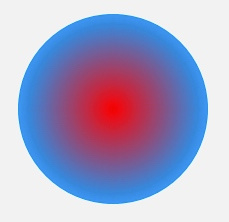
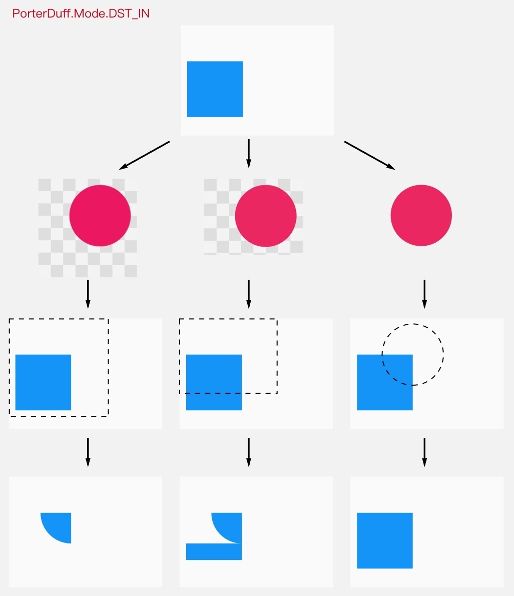
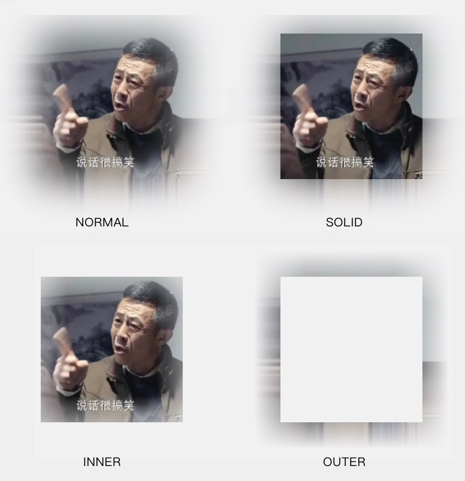

# Paint

<!-- TOC -->

- [Paint](#paint)
  - [基础设置](#%E5%9F%BA%E7%A1%80%E8%AE%BE%E7%BD%AE)
    - [绘制模式 Style](#%E7%BB%98%E5%88%B6%E6%A8%A1%E5%BC%8F-style)
    - [线条宽度 StrokeWidth](#%E7%BA%BF%E6%9D%A1%E5%AE%BD%E5%BA%A6-strokewidth)
    - [文字大小 TextSize](#%E6%96%87%E5%AD%97%E5%A4%A7%E5%B0%8F-textsize)
    - [抗锯齿开关 AntiAlias](#%E6%8A%97%E9%94%AF%E9%BD%BF%E5%BC%80%E5%85%B3-antialias)
  - [设置颜色](#%E8%AE%BE%E7%BD%AE%E9%A2%9C%E8%89%B2)
    - [基本颜色](#%E5%9F%BA%E6%9C%AC%E9%A2%9C%E8%89%B2)
      - [直接设置](#%E7%9B%B4%E6%8E%A5%E8%AE%BE%E7%BD%AE)
      - [着色器 Shape](#%E7%9D%80%E8%89%B2%E5%99%A8-shape)
        - [着色规则 Shader.TileMode](#%E7%9D%80%E8%89%B2%E8%A7%84%E5%88%99-shadertilemode)
        - [线性渐变 LinearGradient](#%E7%BA%BF%E6%80%A7%E6%B8%90%E5%8F%98-lineargradient)
        - [辐射渐变 RadialGradient](#%E8%BE%90%E5%B0%84%E6%B8%90%E5%8F%98-radialgradient)
        - [扫描渐变 SweepGradient](#%E6%89%AB%E6%8F%8F%E6%B8%90%E5%8F%98-sweepgradient)
        - [Bitmap BitmapShader](#bitmap-bitmapshader)
        - [混合着色器 ComposeShader](#%E6%B7%B7%E5%90%88%E7%9D%80%E8%89%B2%E5%99%A8-composeshader)
          - [叠加策略 PorterDuff.Mode](#%E5%8F%A0%E5%8A%A0%E7%AD%96%E7%95%A5-porterduffmode)
    - [颜色过滤 ColorFilter](#%E9%A2%9C%E8%89%B2%E8%BF%87%E6%BB%A4-colorfilter)
      - [LightingColorFilter](#lightingcolorfilter)
      - [PorterDuffColorFilter](#porterduffcolorfilter)
      - [ColorMatrixColorFilter](#colormatrixcolorfilter)
    - [Xfermode](#xfermode)
  - [辅助设置](#%E8%BE%85%E5%8A%A9%E8%AE%BE%E7%BD%AE)
    - [线条端点形状 StrokeCap](#%E7%BA%BF%E6%9D%A1%E7%AB%AF%E7%82%B9%E5%BD%A2%E7%8A%B6-strokecap)
    - [拐角的形状 StrokeJoin](#%E6%8B%90%E8%A7%92%E7%9A%84%E5%BD%A2%E7%8A%B6-strokejoin)
    - [尖角时延长线最大值 StrokeMiter](#%E5%B0%96%E8%A7%92%E6%97%B6%E5%BB%B6%E9%95%BF%E7%BA%BF%E6%9C%80%E5%A4%A7%E5%80%BC-strokemiter)
    - [双线性过滤 FilterBitmap](#%E5%8F%8C%E7%BA%BF%E6%80%A7%E8%BF%87%E6%BB%A4-filterbitmap)
    - [阴影 ShadowLayer](#%E9%98%B4%E5%BD%B1-shadowlayer)
    - [过滤画面（特效） MaskFilter](#%E8%BF%87%E6%BB%A4%E7%94%BB%E9%9D%A2%E7%89%B9%E6%95%88-maskfilter)
      - [BlurMaskFilter](#blurmaskfilter)
      - [EmbossMaskFilter](#embossmaskfilter)
  - [图形轮廓 PathEffect](#%E5%9B%BE%E5%BD%A2%E8%BD%AE%E5%BB%93-patheffect)
    - [CornerPathEffect](#cornerpatheffect)
    - [DiscretePathEffect](#discretepatheffect)
    - [DashPathEffect](#dashpatheffect)
    - [SumPathEffect](#sumpatheffect)
    - [ComposePathEffect](#composepatheffect)
    - [注意事项](#%E6%B3%A8%E6%84%8F%E4%BA%8B%E9%A1%B9)
- [参考资料](#%E5%8F%82%E8%80%83%E8%B5%84%E6%96%99)

<!-- /TOC -->

## 基础设置

### 绘制模式 Style

Paint.setStyle(Style style)

style 默认值为 FILL。

- Paint.Style.STROKE - 画线模式
- Paint.Style.FILL - 填充模式
- Paint.Style.FILLFILL_AND_STROKE - 两种模式并用

### 线条宽度 StrokeWidth

Paint.setStrokeWidth(float width) 

### 文字大小 TextSize

Paint.setTextSize(float textSize) 

### 抗锯齿开关 AntiAlias

Paint.setAntiAlias(boolean aa) 

## 设置颜色

Canvas 绘制的内容，有三层对颜色的处理：


### 基本颜色

#### 直接设置

Paint.setColor(int color) 

Paint.setARGB(int a, int r, int g, int b) 

#### 着色器 Shape

Paint.setShader(Shader shader)

同时 setShader() 和 setColor/ARGB() 和 Color 时优先使用 Shader 的颜色。

##### 着色规则 Shader.TileMode

Shader.TileMode 为端点范围之外的着色规则。

- Shader.TileMode.CLAMP -  夹子模式（直译），端点之外延续端点处的颜色。
- Shader.TileMode.MIRROR - 镜像模式，以任何一个渐变中间或端点为基准都是堆成的。
- Shader.TileMode.REPEAT - 重复模式。

##### 线性渐变 LinearGradient

LinearGradient(float x0, float y0, float x1, float y1, int color0, int color1, Shader.TileMode tileMode)

- x0 y0 x1 y1 - 渐变的两个端点的位置。
- color0 color1 - 端点的颜色。
- tileMode - 端点范围之外的着色规则。

以不同着色规则看一下它们的具体的显示区别。

```java
Shader shader = new LinearGradient(100, 100, 500, 500, Color.parseColor("#E91E63"),  
        Color.parseColor("#2196F3"), Shader.TileMode.XXX);
```

CLAMP:


MIRROR:


REPEAT:


##### 辐射渐变 RadialGradient

RadialGradient(float centerX, float centerY, float radius,int colors[], float stops[], TileMode tileMode)

- centerX centerY - 辐射中心的坐标
- radius - 辐射半径
- centerColor - 辐射中心的颜色
- edgeColor - 辐射边缘的颜色
- tileMode - 辐射范围之外的着色模式。



##### 扫描渐变 SweepGradient

 SweepGradient(float cx, float cy, int color0, int color1)

- cx cy - 扫描的中心
- color0 - 扫描的起始颜色
- color1 - 扫描的终止颜色


##### Bitmap BitmapShader

BitmapShader(Bitmap bitmap, Shader.TileMode tileX, Shader.TileMode tileY)

- bitmap - 用来做模板的 Bitmap 对象
- tileX - 横向的 TileMode
- tileY - 纵向的 TileMode。


##### 混合着色器 ComposeShader

把两个 Shader 一起使用。

ComposeShader(Shader shaderA, Shader shaderB, PorterDuff.Mode mode)

- shaderA 目标图像
- shaderB 源图像
- mode - 两个 Shader 的叠加模式，即 shaderA 和 shaderB 应该怎样共同绘制。默认类型是 PorterDuff.Mode 。

```java
// 第一个 Shader：头像的 Bitmap
Bitmap bitmap1 = BitmapFactory.decodeResource(getResources(), R.drawable.batman);  
Shader shader1 = new BitmapShader(bitmap1, Shader.TileMode.CLAMP, Shader.TileMode.CLAMP);

// 第二个 Shader：从上到下的线性渐变（由透明到黑色）
Bitmap bitmap2 = BitmapFactory.decodeResource(getResources(), R.drawable.batman_logo);  
Shader shader2 = new BitmapShader(bitmap2, Shader.TileMode.CLAMP, Shader.TileMode.CLAMP);

// ComposeShader：结合两个 Shader
Shader shader = new ComposeShader(shader1, shader2, PorterDuff.Mode.SRC_OVER);  
paint.setShader(shader);
```
> 上面这段代码中使用了两个 BitmapShader 来作为 ComposeShader() 的参数，而 ComposeShader() 在硬件加速下是不支持两个相同类型的 Shader 的，所以这里需要关闭硬件加速才能看到效果。


###### 叠加策略 PorterDuff.Mode


第一类：Alpha 合成（关于 Alpha 通道计算）。


第二类，混合（就是常见的色彩叠加）


### 颜色过滤 ColorFilter

Paint.setColorFilter(ColorFilter filter)

为绘制设置颜色过滤。颜色过滤的意思，就是为绘制的内容设置一个统一的过滤策略，然后 Canvas.drawXXX() 方法会对每个像素都进行过滤后再绘制出来。

#### LightingColorFilter 

LightingColorFilter(int mul, int add)

- mul - 和目标像素相乘
- add - 用来和目标像素相加

具体算法如下所示：

```
R' = R * mul.R / 0xff + add.R  
G' = G * mul.G / 0xff + add.G  
B' = B * mul.B / 0xff + add.B  
```

想去掉原像素中的红色，可以把它的 mul 改为 0x00ffff （红色部分为 0 ）， ，那么它的计算过程就是：

```
R' = R * 0x0 / 0xff + 0x0 = 0 // 红色被移除  
G' = G * 0xff / 0xff + 0x0 = G  
B' = B * 0xff / 0xff + 0x0 = B  
```


#### PorterDuffColorFilter

PorterDuffColorFilter(int color, PorterDuff.Mode mode) 

一个指定的颜色（作为源图像）和一种指定的 PorterDuff.Mode 来与绘制对象（目标图像）进行合成。

PorterDuffColorFilter 作为一个 ColorFilter，只能指定一种颜色作为源，而不是一个 Bitmap。

#### ColorMatrixColorFilter

ColorMatrixColorFilter(ColorMatrix matrix)

- ColorMatrix - 内部是一个 4x5 的矩阵。

```
[ a, b, c, d, e,
  f, g, h, i, j,
  k, l, m, n, o,
  p, q, r, s, t ]
```

ColorMatrix 可以把要绘制的像素进行转换。对于颜色 [R, G, B, A] ，转换算法是这样的：

```
R’ = a*R + b*G + c*B + d*A + e;  
G’ = f*R + g*G + h*B + i*A + j;  
B’ = k*R + l*G + m*B + n*A + o;  
A’ = p*R + q*G + r*B + s*A + t;  
```

### Xfermode

Paint.setXfermode(Xfermode xfermode)

Xfermode 全名为 Transfer mode，暂时只有一个子类 PorterDuffXfermode，它的用处为以绘制的内容作为源图像和 View 中已绘制的内容作为目标图像选取一个 PorterDuff.Mode 作为绘制内容的颜色处理方案。

由于 View 的的显示区域都会参与计算，并且 View 自身的底色并不是默认的透明色，会导致范围之外都变成了黑色，因此得使用离屏缓冲，把要绘制的内容单独绘制在缓冲层。用法如下：

```java
int saved = canvas.saveLayer(null, null, Canvas.ALL_SAVE_FLAG);

canvas.drawBitmap(rectBitmap, 0, 0, paint); // 先画方
paint.setXfermode(xfermode); // 设置 Xfermode
canvas.drawBitmap(circleBitmap, 0, 0, paint); // 画圆
paint.setXfermode(null); // 用完及时清除 Xfermode

canvas.restoreToCount(saved);
```

除此之外，还应该注意控制它的透明区域不要太小，要让它足够覆盖到要和它结合绘制的内容，否则得到的结果很可能不是你想要的。

如图所示，由于透明区域过小而覆盖不到的地方，将不会受到 Xfermode 的影响。



## 辅助设置

### 线条端点形状 StrokeCap

Paint.setStrokeCap(cap)

- Paint.Cap.ROUND - 圆头
- Paint.Cap.BUTT - 平头 
- Paint.Cap.SQUARE - 方头

### 拐角的形状 StrokeJoin

Paint.setStrokeJoin(Paint.Join join)

- Paint.Join.MITER - 尖角（默认）
- Paint.Join.BEVEL - 平角
- Paint.Join.ROUND - 圆角

### 尖角时延长线最大值 StrokeMiter

Paint.setStrokeMiter(float miter)

- miter - 对于转角长度的限制，默认值为 4。

当线条拐角为 MITER 时，拐角处的外缘会自动使用延长线来补偿。a/b 比值超过 miter 时，自动改用 BEVEL 的方式来渲染连接点。


### 双线性过滤 FilterBitmap

setFilterBitmap(boolean filter)

图像在放大绘制的时候，默认使用的是最近邻插值过滤，这种算法简单，但会出现马赛克现象；而如果开启了双线性过滤，就可以让结果图像显得更加平滑。


### 阴影 ShadowLayer

setShadowLayer(float radius, float dx, float dy, int shadowColor)

- radius - 阴影的模糊范围
- dx dy - 阴影的偏移量
- shadowColor - 阴影的颜色

在绘制内容下面加一层阴影。清楚阴影使用 clearShadowLayer()。

```java
paint.setShadowLayer(10, 0, 0, Color.RED);

canvas.drawText(text, 80, 300, paint);  
```


注意：

- 在硬件加速开启的情况下， setShadowLayer() 只支持文字的绘制，文字之外的绘制必须关闭硬件加速才能正常绘制阴影。
- 如果 shadowColor 是半透明的，阴影的透明度就使用 shadowColor 自己的透明度；而如果 shadowColor 是不透明的，阴影的透明度就使用 paint 的透明度。

### 过滤画面（特效） MaskFilter

在绘制内容上面加一层附加效果。

> 之前的 setColorFilter(filter) 对每个像素的颜色进行过滤；而这里的 setMaskFilter(filter) 则是基于整个画面来进行过滤.

#### BlurMaskFilter

BlurMaskFilter(float radius, BlurMaskFilter.Blur style) 

- radius - 模糊的范围
- style - 模糊的类型

模糊的类型：

- NORMAL: 内外都模糊绘制
- SOLID: 内部正常绘制，外部模糊
- INNER: 内部模糊，外部不绘制
- OUTER: 内部不绘制，外部模糊（什么鬼？）



#### EmbossMaskFilter

EmbossMaskFilter(float[] direction, float ambient, float specular, float blurRadius) 

- direction - 光源的方向（三个元素）
- ambient - 环境光的强度（取值 0-1）
- specular - 炫光的系数
- blurRadius - 光线的范围


## 图形轮廓 PathEffect

setPathEffect(PathEffect effect)

对 Canvas 所有的图形绘制（drawXXX()）有效
    
### CornerPathEffect

 CornerPathEffect(float radius)

 - radius - 圆角的半径

把所有拐角变成圆角。


### DiscretePathEffect

DiscretePathEffect(float segmentLength, float deviation)

- segmentLength - 切段线段长度
- deviation - 偏离量

将线条切段后随机偏离。


### DashPathEffect

DashPathEffect(float[] intervals, float phase)

- intervals - 虚线的格式（必须是偶数）
- phase - 以原虚线起点开始的偏移量

使用虚线来绘制线条。


### SumPathEffect

 SumPathEffect(PathEffect first, PathEffect second)

 分别按照两种 PathEffect 分别对目标进行绘制。


### ComposePathEffect

先对目标 Path 使用一个 PathEffect，然后再对这个改变后的 Path 使用另一个 PathEffect。

```java
PathEffect dashEffect = new DashPathEffect(new float[]{20, 10}, 0);  
PathEffect discreteEffect = new DiscretePathEffect(20, 5);  
pathEffect = new SumPathEffect(dashEffect, discreteEffect);

canvas.drawPath(path, paint);  
```


### 注意事项

- Canvas.drawLine() 和 Canvas.drawLines() 方法画直线时，setPathEffect() 是不支持硬件加速的。
- PathDashPathEffect 对硬件加速的支持也有问题，所以当使用 PathDashPathEffect 的时候，最好也把硬件加速关了。


# 参考资料

- [绘制基础 - HenCoder](https://hencoder.com/ui-1-1/)
- [Paint 详解 - HenCoder](https://hencoder.com/ui-1-1/)