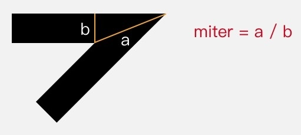

<!-- TOC -->

- [一、Paint 基础设置](#一paint-基础设置)
    - [1.1 绘制模式 Style](#11-绘制模式-style)
    - [1.2 文字大小 TextSize](#12-文字大小-textsize)
    - [1.3 抗锯齿开关](#13-抗锯齿开关)
- [二、颜色 Color](#二颜色-color)
    - [2.1 基本颜色](#21-基本颜色)
    - [2.2 设置着色器 Shape](#22-设置着色器-shape)
        - [2.2.1 着色规则 Shader.TileMode](#221-着色规则-shadertilemode)
        - [2.2.2 线性渐变 LinearGradient](#222-线性渐变-lineargradient)
        - [2.2.3 辐射渐变 RadialGradient](#223-辐射渐变-radialgradient)
        - [2.2.4 扫描渐变 SweepGradient](#224-扫描渐变-sweepgradient)
        - [2.2.5 Bitmap BitmapShader](#225-bitmap-bitmapshader)
        - [2.2.6 混合着色器 ComposeShader](#226-混合着色器-composeshader)
            - [2.2.6.1 叠加策略 PorterDuff.Mode](#2261-叠加策略-porterduffmode)
    - [2.3 颜色过滤 ColorFilter](#23-颜色过滤-colorfilter)
        - [2.3.1 LightingColorFilter](#231-lightingcolorfilter)
        - [2.3.2 PorterDuffColorFilter](#232-porterduffcolorfilter)
        - [2.3.3 ColorMatrixColorFilter](#233-colormatrixcolorfilter)
    - [2.4 Xfermode](#24-xfermode)
- [三、线条形状](#三线条形状)
    - [3.1 设置线条宽度 StrokeWidth](#31-设置线条宽度-strokewidth)
    - [3.2 线条端点形状 StrokeCap](#32-线条端点形状-strokecap)
    - [3.2 拐角的形状 StrokeJoin](#32-拐角的形状-strokejoin)
    - [3.3 尖角延长线最大值 StrokeMiter](#33-尖角延长线最大值-strokemiter)
- [四、阴影 ShadowLayer](#四阴影-shadowlayer)
- [五、过滤画面（特效） MaskFilter](#五过滤画面特效-maskfilter)
    - [5.1 模糊效果 BlurMaskFilter](#51-模糊效果-blurmaskfilter)
    - [5.2 浮雕效果 EmbossMaskFilter](#52-浮雕效果-embossmaskfilter)
- [六、图形轮廓 PathEffect](#六图形轮廓-patheffect)
    - [6.1 CornerPathEffect](#61-cornerpatheffect)
    - [6.2 DiscretePathEffect](#62-discretepatheffect)
    - [6.3 DashPathEffect](#63-dashpatheffect)
    - [6.4 PathDashPathEffect](#64-pathdashpatheffect)
    - [6.5 SumPathEffect](#65-sumpatheffect)
    - [6.6 ComposePathEffect](#66-composepatheffect)
    - [6.7 注意事项](#67-注意事项)
- [七、硬件加速](#七硬件加速)

<!-- /TOC -->

# 一、Paint 基础设置

## 1.1 绘制模式 Style

Paint.setStyle(Style style)

style 默认值为 FILL。

- Paint.Style.STROKE - 画线模式
- Paint.Style.FILL - 填充模式
- Paint.Style.FILLFILL_AND_STROKE - 两种模式并用

## 1.2 文字大小 TextSize

Paint.setTextSize(float textSize) 

## 1.3 抗锯齿开关 

抗锯齿的原理是：修改图形边缘处的像素颜色，从而让图形在肉眼看来具有更加平滑的感觉，因此从某种角度讲，它也造成了图形的颜色失真。

Paint.setAntiAlias(boolean aa) 

Paint paint = new Paint(Paint.ANTI_ALIAS_FLAG);  

# 二、颜色 Color

Canvas 绘制的内容，有三层对颜色的处理：


## 2.1 基本颜色

Paint.setColor(int color) 

Paint.setARGB(int a, int r, int g, int b) 

## 2.2 设置着色器 Shape

Paint.setShader(Shader shader)

同时 setShader() 和 setColor/ARGB() 和 Color 时优先使用 Shader 的颜色。

### 2.2.1 着色规则 Shader.TileMode

Shader.TileMode 为端点范围之外的着色规则。

- Shader.TileMode.CLAMP -  夹子模式（直译），端点之外延续端点处的颜色。
- Shader.TileMode.MIRROR - 镜像模式，以任何一个渐变中间或端点为基准都是堆成的。
- Shader.TileMode.REPEAT - 重复模式

### 2.2.2 线性渐变 LinearGradient

LinearGradient(float x0, float y0, float x1, float y1, int color0, int color1, Shader.TileMode tileMode)

- x0 y0 x1 y1 - 渐变的两个端点的位置。
- color0 color1 - 端点的颜色。
- tileMode - 端点范围之外的着色规则。

以不同着色规则看一下它们的具体的显示区别。

```java
Shader shader = new LinearGradient(100, 100, 500, 500, Color.parseColor("#E91E63"),  
        Color.parseColor("#2196F3"), Shader.TileMode.XXX);
```

CLAMP:


MIRROR:


REPEAT:


### 2.2.3 辐射渐变 RadialGradient

RadialGradient(float centerX, float centerY, float radius,int colors[], float stops[], TileMode tileMode)

- centerX centerY - 辐射中心的坐标
- radius - 辐射半径
- centerColor - 辐射中心的颜色
- edgeColor - 辐射边缘的颜色
- tileMode - 辐射范围之外的着色模式


### 2.2.4 扫描渐变 SweepGradient

 SweepGradient(float cx, float cy, int color0, int color1)

- cx cy - 扫描的中心
- color0 - 扫描的起始颜色
- color1 - 扫描的终止颜色


### 2.2.5 Bitmap BitmapShader

BitmapShader(Bitmap bitmap, Shader.TileMode tileX, Shader.TileMode tileY)

- bitmap - 用来做模板的 Bitmap 对象。
- tileX - 横向的 TileMode。
- tileY - 纵向的 TileMode。


### 2.2.6 混合着色器 ComposeShader

所谓混合，就是把两个 Shader 一起使用。

ComposeShader(Shader shaderA, Shader shaderB, PorterDuff.Mode mode)

- shaderA 目标图像。
- shaderB 源图像。
- mode - 两个 Shader 的叠加模式，即 shaderA 和 shaderB 应该怎样共同绘制。它的类型是枚举类 PorterDuff.Mode。

```java
// 第一个 Shader：头像的 Bitmap
Bitmap bitmap1 = BitmapFactory.decodeResource(getResources(), R.drawable.batman);  
Shader shader1 = new BitmapShader(bitmap1, Shader.TileMode.CLAMP, Shader.TileMode.CLAMP);

// 第二个 Shader：从上到下的线性渐变（由透明到黑色）
Bitmap bitmap2 = BitmapFactory.decodeResource(getResources(), R.drawable.batman_logo);  
Shader shader2 = new BitmapShader(bitmap2, Shader.TileMode.CLAMP, Shader.TileMode.CLAMP);

// ComposeShader：结合两个 Shader
Shader shader = new ComposeShader(shader1, shader2, PorterDuff.Mode.SRC_OVER);  
paint.setShader(shader);
```

上面这段代码中使用了两个 BitmapShader 来作为 ComposeShader() 的参数，而 ComposeShader() 在硬件加速下是不支持两个相同类型的 Shader 的，所以这里需要关闭硬件加速才能看到效果。


#### 2.2.6.1 叠加策略 PorterDuff.Mode


**（1）Alpha 合成（关于 Alpha 通道计算）**


**（2）混合（常见的色彩叠加）**


## 2.3 颜色过滤 ColorFilter

Paint.setColorFilter(ColorFilter filter)

为绘制设置颜色过滤。颜色过滤的意思，就是为绘制的内容设置一个统一的过滤策略，然后 Canvas.drawXXX() 方法会对每个像素都进行过滤后再绘制出来。

### 2.3.1 LightingColorFilter

LightingColorFilter 是用来模拟简单的光照效果的，它的构造函数是 LightingColorFilter(int mul, int add)。

- mul - 和目标像素相乘。
- add - 用来和目标像素相加。

具体算法如下所示：

```
R' = R * mul.R / 0xff + add.R  
G' = G * mul.G / 0xff + add.G  
B' = B * mul.B / 0xff + add.B  
```

想去掉原像素中的红色，可以把它的 mul 改为 0x00ffff（红色部分为 0 ），那么它的计算过程就是：

```
R' = R * 0x0 / 0xff + 0x0 = 0 // 红色被移除  
G' = G * 0xff / 0xff + 0x0 = G  
B' = B * 0xff / 0xff + 0x0 = B  
```


### 2.3.2 PorterDuffColorFilter

PorterDuffColorFilter(int color, PorterDuff.Mode mode) 

一个指定的颜色（作为源图像）与绘制对象（目标图像）按照指定的叠加策略 PorterDuff.Mode 来进行合成。

PorterDuffColorFilter 作为一个 ColorFilter，只能指定一种颜色作为源，而不是一个 Bitmap。

### 2.3.3 ColorMatrixColorFilter

ColorMatrixColorFilter(ColorMatrix matrix)

- ColorMatrix - 内部是一个 4x5 的矩阵。

```
[ a, b, c, d, e,
  f, g, h, i, j,
  k, l, m, n, o,
  p, q, r, s, t ]
```

ColorMatrix 可以把要绘制的像素进行转换。对于颜色 [R, G, B, A] ，转换算法是这样的：

```
R’ = a*R + b*G + c*B + d*A + e;  
G’ = f*R + g*G + h*B + i*A + j;  
B’ = k*R + l*G + m*B + n*A + o;  
A’ = p*R + q*G + r*B + s*A + t;  
```

## 2.4 Xfermode

Paint.setXfermode(Xfermode xfermode)

Xfermode 全名为 Transfer mode，暂时只有一个子类 PorterDuffXfermode，它的用处为以绘制的内容作为源图像，以 View 中已有的内容作为目标图像，选取一个 PorterDuff.Mode 作为绘制内容的叠加策略。

由于 View 的的显示区域都会参与计算，并且 View 自身的底色并不是默认的透明色，会导致范围之外都变成了黑色，因此得使用离屏缓冲，把要绘制的内容单独绘制在缓冲层。
使用离屏缓冲有两种方式：

**（1）Canvas.saveLayer()**

在一般的自定义绘制需求中，都是使用该方式。

```java
// saveLayer() 可以做短时间的离屏缓冲，但该方法性能消耗过大，在满足需求的请下一般推荐第二种。
// 什么时候不能使用第二种：只想截取某一部分区域进行叠加或背景不是透明色。
int saved = canvas.saveLayer(null, null, Canvas.ALL_SAVE_FLAG);

canvas.drawBitmap(rectBitmap, 0, 0, paint); // 先画方
paint.setXfermode(xfermode); // 设置 Xfermode
canvas.drawBitmap(circleBitmap, 0, 0, paint); // 画圆
paint.setXfermode(null); // 用完及时清除 Xfermode

canvas.restoreToCount(saved);
```

除此之外，还应该注意控制它的透明区域不要太小，要让它足够覆盖到要和它结合绘制的内容，否则得到的结果很可能不是你想要的。

如图所示，由于透明区域过小而覆盖不到的地方，将不会受到 Xfermode 的影响。


**（2）View.setLayerType()**

View.setLayerType() 是直接把整个 View 都绘制在离屏缓冲中。 setLayerType(LAYER_TYPE_HARDWARE) 是使用 GPU 来缓冲， setLayerType(LAYER_TYPE_SOFTWARE) 是直接直接用一个 Bitmap 来缓冲。更详情的介绍请看 [硬件加速](#七、硬件加速)

# 三、线条形状

设置线条形状的一共有 4 个方法：setStrokeWidth(float width), setStrokeCap(Paint.Cap cap), setStrokeJoin(Paint.Join join), setStrokeMiter(float miter) 。

## 3.1 设置线条宽度 StrokeWidth

Paint.setStrokeWidth(float width)

默认情况下，线条宽度为 0，但依然能够画出线，线条的宽度为 1 像素。那么它和线条宽度为 1 有什么区别呢？

其实这个和「几何变换」有关：你可以为 Canvas 设置 Matrix 来实现几何变换（如放大、缩小、平移、旋转），在几何变换之后 Canvas 绘制的内容就会发生相应变化，包括线条也会加粗，例如 2 像素宽度的线条在 Canvas 放大 2 倍后会被以 4 像素宽度来绘制。而当线条宽度被设置为 0 时，它的宽度就被固定为 1 像素，就算 Canvas 通过几何变换被放大，它也依然会被以 1 像素宽度来绘制。Google 在文档中把线条宽度为 0 时称作「hairline mode（发际线模式）」。

## 3.2 线条端点形状 StrokeCap

Paint.setStrokeCap(Paint.Cap cap)

- Paint.Cap.ROUND - 圆头
- Paint.Cap.BUTT - 平头 
- Paint.Cap.SQUARE - 方头

虚线是额外加的，虚线左边是线的实际长度，虚线右边是线头。有了虚线作为辅助，可以清楚地看出 BUTT 和 SQUARE 的区别。


## 3.2 拐角的形状 StrokeJoin

Paint.setStrokeJoin(Paint.Join join)

- Paint.Join.MITER - 尖角（默认）
- Paint.Join.BEVEL - 平角
- Paint.Join.ROUND - 圆角


## 3.3 尖角延长线最大值 StrokeMiter

Paint.setStrokeMiter(float miter)

- miter - 对于转角长度的限制，默认值为 4。

这个方法是对于 setStrokeJoin() 的一个补充，。当线条拐角为 MITER 时，拐角处的外缘会自动使用延长线来补偿。a/b 比值超过 miter 时，自动改用 BEVEL 的方式来渲染连接点。



# 四、阴影 ShadowLayer

Paint.setShadowLayer(float radius, float dx, float dy, int shadowColor)

- radius - 阴影的模糊范围
- dx dy - 阴影的偏移量
- shadowColor - 阴影的颜色

在绘制内容下面加一层阴影。清除阴影使用 clearShadowLayer()。

```java
paint.setShadowLayer(10, 0, 0, Color.RED);

canvas.drawText(text, 80, 300, paint);  
```


注意：

- 在硬件加速开启的情况下， setShadowLayer() 只支持文字的绘制，文字之外的绘制必须关闭硬件加速才能正常绘制阴影。
- 如果 shadowColor 是半透明的，阴影的透明度就使用 shadowColor 自己的透明度；而如果 shadowColor 是不透明的，阴影的透明度就使用 paint 的透明度。

# 五、过滤画面（特效） MaskFilter

在绘制内容上面加一层附加效果。

Paint.setColorFilter(filter) 对每个像素的颜色进行过滤；而 Paint.setMaskFilter(filter) 则是基于整个画面来进行过滤。

## 5.1 模糊效果 BlurMaskFilter

Paint.BlurMaskFilter(float radius, BlurMaskFilter.Blur style) 

- radius - 模糊的范围
- style - 模糊的类型

模糊的类型：

- NORMAL: 内外都模糊绘制
- SOLID: 内部正常绘制，外部模糊
- INNER: 内部模糊，外部不绘制
- OUTER: 内部不绘制，外部模糊（仅发光部分可见）


## 5.2 浮雕效果 EmbossMaskFilter

EmbossMaskFilter(float[] direction, float ambient, float specular, float blurRadius) 

- direction - 光源的方向（三个元素）
- ambient - 环境光的强度（取值 0-1）
- specular - 炫光的系数
- blurRadius - 光线的范围


# 六、图形轮廓 PathEffect

Paint.setPathEffect(PathEffect effect)

该方法对 Canvas 所有的图形绘制有效。
    
## 6.1 CornerPathEffect

 CornerPathEffect(float radius)

 - radius - 圆角的半径

把所有拐角变成圆角。


## 6.2 DiscretePathEffect

DiscretePathEffect(float segmentLength, float deviation)

- segmentLength - 切段线段长度
- deviation - 偏离量

将线条按长度 segmentLength 切段后随机偏离。


## 6.3 DashPathEffect

DashPathEffect(float[] intervals, float phase)

- intervals - 虚线的格式（必须是偶数），按照「画线长度、空白长度、画线长度、空白长度」……的顺序排列。
- phase - intervals 的偏移量。

使用虚线来绘制线条。


## 6.4 PathDashPathEffect

PathDashPathEffect 比 DashPathEffect 多了一个 Path，意思就是用 **Path** 来代替虚线。

PathDashPathEffect(Path shape, float advance, float phase, PathDashPathEffect.Style style)

- shape：充当虚线的 Path。
- advance：两个相邻的 shape 起点之间的间隔。
- phase：shape 的偏移量。
- style：它有 3 个值：位移、旋转、变体，区别如下图所示。


## 6.5 SumPathEffect

SumPathEffect(PathEffect first, PathEffect second)

分别按照两种 PathEffect 分别对目标进行绘制。


## 6.6 ComposePathEffect

先对目标 Path 使用一个 PathEffect，然后再对这个改变后的 Path 使用另一个 PathEffect。

ComposePathEffect(PathEffect outerpe, PathEffect innerpe)

- innerpe 比 outerpe 先应用。

```java
// 即先「先偏离，再变虚线」。
PathEffect dashEffect = new DashPathEffect(new float[]{20, 10}, 0);  
PathEffect discreteEffect = new DiscretePathEffect(20, 5);  
ComposePathEffect pathEffect = new ComposePathEffect(dashEffect, discreteEffect);
Paint.setPathEffect(pathEffect);


canvas.drawPath(path, paint);  
```


## 6.7 注意事项

- 使用 Canvas.drawLine() 和 Canvas.drawLines() 方法画直线时，setPathEffect() 是不支持硬件加速的。
- PathDashPathEffect 对硬件加速的支持也有问题，所以当使用 PathDashPathEffect 的时候，最好也把硬件加速关了。

# 七、硬件加速

所谓硬件加速，指的是把某些计算工作交给专门的硬件来做，而不是和普通的计算工作一样交给 CPU 来处理。这样不仅减轻了 CPU 的压力，而且由于有了「专人」的处理，这份计算工作的速度也被加快了。这就是「硬件加速」。

在硬件加速关闭的时候，Canvas 绘制的工作方式是：把要绘制的内容写进一个 Bitmap，然后在之后的渲染过程中，这个 Bitmap 的像素内容被直接用于渲染到屏幕。这种绘制方式的主要计算工作在于把绘制操作转换为像素的过程。

而在硬件加速开启时，Canvas 的工作方式改变了：它只是把绘制的内容转换为 GPU 的操作保存了下来，然后就把它交给 GPU，最终由 GPU 来完成实际的显示工作。除此之外，GPU 自身的设计就对图形计算（例如简单的圆形、简单的方形）具有优势； 最后，由于绘制流程的不同，硬件加速在界面内容发生重绘的时候绘制流程可以得到优化，**它只会重绘变化的视图**，它的父 View 和兄弟 View，只需要保持原样，从而大幅提升绘制效率。

正是由于上面的原因，硬件加速不仅是由于 GPU 的引入而提高了绘制效率，还由于绘制机制的改变，而极大地提高了界面内容改变时的刷新效率。

**（1）硬件加速的开关**

硬件加速可以使用 setLayerType() 来关闭硬件加速，但这个方法其实是用来设置 View Layer 的（离屏缓冲，配合 Xfermode 使用）：

- 参数为 LAYER_TYPE_SOFTWARE 时，使用软件来绘制 View Layer，绘制到一个 Bitmap，并顺便关闭硬件加速；
- 参数为 LAYER_TYPE_HARDWARE 时，使用 GPU 来绘制 View Layer，绘制到一个 OpenGL texture（如果硬件加速关闭，那么行为和 VIEW_TYPE_SOFTWARE 一致），；
- 参数为 LAYER_TYPE_NONE 时，关闭 View Layer。

当设置了 View Layer 后，View 在初次绘制时以及每次 invalidate() 后重绘时，需要进行两次的绘制工作（一次绘制到 Layer，一次从 Layer 绘制到显示屏），所以其实它的每次绘制的效率是被降低了的。因此一般情况下建议关闭 View Layer。

**（2）硬件加速的限制**

硬件加速不只是好处，也有它的限制：受到 GPU 绘制方式的限制，Canvas 的有些方法在硬件加速开启式会失效或无法正常工作。具体的 API 限制和 API 版本的关系如下图：


