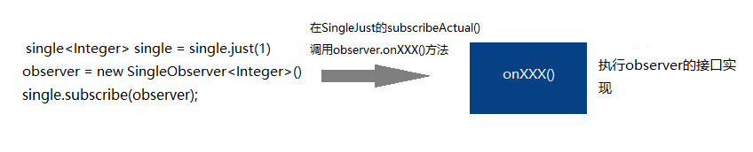
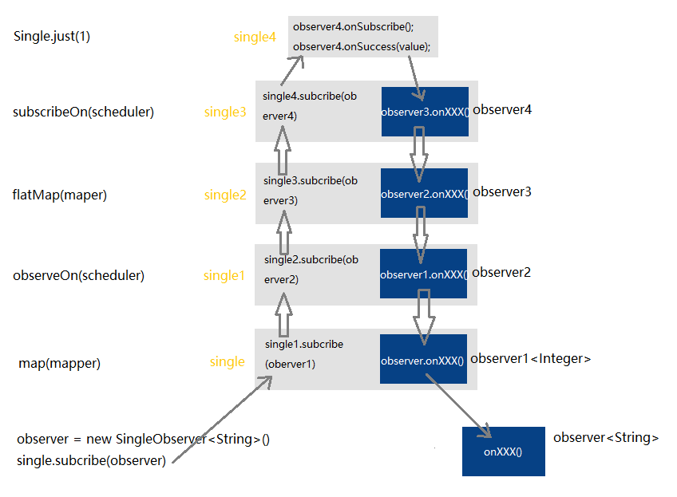
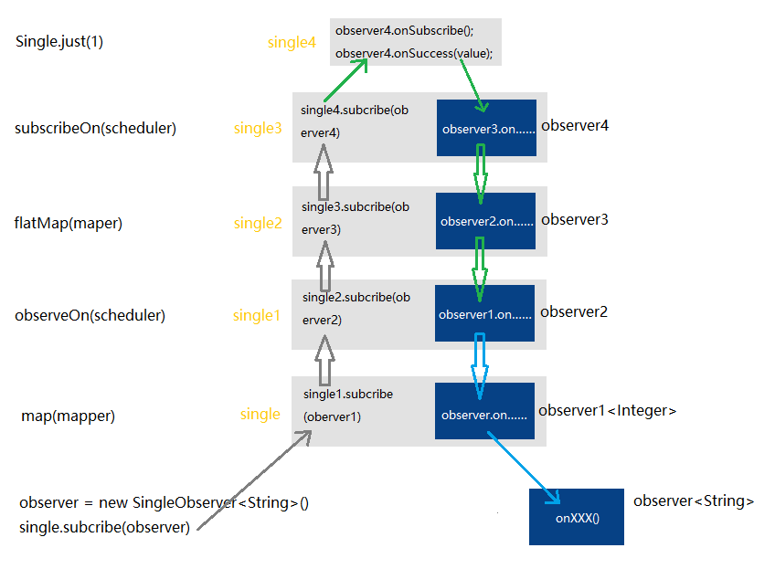

# RxJava2 源码分析

<!-- TOC -->

- [RxJava2 源码分析](#rxjava2-源码分析)
    - [前言](#前言)
    - [初探 RxJava](#初探-rxjava)
        - [Single.just()](#singlejust)
        - [single.subscribe(observer)](#singlesubscribeobserver)
        - [小结](#小结)
    - [再探 RxJava](#再探-rxjava)
        - [RxJava 链式调用结构的本质](#rxjava-链式调用结构的本质)
        - [Map 和 FlapMap](#map-和-flapmap)
            - [map](#map)
            - [flatMap](#flatmap)
        - [线程切换](#线程切换)
            - [subscribeOn](#subscribeon)
            - [observeOn](#observeon)
            - [小结](#小结-1)
    - [终看 RxJava](#终看-rxjava)
        - [doFinally 和 doAfterTerminate 有何不同？](#dofinally-和-doafterterminate-有何不同)
        - [doOnSubscribe 在 2 个 subscribeOn 之间是如何生效的？](#doonsubscribe-在-2-个-subscribeon-之间是如何生效的)
        - [为什么连用两个 subscribeOn 操作符只有第一个有效？](#为什么连用两个-subscribeon-操作符只有第一个有效)
        - [defer 到底有何作用？](#defer-到底有何作用)
        - [Demo 执行过程梳理](#demo-执行过程梳理)

<!-- /TOC -->

## 前言

本文源码分析基于 [RxJava](https://github.com/ReactiveX/RxJava) 2.2.1 版本，主要从易到难一步步模拟实际操作的方式分析 RxJava 的链式调用结构以及线程的切换原理。

为了更清晰的分析源码，以下的代码示例中的被观察者将使用 Single，而不是 Observable。Single 和 Observable 区别在于 Single 只会向观察者发送一个数据（例如在网络请求使用），而 Observable 则可以依次向观察者发送多个数据。

注：下文说的切换线程执行某个代码块的意思是：将该代码块交由所指定的线程 (池) 执行。


## 初探 RxJava

首先看一下一个最简单的链式订阅过程。

```java
// 被观察者的实例化
Single<Integer> single = Single.just(1);

// 观察者的实例化，SingleObserver 为一个接口，定义了观察者的回调方法规范。
SingleObserver<Integer> observer = new SingleObserver<Integer>() {
    @Override
    public void onSubscribe(Disposable d) {
        // 开始订阅
    }

    @Override
    public void onSuccess(Integer integer) {
        // 成功拿到数据
        Timber.w("2222222222");
    }

    @Override
    public void onError(Throwable e) {
        // 异常
    }
};

// 从语意上看被观察者 “订阅” 观察者，实际是观察者订阅被观察者（下面也将如此描述），
// 因此多次调用 single.subscribe() 是互不影响的。
single.subscribe(observer);

```

### Single.just()

被观察者的构建过程，基本上所有的被观察者的构建的 Api 源码都是相似的逻辑。

```java
public static <T> Single<T> just(final T item) {
    ObjectHelper.requireNonNull(item, "value is null");
    // 对全局 Single 被观察者进行转换。
    return RxJavaPlugins.onAssembly(new SingleJust<T>(item));
}

// 对传入的 Single（被观察者）做统一转换
public static <T> Single<T> onAssembly(@NonNull Single<T> source) {
    Function<? super Single, ? extends Single> f = onSingleAssembly;

    // 将 Single 类或 Single 的父类或 Single 实现的接口类 (SingleSource），转换成继承 Single 的被观察者（例如将所有转成 SingleJust）
    if (f != null) {
        return apply(f, source);
    }
    // 默认情况下 f 为 null，所以一般返回构建的被观察者。
    return source;
}
```

因此 Single.just() 的重点便是被观察者 SingleJust 的实例化。

```java
public final class SingleJust<T> extends Single<T> {

    final T value;

    // 很简单，将 value 保存下来，并生成一个被观察者。
    public SingleJust(T value) {
        this.value = value;
    }

    // 该方法为抽象类 Single 的抽象方法，该方法会在订阅时被调用，也是订阅的核心方法（下面会说明何时被调用）。
    // observer 为订阅该被观察者的观察者，在订阅时，会传入 observer，由相应的 Single 子类（这里是 SingleJust）控制 observer 不同方法的执行时机。
    @Override
    protected void subscribeActual(SingleObserver<? super T> observer) {
        observer.onSubscribe(Disposables.disposed());
        observer.onSuccess(value);
    }

}
````

### single.subscribe(observer)

观察者订阅被观察者

```java
public final void subscribe(SingleObserver<? super T> observer) {
    ObjectHelper.requireNonNull(observer, "subscriber is null");

    // 对全局观察者进行转换，默认不转换。
    observer = RxJavaPlugins.onSubscribe(this, observer);

    ObjectHelper.requireNonNull(observer, "subscriber returned by the RxJavaPlugins hook is null");

    try {
        // 我们可以看到订阅过程 (执行 Single.subscribe(observer) 方法) 的实质是传入 observer 执行 subscribeActual(observer) 方法。
        subscribeActual(observer);
    } catch (NullPointerException ex) {
        throw ex;
    } catch (Throwable ex) {
        Exceptions.throwIfFatal(ex);
        NullPointerException npe = new NullPointerException("subscribeActual failed");
        npe.initCause(ex);
        throw npe;
    }
}
```

### 小结

- 我们可以发现被观察者 single 的实例化以及观察者 observer 的实例化都处于**当前所在线程**(重点，有利于 RxJava 后续的理解)。
- 当被观察者 single **被订阅时（调用 single.subscribe(observer)）**，执行的核心方法为被观察者 single 的 subscribeActual(observer) 方法，通过传入观察者 observer 的对象去控制观察者 observer 的方法执行。

 


## 再探 RxJava

我们在上一个 Demo 的基础上加了线程的切换以及 Map 操作符和 FlatMap 操作符的使用。

本小节，皆已以下代码作为 Demo。

```java
// 实例化观察者
SingleObserver<String> observer = new SingleObserver<String>() {
    @Override
    public void onSubscribe(Disposable d) {
        // 开始订阅
    }

    @Override
    public void onSuccess(String integer) {
        // 成功拿到数据
    }

    @Override
    public void onError(Throwable e) {
        // 异常
    }
};

// 实例化被观察者
Single<String> single = Single.just(1)
        .subscribeOn(Schedulers.io())
        .flatMap(new Function<Integer, SingleSource<Integer>>() {
            @Override
            public SingleSource<Integer> apply(Integer integer) throws Exception {
                return Single.just(integer + 1);
            }
        })
        .observeOn(AndroidSchedulers.mainThread())
        .map(new Function<Integer, String>() {
            @Override
            public String apply(Integer integer) throws Exception {
                return integer + "";
            }
        });
        
// 订阅
single.subscribe(observer);
````

### RxJava 链式调用结构的本质

首先我们看被观察者的实例化，这里拿 single.subscribeOn() 方法举例（所有的操作符都基本类似），我们会发现，链式被观察者的实例化过程的本质是**以当前被观察者对象作为新被观察者构造方法的参数生成一个新的观察者并返回**，也就是说被观察者的实例化过程是一个个新的观察者对象生成的过程，且实例化的过程所处线程为当前线程，没有涉及到任何操作符的接口实现或线程切换（在订阅的时候才执行）。

```java
public final Single<T> subscribeOn(final Scheduler scheduler) {
    ObjectHelper.requireNonNull(scheduler, "scheduler is null");
    return RxJavaPlugins.onAssembly(new SingleSubscribeOn<T>(this, scheduler));
}
```

从上面我们可以知道，此时的 single 为最后创建（调用 map 操作符后）的被观察者，即此时的 single 的对象类型为 SingleMap,接着我们看一下 single.subscribe(observer) 实际做了什么。

```java
public final class SingleMap<T, R> extends Single<R> {
   final SingleSource<? extends T> source;

   public SingleMap(SingleSource<? extends T> source, Function<? super T, ? extends R> mapper) {
        this.source = source;
        this.mapper = mapper;
    }
   
   @Override
    protected void subscribeActual(final SingleObserver<? super R> t) {
        // 从构造函数我们可以知道 source 为上一个被观察者 (实例化 SingleMap 的参数)，
        // 传入 t（订阅 single 的观察者）作为参数并实例化一个新的观察者，
        // 最后用新的观察者订阅 source。
        source.subscribe(new MapSingleObserver<T, R>(t, mapper));
    }
```

从上面可以看到 single.subscribe(observer) 的本质为实例化一个新的观察者订阅上一个被观察者。
然后我们看一下 MapSingleObserver 拿到 observer（single 的观察者）做了什么。

```java
static final class MapSingleObserver<T, R> implements SingleObserver<T> {

    final SingleObserver<? super R> t;

    final Function<? super T, ? extends R> mapper;

    MapSingleObserver(SingleObserver<? super R> t, Function<? super T, ? extends R> mapper) {
        this.t = t;
        this.mapper = mapper;
    }

    // 我们可以看到当 MapSingleObserver.onXXX() 被调用时，最终都会调用传进来的 t（observer）的 onXXX() 方法。
    @Override
    public void onSubscribe(Disposable d) {
        t.onSubscribe(d);
    }

    @Override
    public void onSuccess(T value) {
        // 此处暂时省略其它代码
        t.onSuccess(v);
    }

    @Override
    public void onError(Throwable e) {
        t.onError(e);
    }
}
```

而其它的链式调用也是同样的过程，直至在某一个被观察者中 subscribeActual() 方法给观察者的 onxxx() 方法传入具体的数据。在本例中的数据来源为 Single.just(1)，也就是 SingleJust 类。

```java
public final class SingleJust<T> extends Single<T> {

    final T value;

    public SingleJust(T value) {
        this.value = value;
    }

    @Override
    protected void subscribeActual(SingleObserver<? super T> s) {
        // s 为 SingleJust 的观察者，调用 s 的接口方法去通知观察者，
        // 之后 s 又会通知下一个观察者，并依次向下通知。
        s.onSubscribe(Disposables.disposed());
        s.onSuccess(value);
    }

}
```

整个 RxJava **链式调用结构**便如下图所示（下文都将该过程称之为链式调用结构）：

 

**下面的分析将继续沿用该图的变量名以方便解读**

### Map 和 FlapMap

在看 Map 操作符和 FlapMap 操作符的核心源码之前，先看一下 Function 接口，该接口定义了一个方法，用于将类型 T 转成 R。Map 和 FlapMap 的本质也是让开发者自己实现该接口，并对 observer 的 value 进行数据转换再往下一个 observer 传递。

```java
public interface Function<T, R> {
    /**
     * Apply some calculation to the input value and return some other value.
     * @param t the input value
     * @return the output value
     * @throws Exception on error
     */
    R apply(@NonNull T t) throws Exception;
}
```

#### map

```java
public final class SingleMap<T, R> extends Single<R> {
    static final class MapSingleObserver<T, R> implements SingleObserver<T> {

        final SingleObserver<? super R> t;

        final Function<? super T, ? extends R> mapper;

        MapSingleObserver(SingleObserver<? super R> t, Function<? super T, ? extends R> mapper) {
            this.t = t;
            this.mapper = mapper;
        }

        @Override
        public void onSuccess(T value) {
            // T 为自身（observer1） 想要的数据类型，
            // R 为下一个 observer（observer）想要的数据类型。
            R v;
            try {
                // 我们在实例化该被观察者时会实现 mapper 接口，此时调用该实现转换数据类型。
                v = ObjectHelper.requireNonNull(mapper.apply(value), "The mapper function returned a null value.");
            } catch (Throwable e) {
                Exceptions.throwIfFatal(e);
                onError(e);
                return;
            }

            t.onSuccess(v);
        }

    }
```

#### flatMap

```java
public final class SingleFlatMap<T, R> extends Single<R> {
  static final class SingleFlatMapCallback<T, R>
    extends AtomicReference<Disposable>
    implements SingleObserver<T>, Disposable {

        @Override
        public void onSuccess(T value) {
            SingleSource<? extends R> o;

            try {
                // 此处和 Map 操作符基本类似，只是多限制了 mapper 的泛型上下限。
                // 该接口实现中得到了一个新的被观察者（链），在 Demo 为 Single.just(integer + 1)。
                o = ObjectHelper.requireNonNull(mapper.apply(value), "The single returned by the mapper is null");
            } catch (Throwable e) {
                Exceptions.throwIfFatal(e);
                actual.onError(e);
                return;
            }

            if (!isDisposed()) {
                // 订阅后，将是一个新的链式调用过程，该过程走完才接上原来的调用链。
                // 此时 FlatMapSingleObserver 类似结构图中的 observer，
                // 在 FlatMapSingleObserver 的 onXXX() 方法调用 actual（observer2）.onXXX() 继续向下传递结果。
                o.subscribe(new FlatMapSingleObserver<R>(this, actual));
            }
        }

        static final class FlatMapSingleObserver<R> implements SingleObserver<R> {

            final SingleObserver<? super R> actual;

            FlatMapSingleObserver(AtomicReference<Disposable> parent, SingleObserver<? super R> actual) {
                this.parent = parent;
                this.actual = actual;
            }

            @Override
            public void onSuccess(final R value) {
                actual.onSuccess(value);
            }

        }
    }
}
```

### 线程切换

#### subscribeOn

```java
public final class SingleSubscribeOn<T> extends Single<T> {
    final SingleSource<? extends T> source;

    final Scheduler scheduler;

    @Override
    protected void subscribeActual(final SingleObserver<? super T> s) {
        // SubscribeOnObserver 既是一个观察者，也是一个 Runnable。
        final SubscribeOnObserver<T> parent = new SubscribeOnObserver<T>(s, source);
        // 此处注意，SingleSubscribeOn 被订阅时，便已经调用该方法。
        s.onSubscribe(parent);

        // scheduler 对不同线程 (池) 的使用做了一层接口封装,作为线程调度器使用。
        // 调用 scheduler.scheduleDirect() 方法将在 scheduler 所维护的线程 (池) 中执行 SubscribeOnObserver 的 run() 方法，
        // run() 方法执行的是 source（single4）的订阅过程，
        // 也就是说，若之后不再切换线程，从 source（single4）的 subscribeActual() 开始之后的所有代码都在该线程 (池) 中执行。
        Disposable f = scheduler.scheduleDirect(parent);

        parent.task.replace(f);

    }

    static final class SubscribeOnObserver<T>
    extends AtomicReference<Disposable>
    implements SingleObserver<T>, Disposable, Runnable {

        final SingleObserver<? super T> actual;

        final SequentialDisposable task;

        final SingleSource<? extends T> source;

        SubscribeOnObserver(SingleObserver<? super T> actual, SingleSource<? extends T> source) {
            this.actual = actual;
            this.source = source;
            this.task = new SequentialDisposable();
        }

        @Override
        public void onSuccess(T value) {
            actual.onSuccess(value);
        }

        @Override
        public void run() {
            source.subscribe(this);
        }
    }

}
```

#### observeOn

```java
public final class SingleObserveOn<T> extends Single<T> {

    final SingleSource<T> source;

    final Scheduler scheduler;

    @Override
    protected void subscribeActual(final SingleObserver<? super T> s) {
        // 该方法中只有正常的订阅过程，不涉及到线程切换。
        source.subscribe(new ObserveOnSingleObserver<T>(s, scheduler));
    }

    static final class ObserveOnSingleObserver<T> extends AtomicReference<Disposable>
    implements SingleObserver<T>, Disposable, Runnable {

        final SingleObserver<? super T> actual;

        final Scheduler scheduler;


        @Override
        public void onSuccess(T value) {
            this.value = value;
            // 我们可以看到在调用 ObserveOnSingleObserver.onXXX() 之后才在 scheduler 所管理的线程执行 run() 方法。
            Disposable d = scheduler.scheduleDirect(this);
        }

        @Override
        public void run() {
            Throwable ex = error;
            if (ex != null) {
                actual.onError(ex);
            } else {
                actual.onSuccess(value);
            }
        }
    }
}
```

#### 小结

以 Demo 的代码为例，从 single.subcriber(observer)（观察者订阅被观察者）开始实际的线程切换如下图所示：

- 灰色 - 当前默认线程
- 绿色 - subscribeOn(Scheduler)，Demo 为 IO 线程
- 蓝色 - observeOn(Scheduler)，Demo 为 main 线程

 

## 终看 RxJava

该小节的 Demo 代码较长（该Demo是笔者自己给自己出的题目，个人认为理解透该 Demo 对 RxJava 有一个深入的了解），读者可对 Demo 的代码的执行顺序和所处线程尝试自行分析，再向下阅读（向下阅读时请拷贝 Demo 到 Android Studio 方便对比，因为都以 Demo 的代码为基础进行分析）。

接下来将按照 RxJava **链式调用结构**（自下向上的订阅以及自上向下的数据传递）的过程去对一些可能疑惑的地方展开分析，再对整个代码执行过程梳理。

对于 Single 的子类的 subscribeActual() 方法只有订阅操作的操作符将直接跳过。

```java
Single.defer(new Callable<SingleSource<Integer>>() {
    @Override
    public SingleSource<Integer> call() throws Exception {
        return Single.just(1)
                .subscribeOn(Schedulers.io());
    }
})
        .subscribeOn(Schedulers.single())
        .subscribeOn(Schedulers.io())
        .flatMap(new Function<Integer, SingleSource<String>>() {
            @Override
            public SingleSource<String> apply(Integer integer) throws Exception {
                return Single.just("1")
                        .subscribeOn(Schedulers.newThread())
                        .observeOn(Schedulers.single());
            }
        })
        .doOnSubscribe(disposable -> {
            Log.i("rxjava", "doOnSubcribe");
        })
        .subscribeOn(AndroidSchedulers.mainThread())
        .map(new Function<String, Double>() {
            @Override
            public Double apply(String s) throws Exception {
                return Double.parseDouble(s);
            }
        })
        .doAfterTerminate(new Action() {
            @Override
            public void run() throws Exception {
                Log.i("rxjava", "doAfterTerminate");
            }
        })
        .doFinally(new Action() {
            @Override
            public void run() throws Exception {
                Log.i("rxjava", "doFinally");
            }
        })
        .observeOn(AndroidSchedulers.mainThread())
        .map(new Function<Double, Float>() {
            @Override
            public Float apply(Double aDouble) throws Exception {
                return Float.parseFloat(aDouble + "");
            }
        })
        .subscribe(new SingleObserver<Float>() {
            @Override
            public void onSubscribe(Disposable d) {
                Log.i("rxjava", "onSubscribe");
            }

            @Override
            public void onSuccess(Float aFloat) {
                Log.i("rxjava", "onSuccess");
            }

            @Override
            public void onError(Throwable e) {
                Log.i("rxjava", "onError");
            }
        });
```

### doFinally 和 doAfterTerminate 有何不同？

查看源码我们可以发现，这 2 个操作符的代码几乎完全一致，唯一的本质区别是在执行 dispose() 方法时，doFinally 执行 runFinally(),而 doAfterTerminate 没有执行 onAfterTerminate()，也就是说 doFinally 任何情况下最终都会调用 Action.run()，而 doAfterTerminate 则在取消订阅后不再调用 Action.run()。


```java
public final class SingleDoAfterTerminate<T> extends Single<T> {

    static final class DoAfterTerminateObserver<T> implements SingleObserver<T>, Disposable {

        final Action onAfterTerminate;

        @Override
        public void onSuccess(T t) {
            downstream.onSuccess(t);
            onAfterTerminate();
        }

        @Override
        public void dispose() {
            upstream.dispose();
        }

        private void onAfterTerminate() {
            try {
                onAfterTerminate.run();
            } catch (Throwable ex) {
                Exceptions.throwIfFatal(ex);
                RxJavaPlugins.onError(ex);
            }
        }
    }
}
```

```java
public final class SingleDoFinally<T> extends Single<T> {
    static final class DoFinallyObserver<T> extends AtomicInteger implements SingleObserver<T>, Disposable {

        final Action onFinally;
        
        @Override
        public void onSuccess(T t) {
            downstream.onSuccess(t);
            runFinally();
        }

        @Override
        public void dispose() {
            upstream.dispose();
            runFinally();
        }

        void runFinally() {
            if (compareAndSet(0, 1)) {
                try {
                    onFinally.run();
                } catch (Throwable ex) {
                    Exceptions.throwIfFatal(ex);
                    RxJavaPlugins.onError(ex);
                }
            }
        }
    }
}
```

我们继续分析下 doFinally 或 doAfterTerminate 的 Action.run() 的执行时期和执行顺序。

我们发现其实这 2 个操作符的实际操作很简单，在执行完链式调用结构后，再执行 Action.run() 方法。

而当两个同时使用时，我们可以发现他们并没有必定的先后执行顺序，
而是根据被观察者的链式创建先后顺序有关，先被创建的被观察者的 Action.run() 后执行，也就是说 doAfterTerminate 写在 doFinally 上面，Log 先打印 doFinally 后打印 doAfterTerminate。

```java
static final class DoFinallyObserver<T> extends AtomicInteger implements SingleObserver<T>, Disposable {

    final SingleObserver<? super T> downstream;

    final Action onFinally;
    
    @Override
    public void onSuccess(T t) {
        // 执行该方法会向下传递数据直至最后一个观察者拿到数据。
        // 以 Demo 为例，此时 downstream 为 ObserveOnSingleObserver。
        downstream.onSuccess(t);
        runFinally();
    }
}

static final class DoAfterTerminateObserver<T> implements SingleObserver<T>, Disposable {

    final SingleObserver<? super T> downstream;

    final Action onAfterTerminate;

    @Override
    public void onSuccess(T t) {
         // 执行该方法会向下传递数据直至最后一个观察者拿到数据。
         // 以 Demo 为例，此时 downstream 为 DoFinallyObserver，并执行它的 onSuccess() 方法。
        downstream.onSuccess(t);
        
        onAfterTerminate();
    }
}
```
 
### doOnSubscribe 在 2 个 subscribeOn 之间是如何生效的？

我们经常有一种需求，使用 RxJava 结构进行网络请求时，需要在开始请求之前弹个加载提示，可是一般进行网络请求需切换到 io 线程，因此一般便会连用 doOnSubscribe 和 subscribeOn 两个操作符达到在 main 线程执行 UI 操作的效果（Demo 有对此情况进行模拟，因此以 Demo 为例进行解读）。

而它们又是怎么做到的呢？首先我们在通过 subscribeOn(AndroidSchedulers.mainThread()) 在订阅时切换到主线程，接下来看一下 SingleDoOnSubscribe 做了什么。可以看到当调用 DoOnSubscribeSingleObserver.onSubscribe() 时，onSubscribe.accept(d) 被执行。

```java
public final class SingleDoOnSubscribe<T> extends Single<T> {

    // 该方法此时已被切换到 main 线程执行
    @Override
    protected void subscribeActual(final SingleObserver<? super T> s) {
        source.subscribe(new DoOnSubscribeSingleObserver<T>(s, onSubscribe));
    }

    static final class DoOnSubscribeSingleObserver<T> implements SingleObserver<T> {

        final Consumer<? super Disposable> onSubscribe;

        @Override
        public void onSubscribe(Disposable d) {
            try {
                onSubscribe.accept(d);
            } catch (Throwable ex) {
                Exceptions.throwIfFatal(ex);
                done = true;
                d.dispose();
                EmptyDisposable.error(ex, actual);
                return;
            }

            actual.onSubscribe(d);
        }
    }
```

接着我们去寻找什么时候调用的该方法 DoOnSubscribeSingleObserver.onSubscribe()，一直往上订阅直至 SingleSubscribeOn(subscribeOn(Schedulers.io())) 被订阅。

```java
public final class SingleSubscribeOn<T> extends Single<T> {

    @Override
    protected void subscribeActual(final SingleObserver<? super T> s) {
        // 此时处于 main 线程
        final SubscribeOnObserver<T> parent = new SubscribeOnObserver<T>(s, source);
        // 在 main 线程执行 s.onSubscribe() 方法从而一直向下执行其他观察者的 onSubscribe() 方法,
        // 从而在 main 线程执行 DoOnSubscribeSingleObserver.onSubscribe()
        s.onSubscribe(parent);

        // 切换 io 线程执行继续向上执行订阅。
        Disposable f = scheduler.scheduleDirect(parent);

        parent.task.replace(f);

    }
```

### 为什么连用两个 subscribeOn 操作符只有第一个有效？

这里不再贴代码详解，简单来说，便是切换到 io 线程执行 subscribeOn(Schedulers.single()) 的 subscribeActual() 方法，而在该方法中切换到 single 线程继续向上执行其他订阅过程。

### defer 到底有何作用？

defer 操作符用于在被订阅时才构建真正需要的被观察者。

```java
public final class SingleDefer<T> extends Single<T> {

    final Callable<? extends SingleSource<? extends T>> singleSupplier;

    public SingleDefer(Callable<? extends SingleSource<? extends T>> singleSupplier) {
        this.singleSupplier = singleSupplier;
    }

    // 重点：此方法在 SingleDefer 被订阅时才调用。
    @Override
    protected void subscribeActual(SingleObserver<? super T> observer) {
        SingleSource<? extends T> next;

        // SingleDefer 自身也是一个被观察者，但最终去产生订阅的是，实现 call 接返回的被观察者。
        try {
            next = ObjectHelper.requireNonNull(singleSupplier.call(), "The singleSupplier returned a null SingleSource");
        } catch (Throwable e) {
            Exceptions.throwIfFatal(e);
            EmptyDisposable.error(e, observer);
            return;
        }
        
        // 此时 call 方法中的被观察者链也是一个新的链式调用过程
        // 重点：observer 订阅新构建的观察者，此 observer 在 Demo 为 subscribeOn(Schedulers.single()) 的 SubscribeOnObserver，
        // 可能存在切换到其它线程调用 observer.onXXX() 时 ()，即可能存在线程切换。
        next.subscribe(observer);
    }

}
```

该操作符在一些特定时候将很有用，例如：

```java
Observable<List<User>> observable = retrofit.create(UserService.class).getUserList()
```

这是一个以 RxJava 结合 Retrofit 得到的一个被观察者对象过程，但是由于反射的机制，在我们调用 getUserList() 方法时，便会在当前线程（一般此时为 main 线程）去执行 retrofit.create() 中代理对象的 invoke() 方法，而该方法的 ServiceMethod 的实例化是较为耗时的，此时便会堵塞 main 线程。

此时我们便可以使用 defer 操作符，在构建该 observable 前（SingleDefer 被订阅前）对线程进行切换，从而防止堵塞 main 线程。关于 Retrofit 的处理可[点击查看详情 ](https://github.com/passin95/P-MVP/blob/master/pmvp/src/main/java/com/passin/pmvp/http/repository/RepositoryManager.java)。

### Demo 执行过程梳理

该过程从被观察者链和观察者的构建并产生订阅关系后开始梳理。

订阅过程是自下向上订阅，观察者传递数据是自上向下传递。

以数字 1 2 3 4 …… 标记执行顺序。

```java
Single.defer(new Callable<SingleSource<Integer>>() {
    @Override
    public SingleSource<Integer> call() throws Exception {
        // 6. call 方法的执行在 SingleDefer 的 subscribeActual() 中，且 subscribeActual() 所处线程为 single 线程。

               //  8. Single.just(1) 被订阅后，在 subscribeActual() 执行 observer.onXXX() 方法，所处线程为 io 线程。
        return Single.just(1)
                // 7. 当 return 的 SingleSource<Integer> 被订阅后，切换 io 线程。
                .subscribeOn(Schedulers.io());
    }
})
        // 5. 切换到 single 线程
        .subscribeOn(Schedulers.single())
        // 4. 切换到 io 线程
        .subscribeOn(Schedulers.io())
        .flatMap(new Function<Integer, SingleSource<String>>() {
            @Override
            public SingleSource<String> apply(Integer integer) throws Exception {
                // 9. 该接口实现在 SingleFlatMapCallback.onSuccess() 中执行，且所处线程为 io 线程。
                // 此处相当于丢弃了数据 integer 构建一个新的观察者链。

                       // 11. Single.just(1) 被订阅后，在 subscribeActual() 中执行 observer.onXXX() 方法,所处线程为 newThread 线程。
                return Single.just("1")
                        // 10. 当 return 的 SingleSource<String> 被订阅后，切换 newThread 线程。
                        .subscribeOn(Schedulers.newThread())
                        // 12.切换到 single 线程后继续向下传递数据 "1"。
                        .observeOn(Schedulers.single());
            }
        })
        .doOnSubscribe(disposable -> {
            // 3. 此处在 subscribeOn(Schedulers.io()) 被订阅时执行，所处线程为 main 线程。
            Log.i("rxjava", "doOnSubcribe");
        })
        // 2. 切换线程至主线程
        .subscribeOn(AndroidSchedulers.mainThread())
        .map(new Function<String, Double>() {
            @Override
            public Double apply(String s) throws Exception {
                // 13. 数据转换，所处线程为 single 线程。
                return Double.parseDouble(s);
            }
        })
        .doAfterTerminate(new Action() {
            @Override
            public void run() throws Exception {
                // 18. doAfterTerminate，所处线程为 Single 线程，理由和 17 一致。
                Log.i("rxjava", "doAfterTerminate");
            }
        })
        .doFinally(new Action() {
            @Override
            public void run() throws Exception {
                // 17. doFinally，注意：所处线程为 Single 线程！因为该代码块是在 第 12 步骤切换到 single 线程执行的。
                // 或者说 DoAfterTerminateObserver.onSuccess() 是在 single 线程执行的。
                Log.i("rxjava", "doFinally");
            }
        })
        // 14.切换到 main 线程
        .observeOn(AndroidSchedulers.mainThread())
        .map(new Function<Double, Float>() {
            @Override
            public Float apply(Double aDouble) throws Exception {
                // 15. 数据转换，所处线程为 main 线程。
                return Float.parseFloat(aDouble + "");
            }
        })
        .subscribe(new SingleObserver<Float>() {
            @Override
            public void onSubscribe(Disposable d) {
                // 1. 会多次被调用，第一次调用为 subscribeOn(AndroidSchedulers.mainThread()) 被订阅时。
                Log.i("rxjava", "onSubscribe");
            }

            @Override
            public void onSuccess(Float aFloat) {
                // 16. onSuccess,所处线程为主线程
                Log.i("rxjava", "onSuccess");
            }

            @Override
            public void onError(Throwable e) {
                // 16. onError,所处线程为主线程
                Log.i("rxjava", "onError");
            }
        });
```