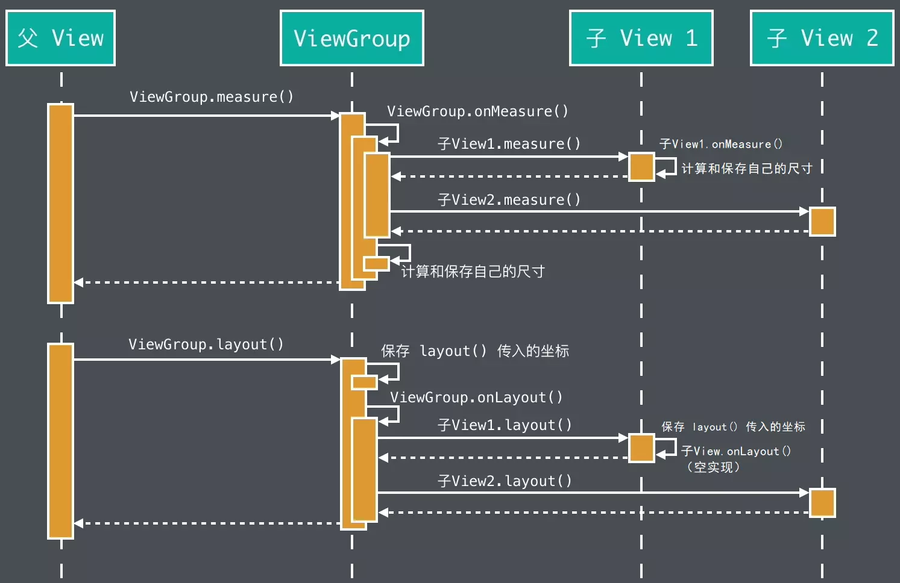

<!-- TOC -->

- [一、View 的工作流程](#%E4%B8%80view-%E7%9A%84%E5%B7%A5%E4%BD%9C%E6%B5%81%E7%A8%8B)
- [二、测量（Measure）](#%E4%BA%8C%E6%B5%8B%E9%87%8Fmeasure)
  - [2.1 MeasureSpec](#21-measurespec)
  - [2.2 测量模式](#22-%E6%B5%8B%E9%87%8F%E6%A8%A1%E5%BC%8F)
  - [2.3 View.onMeasure()](#23-viewonmeasure)
- [三、布局（Layout）](#%E4%B8%89%E5%B8%83%E5%B1%80layout)
- [四、自定义布局](#%E5%9B%9B%E8%87%AA%E5%AE%9A%E4%B9%89%E5%B8%83%E5%B1%80)
  - [4.1 SDK 中常用的计算方法](#41-sdk-%E4%B8%AD%E5%B8%B8%E7%94%A8%E7%9A%84%E8%AE%A1%E7%AE%97%E6%96%B9%E6%B3%95)
    - [4.1.1 View.resolveSize()](#411-viewresolvesize)
    - [4.1.2 ViewGroup.measureChildren()、ViewGroup.getChildMeasureSpec()](#412-viewgroupmeasurechildrenviewgroupgetchildmeasurespec)
  - [4.2 重写 onMeasure() 来修改已有的 View 的尺寸](#42-%E9%87%8D%E5%86%99-onmeasure-%E6%9D%A5%E4%BF%AE%E6%94%B9%E5%B7%B2%E6%9C%89%E7%9A%84-view-%E7%9A%84%E5%B0%BA%E5%AF%B8)
  - [4.3 重写 onMeasure() 来全新计算自定义 View 的尺寸](#43-%E9%87%8D%E5%86%99-onmeasure-%E6%9D%A5%E5%85%A8%E6%96%B0%E8%AE%A1%E7%AE%97%E8%87%AA%E5%AE%9A%E4%B9%89-view-%E7%9A%84%E5%B0%BA%E5%AF%B8)
  - [4.4 重写 onMeasure() 和 onLayout() 来全新计算自定义 ViewGroup 的内部布局](#44-%E9%87%8D%E5%86%99-onmeasure-%E5%92%8C-onlayout-%E6%9D%A5%E5%85%A8%E6%96%B0%E8%AE%A1%E7%AE%97%E8%87%AA%E5%AE%9A%E4%B9%89-viewgroup-%E7%9A%84%E5%86%85%E9%83%A8%E5%B8%83%E5%B1%80)
- [五、绘制流程（Draw）](#%E4%BA%94%E7%BB%98%E5%88%B6%E6%B5%81%E7%A8%8Bdraw)

<!-- /TOC -->

# 一、View 的工作流程
 
视图的核心是在页面中展示特定的图像和响应用户的触摸事件。

视图展示的系统架构是由视图根节点（ViewRootImpl）开始，视图根节点负责连接窗口管理器（WindowManager）与装饰视图（DecorView），窗口管理器用于响应用户事件，而装饰视图用于展示特定图像。

DecorView 继承于 FrameLayout，它包含了一个竖直方向的 LinearLayout，LinearLayout 布局含有两个部分，一个是标题部分，即 titlebar，一个是内容部分，View 的 id 为 android.R.id.content，通过 setContentView() 将添加到内容布局中，即在 Activity 中可通过以下方式拿到设置的布局：

```java
ViewGroup content = findViewById(android.R.id.content); // 内容部分
View childAt = content.getChildAt(0); // 设置的布局
```

视图展示的程序入口，由 performTraversals() 开始，在方法中依次调用 performMeasure()、performLayout()、performDraw()，即执行测量流程、执行布局流程、执行绘制流程，完成页面的整个绘制流程，将装饰视图中的内容呈现于手机屏幕之上。

测量和布局流程如下图所示：



# 二、测量（Measure）

## 2.1 MeasureSpec

MeasureSpec 用于决定 View 和 ViewGroup 之间的尺寸规则，因此我们先看一下 MeasureSpec 的常用方法及其原理。

结论：前 2 位标识 mode，后 30 位标识具体的 size。

```java
public static class MeasureSpec {
    private static final int MODE_SHIFT = 30;
    // 32 位二进制数值为 11000000000000000000000000000000
    private static final int MODE_MASK  = 0x3 << MODE_SHIFT;

    // 不限制，32 位二进制数值为 00000000000000000000000000000000
    public static final int UNSPECIFIED = 0 << MODE_SHIFT;
    // 限制固定值，32 位二进制数值为 01000000000000000000000000000000
    public static final int EXACTLY     = 1 << MODE_SHIFT;
    // 限制上限，32 位二进制数值为 10000000000000000000000000000000
    public static final int AT_MOST     = 2 << MODE_SHIFT;

    // 将 size 和 mode 打包成一个 32 位的 int 值，目的是进行内存优化。
    public static int makeMeasureSpec(int size, @MeasureSpecMode int mode) {
        // 使用旧的方式进行测量（targetSdkVersion<=17 时直接相加）。
        if (sUseBrokenMakeMeasureSpec) {
            return size + mode;
        } else {
            // 按位与，前 2 位为 mode，后 30 位为 size。
            return (size & ~MODE_MASK) | (mode & MODE_MASK);
        }
    }

    public static int getMode(int measureSpec) {
        // 提取前 2 位的数值。
        return (measureSpec & MODE_MASK);
    }

    public static int getSize(int measureSpec) {
        // 提取后 30 位的数值。即获取大小。
        // ~MODE_MASK 为对 MODE_MASK 按位取反。
        return (measureSpec & ~MODE_MASK);
    }
}
```

## 2.2 测量模式

测量模式有三种类型：

- UNSPECIFIED：不限制；
- EXACTLY：限制固定值；
- AT_MOST：限制上限。

一般情况下，视图的测量尺寸需要根据父布局的 MeasureSpec 属性（父 View 的限制）和自身布局参数（开发者的要求）共同决定。

其中，较为特殊的装饰视图属于根视图，没有父视图，则由窗口（Window）尺寸与自身布局参数决定。

## 2.3 View.onMeasure()

View.onMeasure() 的默认实现：

```java
protected void onMeasure(int widthMeasureSpec, int heightMeasureSpec) {
    // 父 View 不限制，则返回最小建议的值；
    // 父 View 有所限制，返回父 View 限制的值。
    setMeasuredDimension(getDefaultSize(getSuggestedMinimumWidth(), widthMeasureSpec),
            getDefaultSize(getSuggestedMinimumHeight(), heightMeasureSpec));
}

public static int getDefaultSize(int size, int measureSpec) {
    int result = size;
    int specMode = MeasureSpec.getMode(measureSpec);
    int specSize = MeasureSpec.getSize(measureSpec);

    switch (specMode) {
    case MeasureSpec.UNSPECIFIED:
        // 不限制，直接返回子 View 想要的大小。
        result = size;
        break;
    case MeasureSpec.AT_MOST:
    case MeasureSpec.EXACTLY:
        // 当父 View 的限制为限制上限或限制固定值时，都直接使用父 View 传下来的 measureSpec 中的的 size。
        result = specSize;
        break;
    }
    return result;
}

/**
 * 自定义 View 若想适配 minWidth、minHeight、背景大小，则需要通过重写 onMeasure() 方法，
 * 在 getSuggestedMinimumWidth() 和 getSuggestedMinimumHeight() 拿到 View 宽高最小的值进行适配。
 */
protected int getSuggestedMinimumHeight() {
    return (mBackground == null) ? mMinHeight : max(mMinHeight, mBackground.getMinimumHeight());
}

protected int getSuggestedMinimumWidth() {
    return (mBackground == null) ? mMinWidth : max(mMinWidth, mBackground.getMinimumWidth());
}
```

# 三、布局（Layout）

通过调用 View.layout() 确定视图的位置后回调 onLayout() 方法，对于 View.onLayout() 是空实现，一般情况下不需要重写，ViewGroup.onLayout() 是抽象方法，需要遍历调用子 View 的 layout() 方法。

```java
public void layout(int l, int t, int r, int b) {
    if ((mPrivateFlags3 & PFLAG3_MEASURE_NEEDED_BEFORE_LAYOUT) != 0) {
        // PFLAG3_MEASURE_NEEDED_BEFORE_LAYOUT 标记着 layout() 前需要重测。
        onMeasure(mOldWidthMeasureSpec, mOldHeightMeasureSpec);
        mPrivateFlags3 &= ~PFLAG3_MEASURE_NEEDED_BEFORE_LAYOUT;
    }

    // ……
    // changed 布局位置发生变化，若布局位置发生改变会回调 sizeChange() 中的 onSizeChanged()。
    // 通过调用 setOpticalFrame() 或 setFrame()，确定视图的四个顶点。
    boolean changed = isLayoutModeOptical(mParent) ?
            setOpticalFrame(l, t, r, b) : setFrame(l, t, r, b);

    if (changed || (mPrivateFlags & PFLAG_LAYOUT_REQUIRED) == PFLAG_LAYOUT_REQUIRED) {
        onLayout(changed, l, t, r, b);
    }

    // 下面省略部分代码
}
```

# 四、自定义布局

布局过程的自定义一般情况下分为 3 类：

- 重写 onMeasure() 来修改已有的 View 的尺寸；
- 重写 onMeasure() 来全新计算自定义 View 的尺寸；
- 重写 onMeasure() 和 onLayout() 来全新计算自定义 ViewGroup 的内部布局。

## 4.1 SDK 中常用的计算方法

在自定义布局的过程中，我们可以完全手写计算方法，也可以搭配 View 和 ViewGroup 中的一些常用的计算方法使用。下面先简单看一下 Android SDK 提供的计算方法。

### 4.1.1 View.resolveSize()

View.resolveSize() 用于适配父 View 的要求（给予的限制）。

```java
public static final int MEASURED_SIZE_MASK = 0x00ffffff;

public static final int MEASURED_STATE_TOO_SMALL = 0x01000000;

public static int resolveSize(int size, int measureSpec) {
    // MEASURED_SIZE_MASK 用于获取 View 的实际大小（即实际表示大小的范围只有前 24 位，25-30 用于表示状态）。
    return resolveSizeAndState(size, measureSpec, 0) & MEASURED_SIZE_MASK;
}

public static int resolveSizeAndState(int size, int measureSpec, int childMeasuredState) {
    // size 为子 View 想要的大小，measureSpec 为父 View 的限制。
    final int specMode = MeasureSpec.getMode(measureSpec);
    final int specSize = MeasureSpec.getSize(measureSpec);
    final int result;
    switch (specMode) {
        // 父 View 限制了上限。
        case MeasureSpec.AT_MOST:
            // 超过了限制的大小，返回 specSize。
            if (specSize < size) {
                // MEASURED_STATE_TOO_SMALL 用于标识着测量的尺寸比视图所期望的尺寸小。
                result = specSize | MEASURED_STATE_TOO_SMALL;
            } else {
                // 没超过限制值，返回 size。
                result = size;
            }
            break;
        // 限制了固定值，直接返回限制的大小 specSize。
        case MeasureSpec.EXACTLY:
            result = specSize;
            break;
        // 不限制，直接返回 size。
        case MeasureSpec.UNSPECIFIED:
        default:
            result = size;
    }
    // 附上想传递给父 View 的状态信息。
    return result | (childMeasuredState & MEASURED_STATE_MASK);
}
```

### 4.1.2 ViewGroup.measureChildren()、ViewGroup.getChildMeasureSpec()

ViewGroup.measureChildren() 用于给与一定的尺寸限制去测量所有子 View 所占的大小。

该方法并不会适用任何情况，开发者往往需要自己手写测量算法。

在手写测量算法的过程中，开发者的要求（layout_打头的属性）一般优先级最高。为什么呢？

例如，开发者在 xml 文件中写死某个 View 的高度为 40 px，却在不断计算的过程中父视图可用高度只有 30px，若以父视图的显示为准会导致显示的视图只有 30 px。即“我”说要 40 px，最后却只显示了 30px，会被开发者认为有“BUG”。因此，一般情况下，开发者的要求优先级最高（但也不是绝对的，适需求而定）。

```java
/**
 * @param widthMeasureSpec  传入的宽度限制。
 * @param heightMeasureSpec  传入的高度限制。
 */
protected void measureChildren(int widthMeasureSpec, int heightMeasureSpec) {
    final int size = mChildrenCount;
    final View[] children = mChildren;
    // 遍历所以子 View。
    for (int i = 0; i < size; ++i) {
        final View child = children[i];
        // Visibility 属性值为 GONE 的子 View 时，不测量。
        if ((child.mViewFlags & VISIBILITY_MASK) != GONE) {
            // 所有的子 View 都应用同一个尺寸限制。
            measureChild(child, widthMeasureSpec, heightMeasureSpec);
        }
    }
}

protected void measureChild(View child, int parentWidthMeasureSpec,
        int parentHeightMeasureSpec) {
    // LayoutParams 可以理解成开发者的要求，即写在 XML 文件中 layout_ 打头的属性。
    final LayoutParams lp = child.getLayoutParams();

    // 获取适配开发者的要求（高和宽）和父 View 的 padding 值后的 MeasureSpec。
    final int childWidthMeasureSpec = getChildMeasureSpec(parentWidthMeasureSpec,
            mPaddingLeft + mPaddingRight, lp.width);
    final int childHeightMeasureSpec = getChildMeasureSpec(parentHeightMeasureSpec,
            mPaddingTop + mPaddingBottom, lp.height);
    // 将父 View 的限制传给子 View 进行子 View 的测量。
    child.measure(childWidthMeasureSpec, childHeightMeasureSpec);
}

/**
 * 
 * @param widthMeasureSpec  传入的宽度限制。
 * @param heightMeasureSpec  传入的高度限制。
 */
protected void measureChildWithMargins(View child,
        int parentWidthMeasureSpec, int widthUsed,
        int parentHeightMeasureSpec, int heightUsed) {
    final MarginLayoutParams lp = (MarginLayoutParams) child.getLayoutParams();

    // 获取适配开发者的要求（宽、高、margin）和父 View 的 padding 值后的 MeasureSpec。
    final int childWidthMeasureSpec = getChildMeasureSpec(parentWidthMeasureSpec,
            mPaddingLeft + mPaddingRight + lp.leftMargin + lp.rightMargin
                    + widthUsed, lp.width);
    final int childHeightMeasureSpec = getChildMeasureSpec(parentHeightMeasureSpec,
            mPaddingTop + mPaddingBottom + lp.topMargin + lp.bottomMargin
                    + heightUsed, lp.height);

    // 将适配后的结果传给子 View 测量自己。
    child.measure(childWidthMeasureSpec, childHeightMeasureSpec);
}

/**
 * @param spec 父 View 传入的限制 MeasureSpec（此处不一定真是父 View 的限制，也可以是我们想传入的 MeasureSpec，为了好描述，统一叫父 View）。
 * @param padding padding 和 margin 的和。
 * @param childDimension 子 View 想要的大小（开发者的要求）。
 * @return 适配后的结果 MeasureSpec。
 */
public static int getChildMeasureSpec(int spec, int padding, int childDimension) {
    int specMode = MeasureSpec.getMode(spec);
    int specSize = MeasureSpec.getSize(spec);

    // 计算父 View 剩余的尺寸大小（宽或高）。
    int size = Math.max(0, specSize - padding);

    int resultSize = 0;
    int resultMode = 0;

    // specMode 为父 View 的限制模式。
    switch (specMode) {
    case MeasureSpec.EXACTLY:
        // 父 View 的限制为限制固定值。

        if (childDimension >= 0) {
            // 开发者的要求为限制固定值，因此大小和模式都是开发者的要求。
            // 此处表现出开发者的要求高于 父 View 的限制。
            resultSize = childDimension;
            resultMode = MeasureSpec.EXACTLY;
        } else if (childDimension == LayoutParams.MATCH_PARENT) {
            // 父 View 限制为限制固定值，且开发者的要求为铺满父 View。
            // 则限制模式为限制固定值，限制的大小为父 View 可用的尺寸。
            resultSize = size;
            resultMode = MeasureSpec.EXACTLY;
        } else if (childDimension == LayoutParams.WRAP_CONTENT) {
            // 父 View 限制为限制固定值，且开发者的要求为希望刚好包裹的视图内容。
            // 则限制模式为限制上限，限制的大小为父 View 可用的尺寸。
            resultSize = size;
            resultMode = MeasureSpec.AT_MOST;
        }
        break;

    case MeasureSpec.AT_MOST:
        // 父 View 的限制为限制上限。

        if (childDimension >= 0) {
            // 开发者的要求为限制固定值，此处表现出开发者的要求高于 父 View 的限制。
            resultSize = childDimension;
            resultMode = MeasureSpec.EXACTLY;
        } else if (childDimension == LayoutParams.MATCH_PARENT) {
            // 父 View 的限制为限制上限且父 View 的大小不固定，而开发者的要求为铺满父 View。
            // 则限制模式为限制上线，则限制大小为父 View 的上限。
            // 即 父 View 也不知道自己有多大，但是有一个上限，然后把这个上限传给子 View，让子 View 在这个限制内自由测量。
            resultSize = size;
            resultMode = MeasureSpec.AT_MOST;
        } else if (childDimension == LayoutParams.WRAP_CONTENT) {
            // 父 View 的限制为限制上限且父 View 的大小不固定，而开发者的要求为希望刚好包裹的视图内容。
            // 则限制模式为限制上线，则限制大小为父 View 的上限。
            // 即 父 View 也不知道自己有多大，但是有一个上限，然后把这个上限传给子 View，让子 View 在这个限制内自由测量。
            resultSize = size;
            resultMode = MeasureSpec.AT_MOST;
        }
        break;

    case MeasureSpec.UNSPECIFIED:
        // 父 View 的限制为“不限制”。

        if (childDimension >= 0) {
            // 开发者的要求为限制固定值，此处表现出开发者的要求高于 父 View 的限制。
            resultSize = childDimension;
            resultMode = MeasureSpec.EXACTLY;
        } else if (childDimension == LayoutParams.MATCH_PARENT) {
            // View.sUseZeroUnspecifiedMeasureSpec 在 targetSdkVersion < 23 时为 true。
            // 父 View 的限制为“不限制”，因此传递父 View 的限制给子 View 就好。
            resultSize = View.sUseZeroUnspecifiedMeasureSpec ? 0 : size;
            resultMode = MeasureSpec.UNSPECIFIED;
        } else if (childDimension == LayoutParams.WRAP_CONTENT) {
            // View.sUseZeroUnspecifiedMeasureSpec 在 targetSdkVersion < 23 时为 true。
            // 父 View 的限制为“不限制”，因此传递父 View 的限制给子 View 就好。
            resultSize = View.sUseZeroUnspecifiedMeasureSpec ? 0 : size;
            resultMode = MeasureSpec.UNSPECIFIED;
        }
        break;
    }
    // 返回结果 measureSpec。
    return MeasureSpec.makeMeasureSpec(resultSize, resultMode);
}
```

## 4.2 重写 onMeasure() 来修改已有的 View 的尺寸

1. 重写 onMeasure() 方法，并在里面调用 super.onMeasure()，触发原有的自我测量；
2. 在 super.onMeasure() 的下面用 getMeasuredWidth() 和 getMeasuredHeight() 来获取到之前的测量结果，并使用自己的算法，根据测量结果计算出新的结果；
3. 调用 setMeasuredDimension() 来保存新的结果（子 View 的期望尺寸）。

## 4.3 重写 onMeasure() 来全新计算自定义 View 的尺寸

1. 重写 onMeasure()，并计算出 View 的尺寸；
2. 使用 resolveSize() 来让子 View 的计算结果符合父 View 的限制（onMeasure() 方法的两个参数），如果想用自己的方式来满足父 View 的限制也行，也可以不满足父 View 的限制，具体可根据实际需求决定；
3. 调用 setMeasuredDimension() 来保存新的结果。

子 View 也可以不遵守父 View 的限制，按自己方式进行绘制，但可能出现 BUG，例如开发者在 xml 布局文件中将父 View 的宽度为固定 100 dp，而子 View 的绘制宽度却为 120，会超出开发者的预期效果，会绘制出宽度为 120dp 的子 View。

## 4.4 重写 onMeasure() 和 onLayout() 来全新计算自定义 ViewGroup 的内部布局

大多数情况下重写 onMeasure() 的三个步骤（思路）：

1. 调用每个子 View 的 measure() 来计算子 View 的尺寸;
2. 计算子 View 的位置并保存子 View 的位置和尺寸;
3. 计算自己的尺寸并用 setMeasuredDimension() 保存。

一般情况下重写 onLayout() 的思路：

- 在 onLayout() 里调用每个子 View 的 layout()，让它们保存自己的位置和尺寸。

关于保存子 View 位置的两点说明：

1. 不是所有 ViewGroup 都需要保存子 View 的位置，因为有的 ViewGroup 可以在布局阶段实时推导出子 View 的位置，例如 LinearLayout；
2. 有时候对某些子 View 需要重复测量多次才能得到正确的尺寸和位置。

以下举一个重写自定义 ViewGroup onMeasure() 的例子，在重写的过程中可以用 SDK 提供的计算方法（1.3.1 节），也可以自己自定义计算方式。

```java
public class DemoLayout extends ViewGroup {

    int selfwidthMode;
    // 自身总可用宽度
    int selfWidthSize;
    // 已使用的宽度
    int usedWidth;

    @Override
    protected void onMeasure(int widthMeasureSpec, int heightMeasureSpec) {
        // widthMeasureSpec 和 heightMeasureSpec 为 DemoLayout 的父 View 的尺寸限制。

        selfwidthMode = MeasureSpec.getMode(widthMeasureSpec);
        selfWidthSize = MeasureSpec.getSize(widthMeasureSpec);

        for (int i = 0; i < getChildCount(); i++) {
            View chindView = getChildAt(i);
            LayoutParams lp = (LayoutParams) chindView.getLayoutParams();

            // 获取当前子 view 的 WidthSpec。
            int childWidthSpec = 0;
            int heightWidthSpec = 0;

            // 根据开发者的要求和 ViewGroup 的可用空间去决定子 View 的大小。

            switch (lp.width) {
                case LayoutParams.WRAP_CONTENT:
                    // 尺寸上限为 MeasureSpec 中的 size，也就是 oddWidth。
                    if (selfwidthMode == MeasureSpec.EXACTLY || selfwidthMode == MeasureSpec.AT_MOST) {
                        childWidthSpec = MeasureSpec.makeMeasureSpec(selfWidthSize - usedWidth, MeasureSpec.AT_MOST);
                    } else if (selfwidthMode == MeasureSpec.UNSPECIFIED) {
                        childWidthSpec = MeasureSpec.makeMeasureSpec(0, MeasureSpec.UNSPECIFIED);
                    }
                    break;
                case LayoutParams.MATCH_PARENT:
                    if (selfwidthMode == MeasureSpec.EXACTLY || selfwidthMode == MeasureSpec.AT_MOST) {
                        childWidthSpec = MeasureSpec.makeMeasureSpec(selfWidthSize - usedWidth, MeasureSpec.EXACTLY);
                    } else if (selfwidthMode == MeasureSpec.UNSPECIFIED) {
                        childWidthSpec = MeasureSpec.makeMeasureSpec(0, MeasureSpec.UNSPECIFIED);
                    }
                    break;
                default:
                    // 默认情况即设置了具体的像素，开发者的要求在地位上绝对高于可用空间。
                    childWidthSpec = MeasureSpec.makeMeasureSpec(lp.width, MeasureSpec.EXACTLY);
                    break;
            }
            chindView.measure(childWidthSpec,heightWidthSpec);
            // 上面这些思路可用 measureChildWithMargins(chindView, widthMeasureSpec, usedWidth, heightMeasureSpec, usedHeight) 代替，
            // 因为该方法对 padding、margin 进行了处理，注意的是需要使用 ViewGroup.MarginLayoutParams。

            // 调用上面这行代码后，可通过 chindView.getMeasuredHeight() 和 chindView.getMeasuredWidth() 去决定子 View 的实际尺寸和位置，
            // 并根据实际需求对子 View 的位置进行保存。
            // lp.setCoordinate(left,top,right,bottom);
        }

        // 计算自己的尺寸（包含所有子 View）并用 setMeasuredDimension() 保存
        int totalWidth = 0;
        int totalHeight = 0;
        // ……
        setMeasuredDimension(totalWidth,totalHeight);
    }

    @Override
    public ViewGroup.LayoutParams generateLayoutParams(AttributeSet p) {
        return new DemoLayout.LayoutParams(getContext(),  p);
    }

    @Override
    protected void onLayout(boolean changed, int l, int t, int r, int b) {
        for (int i = 0; i < getChildCount(); i++) {
            View chindView = getChildAt(i);
            // 提取测量的位置并进行自我布局，也可以使用 Rect[] 进行保存。
            DemoLayout.LayoutParams st =
                    (DemoLayout.LayoutParams) chindView.getLayoutParams();
            chindView.layout(st.mLeft, st.mTop, st.mRight, st.mBottom);
        }
    }

    private static class LayoutParams extends ViewGroup.LayoutParams{

        private int mLeft, mTop, mRight, mBottom;

        public LayoutParams(Context c, AttributeSet attrs) {
            super(c, attrs);
        }

        public void setCoordinate(int left,int top,int right,int bottom) {
            this.mLeft = left;
            this.mTop = top;
            this.mRight = right;
            this.mBottom = bottom;
        }
    }
}
```

# 五、绘制流程（Draw）

Android 里面的绘制都是按顺序的，先绘制的内容会被后绘制的盖住。让我们看看一下绘制流程（draw()）的绘制顺序：


- onDrawForeground() 是 API 23 才引入的，会依次绘制滑动边缘渐变、滑动条和前景。
- 出于效率的考虑，ViewGroup 默认会绕过 draw() 方法，换而直接执行 dispatchDraw()，以此来简化绘制流程。所以如果你自定义了某个 ViewGroup 的子类（比如 LinearLayout）并且需要在它的除 dispatchDraw() 以外的任何一个绘制方法内绘制内容，你可能会需要调用 View.setWillNotDraw(false) 这行代码来切换到完整的绘制流程（是「可能」而不是「必须」的原因是，有些 ViewGroup 是已经调用过 setWillNotDraw(false) 了的，例如 ScrollView）。
- 如果绘制代码既可以写在 onDraw() 里，也可以写在其他绘制方法里，那么优先写在 onDraw() ，因为 Android 有相关的优化，可以在不需要重绘的时候自动跳过 onDraw() 的重复执行，以提升开发效率。
