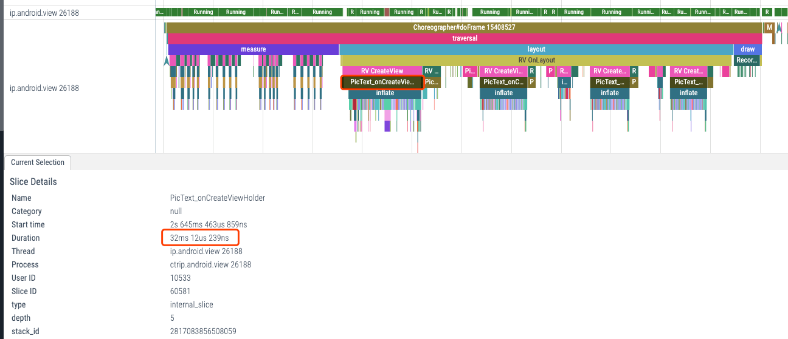
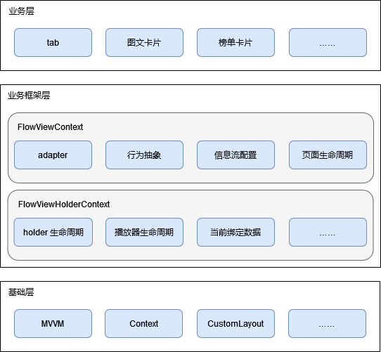

<!-- TOC -->

- [一、背景](#一背景)
- [二、图文卡片样式简介](#二图文卡片样式简介)
- [三、性能优化篇](#三性能优化篇)
    - [3.1 问题拆解](#31-问题拆解)
    - [3.2 优化思路](#32-优化思路)
    - [3.3 详细方案](#33-详细方案)
        - [3.3.1 预加载](#331-预加载)
        - [3.3.2 懒加载](#332-懒加载)
        - [3.3.3 自定义 ViewGroup](#333-自定义-viewgroup)
            - [3.3.3.1 需求分析](#3331-需求分析)
            - [3.3.3.2 详细方案](#3332-详细方案)
            - [3.3.3.3 小结](#3333-小结)
    - [3.4 收益](#34-收益)
- [四、架构设计篇](#四架构设计篇)
    - [4.1 问题拆解](#41-问题拆解)
    - [4.2 思路](#42-思路)
    - [4.3 架构设计](#43-架构设计)
        - [4.3.1 基础层](#431-基础层)
            - [4.3.1.1 MVVM](#4311-mvvm)
            - [4.3.1.2 Context](#4312-context)
        - [4.3.2 业务架构层](#432-业务架构层)
            - [4.3.2.1 FlowViewContext](#4321-flowviewcontext)
            - [4.3.2.2 FlowViewHolderContext](#4322-flowviewholdercontext)
        - [4.3.3 业务层](#433-业务层)
    - [4.4 收益](#44-收益)

<!-- /TOC -->
## 一、背景

自 APM_慢方法 上线后，暴露出首页存在一定的卡顿问题，因此对监控层面卡顿堆栈最多的「图文卡片」进行重构，并以此作为示例，分享在重构过程中的思考和方法，包括性能优化和业务架构方面。

  
 

自 APM_慢方法 上线后，暴露出首页存在一定的卡顿问题，因此对监控层面卡顿堆栈最多的「图文卡片」进行重构，并以此作为示例，分享在重构过程中的思考和方法，包括性能优化和业务架构方面。

## 二、图文卡片样式简介

图文卡片是信息流组件中使用的最多，也是最复杂的一张卡片，具体样式如下图所示，包含了卡片所支持功能的 80%。

  
 

## 三、性能优化篇

### 3.1 问题拆解

测试机型：小米mix4（Android 12）

测试工具：perfetto

  
 

从测试结果来看，measure 耗时 **68ms**， layout 耗时 **156ms**，其中第一张 pixtext 卡片的创建耗时 **32ms**，之后的 pixtext 卡片耗时在 **16ms** 左右。

其中 measure 的耗时主要集中在首页二屏上面（本文暂不讨论），layout 的耗时主要集中在 信息流组件→ 5张卡片的构造 → pictext 卡片（以下简称卡片）的创建上，主要耗时原因梳理如下：

- 此时处于首页初始化阶段，很多初始化任务都在并行运行，**系统负载很高**；
- 第一张卡片更耗时的原因在于：使用到的一些资源是第一次加载，包括本地资源文件的读取（io 操作）、静态、单例对象的创建等；
- 所有的子功能一次性全部创建，实际使用仅需要五分之一左右的功能；
- 使用 xml 进行视图布局耗时：过程涉及读取 xml 文件（io 操作，相对很耗时）→ 解析 xml 文件 → 根据标签名，new 或反射实例化 view 对象；
- 一些较为复杂的 UI 布局，采用 提前测量、嵌套布局、使用性能相对一般的 RelativeLayout、ConstraintLayout 等方式去解决，存在优化的空间。

### 3.2 优化思路

- 系统负载问题，后续通过 android studio profile 查看 **CPU/线程** 具体的运行状况，再针对性的进行逻辑优化或后置运行；
- **预加载**：通过在子线程预加载第一张卡片，从而减少第一张卡片创建时的额外耗时；
- **懒加载**：将卡片以功能为单位，拆分成子 widget（以下简称 widget），按需懒加载；
- 减少 xml 文件的使用：通过**自定义 ViewGroup** 的方式，在尽量保证可维护性的同时，取代常规 xml 的布局方式；
- 通过**自定义 ViewGroup** 的方式去实现较为复杂的 UI 布局。

### 3.3 详细方案

#### 3.3.1 预加载

子线程预加载卡片，再将其放入 RecyclerView 缓存池中复用。

#### 3.3.2 懒加载

将卡片以功能为单位，拆分成子 widget 后，根据 widget 是否需要占位分成 2 种情况处理：

**（1）需要占位**

需要占位的场景，常用于线性布局，子 View 之间拥有明确的从上到下的布局关系，因此在 widget 创建前需要其它 View 进行占位处理。

ViewStub 是布局优化的方式之一，适用于一些延迟加载的场景，它本质是一个不可见、不参与测量布局、不执行绘制的 View。

但它只支持加载 xml 文件的方式进行懒加载，因此选择自定义 ViewStub，通过设置监听的方式去初始化 widget。

  
 

**（2）不需要占位**

  
 

#### 3.3.3 自定义 ViewGroup

##### 3.3.3.1 需求分析

  
 

- 划价部分无法彻底显示时，直接不显示。

以卡片中的价格 widget 为例，应该要如何实现这样一个布局需求呢？一般情况下分为 2 步：

1. LineaLayout + LinearLayout or RelativeLayout or ConstraintLayout；
2. **提前假定卡片宽度**，然后提前测量划价是否能够完全展示，若不能，则将其设置为 gone。

但这样做，并不是很好，原因有 3 点：

1. 需要嵌套 2 层 LineaLayout，或者使用 RelativeLayout、ConstraintLayout，但它们往往会导致多次重复测量或消耗更多的内存；
2. **通用布局往往存在着许多的局限性**，以划价的这个需求为例，就无法通过一些参数配置直接实现需求；
3. 需要对 View 进行提前测量以实现需求，**但假定的东西总是相对不稳定的**，它需要维护更多的假定变量，容易牵一发而动全身。

因此选择**自定义 ViewGroup** 去解决上述问题。自定义 ViewGroup 主要有 2 个好处：

1. 拥有理论上极致的性能：专门针对某个需求定制测量和布局，没有多余的内存消耗和逻辑判断；
2. 可以轻松实现任何复杂的布局需求。

##### 3.3.3.2 详细方案

通常使用到自定义 ViewGroup 是为了实现某种通用性质的 Layout，一般会对每一个子 View 进行同样的逻辑处理，也因此会有多余的内存消耗和逻辑判断。

此处选择改变思路，通过自定义 ViewGroup 去实现 **专属该次需求的布局需求**，其过程主要分为三步：

**（1）构造子 View**

优势：

- 得益于 Kotlin 的特性，子 View 的属性可以高度内聚，也方便去写一些拓展函数；
- 不再需要解析 xml 文件；
- 不再需要调用 findViewById()。

  
 

**（2）测量**

测量阶段，只需要关心 View 的大小，不需要关心 View 会被布局在什么地方。
只需要按照需求，去分析视图的优先级和逻辑，自然而然的写出测量过程。

  

- 划价部分无法彻底显示时，直接不显示。

  
 

**（3）布局**

布局阶段，此时只需要关心 view 的相对位置，对着设计稿写相对位置逻辑即可，因为我们在测量阶段一定能保证 View 的大小是正确的。

  

  
 

##### 3.3.3.3 小结

至此，自定义 ViewGroup 就完成了，可以发现，它拥有着较好的性能以及“为所欲为”的能力，面对一些复杂的布局需求时极其强大。

但并不是说通用布局不推荐使用了，在一些简单明确、无需嵌套的布局场景下，依然可以使用 LinearLayout、FrameLayout 等通用布局去提升我们的开发效率。

### 3.4 收益

  
 

注：
- 本次测试数据是某次同样的数据、同一台手机的测试结果；
- 新卡片中，需要懒加载的视图会在「数据绑定」的时候创建。

## 四、架构设计篇

### 4.1 问题拆解

- **代码堆积**：大部分代码都集中在 ViewHolder 中；
- **低内聚、高耦合**：某个子功能（例如卡片反馈功能），代码散落在各处，和其他类产生过多耦合；
- **内存变量（例如信息流配置）在多个模块传递引用**：需经过 FlowView → Adapter → ViewHolder → ViewGroup → View → ……，一旦值需要修改，同步过程容易出问题，且较难维护。

同时子功能在进行 widget 拆分后引入了新问题：

- widget 需要调用 Adapter/ViewHolder 的方法，例如通过 ViewHolder.getAdapterPosition() 拿到卡片当前的位置；
- widget 需要在 ViewHolder 的一些方法回调中处理逻辑，例如 onRecycler()。

### 4.2 改造思路

- 将卡片以功能为单位，拆分成子 widget，职责内聚，便于维护；
- 引入上下文概念，上下文作为所有数据和服务的入口，同时让上下文在每一个 View 中传递，绝大部分场景都可轻松获取到上下文；
- 根据数据、服务的生命周期的不同，实现 **信息流组件、卡片** 两种粒度的上下文。

### 4.3 架构设计

  
 

- 基础层：抽象出和 **业务完全无关** 的基础功能，该架构思路同样适用于其他业务场景；
- 业务框架层：将业务相关的基础支持、通用功能抽取出来，提升开发效率；
- 业务层：各卡片的业务需求在此层实现。

#### 4.3.1 基础层

##### 4.3.1.1 MVVM

  
 

代码范式上，采用了 **MVVM** 的结构，具体实现为：自定义 Lifecycle + 自定义 ViewModel + LiveData。

自定义的原因是因为系统提供的 Lifecycle、ViewModel 是以 Activity/Fragment 为粒度，而实际需求中往往存在自定义的场景，以信息流组件为例：

- 首页是多 Tab+Fragment 的结构，在切到其它 tab 时，属于 onPause 状态；
- 卡片之间，Model/ViewModel 的数据不是共用的。

##### 4.3.1.2 Context

上下文概念是是架构设计的基石，得益于 View 的体系结构，其本身就有具体的 Context 实现，我们只需自定义 Context，就能够把上下文数据自动带到绝大部分使用场景中，从而解决以下 2 个问题：

- 内存变量传递问题：不再需要在多个模块传递引用，变量的获取和修改都是同一个入口；
- 数据获取问题：通过 View → Context → Data 的路径轻松拿到任何数据。

具体实现：[Android RoomContext 传递](./AndroidRoomContext传递.md)。

#### 4.3.2 业务架构层

##### 4.3.2.1 FlowViewContext

FlowViewContext：信息流组件级别的上下文。

- Adapter：widget 可直接通过 Context 拿到 Adapter，去执行卡片的插入删除操作；
- 行为抽象：信息流组件中的某些行为，在首页和组件两个层面有不同的实现，例如埋点，因此需要将这些行为抽象出来，再设置不同的实现。

##### 4.3.2.2 FlowViewHolderContext

FlowViewHolderContext：卡片级别的上下文。                                   

- holder 生命周期：通过观察者模式，提供 ViewHolder 中 onAttach、onDetach、onRecycled 等方法的回调；
- 播放器生命周期：播放器播放的时机为卡片漏出超过三分之一，通过观察该生命周期，去调用 视频/直播 对应的播放、暂停功能。

#### 4.3.3 业务层

- 代码范式上：采用了 MVVM 的结构；
- 包名结构上：由 按层分包 修改为 **按功能分包**，feature 内高内聚、高度模块化；
- 组件化思想：大到某个区域功能，小到某张卡片的子 widget，都可组件化拆分，避免代码膨胀。

### 4.4 收益

- 开发效率：通过对代码结构的拆分以及基础部分的搭建，提升开发效率 **20%**；
- 产品质量：通过对逻辑的重新梳理，发现遗漏若干个；在重构上线后无故障出现。