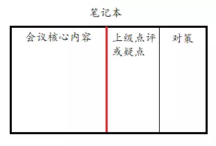

<!-- TOC -->

- [一、如何提问题](#一如何提问题)
- [二、会议总结](#二会议总结)
- [三、汇报问题](#三汇报问题)
- [四、获取资源](#四获取资源)
- [五、月度总结](#五月度总结)
- [六、年终总结](#六年终总结)
- [七、自我介绍](#七自我介绍)

<!-- /TOC -->

## 一、如何提问题

[提问的智慧](https://www.jianshu.com/p/60dd8e9cd12f)

## 二、会议总结

## 三、汇报问题

1. 结论（当下发生的事情）：客户反馈某功能有几率存在一些问题，且功能优先级较高。
2. 原因：技术方案的实现上存在着漏洞，但由于排期原因，该版本无法插入更多任务。
3. 措施：组织前后端开发人员对问题的可能性进行全面排查以及修复，预计需要 XX 天。
4. 建议：建议对现有任务优先级进行重新排列，将一些优先级低的任务向后延期，将该问题的修复插入到下版本的任务需求中。

## 四、获取资源

这个资源对于开发人员来说，可能是自己或身边的同事。

1. 提出诉求：对项目中的部分使用旧网络框架的代码进行替换。
2. 讲述优势：统一网络请求框架，从而减少维护成本，同时更有利于规范项目代码。
3. 描述计划：全局搜索关键类，逐一替换自测并备注后再让 QA 回归。

## 五、月度总结

**（1）表现（Performance）**

1. 岗位的 KPI 是什么；
2. 本月的完成数值以及完成率是多少；
3. 全年进度完成了多少。

**（2）过程（Process）**

1. 列点说明为了每一项 KPI，用了哪些方法；
2. 对应的效果或结果如何。

**（3）问题（Problem）**

1. 经历了哪些挑战，发现存在哪些问题；
2. 对应的改进措施是什么；
3. 还存在哪些问题。

**（4）计划（Plan）**

1. 下个月的计划（KPI）是什么；
2. 打算如何完成计划。

## 六、年终总结

**（1）业绩达成（Achievement）**

1. 业绩是否达标；
2. 完成了哪些项目；
3. 工作进展程度。

**（2）亮点经验（Experience）**

1. 对项目做了哪些优化；
2. 对基础设施做了哪些贡献；
3. 节约了多少成本，提高了多少工作效率。

**（3）问题分析（Analysis）**

1. 当下还存在哪些问题；
2. 什么原因导致的；
3. 具体有何改进建议。

**（4）明年的计划（Plan）**

1. 下一步的安排是什么；
2. 需要什么支持；
3. 有无初步指标。

## 七、自我介绍

STAR 法则。

**（1）情境（Situation）**

曾经遇到的挑战、项目背景。

**（2）任务（Task）**

任务目标是什么。

**（3）行动（Action）**

围绕目标做了哪些动作？重点强调对结果影响最大的行动。

**（4）结果（Result）**

结果如何，注重强调数据。

## 八、做事思维

**（1）思考**

任何事情，不管做成这样的，别人说的，还是自己设计的架构和技术方案，都要问自己背后的原因是什么。

例如当一个新的技术出现，背后的驱动力到底是什么，为什么会出现这个技术，解决了什么问题，还有什么不足或者适配的使用场景？这些问题的背后也体现了对技术的好奇心和热爱，是成为一个好的技术人的关键。

**（2）描述**

- 结论先行：这个是初学者都会犯的错误，表述事情，说了一堆理由，最后告诉你一个结论，听起来费劲，逻辑也不清楚。结论先行，然后再表达推导这个结论的结构，思路要清晰很多。

- 解构：将问题进行解构，可以形成完整的思维闭环，处理事情也不会形成遗漏。例如做资金安全的保障，要从事前、事中、事后的结构来解决资金安全的问题，往往不会形成遗漏，方案也更加清晰。
