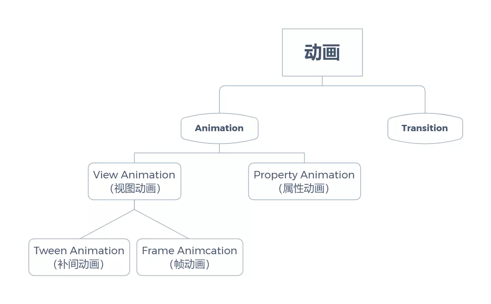

# 动画
<!-- TOC -->

- [动画](#动画)
- [一、动画的分类](#一动画的分类)
- [二、视图动画 View Animation](#二视图动画-view-animation)
    - [2.1 补间动画 Tween Animation](#21-补间动画-tween-animation)
        - [2.1.1 补间动画 API](#211-补间动画-api)
        - [2.1.2 自定义补间动画](#212-自定义补间动画)
    - [2.2 帧动画 Frame Animcatiton](#22-帧动画-frame-animcatiton)
- [三、属性动画 Property Animation](#三属性动画-property-animation)
    - [3.1 ViewPropertyAnimator](#31-viewpropertyanimator)
    - [3.2 ObjectAnimator](#32-objectanimator)
        - [3.2.1 使用方式](#321-使用方式)
        - [3.2.2 监听器](#322-监听器)
        - [3.2.3 TypeEvaluator](#323-typeevaluator)
        - [3.2.4 PropertyValuesHolder](#324-propertyvaluesholder)
    - [3.3 ValueAnimator](#33-valueanimator)
    - [3.4 AnimatorSet](#34-animatorset)
    - [3.5 小结](#35-小结)
- [四、为什么属性动画移动后仍可点击，而补间动画不可以？](#四为什么属性动画移动后仍可点击而补间动画不可以)

<!-- /TOC -->

# 一、动画的分类

Android 中动画的分类如下图所示：

<div align ="center">  </div><br>

View Animation 是纯粹基于 framework 的绘制转变，它并不会真正操作 View 的几何变换（即 View 的大小、位置实际是不变的），只是起到一个视觉上的作用，因此使用较少。

Property Animation 以改变属性为主，通过动态地改变视图的某些属性值，达到动画效果。属性动画可以通过自定义 View 的方式来做出定制化的动画并能“正确”的响应事件，因此现在的项目中的动画大多数都使用它。

Transition 这个词的本意是转换，在 Android 里指的是切换界面时的动画效果，它的重点是在于切换而不是动画。

本文先简单介绍各类动画的使用，再在最后一节分析原理。

# 二、视图动画 View Animation

视图动画可分为 **补间动画** 和 **帧动画**。

补间动画主要应用于页面启动渐入渐出、页面进入和退出、对话框底部弹出等。

帧动画主要应用于网络请求的进度等待、下拉刷新的进度等待等，需要多幅图片的组合使用。

## 2.1 补间动画 Tween Animation

补间动画包含了平移动画、缩放动画、旋转动画、透明动画、动画合集、自定义动画等。

手动实例化一个动画和通过解析 XML 加载动画在功能上几乎一致，不同在于手动实例化动画的方式可以自定义动画。

```java
// 手动创建一个动画
Animation animation = new TranslateAnimation(300, 400, 300, 400);
animation.setDuration(3000);
// 通过解析 XML 文件加载动画
Animation animationFromXml = AnimationUtils.loadAnimation(getContext(), R.anim.animator);
// 开启动画
view.startAnimation(animation);
```

### 2.1.1 补间动画 API

下面以 XML 动画的方式，相关标签属性的用途，手写动画的 API 和 XML 标签的属性的功能和名称基本是一致的。

```xml
<set xmlns:android="http://schemas.android.com/apk/res/android"
    android:fillAfter="true" 
    android:interpolator="@android:anim/accelerate_interpolator"
    android:zAdjustment="top">

    <translate
        android:duration="200"
        android:fromYDelta="0"
        android:toYDelta="100%p"/>

</set>
```

- duration：动画的持续时间。
- interpolator：动画变化的插值器，也叫速度模型。
- fillAfter：动画完成后的停留状态，若为 true，则不复原。
- zAdjustment：动画时使用的排序模式，即当动画区域产生重叠时，zAdjustment 最大的动画会覆盖重叠位置的其他动画。
- fromYDelta：Y 轴的起始坐标。用 %p 可表示所占屏幕宽或高多少百分比的大小。
- toYDelta：Y 轴的终止坐标。
- ……

### 2.1.2 自定义补间动画

以 TranslateAnimation 的源码为例介绍如何自定义补间动画。

```java
public class TranslateAnimation extends Animation {
    
    protected float mFromXDelta;
    protected float mToXDelta;
    protected float mFromYDelta;
    protected float mToYDelta;

    @Override
    public void initialize(int width, int height, int parentWidth, int parentHeight) {
        super.initialize(width, height, parentWidth, parentHeight);
        mFromXDelta = resolveSize(mFromXType, mFromXValue, width, parentWidth);
        mToXDelta = resolveSize(mToXType, mToXValue, width, parentWidth);
        mFromYDelta = resolveSize(mFromYType, mFromYValue, height, parentHeight);
        mToYDelta = resolveSize(mToYType, mToYValue, height, parentHeight);
        // 也可以设置设置各种属性，例如设置持续时间 setDuration(mDuration);
    }
 
    /**
     * 补间动画的本质都是对 Transformation 中的矩阵 Matrix 进行变换。
     *
     * @param interpolatedTime 插值时间，范围从 0 ~ 1。
     * @param t Transformation
     */
    @Override
    protected void applyTransformation(float interpolatedTime, Transformation t) {
        float dx = mFromXDelta;
        float dy = mFromYDelta;
        if (mFromXDelta != mToXDelta) {
            // 通过 (开始距离-终止距离)*interpolatedTime 算出增量的宽度。
            dx = mFromXDelta + ((mToXDelta - mFromXDelta) * interpolatedTime);
        }
        if (mFromYDelta != mToYDelta) {
            dy = mFromYDelta + ((mToYDelta - mFromYDelta) * interpolatedTime);
        }
        // 应用到 Transformation 的 Matrix 中。
        t.getMatrix().setTranslate(dx, dy);
    }
}
```

## 2.2 帧动画 Frame Animcatiton

帧动画顾名思义，原理是是一帧一帧地切换图像，产生视觉上的动画效果。
使用也很简单，在 drawable 下新增一个文件 frame_animation.xml，具体代码如下图所示：

```java
<animation-list xmlns:android="http://schemas.android.com/apk/res/android"
    android:oneshot="false" >
    // oneshot 为 true 时，只执行一次，反之循环显示。
    
    <item
        android:drawable="@drawable/ic_1"
        android:duration="100"/>
    <item
        android:drawable="@drawable/ic_2"
        android:duration="200"/>

    <item
        android:drawable="@drawable/ic_3"
        android:duration="300"/>

</animation-list>
```

```java
imageView.setImageResource(R.drawable.frame_animation.xml);
AnimationDrawable drawable = (AnimationDrawable) (imageView).getDrawable();
drawable.start();
```

# 三、属性动画 Property Animation

属性动画的本质是通过不断动态地改变对象属性，而这些属性是布局界面和绘制界面的数据源，从而实现动画效果。

属性动画的使用方式有三种，分别是 ViewPropertyAnimator、ObjctAnimator、ValueAnimator。

## 3.1 ViewPropertyAnimator 

使用方式：View.animate() 后跟 translationX() 等方法，最后调用 start() 动画便会执行。

ViewPropertyAnimator 自带的属性动画如下图所示：


其中带有 -By() 后缀的是增量版本的方法（原来的基础上添加而不是设置）。

多次 View.animate() 拿到的都是同一个 ViewPropertyAnimator 对象，因此
通过 setListener() 和 setUpdateListener() （最小 API 为 19）设置动画监听时，所有动画都共用同一个监听，因此时常需要在切换动画前通过 set[Update]Listener(null) 来移除监听。

ViewPropertyAnimator 还有 withStartAction() 和 withEndAction() 方法，可以设置一次性的动画开始或结束的监听（最小 API 16）。

需要注意的是，就算动画被取消，AnimatorListener.onAnimationEnd() 也会被调用，onAnimationCancel() 会先于 onAnimationEnd() 被调用，而 withEndAction() 实现的 Rannable 接口不会被调用。

## 3.2 ObjectAnimator

### 3.2.1 使用方式

使用方式：

  1. 如果是自定义控件，需要添加 setter / getter 方法；
  2. 用 ObjectAnimator.ofXXX() 创建 ObjectAnimator 对象；
  3. 用 start() 方法执行动画。

```java
public class SportsView extends View {  
    float progress = 0;

    // 创建 getter 方法。
    public float getProgress() {
        return progress;
    }

    // 创建 setter 方法。
    public void setProgress(float progress) {
        this.progress = progress;
        postInvalidate();
    }

    @Override
    public void onDraw(Canvas canvas) {
        super.onDraw(canvas);

        ......
        canvas.drawArc(arcRectF, 135, progress * 2.7f, false, paint);
        ......
    }
}

```

```java
// 创建 ObjectAnimator 对象, progress 要和 setter / getter 方法的方法名所对应。
ObjectAnimator animator = ObjectAnimator.ofFloat(view, "progress", 0, 65);  
// 设置动画时长。
animator.setDuration(long duration);
// 设置速度模型，SDK 自带了许多速度模型，它们的区别请到 https://hencoder.com/ui-1-6/ 查看。
animator.setInterpolator(new LinearInterpolator());
// 执行动画。
animator.start();  
```

### 3.2.2 监听器

ObjectAnimator 是用 addListener() 和 addUpdateListener() 来添加一个或多个监听器，移除监听器则是通过 remove[Update]Listener() 来指定移除对象。它和 ViewPropertyAnimator 使用的都是同一个监听接口。

ObjectAnimator 支持使用 pause() 方法暂停，所以它还支持暂时的监听：addPauseListener() / removePauseListener()。

### 3.2.3 TypeEvaluator

TypeEvaluator 可以用来自定义变化数据的类型以及变化的过程。其中 fraction 会根据 Interpolator 进行不同速度的变化，但范围会在 0~1 之间。

```java
private class PointFEvaluator implements TypeEvaluator<PointF> {  
   PointF newPoint = new PointF();

   @Override
   public PointF evaluate(float fraction, PointF startValue, PointF endValue) {
       // 一般情况下，该方法的编写过程：返回值 = 开始值 + fraction * (开始值 - 最终值)。
       float x = startValue.x + (fraction * (endValue.x - startValue.x));
       float y = startValue.y + (fraction * (endValue.y - startValue.y));

       newPoint.set(x, y);

       return newPoint;
   }
}

ObjectAnimator animator = ObjectAnimator.ofObject(view, "position",  
        new PointFEvaluator(), new PointF(0, 0), new PointF(1, 1));
animator.start(); 
```

### 3.2.4 PropertyValuesHolder 

在一个 ObjectAnimator 中同时改变多个属性。

```java
PropertyValuesHolder holder1 = PropertyValuesHolder.ofFloat("scaleX", 1);  
PropertyValuesHolder holder2 = PropertyValuesHolder.ofFloat("scaleY", 1);  
PropertyValuesHolder holder3 = PropertyValuesHolder.ofFloat("alpha", 1);

ObjectAnimator animator = ObjectAnimator.ofPropertyValuesHolder(view, holder1, holder2, holder3)  
animator.start();  
```

还可以通过设置 Keyframe（关键帧），把同一个动画属性拆分成多个阶段。

```java
// 在 0% 处开始。
Keyframe keyframe1 = Keyframe.ofFloat(0, 0);  
// 时间经过 50% 的时候，动画完成度 100%。
Keyframe keyframe2 = Keyframe.ofFloat(0.5f, 100);  
// 时间见过 100% 的时候，动画完成度倒退到 80%，即反弹 20%。
Keyframe keyframe3 = Keyframe.ofFloat(1, 80);  
PropertyValuesHolder holder = PropertyValuesHolder.ofKeyframe("progress", keyframe1, keyframe2, keyframe3);

ObjectAnimator animator = ObjectAnimator.ofPropertyValuesHolder(view, holder);  
animator.start();  
```

## 3.3 ValueAnimator

在使用一些第三方库的控件，而想要做动画的属性却没有 setter / getter 方法的时候，会需要用到它。

```java
ValueAnimator animator = ValueAnimator.ofInt(0, 100);
animator.addUpdateListener(new AnimatorUpdateListener() {
    @Override
    public void onAnimationUpdate(ValueAnimator animation) {
        // animatedValue 会不断从 0 变化到 100。
        Integer animatedValue = (Integer) animation.getAnimatedValue();
    }
});
animator.start();
```

## 3.4 AnimatorSet 

多个动画配合执行配合工作。

```java
AnimatorSet animatorSet = new AnimatorSet();
// animator1 和 animator2 依次执行，animator1 和 animator3 同时开始执行，animator4 先于 animator1 执行。
animatorSet.playSequentially(animator1, animator2);
animatorSet.playTogether(animator1,animator3);
animatorSet.play(animator1).before(animator4);  
animatorSet.start();
```

## 3.5 小结

ViewPropertyAnimator、ObjectAnimator、ValueAnimator 的使用难度和复杂度依次递增，但可拓展性也依次递增，因此可根据需求选择合适的方式去实现动画，一般情况下，在每种方式都能实现的情况下，优先选择使用最方便的方式。

# 四、为什么属性动画移动后仍可点击，而补间动画不可以？

当手指按下时，触摸事件会经过 ViewGroup 中的 dispatchTouchEvent 方法筛选符合条件 (手指在边界范围内) 的子 View 进行分派事件 (如果未被 onInterceptTouchEvent 拦截的话)。假设某个子 View 应用了 translation 属性动画，在 ViewGroup 筛选子 View 时，直接判断触摸点是否在 View 的 [left,top,right,bottom] 范围内，是肯定不行的。

那它是怎么判断的呢？

```java
// 这段代码用于检测 childView 是否符合触摸条件。
// 这 2 个条件有其中一个不满足时则不符合条件。
if (!canViewReceivePointerEvents(child)
        || !isTransformedTouchPointInView(x, y, child, null)) {
    ev.setTargetAccessibilityFocus(false);
    continue;
}

private static boolean canViewReceivePointerEvents(@NonNull View child) {
    // 视图是可见的或者设置了动画。
    return (child.mViewFlags & VISIBILITY_MASK) == VISIBLE
            || child.getAnimation() != null;
}

protected boolean isTransformedTouchPointInView(float x, float y, View child,
        PointF outLocalPoint) {
    // 临时坐标
    final float[] point = getTempPoint();
    point[0] = x;
    point[1] = y;
    
    // 对触摸坐标进行处理。处理后的坐标为相对 child 左上角的位置。
    transformPointToViewLocal(point, child);
    // 处理后的坐标是否在 child 的范围内。
    final boolean isInView = child.pointInView(point[0], point[1]);
    if (isInView && outLocalPoint != null) {
        outLocalPoint.set(point[0], point[1]);
    }
    return isInView;
}

public void transformPointToViewLocal(float[] point, View child) {
    // point 为 相对 child 左上角的位置。
    point[0] += mScrollX - child.mLeft;
    point[1] += mScrollY - child.mTop;
    // 通过调用 child.hasIdentityMatrix() 判断 child 是否应用过位移、缩放、旋转之类的和矩阵有关的属性动画。
    if (!child.hasIdentityMatrix()) {
        // 触摸点映射到该子 View 的逆矩阵上。
        // 比如一个 View 它水平平移了 200，那它所对应的逆矩阵就是水平平移了-200，
        // 当触摸点坐标是 [400,400] 的话，那么映射之后，就是 [200,400]。
        child.getInverseMatrix().mapPoints(point);
    }
}

// pointInView 是 View 中的方法。
final boolean pointInView(float localX, float localY) {
    return pointInView(localX, localY, 0);
}

// pointInView 是 View 中的方法。
public boolean pointInView(float localX, float localY, float slop) {
    return localX >= -slop && localY >= -slop && localX < ((mRight - mLeft) + slop) &&
            localY < ((mBottom - mTop) + slop);
}
```

补间动画为什么不行呢？这里以 TranslateAnimation 为例进行分析。

```java
@Override
protected void applyTransformation(float interpolatedTime, Transformation t) {
    float dx = mFromXDelta;
    float dy = mFromYDelta;
    if (mFromXDelta != mToXDelta) {
        dx = mFromXDelta + ((mToXDelta - mFromXDelta) * interpolatedTime);
    }
    if (mFromYDelta != mToYDelta) {
        dy = mFromYDelta + ((mToYDelta - mFromYDelta) * interpolatedTime);
    }
    // 最后都是通过 Transformation.getMatrix() 来获取到矩阵对象然后对这个矩阵进行操作。
    t.getMatrix().setTranslate(dx, dy);
}
```

回到 Animation 中，会发现 applyTransformation() 是在 getTransformation(long currentTime, Transformation outTransformation) 调用的，outTransformation 作为参数传到 applyTransformation() 方法。

接着发现在 applyLegacyAnimation() 调用了 getTransformation()，在 draw() 中调用了 applyLegacyAnimation()。

```java
private boolean applyLegacyAnimation(ViewGroup parent, long drawingTime,
        Animation a, boolean scalingRequired) {
    ...
    // 发现 Transformation 的来源是 parent.getChildTransformation()，它是 parent 的一个全局变量。
    // 由此可知，在一个 ViewGroup 中，它的所有子 View 的所有补间动画都是共用同一个 Transformation 对象的 (也就是共用一个 Matrix)。
    final Transformation t = parent.getChildTransformation();
    boolean more = a.getTransformation(drawingTime, t, 1f);
    if (scalingRequired && mAttachInfo.mApplicationScale != 1f) {
        invalidationTransform = parent.mInvalidationTransformation;
        a.getTransformation(drawingTime, invalidationTransform, 1f);
    } 
    ...
}

boolean draw(Canvas canvas, ViewGroup parent, long drawingTime) {
    boolean more = false;
    ...
    Transformation transformToApply = null;

    final Animation a = getAnimation();
    if (a != null) {
        // 当前 View 的动画不为 null 时，会先调用 applyLegacyAnimation() 应用该动画的矩阵到父 View 的 mChildTransformation 中。
        more = applyLegacyAnimation(parent, drawingTime, a, scalingRequired);
        transformToApply = parent.getChildTransformation();
    }

    if (transformToApply != null) {
        // drawingWithRenderNode 表示是否应用硬件加速。
        if (drawingWithRenderNode) {
            // renderNode 是硬件加速专用的一个对象，动画正在播放的时候就会显示这个矩阵，当播放完毕时，就清除掉该矩阵。
            renderNode.setAnimationMatrix(transformToApply.getMatrix());
        } else {
            // 没有开启硬件加速，则直接应用到 canvas 中，之后会调用 draw(canvas)，开始真正的绘制过程。
            canvas.translate(-transX, -transY);
            canvas.concat(transformToApply.getMatrix());
            canvas.translate(transX, transY);
        }
        // 因此可以发现补间动画只在绘制期间生效。
    }
    ...
}
```
