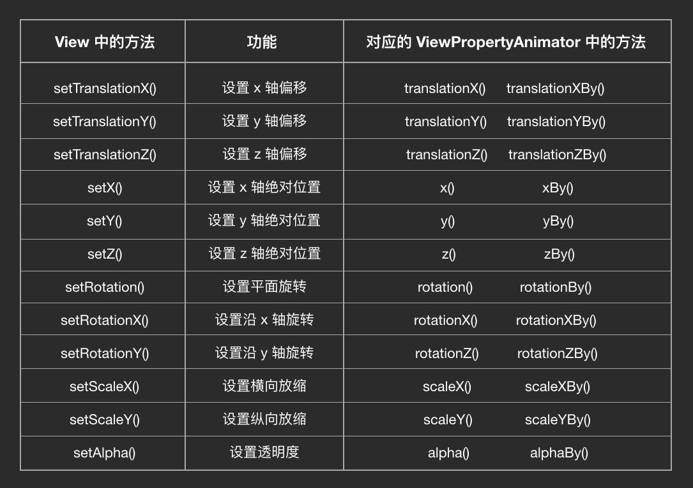

# 动画
<!-- TOC -->

- [动画](#%E5%8A%A8%E7%94%BB)
  - [动画的分类](#%E5%8A%A8%E7%94%BB%E7%9A%84%E5%88%86%E7%B1%BB)
  - [视图动画 View Animation](#%E8%A7%86%E5%9B%BE%E5%8A%A8%E7%94%BB-view-animation)
  - [属性动画 Property Animation](#%E5%B1%9E%E6%80%A7%E5%8A%A8%E7%94%BB-property-animation)
    - [ViewPropertyAnimator](#viewpropertyanimator)
    - [监听器 Listener](#%E7%9B%91%E5%90%AC%E5%99%A8-listener)
    - [ObjectAnimator](#objectanimator)
      - [动画时长 Duration](#%E5%8A%A8%E7%94%BB%E6%97%B6%E9%95%BF-duration)
      - [速度模型 Interpolator](#%E9%80%9F%E5%BA%A6%E6%A8%A1%E5%9E%8B-interpolator)
      - [监听器](#%E7%9B%91%E5%90%AC%E5%99%A8)
      - [TypeEvaluator](#typeevaluator)
      - [PropertyValuesHolder](#propertyvaluesholder)
      - [AnimatorSet](#animatorset)
    - [ValueAnimator](#valueanimator)
- [参考资料](#%E5%8F%82%E8%80%83%E8%B5%84%E6%96%99)

<!-- /TOC -->

## 动画的分类

Android 里动画可以分为两类：Animation 和 Transition（支持的最小 API 为 19）。Animation 又可以再分为 View Animation 和 Property Animation 两类，View Animation 是纯粹基于 framework 的绘制转变，它并不会真正操作 View 的几何变换（即 View 的大小、位置实际是不变的），只是起到一个视觉上的观感作用，因此极少使用。而 Property Animation 不仅可以使用自带的 API 来实现最常用的动画，而且通过自定义 View 的方式来做出定制化的动画，现在的项目中的动画大多数都将使用它。

Transition 这个词的本意是转换，在 Android 里指的是切换界面时的动画效果，它的重点是在于切换而不是动画，此处暂时不对 Transition 进行学习。

## 视图动画 View Animation

由于 View Animation 较为简单且不常用，此时仅仅举一个例子作为参考。

```java
Animation animation = new TranslateAnimation(300, 400, 300, 400);
animation.setDuration(3000);
view.startAnimation(animation);
```

## 属性动画 Property Animation

### ViewPropertyAnimator 

使用方式：View.animate() 后跟 translationX() 等方法，动画会自动执行。

具体可以跟的方法以及方法所对应的 View 中的实际操作的方法如下图所示：



其中带有 -By() 后缀的是增量版本的方法（原来的基础上添加而不是设置）。

### 监听器 Listener

ViewPropertyAnimator 用的是 setListener() 和 setUpdateListener() （最小 API 为 19）方法，要移除监听器时通过 set[Update]Listener(null) 填 null 值来移除。

ViewPropertyAnimator 还有 withStartAction() 和 withEndAction() 方法，可以设置一次性的动画开始或结束的监听（最小 API 16）。

需要说明一下的是，就算动画被取消，AnimatorListener.onAnimationEnd() 也会被调用，onAnimationCancel() 会先于 onAnimationEnd() 被调用，而 withEndAction() 实现的 Rannable 接口不会被调用。

### ObjectAnimator

使用方式：

  1. 如果是自定义控件，需要添加 setter / getter 方法；
  2. 用 ObjectAnimator.ofXXX() 创建 ObjectAnimator 对象；
  3. 用 start() 方法执行动画。

```java
public class SportsView extends View {  
    float progress = 0;

    // 创建 getter 方法
    public float getProgress() {
        return progress;
    }

    // 创建 setter 方法
    public void setProgress(float progress) {
        this.progress = progress;
        postInvalidate();
    }

    @Override
    public void onDraw(Canvas canvas) {
        super.onDraw(canvas);

        ......
        canvas.drawArc(arcRectF, 135, progress * 2.7f, false, paint);
        ......
    }
}

// 创建 ObjectAnimator 对象, progress 要和 setter / getter 方法的方法名所对应。
ObjectAnimator animator = ObjectAnimator.ofFloat(view, "progress", 0, 65);  
// 执行动画
animator.start();  
```

#### 动画时长 Duration

ObjectAnimator.setDuration(long duration)

#### 速度模型 Interpolator

setInterpolator(Interpolator interpolator)

各种不同的速度模型请到 [Hencoder](https://hencoder.com/ui-1-6/) 查看。

#### 监听器

ObjectAnimator 是用 addListener() 和 addUpdateListener() 来添加一个或多个监听器，移除监听器则是通过 remove[Update]Listener() 来指定移除对象。它和 ViewPropertyAnimator 使用的都是同一个监听接口。

ObjectAnimator 支持使用 pause() 方法暂停，所以它还多了一个 addPauseListener() / removePauseListener() 的支持。

#### TypeEvaluator

TypeEvaluator 可以用来自定义变化数据的类型以及变化的过程。其中 fraction 会根据 Interpolator 进行不同速度的变化，但范围会在 0~1 之间。

```java
private class PointFEvaluator implements TypeEvaluator<PointF> {  
   PointF newPoint = new PointF();

   @Override
   public PointF evaluate(float fraction, PointF startValue, PointF endValue) {
       // 一般情况下，该方法的编写过程：返回值 = 开始值 + fraction * (开始值 - 最终值)
       float x = startValue.x + (fraction * (endValue.x - startValue.x));
       float y = startValue.y + (fraction * (endValue.y - startValue.y));

       newPoint.set(x, y);

       return newPoint;
   }
}

ObjectAnimator animator = ObjectAnimator.ofObject(view, "position",  
        new PointFEvaluator(), new PointF(0, 0), new PointF(1, 1));
animator.start(); 
```

#### PropertyValuesHolder 

用于在一个动画中改变多个属性。

```java
PropertyValuesHolder holder1 = PropertyValuesHolder.ofFloat("scaleX", 1);  
PropertyValuesHolder holder2 = PropertyValuesHolder.ofFloat("scaleY", 1);  
PropertyValuesHolder holder3 = PropertyValuesHolder.ofFloat("alpha", 1);

ObjectAnimator animator = ObjectAnimator.ofPropertyValuesHolder(view, holder1, holder2, holder3)  
animator.start();  
```

还可以通过设置 Keyframe （关键帧），把同一个动画属性拆分成多个阶段。

```java
// 在 0% 处开始
Keyframe keyframe1 = Keyframe.ofFloat(0, 0);  
// 时间经过 50% 的时候，动画完成度 100%
Keyframe keyframe2 = Keyframe.ofFloat(0.5f, 100);  
// 时间见过 100% 的时候，动画完成度倒退到 80%，即反弹 20%
Keyframe keyframe3 = Keyframe.ofFloat(1, 80);  
PropertyValuesHolder holder = PropertyValuesHolder.ofKeyframe("progress", keyframe1, keyframe2, keyframe3);

ObjectAnimator animator = ObjectAnimator.ofPropertyValuesHolder(view, holder);  
animator.start();  
```

#### AnimatorSet 

多个动画配合执行配合工作。

```java
AnimatorSet animatorSet = new AnimatorSet();
// animator1 和 animator2 依次执行，animator1 和 animator3 同时开始执行，animator4 先于 animator1 执行。
animatorSet.playSequentially(animator1, animator2);
animatorSet.playTogether(animator1,animator3);
animatorSet.play(animator1).before(animator4);  
animatorSet.start();
```

### ValueAnimator 

在使用一些第三方库的控件，而想要做动画的属性却没有 setter / getter 方法的时候，会需要用到它。

```java
ValueAnimator animator = ValueAnimator.ofInt(0, 100);
animator.addUpdateListener(new AnimatorUpdateListener() {
    @Override
    public void onAnimationUpdate(ValueAnimator animation) {
        Integer animatedValue = (Integer) animation.getAnimatedValue();
    }
});
animator.start();
```


# 参考资料

- [属性动画 Property Animation（上手篇） - HenCoder](https://hencoder.com/ui-1-6/)
- [属性动画 Property Animation（进阶篇） - HenCoder](https://hencoder.com/ui-1-7/)