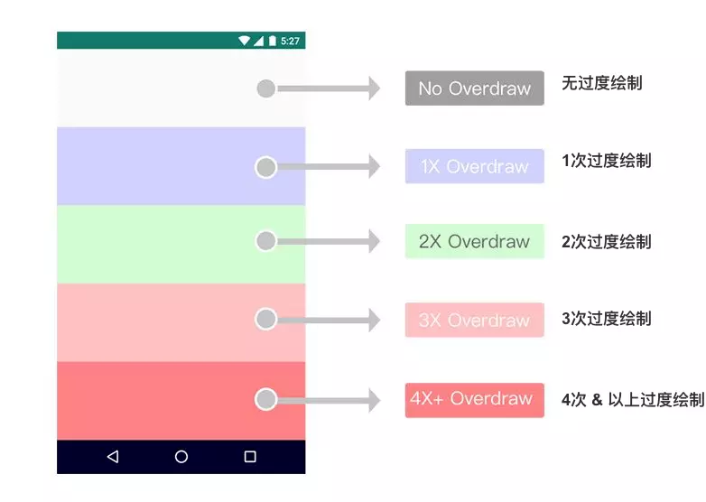

# 一、简介

## 1.1 性能优化的目的

性能优化的目的是为了让应用程序 App 更快、更稳定、更省。

- 更快：应用程序流畅的运行，能快速响应用户操作；
- 更稳定：在用户使用过程中，程序按正确常的业务需求执行，不出现应用 **程序崩溃（Crash）** 和 **无响应（ANR）** 的问题；
- 更省：节省耗费的资源，包括内存占用、电池消耗、流量消耗等。

## 1.2 卡顿的原因

Android 系统每隔 16ms 发出 VSYNC 信号，触发对 UI 的渲染，如果每次渲染都成功，这样就能够达到流畅的画面所需要的60fps，因此程序的大多数操作都必须在16ms内完成。
反之在 16ms 内渲染失败，那么用户在 32ms 甚至更加时间内看到的会是同一帧画面，从而发生了丢帧现象。

# 二、启动速度

从宏观上讲，在业务方法已达到最优性能的情况下，启动速度的优化都可尝试采用 **异步加载（多线程）、分步加载、延期加载** 的策略去提高性能。

## 2.1 App 启动速度

应用的启动方式分为冷启动、温启动、热启动：

- 冷启动：进程不存在时启动。
- 温启动：进程存在，但界面被杀死（需从 activity.onCreate() 开始执行）。
- 热启动：进程存在、界面也存在（需从 activity.onStart() 开始执行）。

这里主要针对启动速度最慢的冷启动进行优化。

### 2.1.1 启动速度计算

此处将 App 的启动耗时区间定义为：从点击 App 图标至入口 Activity.onResume() 执行完毕。

adb shell am start -W 应用包名/Activity包名.Activity

- startTime - 准备调用startActivityAndWait()的时间点。
- endTime - 获取startActivityAndWait()返回值的时间点（包含Activity的onCreate()、onResume()）。
- mLaunchStartTime - 第一个Activity的开始启动时间点。
- displayStartTime - 最后一个Activity开始启动时间点。
- curTime - 在 onResume() 后，endTime 前被获取。
- ThisTime = (curTime - displayStartTime)
- TotalTime = mLaunchStartTime != 0 ? (curTime - mLaunchStartTime):thisTime
- WaitTime = endtime - startTime

<div align="center">  </div>

一般关心 TotalTime 即可，这个时间才是所测试应用真正启动的耗时。

```
adb shell am start -W com.example.passin.myapplication/com.example.passin.myapplication.MainActivity
```

### 2.1.2 优化方案

**（1）异步加载**

 - [TaskScheduler](https://github.com/passin95/TaskScheduler)

可控制任务依赖关系的任务调度器，并可自动对无依赖关系的任务异步同时执行，加快执行速度。

**（2）入口界面优化**

直接看 2.2 节。

**（3）视觉优化**

在 Activity.onCreate() 中，WindowManager 会先加载界面主题样式中的 windowBackground 做为app的预览元素，因此可以修改该属性，给用户快速反馈的视觉体验。

1. 配置SplashTheme。

```
<style name="SplashTheme" parent="Theme.AppCompat.Light.NoActionBar">
    <item name="android:windowBackground">@mipmap/ic_splash</item>
</style>
```
2. 将 SplashActivity 默认主题为 SplashTheme。

```java
<activity android:name=".SplashActivity"
    android:theme="@style/SplashTheme">
    <intent-filter>
        <action android:name="android.intent.action.MAIN"/>

        <category android:name="android.intent.category.LAUNCHER"/>
    </intent-filter>
</activity>
```

或者手动设置主题。

```java
public class SplashActivity extends AppCompatActivity {
    protected void onCreate(Bundle savedInstanceState) {
        // 需在super.onCreate()前调用。
        setTheme(R.style.AppTheme);
        super.onCreate(savedInstanceState);
    }
}
```

## 2.2 界面启动速度

由于我们打开的界面大多是Activity，此处以 Activity 进行举例说明。

根据 Activity 的跳转的生命周期走向，以及视图在 onResume() 才附加到 Window，因此将页面启动速度定义为上一个Activity.onStop() 至下一个 activity.onResume() 执行完毕。

onPause（A）-> onCreate(B) -> onStart(B) -> onResume(B)

# 三、绘制优化

## 3.1 onDraw()

由于 onDraw() 的特性，可能会频繁调用（例如使用了属性动画），可以进行的优化如下：

- 尽可能不要使用局部对象导致内存抖动。
- 避免在 onDraw() 执行耗时操作。

## 3.2 减少过度绘制

过度绘制(Overdraw)是指屏幕上的某个像素在同一帧的时间内被绘制了多次。

在多层次的UI结构里面，不可见的UI也做了绘制的操作，这就会导致某些像素区域被绘制了多次从而导致资源的浪费以及增加耗时。

<div align="center">  </div>

过度绘制优化方案：

**（1）去除 window 的默认背景**

- 如果该界面背景颜色已具体要求某个颜色，可以在 setContentView() 之前调用 getWindow().setBackgroundDrawable(null) 取消 Window 默认背景。

**（2）减少没必要的像素多次绘制（GPU过度绘制）**

- 布局嵌套中无意义的背景覆盖。

**（3）自定义 View**

调用 canvas.quickReject() 判断经过当前矩阵变化后是否和某个矩形相交。若相交，则可跳过相交的区域，从而减少过度绘制。

调用 canvas.clipRect() 指定只需要绘制的区域（覆盖区域不需要绘制）。

**（4）ViewPager 与 Fragment**

对于1个 ViewPager + 多个 Fragment 组成的首页界面，若 **每个** Fragment 都设置了背景色，则 ViewPager 则可以不设置。

# 四、布局优化

[View 的工作流程](./View%20的工作流程.md)

**（1）同层级嵌套下使用性能高的布局**

- 性能耗费低的布局 = 功能简单 = FrameLayout、LinearLayout
- 性能耗费高的布局 = 功能复杂 = RelativeLayout、ConstraintLayout

**（2）减少布局嵌套**

一些父布局例如 RelativeLayout 需要 measure两次才能完成，而子View的位置会受到父View的影响，相互嵌套导致的深层嵌套等的发生会使 measure 次数呈指数级增长，所费时间也呈线性增长。

因此嵌套所耗费的性能大于单个布局本身耗费的性能，在布局过程中应该优先减少嵌套。对于复杂布局可使用 ConstraintLayout。

**（3）include、viewstub、merge**

- include：直接加载 xml 到当前 UI 结构中，用于减少重复代码，便于维护。
- viewstub：viewstub 是轻量级且不可见的 View，不参与measure和layout，需要时才动态加载需要的 View，资源消耗非常低。
- merge：用于替换父 View，从而减少多余嵌套。

**（4）优先使用 new 的方式创建 View**

Android xml 文件的加载是 LayoutInflater 利用 pull 解析方式来解析，然后根据节点名通过反射的方式创建出View对象实例，改为使用 new View() 的方式进行布局，可以有效减少 inflate 的时间。


# 五、内存优化

建议先了解 [Java 虚拟机](./Java%20%E8%99%9A%E6%8B%9F%E6%9C%BA.md)，从中了解 Java 虚拟机、内存回收算法、垃圾对象的判定算法，才能更深刻的理解内存优化。

## 5.1 常见的内存问题

常见的内存问题分为以下几种：

- 内存泄露
- 内存抖动
- Bitmap 相关
- 代码质量

**（1）内存泄漏**

内存泄漏对于性能的影响还是比较大的，它不仅导致 GC 无法识别回收无用的对象，还会进一步导致内存不足从而增大GC的触发频率。

[可达性分析算法](./Java%20%E8%99%9A%E6%8B%9F%E6%9C%BA.md#312-可达性分析算法) 是判断是否造成内存泄漏的重要依据，内存泄漏的本质就是 **GC Roots 中的对象（长生命周期对象）引用了并且不释放已不在使用的短生命周期对象**。

**（2）内存抖动**

内存抖动的原因是短时间内生成了大量临时变量（生命周期短）从而容易引发 GC，而 GC 期间会停止所有线程，防止线程在CLR检查期间访问了某个对象改变了这个对象的状态，从而影响性能。

**（3）Bitmap**

在 Android 2.3.3（API 10）及以后，Bitmap 对象和像素数据均存储在堆内存中，不再需要手动释放 Bitmap 内存，转由 Java 回收机制自动回收，因此对 Bitmap 的优化主要是配置上。

简单来说，就是根据需求选择最合适的解码方式。

 

## 5.2 内存优化案例


- 尽可能的杜绝内存泄漏，可使用 [leakcanary
](https://github.com/square/leakcanary) 检测项目中存在的内存泄漏。

- 应避免在循环亦或 onDraw() 中创建“一次性使用”的对象，不到万不得已不要在里面写try catch。

- 数量级千级以内的键对容器，如果 key 值为基本数据类型，推荐使用 SparseArray、SparseBooleanArray、LongSparseMap 等容器代替 HashMap，key 值不为基础数据类型，则使用 ArrayMap。能减少内存占用。

- 减少非必要枚举的使用，它不仅会增大apk的大小，还会产生额外的内存占用，可以使用 @interface + @IntDef/@StringDef 替代枚举。

- 尽量使用Parcelable代替Serializable，前者在性能和速度上都大于后者。

# 六、APK 优化

**（1）资源优化**

- 使用 Android Lint 删除冗余资源、文件。
- 根据机型分辨率选择合适的图片。
- 压缩图片，使用内存占用小的图片格式，如 webp。
- 代码层面实现 UI 效果从而代替图片，例如常见的渐变、圆角等需求都可以通过代码实现。

**（2）严格审核第三方库**

不要为了一个小的功能引入一个较大的库。

**（3）混淆**

- 官方混淆方案（ProGuard）：包含了压缩、优化、混淆等功能。
- 微信资源混淆方案（[AndResGuard](https://github.com/shwenzhang/AndResGuard/blob/master/README.zh-cn.md)）：将冗长的资源路径变短。

**（4）插件化**

- 将功能模块化打包成 apk 放在服务器上，按需下载后通过插件化的方式加载。

**（5）最小化 so 平台支持**

- 在满足兼容的前提下，尽可能少的选择支持的平台，so 文件往往在 apk 的构成比重中极大。

# 七、电量优化

**（1）优化唤醒锁（Wakelock）**

检查全部唤醒锁，是否存在冗余或者无用的唤醒锁，唤醒锁会导致手机的CPU无法休眠，长时间工作是浪费电量的关键所在。

**（2）优化网络请求**

集中具有相关性的网络数据请求，统一发送；精简数据结构，减少无用数据的传输，这样不仅可以节省电量，也能节省流量。

**（3）优化数据处理**
  
对于分析和统计等非重要的计算，在电量充足或连接Wifi时进行，可以通过JobScheduler类进行处理。
   
**（4）优化服务**

精简冗余的服务（Service），避免长时间执行耗电较高操作。

**优化定位**

注意精准定位（GPS）信息的获取，使用后及时关闭，对于精度要求较低的定位，可以通过网络定位进行，以便降低耗电量。

# 八、其它优化案例

- 需要 Map 的 key 和 value 时，应该选择迭代 entrySet()，只需要 key 时，使用 keySet()。

- Bundle 序列化方式推荐 Parcelable，其余情况的序列化方式推荐 [ProtoBuf](https://github.com/protocolbuffers/protobuf)。

- 一般的字符串拼接在编译期会进行优化，但是在循环中字符串拼接无法做到优化，所以需要使用 StringBuilder 进行替换。

- List 的 contains 方法普遍时间复杂度是 O(n)，如果在代码中需要频繁调用 contains 方法查找数据，可以先将 list 转换成 HashSet 实现，将 O(n) 的时间复杂度降为 O(1)。

- 手动指定容器初始容量大小，减小扩容次数。

- 当要把其它对象或类型转化为字符串时，使用 String.valueOf(value) 比 value+"" 的效率更高。

- 可使用 [blockcanary](https://github.com/markzhai/AndroidPerformanceMonitor) 检测 ui 线程是否做了耗时操作。

- 界面不可见时，停止动画。定位使用完毕后立刻关闭定位。

- 如果每个 item 的大小是固定的，可以 setHasFixedSize(true) 去减少 requestLayout() 操作。

- 通过设置 setHasStableIds(true) +重写 getItemId()，可以避免调用 notifyDataSetChanged 导致的闪屏。

- Retrofit ServiceMethod 对象的构建相对耗时，会阻塞主线程，可为 Retrofit 设置二次代理，在 defer 操作符的回调中执行这些方法。

# 九、性能调优工具

## 9.1 Hierarchy Viewer 和 Layout Inspector

[Hierarchy Viewer](https://developer.android.com/studio/profile/hierarchy-viewer) 是 Android Device Monitor 中内置的一种工具，可以测量布局层次结构中每个视图的布局速度，从而查找由视图层次结构导致的性能瓶颈。

但 Google 已不再维护 Hierarchy Viewer，若需求仅是检查视图层次结构中的属性，则推荐使用 [Layout Inspector](https://developer.android.com/studio/debug/layout-inspector.html)。

## 9.2 Profile GPU Rendering

[Profile GPU Rendering](https://developer.android.com/studio/profile/inspect-gpu-rendering) 以滚动直方图的形式直观地显示渲染界面窗口帧所花费的时间（以每帧 16 毫秒的速度作为对比基准）。要实现每秒 60 帧，代表每个帧的竖条需要保持在基准线以下。当竖条超出此线时，在视觉上就可能出现丢帧现象。

我们可以通过以下步骤开启该调试工具：

手机 “设置” App -> 开发者选项 -> Profile GPU rendering（GPU 渲染模式分析） -> on screen as bars（在屏幕上显示为条形图）

## 9.3 Android Profiler

Android Studio 3.0 及更高版本中的 [Android Profiler](https://developer.android.com/studio/profile/android-profiler) 取代了 [Android Monitor](https://developer.android.google.cn/studio/profile/monitor)。Android Profiler 工具可提供实时数据，帮助您了解应用的 CPU、内存、网络和电池资源使用情况。

## 9.4 过度绘制调试工具

**过度绘制调试工具** 是开发者选项中的一个功能，通过对您的界面进行颜色编码来帮助您识别过度绘制。

我们可以通过以下步骤开启该调试工具：

手机 “设置” App -> 开发者选项 -> 调试GPU过度绘制 -> 显示过度绘制区域
