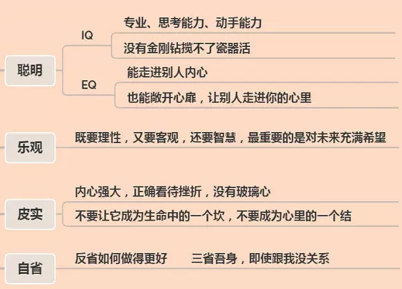

<!-- TOC -->

- [一、前言](#一前言)
- [二、专业能力](#二专业能力)
    - [2.1 基础知识](#21-基础知识)
    - [2.2 项目经历](#22-项目经历)
    - [2.3 编码能力](#23-编码能力)
    - [2.4 系统设计](#24-系统设计)
- [三、沟通协作能力](#三沟通协作能力)
    - [3.1 沟通能力](#31-沟通能力)
    - [3.2 协作能力](#32-协作能力)
- [四、成长潜力](#四成长潜力)
- [五、文化匹配](#五文化匹配)

<!-- /TOC -->

## 一、前言

个人的职业素养在于日复一日一点一滴的积累和思考，本文主要是帮助读者提高自我认知，并对技术面试较为系统的了解，找到前进的方向。

对于技术面试，面试官一般主要从这四方面考察候选人：专业能力、沟通协作能力、成长潜力、文化匹配。

## 二、专业能力

专业能力主要分为「深度」和「广度」。一般通过「基础知识」、「项目经历」、「编码能力」、「系统设计」去进行考量。

无论工作经验多少，学海无涯，知识都是会存在盲区的，但是对于简历里提到的技术点，在面试过程中，应该主动展现你对简历提到技术点的深度和广度，不要让面试官挤牙膏一样的问。

对于客户端开发来说，深度主要体现下基础知识、项目经历以及系统设计，广度主要体现下项目经历和系统设计中。

### 2.1 基础知识

对于笔者（Android 开发）来说，基础知识主要包括 Java 基础、Android 基础、设计模式、网络、常用第三方源码等。

这部分的知识建议系统的学习并深入了解，然后在平时工作中以及面试后复盘总结、查缺补漏。如果能多面试几个公司的话，就会发现大家问的问题都差不多。

关于基础知识的深度方面，这里两个例子：

若候选人写了 Java 基础扎实，那么在面试官眼里，代表着至少应该看过并深入理解 String、HashMap、ArrayList、ConcurrentHashMap 等常用类的源码。

若候选人写了 Android 基础扎实，那么在面试官眼里，代表着至少应该看过并深入理解 Looper 机制、Android 自定义控件、Android 事件分发机制、Binder 等。

### 2.2 项目经历

项目经历这一块，面试官可能会问你，做了什么，用了哪些技术，遇到什么困难，怎么解决的。

这几个问题，建议候选人可以对着自己的简历，思考一下如何回答。这里面应该注意两个细节：

- 一是原因（广度），比如说你做某一个需求，业界有 ABC 三种方案，你为什么用了 A 方案，而没用 B 或 C 方案，这些方案的区别是什么？
- 二是原理（深度），比如说你用了某个开源项目，它的实现原理是什么？最好是代码看过，如果没看过的话，要知道核心原理。

除此之外，还可以尝试跳出客户端的范畴思考实行方案，去了解不同端该做和能做的事情，不局限于客户端技术栈。

一方面，在你的项目还没有证明它的价值之前，可能很多公司并不愿意投入很多的人力。这个时候我们只能去包办前后端。等到这个项目证明了它的价值，才会拉更多的人参与进来。所以这就需要我们具备跨端的能力，目标是解决项目的痛点，要知道客户端技术并不是唯一的选择。

另外一方面，针对持续交付平台、测试平台、网络平台、数据平台等很多平台，客户端开发者本来就是使用方，我们应该更清楚里面的痛点是什么，有哪些可以改进的地方，所以客户端开发者应该更能主导这些平台的演进。

### 2.3 编码能力

现在的很多大厂以及中厂都开始重视编码能力，主要是算法，有一些公司也会考些工程类的题目，比如生产者消费者模式，多线程交替打印有序数组等。

这部分的准备其实也很简单，一句话就是刷 [LeetCode](https://leetcode-cn.com)，对于客户端来说，将 [LeetCode 精选 TOP 面试题](https://leetcode-cn.com/problemset/leetcode-top) 和 [LeetCode 热题 HOT 100](https://leetcode-cn.com/problemset/leetcode-hot-100/) 刷会就可以应付大部分算法题了。

### 2.4 系统设计

系统设计是一个很大的话题，包含了方方面面，小到某个框架的设计，大到整个应用的体系化架构，既需要深度又需要广度。

一般系统设计，不仅要实现功能和业务，还要准确的识别出功能/服务/系统的难点。这就需要既要有敏锐的洞察力，也要有结构化的全方位思考，以及可实操的落地方案。

作为一个资深技术人员，主流的解决方案是应该了解的，可以体现我们的技术视野，因为较高级的岗位需要经常做一些方案设计和选型的，甚至需要做一些架构设计。

关于程序设计的思考模式，可以借鉴一下美团的 beafqps 方法论，具体如下：

- BenchMark（对标）：做方案搞架构，要了解部门、公司内、业内的通用和先进解决方案，进行对标。

- Efficiency（效率）：方案设计要高内聚、低耦合，易扩展，易维护；重复的工作自动化等等，要经常思考如何提高效率。

- Architecture（架构）：要符合简单、合适、可演进的原则，好的架构，可以提高迭代效率，降低研发成本，提高系统稳定性。

- Function（功能）：这个是最基础的一个，勿忘初心，本质上是为了支持功能去实现。

- Quality（质量）：一方面是指可靠性，系统要可测试、质量保障要做好；另一方面是指可用性，要高可用，稳定性要好。

- Performance（性能）：对于客户端来说，写好每一行代码，避免卡顿，减少方法耗时，减少内存占用，并针对具体的案例进行优化。

- Safety（安全）：系统是否被 Root，网络环境是否安全、混淆反逆向等。

如果在与面试官的交流中，上面 7 个要素都提到，就可以说明你的思考已经比较全面了，具备了较好的技术广度了，如果面试官对你的技术深度，也是有较高评价的话，专业能力这一块，就过关了。

## 三、沟通协作能力

如果说专业能力和解决问题能力是硬实力的话，那么接下来要讨论的就是沟通协作能力（软实力）。

无论作为 Leader 还是团队成员，都需要与很多同事一起工作，如果沟通与协作能力有问题的话，可能会降低团队的整体工作效率、影响团队的士气和氛围。因此，面试官也会观察候选人这方面的能力。

### 3.1 沟通能力

首先聊聊沟通能力，对于一个内向的人来说，本质上是一个自信心建立以及多练的过程，这里主要说一些技巧方面的内容：

**（1）如何沟通**

不管是面试还是沟通过程中，应该做到不卑不亢、语速正常、注意抑扬顿挫，不要想机关枪一样，一个声调突突突，那样对方会听的很累，抓不住重点。保持微笑，与对方真诚的交流互动才是一个比较好的方式。

**（2）长时间沟通的技巧**

日常交流中，控制语速，习惯性做到边思考，边描述，通俗点讲就是现在讲的一些内容，应该是几秒前想好的。

**（3）提升沟通质量**

养成自省的习惯，以一个听者的角度去复盘有哪些地方还值得去注意和修缮的。

**（4）换个角度看面试**

对于面试等一些场景，可以换个角度看待，例如面试过程会对基础知识不断的深入，对项目所暴露的问题不断讨论，往往结局便是双方摸索出一个达成共识的方案，因此不难发现我们可以把面试看成一次技术交流的过程。

**（5）择景回答**

在描述同一件事情时，面对不同的场景和人物，往往需要不同的回答。这里举几个场景：

一般技术面试，在一二面时（一般是同级同事或 Leader），往往会围绕基础知识、项目经历的细节不断深入探讨，而作为三面乃至四面面试官（Leader 的 Leader，乃至 vp）时，面试官更希望先看到候选者的总结能力、沟通协作能力等。因为细节问题已经在一二面进行过考量了，就需要我们对自己有一个清晰的总结。

再或者是公司的内部晋升答辩，往往只有十多分钟的描述时间，这时候讲太多细节方面的东西无疑是给自己亮红灯。

### 3.2 协作能力

下面再说下协作能力，首先要有同理心，人无完人，我们不能用对家人和朋友的期望，来要求每一个同事、每一个面试官。

比如面试官迟到了、或者说错话了、作为候选人，可以理解包容、恶劣情况下也要审时度势，权衡利弊，当然，必要时我们也要坚守自己的底线和原则。

另外要注意的是，很多较为高级的职位，工作职责往往包含日常指导初中级工程师、跨团队沟通、统筹协调、项目管理、团队管理等，因此越是工作经验丰富的朋友，越要注意提高自己的沟通协作能力。

## 四、成长潜力

一般新人入职的半年乃至一年，都在熟悉业务、流程、团队、系统等，真正能够做出重大贡献，往往要第二年才能开始。因此，企业对候选人的成长性是有期望的。

成长潜力一般是结合候选人的经历去评估的。

例如：

- 候选人过往的经历有没有在较短时间内，完成新业务或系统的熟悉，快速做出业绩的事例；
- 候选人对自己做过的事情，有没有较为深刻的理解和总结，是否善于发现问题，并提出解决方案以及最终落地。

典型的场景是，我们在描述完自己很拿手的项目之后，面试官问，这个项目有没有可以优化的地方？如果候选人能够脱口而出，把当前的问题，短期、中期、长期的规划，清楚的说出，就可以体现出很好的主动性，这也意味着成长潜力。

## 五、文化匹配

由于企业招一个人的成本是很高的，尤其是高端岗位，企业一定不希望候选人入职待一年就走的，这样不利于团队的稳定性和梯队建设，也不利于企业的发展。

因此通过文化匹配的方式，本质上是希望雇主和候选人能够拥有相对一致的方向，能够互相认可，以长久互利共赢。

文化匹配通常这方面都是由 VP、Team Leader、HR 来考察的。主要包含企业的使命、愿景以及价值观。

使命、愿景方面，候选人面试前可以提前做好功课，适当的表达自己对企业文化的认可，会有较大的加分。

价值观方面，以阿里的人才观作为主要参考：

  

简单点说，应该要乐观，皮实，做事积极主动、认真负责（具有 Owner 意识）。

还有一些现实的角度，例如有的面试官很坦诚：“我们这里加班很多，早 10 晚 10，996，你能接受吗？”。这个可以根据自己的规划自行决定。
