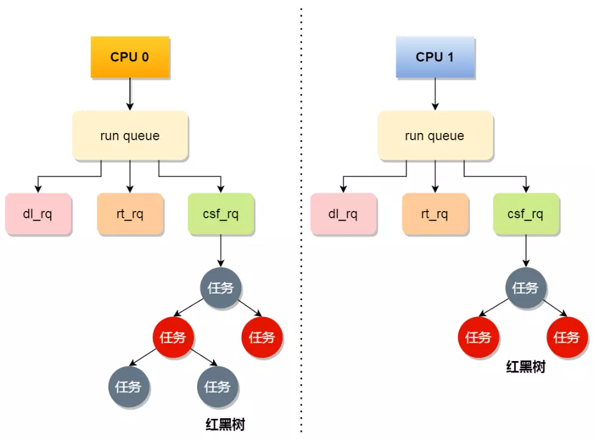
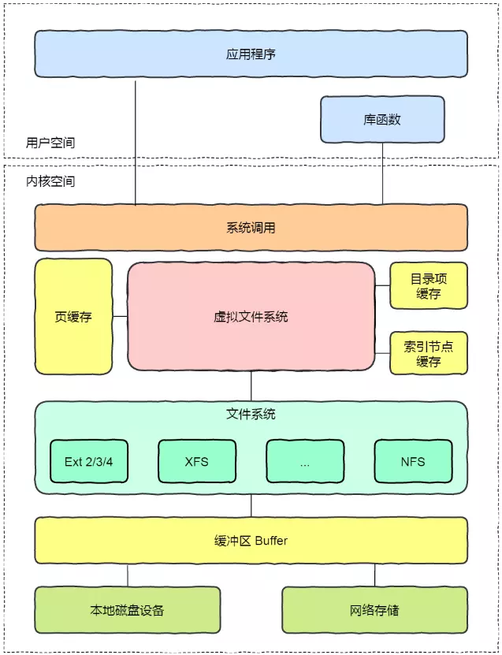
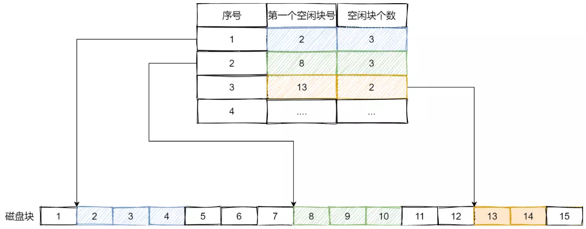

<!-- TOC -->

- [一、硬件结构](#一硬件结构)
    - [1.1 CPU 的工作原理](#11-cpu-的工作原理)
        - [1.1.1 图灵机的工作方式](#111-图灵机的工作方式)
        - [1.1.2 冯诺依曼模型](#112-冯诺依曼模型)
            - [1.1.2.1 内存](#1121-内存)
            - [1.1.2.2 中央处理器](#1122-中央处理器)
            - [1.1.2.3 总线](#1123-总线)
            - [1.1.2.4 输入、输出设备](#1124-输入输出设备)
        - [1.1.3 线路位宽与 CPU 位宽](#113-线路位宽与-cpu-位宽)
        - [1.1.4 程序执行的基本过程](#114-程序执行的基本过程)
        - [1.1.5 a = 1 + 2 执行具体过程](#115-a--1--2-执行具体过程)
        - [1.1.6 指令](#116-指令)
            - [1.1.6.1 指令是什么](#1161-指令是什么)
            - [1.1.6.2 指令的类型](#1162-指令的类型)
            - [1.1.6.3 指令的执行速度](#1163-指令的执行速度)
    - [1.2 存储器](#12-存储器)
        - [1.2.1 寄存器](#121-寄存器)
        - [1.2.2 CPU Cache](#122-cpu-cache)
        - [1.2.3 内存](#123-内存)
        - [1.2.4 SSD/HDD 硬盘](#124-ssdhdd-硬盘)
        - [1.2.5 存储器层次关系](#125-存储器层次关系)
    - [1.3 CPU Cache 的运行机制](#13-cpu-cache-的运行机制)
    - [1.4 CPU 缓存一致性](#14-cpu-缓存一致性)
        - [1.4.1 CPU Cache 数据写入内存](#141-cpu-cache-数据写入内存)
            - [1.4.1.1 写直达](#1411-写直达)
            - [1.4.1.2 写回](#1412-写回)
        - [1.4.2 缓存一致性问题](#142-缓存一致性问题)
            - [1.4.2.1 总线嗅探](#1421-总线嗅探)
            - [1.4.2.2 MESI 协议](#1422-mesi-协议)
            - [1.4.2.3 伪共享](#1423-伪共享)
    - [1.5 CPU 如何选择线程](#15-cpu-如何选择线程)
        - [1.5.1 调度类](#151-调度类)
        - [1.5.2 完全公平调度](#152-完全公平调度)
        - [1.5.3 CPU 运行队列](#153-cpu-运行队列)
    - [1.6 中断](#16-中断)
        - [1.6.1 什么是中断](#161-什么是中断)
        - [1.6.2 什么是软中断](#162-什么是软中断)
    - [1.7 数字在二进制是如何表示的](#17-数字在二进制是如何表示的)
        - [1.7.1 为什么负数要用补码表示](#171-为什么负数要用补码表示)
        - [1.7.2 浮点型数据的二进制存储](#172-浮点型数据的二进制存储)
- [二、操作系统结构](#二操作系统结构)
    - [2.1 内核](#21-内核)
    - [2.2 内核架构](#22-内核架构)
- [三、内存管理](#三内存管理)
    - [3.1 虚拟内存](#31-虚拟内存)
    - [3.2 内存分段](#32-内存分段)
    - [3.3 内存分页](#33-内存分页)
        - [3.3.1 什么是内存分页](#331-什么是内存分页)
        - [3.3.2 多级页表](#332-多级页表)
        - [3.3.3 TLB](#333-tlb)
    - [3.4 段页式内存管理](#34-段页式内存管理)
    - [3.5 Linux 内存管理](#35-linux-内存管理)
- [四、进程和线程](#四进程和线程)
    - [4.1 进程](#41-进程)
        - [4.1.1 进程的状态](#411-进程的状态)
        - [4.1.2 进程的控制结构](#412-进程的控制结构)
        - [4.1.3 进程的控制](#413-进程的控制)
        - [4.1.4 进程的上下文切换](#414-进程的上下文切换)
            - [4.1.4.1 CPU 的上下文切换](#4141-cpu-的上下文切换)
            - [4.1.4.2 进程的上下文切换](#4142-进程的上下文切换)
    - [4.2 线程](#42-线程)
        - [4.2.1 线程与进程的比较](#421-线程与进程的比较)
        - [4.2.2 线程的上下文切换](#422-线程的上下文切换)
        - [4.2.3 线程的实现](#423-线程的实现)
            - [4.2.3.1 用户线程](#4231-用户线程)
            - [4.2.3.2 内核线程](#4232-内核线程)
            - [4.2.3.3 轻量级进程](#4233-轻量级进程)
    - [4.3 调度](#43-调度)
        - [4.3.1 调度原则](#431-调度原则)
        - [4.3.2 调度算法](#432-调度算法)
            - [4.3.2.1 先来先服务调度算法](#4321-先来先服务调度算法)
            - [4.3.2.2 最短作业优先调度算法](#4322-最短作业优先调度算法)
            - [4.3.2.3 高响应比优先调度算法](#4323-高响应比优先调度算法)
            - [4.3.2.4 时间片轮转调度算法](#4324-时间片轮转调度算法)
            - [4.3.2.5 最高优先级调度算法](#4325-最高优先级调度算法)
            - [4.3.2.6 多级反馈队列调度算法](#4326-多级反馈队列调度算法)
    - [4.4 进程间通信](#44-进程间通信)
        - [4.4.1 管道](#441-管道)
            - [4.4.1.1 管道在 Linux 的使用](#4411-管道在-linux-的使用)
            - [4.4.1.2 管道的原理](#4412-管道的原理)
        - [4.4.2 消息队列](#442-消息队列)
        - [4.4.3 共享内存](#443-共享内存)
        - [4.4.4 信号量](#444-信号量)
        - [4.4.5 信号](#445-信号)
        - [4.4.6 Socket](#446-socket)
    - [4.5 线程安全](#45-线程安全)
- [五、文件系统](#五文件系统)
    - [5.1 文件系统的基本组成](#51-文件系统的基本组成)
    - [5.2 虚拟文件系统](#52-虚拟文件系统)
    - [5.3 文件的存储](#53-文件的存储)
        - [5.3.1 连续空间存放方式](#531-连续空间存放方式)
        - [5.3.2 非连续空间存放方式](#532-非连续空间存放方式)
            - [5.3.2.1 链表方式](#5321-链表方式)
            - [5.3.2.2 索引方式](#5322-索引方式)
    - [5.4 目录的存储](#54-目录的存储)
    - [5.5 空闲空间管理](#55-空闲空间管理)
        - [5.5.1 空闲表法](#551-空闲表法)
        - [5.5.2 空闲链表法](#552-空闲链表法)
        - [5.5.3 位图法](#553-位图法)
    - [5.6 软链接和硬链接](#56-软链接和硬链接)
- [六、设备管理](#六设备管理)
    - [6.1 设备控制器](#61-设备控制器)
    - [6.2 设备驱动程序](#62-设备驱动程序)
    - [6.3 设备分类](#63-设备分类)
    - [6.4 通用块层](#64-通用块层)
    - [6.5 存储系统 I/O 软件分层](#65-存储系统-io-软件分层)
    - [6.6 键盘敲入字母时，期间发生了什么？](#66-键盘敲入字母时期间发生了什么)
- [七、网络系统](#七网络系统)
    - [7.1 Linux 收发网络包流程](#71-linux-收发网络包流程)
    - [7.2 文件传输](#72-文件传输)
        - [7.2.1 DMA 技术](#721-dma-技术)
        - [7.2.2 传统的文件传输有多糟糕？](#722-传统的文件传输有多糟糕)
        - [7.2.3 如何优化文件传输的性能？](#723-如何优化文件传输的性能)
        - [7.2.4 零拷贝](#724-零拷贝)
            - [7.2.4.1 mmap + write](#7241-mmap--write)
            - [7.2.4.2 sendfile](#7242-sendfile)
        - [7.2.5 PageCache](#725-pagecache)
        - [7.2.6 大文件传输用什么方式实现？](#726-大文件传输用什么方式实现)
    - [7.3 I/O 多路复用](#73-io-多路复用)
        - [7.3.1 文件描述符](#731-文件描述符)
        - [7.3.2 服务器最大 TCP 连接数](#732-服务器最大-tcp-连接数)
        - [7.3.3 多进程模型](#733-多进程模型)
        - [7.3.4 多线程模型](#734-多线程模型)
        - [7.3.5 I/O 多路复用](#735-io-多路复用)
            - [7.3.5.1 select/poll](#7351-selectpoll)
            - [7.3.5.2 epoll](#7352-epoll)
- [参考资料](#参考资料)

<!-- /TOC -->

# 一、硬件结构

## 1.1 CPU 的工作原理

### 1.1.1 图灵机的工作方式

图灵的基本思想是用机器来模拟人们用纸笔进行数学运算的过程，还定义了计算机由哪些部分组成，程序又是如何执行的。

图灵机的基本组成如下：

- 有一条「纸带」，纸带由一个个连续的格子组成，每个格子可以写入字符，纸带就好比内存，而纸带上的格子的字符就好比内存中的数据或程序；
- 有一个「读写头」，读写头可以读取纸带上任意格子的字符，也可以把字符写入到纸带的格子；
- 读写头上有一些部件，比如存储单元、控制单元以及运算单元。

接下来以 **1 + 2** 为例，来看看它是怎么执行的：

1. 首先，用读写头把「1、2、+」这 3 个字符分别写入到纸带上的 3 个格子，然后读写头停在 1 字符对应的格子上；
2. 接着，读写头读入 1 传输给「控制单元」，判断是一个数据后写入「存储单元」（存储设备）中，这个存储设备称为图灵机的状态；
3. 然后，读写头向右移动一个格，用同样的方式把 2 读入到图灵机的状态；
4. 接着，读写头再往右移动一个格，读写头读到 + 号后，「控制单元」发现是一个 + 号（指令），于是通知「运算单元」工作。运算单元就会读取状态中的 1 和 2 并进行 **+** 号计算，再将计算的结果 3 存放到状态中；
5. 最后，运算单元将结果返回给控制单元，控制单元将结果传输给读写头，读写头向右移动，把结果 3 写入到纸带的格子中。

事实上，图灵机这个看起来很简单的工作方式，和我们今天的计算机是基本一样的。

### 1.1.2 冯诺依曼模型

在 1945 年冯诺依曼和其他计算机科学家们提出了计算机具体实现的报告：其遵循了图灵机的设计，还提出用电子元件构造计算机，约定了用二进制进行计算和存储，并定义计算机基本结构为 5 个部分，分别是 **中央处理器（CPU）、内存、输入设备、输出设备、总线**。

<div align="center">  </div>

#### 1.1.2.1 内存

我们的程序和数据都是存储在内存，存储的区域是线性的。

数据存储的单位是一个「二进制位（bit）」，即 0 或 1。最小的存储单位是「字节（byte）」，1 字节等于 8 位（bit）。

内存的地址是从 0 开始编号的，然后自增排列，最后一个地址为 **内存总字节数 - 1**，这种结构好似我们程序里的数组，所以内存的读写任何一个数据的速度都是一样的。

#### 1.1.2.2 中央处理器

中央处理器也就是我们常说的 CPU，32 位和 64 位 CPU 最主要区别在于「一次能计算多少字节的数据」：

- 32 位 CPU 一次可以计算 4 个字节；
- 64 位 CPU 一次可以计算 8 个字节。

之所以 CPU 要这样设计，是为了能计算更大的数值，如果是 8 位的 CPU，那么一次只能计算 1 个字节 **0~255** 范围内的数值，就无法一次完成计算 **10000 * 500**，而 32 位 CPU 能计算的最大整数是 **4294967295**。

CPU 内部还有一些组件，常⻅的有寄存器、控制单元和逻辑运算单元等。其中:

- 控制单元：负责控制 CPU 工作，识别字符是数据还是指令，以及控制程序的流程等;
- 逻辑运算单元：负责计算，例如执行运算指令;
- 寄存器（存储单元）：主要作用是「存储计算时的数据」，它的数据读取速度远超内存。

而寄存器又分为很多种，每种寄存器的功能又不尽相同：

- 通用寄存器：用来存放需要进行运算的数据，比如需要进行加和运算的两个数据；
- 程序计数器：用来存储 CPU 要执行的下一条指令「所在的内存地址」，注意不是存储了下一条要执行的指令，此时指令还在内存中，程序计数器只是存储了下一条指令的地址；
- 指令寄存器：用来存放程序计数器指向的指令，也就是指令本身。

#### 1.1.2.3 总线

总线用于 CPU 和内存以及其他设备之间的通信，根据作用可分为 3 种：

- 地址总线：用于指定 CPU 将要操作的内存地址；
- 数据总线：用于读写内存的数据；
- 控制总线：用于发送和接收信号，比如中断、设备复位等信号，CPU 收到信号后自然进行响应，这时也需要控制总线。

当 CPU 要读写内存数据的时候，一般需要通过两个总线：

- 首先要通过「地址总线」来指定内存的地址；
- 再通过「数据总线」来传输数据。

#### 1.1.2.4 输入、输出设备

输入设备向计算机输入数据，计算机经过计算后，把数据输出给输出设备。期间，如果输入设备是键盘，按下按键时是需要和 CPU 进行交互的，这时就需要用到控制总线了：给 CPU 发送「中断请求」告知有数据输入。

### 1.1.3 线路位宽与 CPU 位宽

**（1）线路位宽**

数据是如何通过线路传输的呢？本质上是通过操作电压，低电压表示 0，高压电压则表示 1。

高低高这样的信号，其实就是 101 二进制数据，如果只有一条线路，就意味着每次只能传递 1 bit 的数据，即 0 或 1，那么传输 101 这个数据，就需要 3 次才能传输完成，这样的效率非常低。

为了避免低效率的串行传输的方式，线路的位宽最好一次就能访问到所有的内存地址或足够大的数据。

例如 CPU 要想操作内存地址就需要地址总线，如果想要 CPU 操作 4G 的内存，那么就需要 32 条地址总线，因为 2 ^ 32 =4G，也因此 **地址总线的位数决定了 CPU 可直接寻址的内存空间大小**。

**（2）CPU 位宽**

CPU 位宽指的是 CPU 一次执行指令的数据带宽，其由 **寄存器数据宽度（CPU 位数）、数据总线位宽** 共同决定。

CPU 位数往往和数据总线、指令位数（操作系统位数）一致，这样才能兼顾 CPU 计算效率和线路传输效率的最大化：

- 若 32 位 CPU 控制 40 位宽的数据总线，工作起来就会非常复杂且麻烦，因为 CPU 自身无法一次性计算 40 位的数据，还涉及到 2 次传输的数据如何拆分计算的问题；
- 若 32 位 CPU 控制 16 位宽的数据总线，则一个 int（4 字节） 类型的数据，需要传输 2 次，增加 CPU 的等待时间，影响性能。

**（3）32 位 CPU 和 64 位 CPU 的区别**

如果用 32 位 CPU 去加和两个 64 位大小的数字，就需要把这 2 个 64 位的数字分成 2 个低位 32 位数字和 2 个高位 32 位数字来计算，不能一次性计算出结果。

而 64 位 CPU 可以一次性计算出两个 64 位数字的结果，因为 64 位 CPU 可以一次读入 64 位的数字，其内部的逻辑运算单元也支持 64 位数字的计算。

但是并不代表 64 位 CPU 性能比 32 位 CPU 高很多，因为需要算超过 32 位的数字的概率相对很小，所以 **若 CPU 主频一致，单从计算性能来看，如果计算的数额不超过 32 位数字的情况下，32 位和 64 位 CPU 之间没什么区别的，只有当计算超过 32 位数字的情况下，64 位的性能优势才能体现出来**。

64 位 CPU 带来的优势更多是寄存器所能表示的数的范围增大，即提升了 CPU 的位宽，同时一般 CPU 位数 和地址总线的位宽是一样的，因此大大提升了 CPU 可直接寻址的内存空间大小。

硬件的 64 位和 32 位指的是 CPU 的位宽，软件（操作系统）的 64 位和 32 位指的是指令的位宽。

### 1.1.4 程序执行的基本过程

在前面，我们知道了程序在图灵机的执行过程，接下来来看看程序在冯诺依曼模型上是怎么执行的。

程序实际上是一条一条指令，所以程序的运行过程本质是一条条指令按序的执行，负责执行指令的就是 CPU 了。

<div align="center">  </div>

现代大多数 CPU 都使用来「流水线」的方式来执行指令，所谓的流水线就是把一个任务拆分成多个小任务，每个小任务再由专门的功能部件「并行」去实现。一条指令的执行通常分为 4 个阶段，称为 4 级流水线：

1. Fetch（取得指令）：「控制单元」读取「程序计数器」的值，这个值是指令的虚拟内存地址，然后「控制单元」操作「地址总线」得到指令的物理内存地址，接着通知内存设备准备数据，数据准备好后通过「数据总线」将指令数据传给 CPU，CPU 收到内存传来的数据后，将这个指令数据存入到「指令寄存器」；
2. Decode（指令译码）：「控制单元」解码「指令寄存器」中的指令，确定指令的类型和参数。无论是进行算术操作、逻辑操作，还是进行数据传输、条件分支操作，都交给「逻辑运算单元」执行，仅仅是简单的操作（无条件地址跳转），才直接交由「控制单元」继续执行；
3. Execution（执行指令）：相应的单元执行对应的指令。
4. Store（数据回写）：执行完毕后通过「数据总线」将结果写回内存。
5. CPU 执行完指令后，「程序计数器」的值自增，表示指向下一条指令的内存地址，接着再回到第一步。这个自增的大小，由 CPU 的位宽决定，比如 32 位的 CPU，「程序计数器」的值会自增 4 个字节；

CPU 从程序计数器读取指令、到执行、再到下一条指令，这个过程会不断循环，直到程序执行结束，这个不断循环的过程被称为「CPU 的指令周期」。

### 1.1.5 a = 1 + 2 执行具体过程

接下来用 a = 1 + 2 的作为例子，进一步分析该程序在冯诺伊曼模型的执行过程。
 
首先 CPU 是不认识 a = 1 + 2 这个字符串的，这些字符串只是方便我们程序员认识，要想这段程序能跑起来，还需要把整个程序翻译成「汇编语言」（面向机器的程序设计语言）的程序，这个过程称为「编译成汇编代码」。

针对汇编代码，还需要用「汇编器将其翻译成机器码」，这些机器码由 0 和 1 组成的机器语言，这一条条机器码，就是一条条的「计算机指令」，这个才是 CPU 真正能够认识的东⻄。

内存会有个专门的区域来存放数据，这个区域就是「数据段」；也有专门来存放指令的区域，称为「正文段」，数据和指令是分开区域存放的。

<div align="center">  </div>

编译器会把 **a = 1 + 2** 翻译成 4 条指令，存放到正文段中。如上图，假定程序执行时，这 4 条指令被存放到了 0x200 ~ 0x20c 的地址区域中：

- 0x200 的内容是 **load** 指令：将 0x100 地址中的数据 1 装入到寄存器 **R0**；
- 0x204 的内容是 **load** 指令：将 0x104 地址中的数据 2 装入到寄存器 **R1**；
- 0x208 的内容是 **add** 指令：将寄存器 **R0** 和 **R1** 的数据相加，并把结果存放到寄存器 **R2**；
- 0x20c 的内容是 **store** 指令：将寄存器 **R2** 中的数据回写到数据段中的 **0x108** 地址中，这个地址也就是变量 **a** 内存中的地址。

在上面的例子中，由于是在 32 位 CPU 执行的，因此一条指令是占 32 位大小，也就是说每条指令间隔 4 个字节，这也是为什么 32 位 CPU 不能运行在 64 位操作系统的原因之一。

数据的大小是根据在程序中指定的变量类型，在大多数系统中，int 类型的数据则占 4 个字节，char 类型的数据则占 1 个字节。

### 1.1.6 指令

#### 1.1.6.1 指令是什么

指令的内容是一串二进制数字的机器码，每条指令都有对应的机器码，CPU 通过解析机器码来知道指令的内容。

不同的 CPU 有不同的指令集，也就是对应着不同的汇编语言和不同的机器码，接下来选用最简单的 **MIPS** 指令集，来看看机器码是如何生成的：

MIPS 的指令是一个 32 位的整数，高 6 位代表「操作码」，表示这条指令是什么行为的指令，剩下的 26 位不同指令类型所表示的内容也就不相同，主要有 R、I、J 三种类型。

<div align="center">  </div><br>

- R 指令：用于算术和逻辑操作。如果是逻辑位移操作，后面还有位移操作的「位移量」，而最后的「功能码」则是再前面的操作码不够的时候，扩展操作码来表示对应的具体指令的；
- I 指令：用于数据传输、条件分支等。这个类型的指令，就没有了位移量和操作码，也没有了第三个寄存器，而是把这三部分直接合并成了一个地址值或一个常数；
- J 指令：用于跳转，高 6 位之外的 26 位都是一个跳转后的地址。

接下来，我们把这个示例翻译成机器码：「add 指令将寄存器 R0 和 R1 的数据相加，并把结果放入到 R2」：

<div align="center">  </div><br>

add 指令是属于 R 指令类型：

- add 对应的 MIPS 指令里操作码是 **000000**，以及最末尾的功能码是 **100000**，这些数值都是固定的，可通过 MIPS 指令集的手册查看其它指令的数值；
- rs 代表第一个寄存器 R0 的编号，即 **00000**；
- rt 代表第二个寄存器 R1 的编号，即 **00001**；
- rd 代表目标的临时寄存器 R2 的编号，即 **00010**；
- 因为不是位移操作，所以位移量是 **00000**。

把上面这些数字拼在一起就是一条 32 位的 MIPS add 指令了，那么用 16 进制表示的机器码则是 **0x00011020**。

编译器在编译程序的时候，会构造指令，这个过程称为「指令的编码」。CPU 执行程序的时候，就会解析指令，这个过程称为「指令的解码」。

#### 1.1.6.2 指令的类型

指令从功能⻆度划分，可以分为 5 大类：

- 数据传输类型：比如 **store/load** 是寄存器与内存间数据传输的指令，**mov** 是将一个内存地址的数据移动到另一个内存地址的指令；
- 运算类型：比如加减乘除、位运算、比较大小等等，它们最多只能处理两个寄存器中的数据；
- 跳转类型：通过修改程序计数器的值来达到跳转执行指令的过程，比如常⻅的 **if-else、swtich-case、函数调用** 等；
- 信号类型：比如发生中断的指令 **trap**；
- 闲置类型：比如指令 nop，执行后 CPU 会空转一个指令周期。

#### 1.1.6.3 指令的执行速度

CPU 的硬件参数都会有 **GHz** 这个参数，比如一个 1 GHz 的 CPU，指的是时钟频率是 1 G，代表着 1 秒会产生 1G 次数的脉冲信号，每一次脉冲信号高低电平的转换就是一个周期，称为「时钟周期」,「时钟周期时间」就是 1/1G。

一个时钟周期一定能执行完一条指令吗？答案是不一定的，大多数指令不能在一个时钟周期完成，通常需要若干个时钟周期。不同的指令需要的时钟周期也是不同的，例如乘法需要的时钟周期就要比加法多。 

从 CPU 层面如何让程序跑的更快呢？一般可以从三个维度去优化：

- 降低时钟周期时间：本质上是提升 CPU 主频，更换硬件或者是使用超频技术，本质上就是提升 CPU 的运转速度；
- 优化指令所需的时钟周期时间：现代大多数 CPU 通过流水线技术（Pipline）去优化，流水线是把一个重复的过程分解为若干个子过程，每个子过程与其他子过程并行进行；
- 减少所需的指令：这个层面是基本靠编译器来优化，毕竟同样的代码，在不同的编译器，编译出来的计算机指令会有不同的表示方式。

## 1.2 存储器

存储器从快到慢通常可以分为这么几个级别：

- 寄存器；
- CPU Cache: L1-Cache；L2-Cache；L3-Cahce；
- 内存；
- SSD/HDD 硬盘。

### 1.2.1 寄存器

最靠近 CPU 的控制单元和逻辑运算单元的存储器就是寄存器，它使用的材料速度也是最快的，价格也是最贵的，因此数量一般不会很多。

数量通常在几十到几百之间，每个寄存器可以用来存储一定的字节（byte）的数据。比如：

- 32 位 CPU 中大多数寄存器可以存储 **4** 个字节；
- 64 位 CPU 中大多数寄存器可以存储 **8** 个字节。

CPU 处理一条指令的时候，除了读写寄存器，还需要解码指令、控制指令执行和计算。因此对寄存器的访问速度要求非常高，一般要求在 **半个指令时钟周期内完成读写**，这样才能尽可能的保证 CPU 的全力运转。

如果寄存器的速度太慢，则会拉长指令的处理周期，从而影响了整个计算机的性能。

### 1.2.2 CPU Cache

CPU Cache 用的是一种叫 **SRAM（Static Random-Access Memory，静态随机存储器）** 的芯片。

SRAM 之所以叫「静态」存储器，是因为只要有电，数据就可以一直保持存在，而一旦断电，数据就会丢失了。相对之下， **动态随机存取存储器（DRAM）** 里面所储存的数据就需要周期性地更新。

在 SRAM 里面，一个 bit 的数据，通常需要 6 个晶体管，所以 SRAM 的存储密度不高，同样的物理空间下，能存储的数据是有限的，不过也因为 SRAM 的电路简单，所以访问速度非常快。

CPU 的高速缓存，通常可以分为 L1、L2、L3 这样的三层高速缓存，也称为一级缓存、二次缓存、三次缓存。

**（1）L1 高速缓存**

L1 高速缓存的访问速度几乎和寄存器差不多快，通常只需要 **2~4** 个时钟周期，而大小在 **几十 KB 到几百 KB** 不等。

**每个 CPU 核心** 都有一块属于自己的 L1 高速缓存，指令和数据在 L1 是分开存放的，所以 L1 高速缓存通常分成「指令缓存」和「数据缓存」。

在 Linux 系统，我们可以通过以下命令查看 L1 高速缓存的大小：

```
L1 Cache 「数据」缓存的容量：
$ cat /sys/devices/system/cpu/cpu0/cache/index0/size
32K

L1 Cache 「指令」缓存的容量：
$ cat /sys/devices/system/cpu/cpu0/cache/index1/size
32K
```

**（2）L2 高速缓存**

**每个 CPU 核心** 同样都有一块属于自己的 L2 高速缓存，L2 高速缓存位置相比 L1 高速缓存距离 CPU 核心更远，访问速度一般在 **10~20** 个时钟周期，大小在 **几百 KB 到几 MB** 不等。

在 Linux 系统，我们可以通过以下命令查看 L2 高速缓存的大小：

```
$ cat /sys/devices/system/cpu/cpu0/cache/index2/size
256K
```

**（3）L3 高速缓存**

L3 高速缓存通常是 **多个 CPU 核心共用的**，位置比 L2 高速缓存距离 CPU 核心更远，访问速度一般在 **20~60** 个时钟周期，大小在 **几 MB 到几十 MB** 不等。

在 Linux 系统，我们可以通过以下命令查看 L3 高速缓存的大小：

```
$ cat /sys/devices/system/cpu/cpu0/cache/index3/size
3072K
```

### 1.2.3 内存

内存用的芯片和 CPU Cache 有所不同，它使用的是一种叫作 **DRAM （Dynamic Random AccessMemory，动态随机存取存储器）** 的芯片。

相比 SRAM，DRAM 的密度更高，功耗更低，有更大的容量，而且造价比 SRAM 芯片便宜很多。

DRAM 存储一个 bit 的数据，只需要一个晶体管和一个电容，由于数据会被存储在电容里，且电容会不断漏电，所以需要「定时刷新」电容，才能保证数据不会被丢失，这就是 DRAM 之所以被称为「动态」存储器的原因。

DRAM 的数据访问电路和刷新电路都比 SRAM 更复杂，所以访问的速度会更慢，内存的读取速度大概在 **200~300** 个时钟周期之间。

### 1.2.4 SSD/HDD 硬盘

SSD（Solid-state disk）就是我们常说的固体硬盘，结构和内存类似，但是它相比内存的优点是断电后数据还是存在的，而内存、寄存器、高速缓存断电后数据都会丢失。内存的读写速度比 SSD 大概快 **10~1000** 倍。

还有一款传统的硬盘，也就是机械硬盘（Hard Disk Drive, HDD），它是通过物理读写的方式来访问数据的，因此它访问速度是非常慢的，它的速度比内存慢 **10W 倍** 左右。

### 1.2.5 存储器层次关系

<div align="center">  </div><br>

**CPU 并不会直接和每一种存储器设备直接打交道，而是每一种存储器设备只和它相邻的存储器设备打交道**。

比如，CPU Cache 的数据是从内存加载过来的，写回数据的时候也只写回到内存，CPU Cache 不会直接把数据写到硬盘，也不会直接从硬盘加载数据，而是先加载到内存，再从内存加载到 CPU Cache 中。

另外，当 CPU 需要访问内存中某个数据的时候，如果寄存器有这个数据，CPU 就直接从寄存器取数据即可，如果寄存器没有这个数据，CPU 就会查询 L1 高速缓存，如果 L1 没有，则查询 L2 高速缓存，L2 还是没有的话就查询 L3 高速缓存，L3 依然没有的话，才去内存中取数据。

所以，存储层次结构也形成了「缓存」的体系。

## 1.3 CPU Cache 的运行机制

CPU Cache 的数据是从内存中「一小块一小块」读取过来的，而不是按照单个数组元素来读取数据的，在 CPU Cache 中的，这样一小块一小块的数据，称为「Cache Line（缓存块）」，对应在内存的数据称为「内存块」。

在 Linux 系统，我们可以通过以下命令查看 L1 Cache Line 的大小：

```
$ cat /sys/devices/system/cpu/cpu0/cache/index0/coherency_line_size
64
```

也就意味着该 CPU L1 Cache 一次载入数据的大小是 **64** 字节。

假定有一个 **int array[100]** 的数组，单个数组元素占 4 字节，若不足 64 字节，CPU 就会顺序加载数组元素，即 **array[0]~array[15]** 都会被缓存在 CPU Cache 中，当下次访问这些数组元素时，会直接从 CPU Cache 读取，而不用再从内存中读取，从而提高了 CPU 读取数据的性能。

> CPU 是如何知道要访问的内存数据是否在 Cache 里呢？

我们从最简单、基础的「直接映射 Cache（Direct Mapped Cache）」方式为例，来看看整个 CPU Cache 的数据结构和访问逻辑：

<div align="center">  </div>

- 组标记（Tag）：可能有多个内存块映射到同一个 Cache Line，因此 Cache Line 需要存储一个「组标记」从而对比知道是哪一个内存块的缓存；
- 字（Word）：CPU 在从 CPU Cache 读取数据的时候，并不是读取 CPU Line 中的整个数据块，而是读取 CPU 所需要的一个数据片段，这样的数据统称为一个「字」；
- 索引（Index）：根据内存地址中的索引信息，计算在具体指向哪一个 Cache Line；
- 偏移量（Offest）：通过偏移量找到对应的 CPU Line 中数据块中所需的字；
- 有效位（Valid Bit）：用来标记对应的 CPU Line 中的数据是否是有效的，如果有效位是 0，无论 CPU Line 中是否有数据，CPU 都会直接访问内存，重新加载数据；
- 实际数据（数据块，Data Bloack）：从内存加载的实际存放数据的地方。

可以看到，一个内存的访问地址，由 **组标记、CPU Line 索引、偏移量** 这三种信息组成；CPU Cache 里的数据结构，则是由 **索引 + 有效位 + 组标记 + 数据块** 组成。具体的访问逻辑如下：

1. 根据内存地址中索引信息，通过「取模运算」从而计算在 CPU Cahe 中的索引，也就是找出对应的 CPU Line 的地址；
2. 找到对应 CPU Line 后，判断 CPU Line 中的有效位，确认 CPU Line 中数据是否是有效的（1）。如果是无效的（0），CPU 就会直接访问内存，并重新读取数据；如果是有效的，则往下执行；
3. 对比内存地址中组标记和 CPU Line 中的组标记是否一致。如果不一致的话，CPU 就会直接访问内存，并重新读取数据；如果一致的话，则往下执行；
4. 根据内存地址中偏移量信息，从 CPU Line 的数据块中，读取对应的 **字**。

除了直接映射 Cache 之外，还有其他通过内存地址找到 CPU Cache 中的数据的策略，比如 **全相连 Cache （Fully Associative Cache）、组相连 Cache（Set Associative Cache）** 等，这几种策略的数据结构都比较相似。

## 1.4 CPU 缓存一致性

数据不光是只有读操作，还有写操作，那么如果数据写入 Cache 之后，内存与 Cache 相对应的数据将会不同，就需要把 Cache 中的数据同步到内存里。

### 1.4.1 CPU Cache 数据写入内存

CPU Cache 是由很多个 Cache Line 组成的，CPU Line 是 CPU 从内存读取数据的基本单位，而 CPU Line 一般是由标志（Tag）+ 数据块（Data Block）组成。

那在什么时机才把 Cache 中的数据写回到内存呢？下面介绍两种方法：

- 写直达（Write Through）
- 写回（Write Back）

#### 1.4.1.1 写直达

保持内存与 Cache 一致性最简单的方式是，把数据同时写入内存和 Cache 中，这种方法称为「写直达」。

在这个方法里，写入前会先判断数据是否已经在 CPU Cache 里面了：

- 如果数据已经在 Cache 里面，先将数据更新到 Cache 里面，再写入到内存里面；
- 如果数据没有在 Cache 里面，就直接把数据更新到内存里面。

写直达法很直观，也很简单，但是无论数据在不在 Cache 里面，每次写操作都会写回到内存，性能不好。

#### 1.4.1.2 写回

在写回机制中，当发生写操作时，新的数据仅仅被写入 Cache Block 里，只有当修改过的 Cache Block「被替换」时才需要写到内存中，这种方式称为「写回」。

（1）要写入的数据还在 CPU Cache 中

则把数据更新到 CPU Cache 里，同时标记 CPU Cache 里的这个 Cache Block 为脏（Dirty）的，脏（Dirty）表明我们 CPU Cache 里面的这个 Cache Block 的数据和内存是不一致的，这种情况不用把数据写回内存。

（2）要写入的数据所对应的 Cache Block 里存放的是「别的内存地址的数据」的话，就要检查这个 Cache Block 里的数据有没有被标记为脏的：

- 如果是脏的话，我们就要把这个 Cache Block 里的数据写回到内存，然后再把当前要写入的数据，写入到这个 Cache Block 里，同时也把它标记为脏的；
- 如果 Cache Block 里面的数据没有被标记为脏（说明这个数据写入 CPU Cache 后没有变更过），则就直接将数据写入到这个 Cache Block 里，然后再把这个 Cache Block 标记为脏的就好了。

可以发现写回这个方法，在把数据写入到 Cache 的时候，只有在缓存不命中，同时数据对应的 Cache 中的 Cache Block 为脏标记的情况下，才会将数据写到内存中，而在缓存命中的情况下，则在写入后 Cache 后，只需把该数据对应的 Cache Block 标记为脏即可，而不用写到内存里。

这样的好处是，如果我们大量的操作都能够命中缓存，那么大部分时间里 CPU 都不需要读写内存，自然性能相比写直达会好很多。

### 1.4.2 缓存一致性问题

现代 CPU 基本上都是多核的，由于 L1/L2 Cache 是多个核心各自独有的，就会带来不同核心之间的「缓存一致性（Cache Coherence）」问题：

在某⼀个 CPU 核心对资源进⾏写操作的中途（写⼊已经开始，但还没结束），其他 CPU 核心对这个写了⼀半的资源进⾏了读操作，或者基于这个写了⼀半的资源再进⾏写操作，就会导致出现数据错误。

要解决这个问题，就需要一种机制，来同步不同核心里面的缓存数据，要实现的这个机制的话，就需要保证做到下面这 2 点：

1. 某个 CPU 核心里的 Cache 数据更新时，必须要同步到其他核心的 Cache，称为「写传播（Wreite Propagation）」；
2. 某个 CPU 核心里对数据的操作顺序，必须在其他核心看起来顺序是一样的，称为「事务的串形化（Transaction Serialization）」。

#### 1.4.2.1 总线嗅探

写传播的原则就是当某个 CPU 核心更新了 Cache 中的数据，要把该事件广播通知到其他核心。最常⻅实现的方式是总线嗅探（Bus Snooping）。

总线嗅探的原理很简单：CPU 需要每时每刻监听总线上的一切活动，一旦某个 CPU 核心修改了 L1 Cache 中变量的值，就通过总线把这个事件广播通知给其他所有的核心。但是由于不管别的核心的 Cache 是否缓存相同的数据，都需要发出一个广播事件，这无疑会加重总线的负载，并且并不能保证事务串形化。

为了解决这个问题，于是研究了一个新的协议 MESI 协议：通过基于总线嗅探机制并综合状态机制实现了事务串形化，在做到 CPU 缓存一致性的同时，还减少了总线压力。

#### 1.4.2.2 MESI 协议

MESI 协议其实是 4 个状态单词的开头字母缩写，分别是：

- 已修改（Modified）：代表该 Cache Block 上的数据已经被更新过，但是还没有写到内存里；
- 独占（Exclusive）：最新的数据只存储在一个 CPU 核心的 Cache 里，而其他 CPU 核心的 Cache 没有该数据；
- 共享（Shared）：在「独占」状态下的数据，如果有其他核心读取了相同的数据到自己的 Cache，那么这个时候，独占状态下的数据就会变成共享状态；
- 已失效（Invalidated）：表示的是这个 Cache Block 里的数据已经失效了，不可再读取使用该状态的数据。

需要补充说明的是：

- 可以发现「独占」和「共享」状态 Cache Block 里的数据和内存里面的数据是一致性的；
- 「独占」状态的时候，数据只存储在一个 CPU 核心的 Cache 里，因此 CPU 核心再向 Cache 写数据时就可以随便操作该数据，而不需要通知其他 CPU 核心；
- 「共享」状态代表着相同的数据在多个 CPU 核心的 Cache 里都有，所以当我们要更新 Cache 里面的数据的时候，不能直接修改，而是要先向所有的其他 CPU 核心广播一个请求，要求先把其他核心的 Cache 中对应的 Cache Line 标记为「无效」状态，然后再更新当前 Cache 里面的数据。

接下来详述每个状态转换的原因：

（1）当前 CPU Line 状态是已修改（Modified）：

- Local Read：从 Cache 中读取数据，状态不变；
- Local Write：修改 Cache 中的数据，状态不变；
- Remote Read：Cache Line 的数据被写到内存中，当前状态变成「共享」；
- Remote Write：Cache Line 的数据被写到内存中，由于其他 CPU 核心修改该数据，当前状态变成「已失效」。

（2）当前 CPU Line 状态是独占（Exclusive）：

- Local Read：从 Cache 中读取数据，状态不变；
- Local Write：修改 Cache 中的数据，状态变成「已修改」；
- Remote Read：其他核心从内存读取了相同的数据到自己的 Cache，状态变成「共享」；
- Remote Write：数据在其它核心被修改了，当前状态变成「已失效」。

（3）当前 CPU Line 状态是共享（Shared）：

- Local Read：从 Cache 中读取数据，状态不变；
- Local Write：修改 Cache 中的数据，状态变成「已修改」，其它核心共享的 Cache Line 变成「已失效」；
- Remote Read：状态不变；
- Remote Write：数据在其它核心修改了，当前状态变成「已失效」。

（4）当前 CPU Line 状态是已失效（Invalidated）：

- Local Read：
1. 如果其它核心的 Cache 没有这份数据，则从内存中读取数据，状态变成「独占」；
2. 如果其它核心的 Cache 有这份数据，且状态为「已修改」，则其它核心的 Cache 里的数据会先写进内存，再从内存中读取数据到 Cache，这 2 个 Cache 的 Cache Line 状态都变成「共享」；
3. 如果其它核心的 Cache 有这份数据，且状态为「独占」或「共享」，则直接从内存中读取数据到 Cache，这些 Cache 的 Cache Line 状态都变成「共享」。
- Local Write：
1. 如果其它核心的 Cache 没有这份数据，则从内存中读取数据，状态变成「独占」；
2. 如果其它核心的 Cache 有这份数据且状态不为「已失效」，则其它核心的 Cache 里的数据会先写进内存；从内存中读取数据到 Cache，再在 Cache 中更新新数据，自身核心状态变成「已修改」，其它核心 Cache 的 Cache Line 变成「已失效」；
- Remote Read：其它核心的操作与自身无关，状态不变；
- Remote Write：其它核心的操作与自身无关，状态不变。

可以发现对于在「已修改」或者「独占」状态的 Cache Line，修改更新其数据不需要发送广播给其他 CPU 核心。

#### 1.4.2.3 伪共享

假设某个 CPU Line 有变量 A、B，如果 1 号和 2 号 CPU 核心持续的分别修改变量 A 和 B，虽然变量 A 和 B 之间其实并没有任何的关系，但是因为同时归属于一个 Cache Line，会导致对方核心每次都处于「已失效」的状态，从而并没有起到缓存的效果。

因此，这种因为多个线程同时读写同一个 Cache Line 的不同变量时，而导致 CPU Cache 失效的现象称为「伪共享（False Sharing）」。

> 如何解决这个问题呢？

在 Linux 内核中通过 __cacheline_aligned_in_smp 宏定义来使同一对象内的变量分别处于不同的 Cache Line。

```c
struct test {
    int a;
    int b __cacheline_aligned_in_smp;
}
```

<div align="center">  </div>

## 1.5 CPU 如何选择线程

在 Linux 内核中，进程和线程都是用 **tark_struct** 结构体表示的，区别在于线程的 tark_struct 结构体里部分资源是共享了进程已创建的资源，比如内存地址空间、代码段、文件描述符等。

所以 Linux 内核里的调度器，调度的对象就是「tark_struct」，接下来我们就把这个数据结构统称为「任务」。

在 Linux 系统中，根据任务的优先级以及响应要求，主要分为两种，其中优先级的数值越小，优先级越高：

- 实时任务：对系统的响应时间要求很高，也就是要尽可能快的执行实时任务，优先级范围在 **0~99** 内；
- 普通任务：响应时间没有很高的要求，优先级范围在 **100~139** 内。

### 1.5.1 调度类

由于任务有优先级之分，Linux 系统为了保障高优先级的任务能够尽可能早的被执行，于是分为了这几种调度类：

<div align="center">  </div>

Deadline 和 Realtime 这两个调度类，都是应用于实时任务的，具体的策略细节如下：

- SCHED_DEADLINE：是按照 **截止日期** 进行调度的，距离当前时间点最近的截止日期的任务会被优先调度；
- SCHED_FIFO：对于相同优先级的任务，按先来先服务的原则，但是优先级更高的任务，可以抢占低优先级的任务，也就是优先级高的可以「插队」；
- SCHED_RR：对于相同优先级的任务，轮流着运行，每个任务都有一定的时间片，当用完时间片的任务会被放到队列尾部，以保证相同优先级任务的公平性，但是高优先级的任务依然可以抢占低优先级的任务。

而 Fair 调度类是应用于普通任务，分为两种调度策略：

- SCHED_NORMAL：普通任务使用的调度策略；
- SCHED_BATCH：后台任务的调度策略，不和终端进行交互，因此在不影响其他需要交互的任务，可以适当降低它的优先级。

### 1.5.2 完全公平调度

我们平日里遇到的基本都是普通任务，对于普通任务来说，公平性最重要，在 Linux 里面，实现了一个基于 CFS 的调度算法，也就是「完全公平调度（Completely Fair Scheduling）」。

这个算法的理念是想让分配给每个任务的 CPU 时间是一样，于是它为每个任务安排一个「虚拟运行时间 vruntime」，如果一个任务在运行，其运行的越久，该任务的 vruntime 自然就会越大，而没有被运行的任务，vruntime 是不会变化的。

那么，在 CFS 算法调度的时候，会优先选择 vruntime 小的任务，以保证每个任务的公平性。

普通任务也是拥有优先级的，因此 vruntime 的计算加入了一个变量「权重」来控制任务的优先级，计算公式如下：

```
虚拟运行时间 vruntime += 实现运行时间 delta_exec * 常量 NICE_0_LOAD / 权重
```

可以发现，**权重值越大**，最终的 vruntime 值越小，根据「完全公平调度」算法，**最后获取的实际运行时间也就越长**。

权重值并不是优先级的值，内核中会有一个「nice 级别」与权重值的转换表，转换表成正反比关系，即 nice 级别越低的权重值就越大。

「nice 级别」与优先级（priority）的关系是这样的：priority(new) = priority(old) + nice，nice 的值能设置的范围是-20～19，值越低，表明优先级越高，且仅仅适用于普通任务的优先级。

### 1.5.3 CPU 运行队列

一个系统通常都会运行着很多任务，多任务的数量基本都是远超 CPU 核心数量，这就需要「排队」。

每个 CPU 都有自己的运行队列（Run Queue, rq），服务于在此 CPU 上运行的所有进程。

几种调度类的优先级为：Deadline > Realtime > Fair，对于队列而言就是 dl_rq > rt_rq > csf_rq。其中 csf_rq 是用红黑树来描述的，队列的任务按 vruntime 大小来排序的，最左侧的叶子节点，就是下次会被调度的任务。

<div align="center">  </div>

## 1.6 中断

### 1.6.1 什么是中断

中断是系统用来响应硬件设备请求的一种机制，操作系统收到硬件的中断请求，会打断正在执行的进程，然后调用「内核中的中断处理程序」来响应请求。所以中断处理程序，要尽可能快的执行完，这样才能减少对进程运行的影响。

中断处理程序在响应中断时，可能还会「临时关闭中断响应」，这意味着，如果当前中断处理程序没有执行完之前，系统中其他的中断请求都无法被响应，也就说中断有可能会 **丢失**，所以中断处理程序要短且快。

### 1.6.2 什么是软中断

Linux 系统 **为了解决中断处理程序执行过长和中断丢失的问题，将中断过程分成了两个阶段，分别是「上半部分和下半部分」**。

- 上半部分：**直接处理硬件请求，也就是硬中断**，会打断 CPU 正在执行的任务，且一般会暂时关闭中断请求。主要负责处理跟硬件紧密相关或者时间敏感的事情，特点是快速执行，会立即执行中断处理程序；
- 下半部分：**是由内核触发，也就是软中断**，通常都是耗时比较长的事情，特点是延迟执行，一般以「内核线程」的方式运行，名字通常为「ksoftirqd/CPU 编号」，不会打断 CPU 正在执行的任务。

举一个网卡接收网络包的例子：

1. 网卡收到网络包后，会通过「硬件中断」通知内核有新的数据到了，于是内核就会调用对应的中断处理程序来响应该事件，这个事件的处理也是会分成上半部和下半部；
2. 上半部分要做到快速处理，所以只要把网卡的数据读到内存中，然后更新一下硬件寄存器的状态，比如把状态更新为表示数据已经读到内存中的状态值；
3. 接着，内核会触发一个「软中断」，把一些处理比较耗时且复杂的事情，交给「软中断处理程序」去做，也就是中断的下半部，其主要任务是从内存中找到网络数据，再按照网络协议栈，对网络数据进行逐层解析和处理，最后把数据送给应用程序。

软中断不只是包括硬件设备中断处理程序的下半部，一些内核自定义事件也属于软中断，比如内核调度等、RCU 锁（内核里常用的一种锁）等。

## 1.7 数字在二进制是如何表示的

### 1.7.1 为什么负数要用补码表示

以 int 类型的数字作为例子，int 类型是 32 位的，其中最高位是作为「符号标志位」，正数的符号位是 0，负数的符号位是 1，剩余的 31 位则表示二进制数据。

那么，对于 int 类型的数字 1 的二进制数表示如下：

<div align="center">  </div><br>

而负数就比较特殊了点，负数在计算机中是以「补码」表示的，所谓的补码就是把正数的二进制全部取反再加 1，比如 -1 的二进制是把数字 1 的二进制取反后再加 1。

> 为什么负数要用补码表示呢？

主要是为了性能考虑：如果负数不是使用补码的方式表示，则在做基本对加减法运算的时候，还需要多一步操作来判断是否为负数，如果为负数，还得把加法反转成减法，或者把减法反转成加法，相对来说会多一步。

### 1.7.2 浮点型数据的二进制存储

现在绝大多数计算机使用的浮点数，一般采用的是 IEEE 制定的国际标准，这种标准形式如下图：

<div align="center">  </div><br>

- 符号位：表示数字是正数还是负数，为 0 表示正数，为 1 表示负数；
- 指数位：指定了「小数点在数据中的位置」，指数可以是负数，也可以是正数，指数位的长度越长则数值的表达范围就越大；
- 尾数位：小数点右侧的数字，也就是小数部分，比如二进制 1.0011 x 2^(-2)，尾数部分就是 0011，而且尾数的长度决定了这个数的精度，因此如果要表示精度更高的小数，则就要提高尾数位的长度。

我们就以 **10.625** 作为例子，看看这个数字在 float 里是如何存储的：

<div align="center">  </div><br>

1. 首先，我们计算出 10.625 的二进制小数为 1010.101。小数点后第一位是 1/2，第二位是 1/4，可以此类推后续第 n 位值的大小为 1/2^n；
2. 然后把小数点，移动到第一个有效数字后面，即将 1010.101 右移 3 位成 1.010101，右移 3 位就代表 +3，左移 3 位就是 -3；
3. float 中的「指数位」就跟这里移动的位数有关系，把移动的位数再加上「偏移量」，float 的话偏移量是 127，相加右移位数 3 后，就是指数位的值了；
4. 1.010101 这个数的小数点右侧的数字就是 float 里的「尾数位」，由于尾数位是 23 位，则后面要补充 0，所以最终尾数位存储的数字是 **01010100000000000000000**。

因此也不难可以发现，小数相加可能会有精度缺失的原因是：**有的小数无法用「完整」的二进制来表示，所以计算机里只能采用近似数的方式来保存，那两个近似数相加，得到的必然也是一个近似数**。

# 二、操作系统结构

## 2.1 内核

计算机是由各种硬件设备组成的，比如内存、CPU、硬盘、输入输出设备等，内核的作用在于作为应用程序和硬件设备的桥梁，这样任何一个应用程序都只需与内核交互，不用关心硬件的细节。

<div align="center">  </div>

现代操作系统，内核一般会提供 4 个基本能力：

- 管理进程、线程，决定哪个进程、线程使用 CPU，也就是进程调度的能力；
- 管理内存，决定内存的分配和回收，也就是内存管理的能力；
- 管理硬件设备，为进程与硬件设备之间提供通信能力，也就是硬件通信能力；
- 提供系统调用，如果应用程序要运行更高权限运行的服务，那么就需要有系统调用，它是用户程序与操作系统之间的接口。

内核具有很高的权限，可以控制 CPU、内存、硬盘等硬件，而应用程序具有的权限很小，因此大多数操作系统，会把内存分成了两个区域：

- 内核空间：这个内存空间只有内核程序可以访问；
- 用户空间：这个内存空间专门给应用程序使用。

用户空间的进程只能访问一个局部的内存空间，而内核空间的代码可以访问所有内存空间。因此，当程序使用用户空间时，我们常说该程序在「用户态」执行，而当程序使用内核空间时，程序则在「内核态」执行。

应用程序如果需要进入内核空间，就需要通过「系统调用」，下面来看看系统调用的过程：

<div align="center">  </div>

当应用程序使用系统调用时，会产生一个中断。发生中断后，CPU 会中断当前在执行的用户程序，转而跳转到中断处理程序，开始执行内核程序。内核处理完后，主动触发中断，把 CPU 执行权限交回给用户程序，回到用户态继续工作。

## 2.2 内核架构

内核的架构一般有三种类型：

<div align="center">  </div>

- 宏内核：系统内核的所有模块，比如进程调度、内存管理、文件系统、设备驱动等，都运行在内核态，整个内核是一个完整的可执行程序，且拥有最高的权限；
- 微内核：只保留最基本的能力，比如进程调度、虚拟机内存、中断等。把一些系统服务放到了用户空间，比如驱动程序、文件系统，这样服务与服务之间是隔离的，单个服务出现故障也不会导致整个操作系统挂掉，提高了操作系统的稳定性和可靠性，但由于不在内核中，且驱动程序一般会频繁调用底层能力，会带来性能损耗；
- 混合内核：是宏内核和微内核的结合体，也就是内核中会有一个小型的内核，其他模块就在这个基础上搭建，这个模块有自于用户态，也有来自于内核态，整个内核是个完整的程序。

Linux 的内核设计是采用了宏内核，Window 的内核设计则是采用了混合内核。

# 三、内存管理

## 3.1 虚拟内存

单片机是没有操作系统的，所以每次写完代码，都需要借助工具把程序烧录进去，这样程序才能跑起来。另外，单片机的 CPU 是直接操作内存的「物理地址」。

在这种情况下，要想在内存中同时运行两个进程是不可能的：如果第一个程序在 2000 的位置写入一个新的值，将会擦掉第二个程序存放在相同位置上的数据，所以同时运行两个程序是行不通的。

> 操作系统是如何解决这个问题的呢？

为每一个进程分配一个独立的内存空间。通过新增了「虚拟内存地址」的概念，将不同进程的虚拟内存地址和不同的物理内存地址映射起来。

当程序要访问虚拟地址的时候，由操作系统转换成不同的物理地址，这样不同的进程运行的时候，写入的是不同的物理地址，这样就不会冲突了。即：

- 我们程序所使用的内存地址叫做虚拟内存地址（Virtual Memory Address）；
- 实际存在硬件里面的空间地址叫做物理内存地址（Physical Memory Address）。

进程持有的虚拟地址会通过 CPU 芯片中的「内存管理单元（MMU）」的映射关系，来转换变成物理地址，然后再通过物理地址访问内存。

> 操作系统是如何管理虚拟地址与物理地址之间的关系？

主要有两种方式，分别是「内存分段」和「内存分页」。

## 3.2 内存分段

程序是由若干个逻辑分段组成的，如可由「代码分段、数据分段、栈段、堆段」四个段组成。不同的段是有不同的属性的，所以就用分段（Segmentation）的形式把这些段分离出来。

<div align="center">  </div><br>

1. 分段机制下的虚拟地址由两部分组成：「段选择子」和「段内偏移量」；
2. 「段选择子」保存在「段寄存器」中，里面最重要的是「段号」，用作「段表」的索引，索引到的内容为「段内描述符」；
3. 「段内描述符」包含了「段基地址」、「段界限」、「特性等级」等；
4. 通过「段基地址」加上「段内偏移量」就能找到物理内存中的地址，其中「段内偏移量」应该位于 0 和「段界限」之间。

分段的办法很好，解决了程序本身不需要关心具体的物理内存地址的问题，但它也有一些不足之处：

- 存在内存碎片；
- 内存交换的效率低。

**（1）内存碎片**

我们先来看看，分段为什么会产生内存碎片的问题？假设有 1G 的物理内存，用户执行了多个程序，其中：

- 游戏占用了 512MB 内存；
- 浏览器占用了 128MB 内存；
- 音乐占用了 256 MB 内存。

这个时候，如果我们关闭了浏览器，则空闲内存还有 1024 - 512 - 256 = 256MB。

如果这个 256MB 不是连续的，被分成了两段 128 MB 内存，这就会导致没有空间再打开一个 200MB 的程序。

这个问题一般可以通过「内存交换」的方式解决：

先把音乐程序占用的那 256MB 内存写到硬盘上，然后再从硬盘上读回来，位置紧紧跟着那已经被占用了的 512MB 内存后面。这样就能空缺出连续的 256MB 空间，于是新的 200MB 程序就可以装载进来。

**（2）内存交换效率低**

对于多进程的系统来说，用分段的方式，内存碎片是很容易产生的，因此会经常需要使用「内存交换」去解决该问题，也因此存在很大的性能问题：

因为硬盘的访问速度要比内存慢太多了，每一次内存交换，我们都需要把一大段连续的内存数据写到硬盘上并再从硬盘上读回来。如果交换的是一个内存空间很大的程序，就会出现明显的性能问题。

为了解决内存分段的内存碎片和内存交换效率低的问题，就出现了「内存分页」。

## 3.3 内存分页

### 3.3.1 什么是内存分页

「内存分页」是指把整个虚拟内存地址和物理内存空间切成一段段固定尺寸的大小。这样一个连续并且尺寸固定的内存空间，我们叫「页（Page）」。在 Linux 下，每一页的大小为 **4KB**。

其中「页表」存储在内存里，由「内存管理单元（MMU）」负责将虚拟内存地址转换成物理地址。

当进程访问的虚拟地址在页表中查不到时，系统会产生一个「缺页异常」，接着会进入系统内核空间分配物理内存，然后再更新进程页表，最后再返回用户空间，恢复进程的运行。

> 分页是怎么解决分段的内存碎片、内存交换效率低的问题？

由于内存空间都是预先划分好的，也就不会像分段会产生间隙非常小的内存，那么 **释放的内存都是以页为单位释放的，也就不会产生无法给进程使用的小内存**。

如果内存空间不够，操作系统会把其他正在运行的进程中的「最近没被使用」的内存页给释放掉，也就是暂时写在硬盘上，称为换出（Swap Out）。一旦需要的时候，再加载进来，称为换入（Swap In）。所以，一次性写入磁盘的往往只有少数的页，不会花太多时间，内存交换的效率就相对比较高。
    
<div align="center">  </div><br>

### 3.3.2 多级页表

在 32 位操作系统中，一般虚拟地址空间共有 4GB，假设一个页的大小是 4KB（2^12），那么就需要大约 100 万（2^20）个页，每个「页表项」需要 4 个字节大小来存储，那么整个 4GB 空间的映射就需要有 4MB（4x2^20） 的内存来存储页表。

而操作系统是可以同时运行非常多的进程的，每个进程又有自己的虚拟地址空间，也就说都有自己的页表，若采用简单的分页方式，每个进程都需占用 4MB 的内存来存储页表，势必会导致内存的大量使用。

于是采用「多级页表（Multi-Level Page Table）」的方式解决上面的问题。

我们把这个 100 多万个「页表项」的单级页表再分页，将页表（一级页表）分为 **1024** 个页表（二级页表），每个表（二级页表）中又包含 1024 个「页表项」，形成「二级分页」。

<div align="center">  </div>

此时完全映射 4GB 地址空间就需要 4KB（一级页表）+ 4MB（二级页表）的内存，看似占用的内存反而增加了，那多级页表究竟如何解决的呢？

其实对于大多数程序来说，其使用到的空间远不可能达到 4GB，受限于物理内存的限制，在物理内存紧张的情况下，操作系统会将页面换出到硬盘，也就是说不会占用物理内存，所以大部分的页表项都是空的。

如果使用了二级分页，一级页表就可以覆盖整个 4GB 虚拟地址空间，若某个一级页表的页表项没有被用到，也就不需要创建这个页表项对应的二级页表了，若用到了某个一级页表的页表项，在需要时才创建二级页表，从而大大优化了内存占用。

对于 64 位的系统，两级分页肯定不够了，一般会拓展到四级目录，分别是：

- 全局页目录项 PGD（Page Global Directory）；
- 上层页目录项 PUD（Page Upper Directory）；
- 中间页目录项 PMD（Page Middle Directory）；
- 页表项 PTE（Page Table Entry）。

<div align="center">  </div>

### 3.3.3 TLB

多级页表虽然解决了空间上的问题，但是虚拟地址到物理地址的转换就多了几道转换的工序，降低了这俩地址转换的速度，带来了时间上的开销。

程序是有「局部性」的：即在一段时间内，整个程序的执行仅限于程序中的某一部分，相应地，执行所访问的存储空间也局限于某个内存区域。

我们就可以利用这一特性，把最常访问的几个页表项存储到访问速度更快的硬件，于是计算机科学家们，就在 CPU 芯片中，加入了一个专门存放程序最常访问的页表项的 Cache，这个 Cache 就是 「TLB（Translation Lookaside Buffer）」，通常称为页表缓存、转址旁路缓存、快表等。

<div align="center">  </div>

在 CPU 芯片里面，封装了内存管理单元（MMU）芯片，它用来完成地址的转换和 TLB 的访问，有了 TLB 后，CPU 在寻址时，会先查 TLB，如果没找到，才会继续查常规的页表。

## 3.4 段页式内存管理

内存分段和内存分页并不是对立的，它们是可以组合起来在同一个系统中使用的，通常称为「段页式内存管理」。

段页式内存管理实现的方式：

1. 先将程序划分为多个有逻辑意义的段，也就是前面提到的分段机制；
2. 接着再把每个段划分为多个页，也就是对分段划分出来的连续空间，再划分固定大小的页。

这样，地址结构就由 **段号、段内页号和页内位移** 三部分组成。

<div align="center">  </div>

虚拟内存地址转换过程就变成：
    
1. 先访问段表，得到页表起始地址；
2. 再访问页表，得到物理页号；
3. 将物理页号与页内位移组合，得到物理地址。

## 3.5 Linux 内存管理

早期 Intel 的处理器从 80286 开始使用的是段式内存管理（内存分段）。但是很快发现，光有段式内存管理而没有页式内存管理是不够的。因此，在不久以后的 80386 中就实现了页式内存管理。

而 Linux 系统主要采用的是「页式内存管理」，但受限于 Intel CPU 的硬件结构也不可避免地涉及了段机制。

事实上，Linux 内核所采取的办法是使段式映射的过程实际上不起什么作用：Linux 系统中的每个段都是从 0 地址开始的整个 4GB 虚拟空间（32 位环境下），也就是所有的段的起始地址都是一样的。

这意味着，Linux 系统中的代码，包括操作系统本身的代码和应用程序代码，所面对的地址空间都是线性地址空间（虚拟地址），这种做法相当于屏蔽了处理器中的逻辑地址概念，段只被用于访问控制和内存保护。

这里补充说明下逻辑地址和线性地址：

- 逻辑地址：没被段式内存管理映射的地址；
- 虚拟地址：通过段式内存管理映射的地址。

> Linux 的虚拟地址空间是如何分布的

在 Linux 操作系统中，虚拟地址空间的内部又被分为「内核空间」和「用户空间」两部分，不同位数的系统，地址空间的范围也不同。比如最常⻅的 32 位和 64 位系统，其虚拟内存地址分配如下图所示：

<div align="center">  </div>

- 32 位系统的内核空间占用 1G，位于最高处，剩下的 3G 是用户空间；
- 64 位系统的内核空间和用户空间都是 128T，分别占据整个内存空间的最高和最低处，剩下的中间部分是未定义的。

虽然每个进程都各自有独立的虚拟内存，但是 **每个虚拟内存中的内核地址，其关联的都是相同的物理内存**。这样，进程切换到内核态后，就可以很方便地访问内核空间内存。

用户空间内存，从低到高分别是 7 种不同的内存段：

- 程序文件段：二进制可执行代码；
- 已初始化数据段：静态常量；
- 未初始化数据段：未初始化的静态变量；
- 堆段：动态分配的内存，从低地址开始向上增长；
- 文件映射段：包括动态库、共享内存等，从低地址开始向上增长（跟硬件和内核版本有关）；
- 栈段：包括局部变量和函数调用的上下文等。栈的大小是固定的，一般是 8 MB。系统也提供了参数支持自定义大小。

# 四、进程和线程

## 4.1 进程

我们编写的代码只是一个存储在硬盘的静态文件，通过编译后就会生成二进制可执行文件，当我们运行这个可执行文件后，它会被装载到内存中，接着 CPU 会执行程序中的一条条指令，那么这个「运行中的程序」，就被称为「进程」（Process）。

对于一个支持多进程的系统，虽然单核的 CPU 在某一个瞬间，只能运行一个进程，但在 1 秒钟内，它可能会运行多个进程，这样就产生并行的错觉，这实际上这是「并发」，而「并行」则是多个 CPU 同一时间同时在工作。

### 4.1.1 进程的状态

<div align="center">  </div>

- 创建装填（new）：进程正在被创建；
- 就绪状态（Ready）：可运行，在没有被进程调度器选中前暂时停止运行或者给它的运行的时间片用完；
- 运行状态（Runing）：进程正占用 CPU；
- 阻塞状态（Blocked）：该进程正在等待某一事件发生（如等待输入/输出操作的完成）而暂时停止运行。这时，即使给它 CPU 控制权，它也无法运行；
- 就绪挂起状态：进程在外存（硬盘），但只要进入内存，则会立刻运行；
- 阻塞挂起状态：进程在外存（硬盘）并等待某个事件的出现；
- 结束状态（Exit）：进程正在被系统中销毁。

> 挂起状态

如果有大量处于阻塞状态的进程，进程可能会一直占用着物理内存空间，而物理内存空间又是有限的，如何解决这个问题呢？

在虚拟内存管理的操作系统中，通常会把阻塞状态的进程的物理内存空间换出到硬盘，等需要再次运行的时候，再从硬盘换入到物理内存。

进程没有占用实际的物理内存空间的情况，这个状态就是「挂起状态」，导致进程挂起的原因不只是因为进程所使用的内存空间不在物理内存，还包括如下情况：

- 通过 sleep 让进程间歇性挂起，其工作原理是设置一个定时器，到期后唤醒进程；
- 用户希望挂起一个程序的执行，比如在 Linux 中用 Ctrl+Z 挂起进程。

### 4.1.2 进程的控制结构

在操作系统中，是用进程控制块（Process Control Block，PCB）数据结构来描述进程的，它是进程存在的唯一标识。

> PCB 具体包含什么信息呢？

**（1）进程描述信息**

- 进程标识符：标识各个进程，每个进程都有一个并且唯一的标识符；
- 用户标识符：进程归属的用户，用户标识符主要为共享和保护服务。

**（2）进程控制和管理信息**

- 进程当前状态，如 new、ready、running、waiting 或 blocked 等；
- 进程优先级：进程抢占 CPU 时的优先级。

**（3）资源分配清单**

- 有关内存地址空间或虚拟地址空间的信息，所打开文件的列表和所使用的 I/O 设备信息。

**（4）CPU 相关信息**

- CPU 中各个寄存器的值，当进程被切换时，CPU 的状态信息都会被保存在相应的 PCB 中，以便进程重新执行时，能从断点处恢复执行。

> 每个 PCB 是如何组织的呢？

通常是选择「链表」的方式进行组织，把具有「相同状态的进程链在一起，组成各种队列」。比如：

- 就绪队列：所有处于就绪状态的进程链在一起的队列；
- 阻塞队列：所有因等待某事件而处于等待状态的进程链在一起的队列；
- 运行队列：所有处于运行状态的进程链在一起的队列。

### 4.1.3 进程的控制

**（1）创建进程**

操作系统允许一个进程创建另一个进程，而且允许子进程继承父进程所拥有的资源，当子进程被终止时，其在父进程处继承的资源应当还给父进程；当父进程被终止时，同时也会终止其所有的子进程。

注意：Linux 操作系统对于终止有子进程的父进程，会把子进程交给 1 号进程接管。本处所指出的进程终止概念是宏观操作系统的一种观点，最后怎么实现还是看具体的操作系统。

创建进程的过程如下：

1. 为新进程分配一个唯一的进程标识号，并申请一个空白的 PCB，PCB 是有限的，若申请失败则创建失败；
2. 为进程分配资源，此处如果资源不足，进程就会进入等待状态，以等待资源；
3. 初始化 PCB；
4. 如果进程的调度队列能够接纳新进程，那就将进程插入到就绪队列，等待被调度运行。

**（2）终止进程**

进程可以有 3 种终止方式：正常结束、异常结束以及外界干预（信号 kill 掉）。

终止进程的过程如下：

1. 查找需要终止的进程的 PCB；
2. 如果处于执行状态，则立即终止该进程的执行，然后将 CPU 资源分配给其他进程；
3. 如果其还有子进程，则应将其所有子进程终止；
4. 该进程所拥有的全部资源都归还给父进程或操作系统；
5. 将其从 PCB 所在队列中删除。

**（3）阻塞进程**

当进程需要等待某一事件完成时，它可以调用阻塞语句把自己阻塞等待。而一旦被阻塞等待，它只能由另一个进程唤醒。

阻塞进程的过程如下：

1. 找到将要被阻塞进程标识号对应的 PCB；
2. 如果该进程为运行状态，则保护其现场，将其状态转为阻塞状态，停止运行；
3. 将该 PCB 插入到阻塞队列中去。

**（4）唤醒进程**

如果某进程正在等待某个事件，需由别的发现者进程用唤醒语句唤醒它。

唤醒进程的过程如下：

1. 在该事件的阻塞队列中找到相应进程的 PCB；
2. 将其从阻塞队列中移出，并置其状态为就绪状态；
3. 把该 PCB 插入到就绪队列中，等待进程调度程序调度。

进程的阻塞和唤醒是一对功能相反的语句，如果某个进程调用了阻塞语句，则必有一个与之对应的唤醒语句。

### 4.1.4 进程的上下文切换

各个进程之间是共享 CPU 资源的，同一时间一个 CPU 只会运行一个进程，如果要运行其他进程，则需要切换到另一个进程，这个过程称为「进程的上下文切换」。

#### 4.1.4.1 CPU 的上下文切换

进程的上下文切换必然会与 CPU 有所关联，因此先来看看 CPU 上下文切换。

从 CPU 的工作原理来看，CPU 寄存器和程序计数器是 CPU 在运行任何任务前所必须依赖的环境，这些环境就叫做「CPU 的上下文」。

故「CPU 的上下文切换」就是先把前一个任务的 CPU 的上下文（CPU 寄存器和程序计数器）保存起来，然后加载新任务的上下文到这些寄存器和程序计数器中，最后再跳转到程序计数器所指向的新指令，运行新任务。

系统内核会存储保持下来的上下文信息，当此任务再次被分配给 CPU 运行时，CPU 会重新加载这些上下文，这样就能保证任务原来的状态不受影响，让任务看起来还是连续运行。 

上面说到所谓的「任务」，主要包含进程、线程和中断。所以，可以根据任务的不同，CPU 上下文切换可以分成：「进程上下文切换」、「线程上下文切换」和「中断上下文切换」。

#### 4.1.4.2 进程的上下文切换

进程是由内核管理和调度的，所以进程的切换只能发生在内核态。

**进程的上下文切换不仅包含了虚拟内存、栈、全局变量等用户空间的资源，还包括了内核堆栈、寄存器等内核空间的资源。**

通常，会把交换的信息保存在进程的 PCB，当要运行另外一个进程的时候，我们需要从这个进程的 PCB 取出上下文，然后恢复到 CPU 中，这使得这个进程可以继续执行。

也不难想象，进程的上下文切换开销其实是不小的，因此理论上应该尽量减少进程的上下文切换的次数，使进程可以把更多时间花费在执行程序上。

> 发生进程上下文切换有哪些常见的场景？

- 为了保证所有进程可以得到公平调度，CPU 时间被划分为一段段的时间片，这些时间片再被轮流分配给各个进程。这样，当某个进程的时间片耗尽了，进程就从运行状态变为就绪状态，系统从就绪队列选择另外一个进程运行；
- 进程在系统资源不足（比如内存不足）时，要等到资源满足后才可以运行，这个时候进程也会被挂起，并由系统调度其他进程运行；
- 当进程通过睡眠函数 sleep 这样的方法将自己主动挂起时，自然也会重新调度；
- 当有优先级更高的进程运行时，为了保证高优先级进程的运行，当前进程会被挂起，由高优先级进程来运行；
- 发生硬件中断时，CPU 上的进程会被中断挂起，转而执行内核中的中断处理程序。

## 4.2 线程

线程是操作系统能够进行运算调度的最小单位，它是进程当中的一条「执行流程」，它依赖于进程创建，是进程中的实际运作单位。

同一个进程内多个线程之间可以共享代码段、数据段、打开的文件等资源，但每个线程各自都有一套独立的「寄存器数据」和「栈」，这样可以确保线程的控制流是相对独立的。

### 4.2.1 线程与进程的比较

线程与进程的比较：

- 进程是操作系统「资源」分配的基本单位，而线程是「任务」调度和执行的基本单位，它依赖于进程创建，是进程中的实际运作单位；

- 进程拥有一个完整的资源平台，而线程只独享必不可少的资源，如寄存器和栈，也因此一个线程的开销要远小于进程；

- 线程和进程同样具有就绪、阻塞、执行三种基本状态，同样具有状态之间的转换关系；

- 同一进程的各线程间共享内存和文件资源，那么在线程之间进行数据传递的时候，就不需要经过内核了。

### 4.2.2 线程的上下文切换

线程的上下文切换根据是不是属于同一个进程分为 2 种情况：

- 当两个线程不是属于同一个进程，则切换的过程就跟进程上下文切换一样；
- 当两个线程是属于同一个进程，因为虚拟内存是共享的，所以在切换时，虚拟内存这些资源就保持不动，只需要切换线程的私有数据、寄存器等不共享的数据。

### 4.2.3 线程的实现

主要有三种线程的实现方式：

- 用户线程（User Thread）：在用户空间实现的线程，不是由内核管理的线程，是由用户态的线程库来完成线程的管理；
- 内核线程（Kernel Thread）：在内核中实现的线程，是由内核管理的线程；
- 轻量级进程（LightWeight Process）：在内核中来支持用户线程。

#### 4.2.3.1 用户线程

「用户线程」是基于用户态的线程管理库来实现的，那么线程控制块（Thread Control Block, TCB）也是线程管理库实现的，对于操作系统而言是看不到这个 TCB 的，它只能看到整个进程的 PCB。

所以，**用户线程的整个线程管理和调度，操作系统是不直接参与的，而是由用户级线程库函数来完成线程的管理，包括线程的创建、终止、同步和调度等**。

> 用户线程的优点：

- 每个进程都需要有它私有的线程控制块（TCB）列表，用来跟踪记录它各个线程状态信息（栈指针、寄存器），TCB 由用户级线程库函数来维护，可用于不支持线程技术的操作系统；
- 用户线程的切换也是由线程库函数来完成的，无需用户态与内核态的切换，所以速度相对很快。

> 用户线程的缺点：

- 由于操作系统不参与线程的调度，如果一个线程发起了系统调用而阻塞，那进程所包含的用户线程都不能执行了；
- 当一个线程开始运行后，除非它主动地交出 CPU 的使用权，否则它所在的进程当中的其他线程无法运行，因为用户态的线程没法打断当前运行中的线程，它没有这个特权，只有操作系统才有，但是用户线程不是由操作系统管理的；
- 由于时间片是分配给进程的，故与其他进程比，在多线程执行时，每个线程得到的时间片较少，执行会比较慢。

#### 4.2.3.2 内核线程

「内核线程」是由操作系统内核管理的，线程对应的 TCB 自然是放在内核里的，因此线程的创建、终止和管理都是由操作系统负责。

> 内核线程的优点：

- 在一个进程当中，如果某个内核线程发起系统调用而被阻塞，并不会影响其他内核线程的运行；
- 多线程的进程可以获得更多的 CPU 运行时间。

> 内核线程的缺点：

- 线程的创建、终止和切换都是通过系统调用的方式来进行，因此系统开销比较大。

#### 4.2.3.3 轻量级进程

「轻量级进程（Light-weight process，LWP）」是建立在内核之上并由内核支持的用户线程。

一个进程可有一个或多个轻量级进程，每个轻量级进程是跟内核线程一对一映射的，因此每个轻量级进程都是一个独立的线程调度单元，即使有一个轻量级进程在系统调用中阻塞，也不会影响整个进程的执行。

与普通进程相比，轻量级进程与其他进程 **共享所有（或大部分）它的逻辑地址空间和系统资源**，但只有一个最小的执行上下文和调度程序所需的统计信息，这也是它之所以被称为轻量级的原因

与线程相比，它有自己的进程标识符，优先级，状态，以及栈和局部存储区，并和其他进程有着父子关系。

轻量级进程可以通过系统调用获得内核提供的服务，因此，一个用户级线程只需要连接到一个轻量级进程上便可以具有内核支持线程的所有属性。

## 4.3 调度

我们把控制 CPU 分配给进程的程序称为「调度程序（scheduler）」，这个过程会涉及到进程的上下文切换。

### 4.3.1 调度原则

1. 如果运行的程序发生了 I/O 事件的请求，那 CPU 使用率必然会很低，因为此时进程在阻塞等待硬盘的数据返回。所以，**为了提高 CPU 利用率，在这种发送 I/O 事件致使 CPU 空闲的情况下，调度程序需要从就绪队列中选择一个进程来运行。**
2. 有的程序执行某个任务花费的时间会比较长，如果这个程序一直占用着 CPU，会造成系统吞吐量（CPU 在单位时间内完成的进程数量）的降低。**所以，要提高系统的吞吐率，调度程序要权衡长任务和短任务进程的运行完成数量。**
3. 从进程开始到结束的过程中，实际上是包含两个时间，分别是进程运行时间和进程等待时间，这两个时间总和就称为周转时间。**进程的周转时间越小越好，如果进程的等待时间很长而运行时间很短，那周转时间就很长，这不是我们所期望的，调度程序应该避免这种情况发生。**
4. 处于就绪队列的进程，也不能等太久，当然希望这个等待的时间越短越好，这样可以使得进程更快的在 CPU 中执行。所以，**就绪队列中进程的等待时间也是调度程序所需要考虑的。**
5. 对于鼠标、键盘这种交互式比较强的应用，我们当然希望它的响应时间越快越好，否则就会影响用户体验了。所以，**对于交互式比较强的应用，响应时间也是调度程序所需要考虑的。**

针对上面的五种调度原则，可总结成如下五个维度：

- CPU 利用率：调度程序应确保 CPU 是始终匆忙的状态，这可提高 CPU 的利用率；
- 系统吞吐量：吞吐量表示的是单位时间内 CPU 完成进程的数量，长作业的进程会占用较长的 CPU 资源，因此会降低吞吐量，相反，短作业的进程会提升系统吞吐量；
- 周转时间：周转时间是进程运行和阻塞时间总和，一个进程的周转时间越小越好；
- 等待时间：这个等待时间不是阻塞状态的时间，而是进程处于就绪队列的时间，等待的时间越长，用户越不满意；
- 响应时间：用户提交请求到系统第一次产生响应所花费的时间，在交互式系统中，响应时间是衡量调度算法好坏的主要标准。

### 4.3.2 调度算法

调度算法可以分为两类：

- 非抢占式调度算法：进程运行直到被阻塞，或者直到该进程退出，才会调用另外一个进程，也就是说不会临时中断这个事情；
- 抢占式调度算法：进程只运行某段时间，如果在该时段结束时，该进程仍然在运行时，则会把它挂起，接着调度程序从就绪队列挑选另外一个进程运行。这种抢占式调度处理，需要在时间间隔的末端发生「时钟中断」，以便把 CPU 控制返回给调度程序进行调度，也就是常说的「时间片机制」。

不同的调度算法适用的场景也是不同的，接下来说说常⻅的 CPU 调度算法。

#### 4.3.2.1 先来先服务调度算法

先来先服务调度算法：每次从就绪队列选择最先进入队列的进程，然后一直运行，直到「进程退出或被阻塞」，才会继续从队列中选择第一个进程接着运行。

该算法的弊端在于：若碰到一个长作业的进程，后续的进程会很长时间无法运行。

#### 4.3.2.2 最短作业优先调度算法

最短作业优先调度算法：优先选择运行时间最短的进程来运行，从而提高系统的吞吐量。

该算法的弊端在于：若碰到非常多的短作业，长作业的进程很长时间都将无法运行。

#### 4.3.2.3 高响应比优先调度算法

高响应比优先调度算法：每次进行进程调度时，先计算「响应比优先级」，然后把「响应比优先级」最高的进程投入运行。

响应比优先级的计算公式为：(等待时间 + 理论作业时间) / 理论作业时间。

可以发现：

- 如果两个进程的「等待时间」相同时，「理论作业时间」越短，「优先级」就越高，这样短作业的进程容易被选中运行；
- 如果两个进程「理论作业时间」相同时，「等待时间」越长，「优先级」就越高，这就兼顾到了长作业进程，当其等待时间足够长时，其响应比便可以不断升高，从而获得运行的机会。

#### 4.3.2.4 时间片轮转调度算法

使用最广的算法是时间片轮转调度算法：每个进程被分配一个时间段，称为时间片（Quantum），即允许该进程在该时间段中运行。

- 若时间片用完，进程还在运行，则进行进程的上下文切换，将 CPU 调度给另一个进程使用；
- 如果该进程在时间片结束前阻塞或结束，则 CPU 立即进行切换。

时间片的长度是一个很关键的点：

- 设得太短会导致过多的进程上下文切换，降低了 CPU 效率；
- 设得太长又会导致短作业进程的响应时间变长。

一般来说，时间片设为 **20ms~50ms** 通常是一个比较合理的折中值。

#### 4.3.2.5 最高优先级调度算法

最高优先级调度算法：能够为进程设立优先级，从就绪队列中选择最高优先级的进程优先运行。

进程的优先级可以分为「静态优先级」和「动态优先级」。

- 静态优先级：创建进程时候，就已经确定了优先级了，然后整个进程运行期间优先级都不会变化；
- 动态优先级：根据进程的动态变化调整优先级，如果进程运行时间过长，则降低其优先级；如果进程就绪队列的等待时间过长，则升高其优先级。

#### 4.3.2.6 多级反馈队列调度算法

多级反馈队列调度算法：综合「时间片轮转算法」和「最高优先级算法」的优点发展而来。来看看，它是如何工作的：

- 设置了多个队列，赋予每个队列不同的优先级，每个队列优先级 **从高到低**，同时 **优先级越高时间片越短**；
- 新的进程会被放入到第一级队列的末尾，按先来先服务的原则排队等待被调度，如果在第一级队列规定的时间片没运行完成，则将其转入到第二级队列的末尾，以此类推，直至完成；
- 当较高优先级的队列为空，才调度较低优先级的队列中的进程运行。如果进程运行时，有新进程进入较高优先级的队列，则停止当前运行的进程并将其移入到原队列末尾，接着让较高优先级的进程运行。

可以发现，对于短作业可能可以在第一级队列很快被处理完。对于长作业，如果在第一级队列处理不完，可以移入下次队列等待被执行，虽然等待的时间变长了，但是运行时间也变更长了，所以该算法很好的兼顾了长短作业，同时有较好的响应时间。

## 4.4 进程间通信

每个进程的用户地址空间都是独立的，一般而言是不能互相访问的，但内核空间是每个进程都共享的，所以进程之间要通信必须通过内核。

Linux 内核提供了不少进程间通信的方式，例如 **管道、消息队列、共享内存、信号量、信号、Socket**。

其中最简单的方式就是管道。

### 4.4.1 管道

#### 4.4.1.1 管道在 Linux 的使用

```
$ ps auxf | grep mysql
```

上面命令行里的「|」竖线就是一个「管道」，它的功能是将前一个命令（ps auxf）的输出，作为后一个命令（grep mysql）的输入，从功能描述可以看出，**管道传输数据是单向的**，如果想相互通信，我们需要创建两个管道才行。

上面这种管道是没有名字的，所以「|」表示的管道称为「匿名管道」，用完了就销毁。

管道还有另外一个类型是「命名管道」，也被叫做「FIFO」，因为数据是先进先出的传输方式。

在使用命名管道前，先需要通过 **mkfifo** 命令来创建，并且指定管道名字：

```
$ mkfifo myPipe
```

myPipe 就是这个管道的名称，基于 Linux 一切皆文件的理念，所以管道也是以文件的方式存在，我们可以用 ls 看一下，这个文件的类型是 p，也就是 pipe（管道）的意思：

```
$ ls -l
prw-r--r--. 1 root    root         0 Jul 17 02:45 myPipe
```

接下来，我们往 myPipe 这个管道写入数据：

```
$ echo"hello" > myPipe
```

此时会发现命令执行后就停在这了，这是因为管道里的内容没有被读取，只有当管道里的数据被读完后，命令才可以正常退出。

于是，我们执行另外一个命令来读取这个管道里的数据：

```
$ cat < myPipe
hello
```

可以看到，管道里的内容被读取出来了，并打印在了终端上，另外一方面，echo 那个命令也正常退出了。

不难发现，管道这种阻塞等待的通信方式效率低，不适合进程间频繁地交换数据，同时通信数据都遵循先进先出原则，不支持 lseek 之类的文件定位操作。

当然，它的好处，自然就是简单，同时也我们很容易得知管道里的数据已经被另一个进程读取了。

#### 4.4.1.2 管道的原理

管道的原理本质上是 **内核里面的内存缓存**，然后两端对缓冲区进行读写。通信的数据是无格式的流并且大小受到内核限制。

匿名管道的创建，需要通过下面这个系统调用：

```c
/**
 * 
 * @param fd[0] 表示读取端文件描述符，fd[1] 表示写入端文件描述符。
 */
int pipe(int fd[2])
```
              
匿名管道是只能用于存在 **父子关系的进程间通信**，因为需要申明的两个文件描述符是在一个进程里面的，只能通过 fork 创建子进程，创建的子进程会复制父进程的文件描述符从而实现跨进程通信。

而命名管道可以在不相关的进程间也能相互通信。命令管道通过文件系统提前创建了一个类型为管道的设备文件（也是内核的缓存），其它进程里就可以通过这个设备文件进行通信。

### 4.4.2 消息队列

消息队列解决了管道堵塞等待效率低的问题：比如，A 进程要给 B 进程发送消息，A 进程把数据放在对应的消息队列后就可以正常返回了，B 进程需要的时候再去读取数据就可以了。同理，B 进程要给 A 进程发送消息也是如此。

消息队列的实现具有以下特点：

- 消息队列本质上是以链表形式保存在内核的数据，链表元素是一个个消息体；
- 消息队列中的消息不再是无格式的字节流，在发送数据时，会分成一个一个独立的数据单元，也就是消息体（数据块），消息体是用户自定义的数据类型，因此再通信前消息的发送方和接收方要约定好消息体的数据类型。如果进程从消息队列中读取了消息体，内核就会把这个消息体删除；
- 消息队列生命周期随内核，如果没有释放消息队列或者没有关闭操作系统，消息队列会一直存在。

消息队列存在 2 个不足的地方：

1. 消息队列不适合比较大数据的传输：在内核中每个消息体都有一个最大长度的限制，同时所有队列所包含的全部消息体的总长度也是有上限。在 Linux 内核中，会有两个宏定义 **MSGMAX** 和 **MSGMNB**，它们以字节为单位，分别定义了一条消息的最大长度和一个队列的最大长度；
2. 存在两次数据拷贝：进程写入数据到内核中的消息队列时，会发生从用户态拷贝数据到内核态的过程，同理另一进程读取内核中的消息数据时，会发生从内核态拷贝数据到用户态的过程。

### 4.4.3 共享内存

共享内存可以解决消息队列通信中用户态与内核态之间数据拷贝过程带来的开销。

共享内存的原理是：两进程之间拿出一块虚拟地址空间来，直接映射到相同的物理内存中，每个进程像访问进程自己的空间一样快捷方便，不需要陷入内核态或者系统调用，从而大大提高了通信速度，享有最快的进程间通信方式之名。

但是便捷高效的共享内存通信，会带来并发问题：多进程竞争同个共享资源会造成数据的错乱。

### 4.4.4 信号量

信号量其实是一个整型的计数器，主要用于实现进程间的资源访问的互斥与同步，以防止多进程竞争共享资源而造成的数据错乱。

信号量表示资源的数量，控制信号量的方式有两种原子操作：

- P 操作：这个操作会把信号量减去 1，相减后如果信号量 < 0，则表明资源已被占用，进程需阻塞等待；相减后如果信号量 >= 0，则表明还有资源可使用，进程可正常继续执行；
- V 操作：这个操作会把信号量加上 1，相加后如果信号量 <= 0，则表明当前有阻塞中的进程，于是会将该进程唤醒运行；相加后如果信号量 > 0，则表明当前没有阻塞中的进程。

P 操作是用在进入共享资源之前，V 操作是用在离开共享资源之后，这两个操作是必须成对出现的。

### 4.4.5 信号

「信号」常用于通知给进程一些异常情况的信息，例如非法内存访问，杀死某个进程等，不适用于数据交换。

信号事件的来源主要有「硬件来源」和「软件来源」。

- 硬件来源：例如键盘 Cltr+C SIGINT 信号，表示终止该进程；
- 软件来源：在 Linux 操作系统中，提供了几十种信号，分别代表不同的意义。我们可以通过 kill -l 命令，查看所有的信号。

信号是进程间通信机制中「唯一的异步通信机制」，因为可以在任何时候发送信号给某一进程，一旦有信号产生，用户进程有以下几种对信号的处理方式：

- 执行默认操作：Linux 对每种信号都规定了默认操作，例如，上面列表中的 SIGTERM 信号，就是终止进程的意思；
- 捕捉信号：我们可以为信号定义一个信号处理函数。当信号发生时，我们就执行相应的信号处理函数；
- 忽略信号：当我们不希望处理某些信号的时候，就可以忽略该信号，不做任何处理。有两个信号是应用进程无法捕捉和忽略的，即 **SIGKILL** 和 **SEGSTOP**，它们用于在任何时候中断或结束某一进程。

### 4.4.6 Socket

前面提到的跨进程通信方式都是在同一台主机上进行进程间通信，要想跨网络与不同主机上的进程之间通信，就需要使用 [Socket 通信](./网络.md#七socket) 了。

Socket 通信不仅可以跨网络与不同主机的进程间通信，还可以在同主机上进行进程间通信。
    
由于加入了网络协议的元素以及数据同样需要在内核中来回拷贝，因此同样存在传输效率相对较低的问题，更多适用于不同主机间的网络通信。

## 4.5 线程安全

线程安全相关可跳转 [Java 线程安全](./Java%20并发.md#四线程安全和锁) 查看，从操作系统和硬件角度来看，概念上都是差不多的，都存在线程安全、各种锁（例如悲观锁、乐观锁、读写锁）的概念，而 Java 虚拟机则是对操作系统的概念上的一种抽象实现。

# 五、文件系统

## 5.1 文件系统的基本组成

文件系统是操作系统中负责管理持久数据的子系统，说简单点，就是负责把用户的文件存到磁盘硬件中，即使计算机断电了，磁盘里的数据并不会丢失。

Linux 最经典的一句话是：「一切皆文件」，不仅普通的文件和目录，就连块设备、管道、Socket 等，也都是统一交给文件系统管理的。

Linux 文件系统会为每个文件分配两个数据结构：「索引节点（index node）」和「目录项（directoryentry）」：

- 索引节点：用来记录文件的元信息。比如 inode 编号、文件大小、访问权限、创建时间、修改时间、数据在磁盘的位置等等。**索引节点是文件的唯一标识**，它们之间一一对应，**存储在硬盘中**，但在使用时会加载到内存中，以提高访问速度；
- 目录项：用来记录文件的名字、索引节点指针以及与其他目录项的层级关联关系。多个目录项关联起来，就会形成目录结构，目录项是由内核维护的一个数据结构，**缓存在内存中**。

目录也是文件，也是用索引节点唯一标识，和普通文件不同的是，普通文件在磁盘里面保存的是文件数据，而目录文件在磁盘里面保存子目录或文件。

磁盘读写的最小单位是扇区，扇区的大小只有 **512B** 大小，如果每次读写都以这么小为单位，那这读写的效率会非常低。

所以，文件系统把多个扇区组成了一个「逻辑块（数据块）」，成为每次读写的最小单位，在 Linux 中的大小为 4KB，也就是一次性读写 8 个扇区，从而提高磁盘的读写效率。

文件系统的基本组成，如下图所示：
    
<div align="center">  </div>

磁盘进行格式化的时候，会被分成三个存储区域：

- 超级块：用来存储文件系统的详细信息，比如块个数、块大小、空闲块等等，在文件系统挂载时加载进内存；
- 索引节点区：用来存储索引节点，当文件被访问时加载进内存；
- 数据块区：用来存储文件或目录数据。

## 5.2 虚拟文件系统

文件系统的种类众多，而操作系统希望对用户提供一个统一的接口，于是在用户层与文件系统层引入了中间层，这个中间层就称为「虚拟文件系统（Virtual File System，VFS）」。

在 Linux 文件系统中，用户空间、系统调用、虚拟机文件系统、缓存、文件系统以及存储之间的关系如下图：

<div align="center">  </div><br>

根据存储位置的不同，可以把文件系统分为三类：

- 磁盘的文件系统：它是直接把数据存储在磁盘中，比如 Ext 2/3/4、XFS 等都是这类文件系统；
- 内存的文件系统：一般是读写内核（内存）中相关的数据，例如 /proc 和 /sys 文件系统都属于这一类；
- 网络的文件系统：用来访问其他计算机主机数据的文件系统，比如 NFS、SMB 等等。

文件系统首先要先挂载到某个目录才可以正常使用，比如 Linux 系统在启动时，会把文件系统挂载到根目录。

## 5.3 文件的存储

文件在硬盘上的存储方式有两种：「连续空间存放方式」和「非连续空间存放方式」，其中非连续空间存放方式又可以分为「链表方式」和「索引方式」。

### 5.3.1 连续空间存放方式

连续空间存放方式顾名思义，文件存放在磁盘「连续的物理空间」中，它的读写效率很高，因为一次磁盘寻道就可以读出整个文件。

使用连续存放的方式有一个前提，必须先知道一个文件的大小，这样文件系统才能根据文件的大小在磁盘上找到一块连续的空间分配给文件。

所以，文件头里需要指定「起始块的位置」和「长度」，有了这两个信息就可以很好的表示文件存放方式是一块连续的磁盘空间。

连续空间存放的方式虽然读写效率高，但是容易产生「磁盘空间碎片」以及「文件长度不易扩展」：

<div align="center">  </div>

这 2 个问题虽然都可以挪动磁盘中的文件来解决，但磁盘读写性能相对来说性能是很低的，在进程运行时使用的话，会极大的影响性能，因此磁盘整理往往是由用户计划定于某个时段自动运行。

### 5.3.2 非连续空间存放方式

#### 5.3.2.1 链表方式

链表的方式存放是离散的，不用连续的，因此可以消除磁盘碎片的问题，从而提高磁盘空间的利用率，同时文件的⻓度可以动态扩展，但需要消耗额外的储存用于指向下一段文件。

根据实现的方式的不同，可分为「隐式链接」和「显式链接」两种形式：

**（1）隐式链接**

隐式链接的实现：文件头要包含「第一块」和「最后一块」的位置，并且每个数据块里面留出一个指针空间，用来存放下一个数据块的位置。

<div align="center">  </div><br>

隐式链接的缺点在于：

- 无法直接访问数据块，只能通过指针顺序 **访问文件**；
- 数据块指针需要消耗一定的存储空间；
- 稳定性较差，系统在运行过程中由于软件或者硬件错误导致链表中的指针丢失或损坏，会导致文件数据的丢失。

**（2）显式链接**

显式链接的实现：将链接文件各数据块的指针，显式地存放在内存的一张链接表中（文件分配表（FileAllocation Table，FAT），该表在整个磁盘仅设置一张，每个表项中存放链接指针，指向下一个数据块号。

由于查找记录的过程是在内存中进行的，因而显著地 **提高了检索速度**，并且大大 **减少了访问磁盘的次数**。但也正是整个表都存放在内存中的关系，因此不适用于大磁盘。

#### 5.3.2.2 索引方式

索引方式的实现：为每个文件创建一个「索引数据块」，里面存放指向文件数据块的指针列表，说白了就像书的目录一样，要找哪个章节的内容，看目录查就可以。

通过在文件头添加指向「索引数据块」的指针，这样就可以通过文件头知道索引数据块的位置，再通过索引数据块里的索引信息找到对应的数据块。

<div align="center">  </div><br>

创建文件时，索引块的所有指针都设为空。当首次写入第 i 块时，先从空闲空间中取得一个块，再将其地址写到索引块的第 i 个条目。

索引的方式优点在于：

- 文件的创建、增大、缩小很方便；
- 不会有碎片的问题；
- 支持顺序读写和随机读写。

索引指向的不仅仅是数据块，还可以是另一个索引块。

## 5.4 目录的存储

目录其实也是个文件，和普通文件不同的是，普通文件的块里面保存的是文件数据，目录文件的块里面保存的是 **目录里面一项一项的文件信息**。

在目录数据块中，最简单的保存格式就是「列表」，就是一项一项地将目录下的文件的信息（如文件名、文件索引节点、文件类型等）列在表里。

<div align="center">  </div><br>

通常，第一项是「.」，表示当前目录，第二项是「..」，表示上一级目录，接下来就是一项一项的文件名和 inode。

当目录中文件过多时，再一项一项的找就比较慢了，因此数据块的内容可以优化成哈希表，每一个哈希值对应一个块，块中可能存在多个文件。

当需要查找某个文件时，对文件名进行哈希计算得到哈希值，如果哈希值能匹配得上，再遍历对应的块就能找到对应的文件了。

这种方法的优点是查找非常迅速，插入和删除也较简单。哈希表设置得越大，出现哈希冲突的概率也就越低，性能也就越高，但占用的内存也就越多。

## 5.5 空闲空间管理

当我们要向硬盘写入一个数据块时，如何找到合适空闲的扇区呢？常用的方法有这几种：「空闲表法」、「空闲链表法」、「位图法」。

### 5.5.1 空闲表法

空闲表法的实现：为所有空闲空间建立一张表，表内容包括空闲区的第一个块号和该空闲区的块个数，注意，这个方式是连续分配的：

<div align="center">  </div><br>

当创建文件时，系统依次扫描空闲表，直到找到一个大小合适的空闲区域为止。

当删除文件时，系统回收文件空间，也需顺序扫描空闲表，寻找一个空闲表条目并将释放空间的第一个物理块号及它占用的块数填到这个条目中。

这种方法仅当有少量的空闲区时才有较好的效果，一般适用于建立连续文件。因为如果有大量的小的空闲区，则空闲表变得很大，查询效率会很低。

### 5.5.2 空闲链表法

空闲表法的实现：使用「链表」的数据结构来管理空闲空间，每一个空闲块里有一个指针指向下一个空闲块。

<div align="center">  </div><br>

当创建文件时，从链表头的空闲块开始插入数据块，当空闲块满了后，则链接到下一个空闲块进行同样的操作。

当删除文件时，则把这些空闲块依次作为新的链表头接到链表上。

这种方法其特点是简单，但不能随机访问，工作效率低，因为每当在链上增加或移动空闲块时需要做很多 I/O 操作，同时数据块的指针消耗了一定的存储空间。

### 5.5.3 位图法

位图是利用二进制的一位来表示磁盘中一个盘块的使用情况，磁盘上所有的盘块都有一个二进制位与之对应。

当值为 0 时，表示对应的盘块空闲，值为 1 时，表示对应的盘块已分配。它形式如下：

1111110011111110001110110111111100111 ...

在 Linux 文件系统就采用了位图的方式来管理空闲空间，该方式不仅用于「磁盘空闲块」的管理，还用于「索引节点（inode）」空闲块的管理，因为 inode 也是存储在磁盘的。

## 5.6 软链接和硬链接

有时候我们希望给某个文件取个别名，那么在 Linux 中可以通过「硬链接（Hard Link）」和「软链接（Symbolic Link）」来实现，它们都是比较特殊的文件，但是实现方式不相同。

硬链接是 **多个目录项中的「索引节点指针」指向一个文件**，也就是指向同一个 inode，但是 inode 是不可能跨越文件系统的，因为每个文件系统都有各自的 inode 数据结构和列表，所以硬链接是不可用于跨文件系统的。

由于多个目录项都是指向一个 inode，那么只有删除文件的所有硬链接以及源文件时，系统才会彻底删除该文件。

<div align="center">  </div>

软链接则是相当于重新创建一个文件，这个文件有独立的 inode，但是这个文件的内容是另外一个文件的路径，所以访问软链接的时候，实际上相当于访问到了另外一个文件，所以软链接是可以跨文件系统的，甚至目标文件被删除了，链接文件还是在的，只不过指向的文件找不到了而已。

<div align="center">  </div>

# 六、设备管理

## 6.1 设备控制器

我们的计算机可以连接非常多的输入输出设备，比如键盘、鼠标、显示器、网卡、硬盘、打印机、音响等等，每个设备的用法和功能都不同，那操作系统是如何把这些输入输出设备统一管理的呢?

为了屏蔽设备之间的差异，每种设备都有一个叫「设备控制器（Device Control）」的组件，比如硬盘有硬盘控制器、显示器有视频控制器等，而 CPU 则只需和设备控制器进行通信就能间接控制设备。

设备控制器里有「芯片」，它可执行自己的逻辑，也有自己的寄存器，用来与 CPU 进行通信，结构如下图所示：

<div align="center">  </div><br>

设备控制器有三类寄存器：

- 数据寄存器：CPU 向 I/O 设备写入需要传输的数据，比如要打印的内容是「Hello」，CPU 就要先发送一个 H 字符给到对应的 I/O 设备；
- 命令（控制）寄存器：CPU 发送一个命令，告诉 I/O 设备，要进行输入/输出操作，于是就会交给 I/O 设备去工作，任务完成后，会把状态寄存器里面的状态标记为完成；
- 状态寄存器：目的是告诉 CPU，现在已经在工作或工作已经完成，如果已经在工作状态，CPU 再发送数据或者命令过来，都是没有用的，需等到前面的工作已经完成，状态寄存标记成已完成，CPU 才能发送下一个字符和命令。

## 6.2 设备驱动程序

虽然设备控制器屏蔽了设备的众多细节，但每种设备的控制器的寄存器、缓冲区等使用模式都是不同的，所以为了屏蔽「设备控制器」的差异，引入了「设备驱动程序」。

<div align="center">  </div><br>

设备控制器不属于操作系统范畴，它是属于硬件，而设备驱动程序属于操作系统的一部分，操作系统的内核代码可以像本地调用代码一样使用设备驱动程序的接口，而设备驱动程序是面向设备控制器的代码，它发出操控设备控制器的指令后，才可以操作设备控制器。

不同的设备控制器虽然功能不同，但是 **设备驱动程序会提供统一的接口给操作系统**，这样不同的设备驱动程序，就可以以相同的方式接入操作系统。

## 6.3 设备分类

输入输出设备可分为两大类：

- 块设备（Block Device）：块设备的基本特征是每个块都能独立于其它块而读写，它把数据存储在固定大小的块中，每个块有自己的地址。例如硬盘、U 盘、SD 卡等。
- 字符设备（Character Device）：以字符为单位进行传输的设备，字符设备是不可寻址的，也没有任何寻道操作。例如鼠标、键盘、打印机等。

块设备通常传输的数据量会非常大，为了减少对设备的频繁操作，所以控制器添加了一个可读写的「数据缓冲区」。

- CPU 写入数据到控制器的缓冲区时，当缓冲区的数据囤够了一部分，才会发给设备；
- CPU 从控制器的缓冲区读取数据时，也需要缓冲区囤够了一部分，才拷贝到内存。

那 CPU 是如何与设备的控制器和数据缓冲区进行通信的？存在两个方法：

- 端口 I/O：每个控制寄存器被分配一个 I/O 端口，可以通过特殊的汇编指令操作这些寄存器，比如 **in/out** 类似的指令；
- 内存映射 I/O：将所有控制寄存器映射到内存空间中，这样就可以像读写内存一样读写数据缓冲区。

## 6.4 通用块层

通用块层是处于文件系统和磁盘驱动中间的一个块设备抽象层，它主要有两个功能：

1. 向上为文件系统和应用程序，提供 **访问块设备的标准接口**，向下把各种不同的磁盘设备抽象为统一的块设备，并在内核层面，提供一个框架来管理这些设备的驱动程序；
2. 通用层还会给文件系统和应用程序发来的 I/O 请求进行调度，主要目的是为了提高磁盘读写的效率。

Linux 内存支持 5 种 I/O 调度算法，分别是：

- 没有调度算法：不对文件系统和应用程序的 I/O 做任何处理，这种算法常用在虚拟机 I/O 中，此时磁盘 I/O 调度算法交由物理机系统负责；
- 先入先出调度算法：先进入 I/O 调度队列的 I/O 请求先发生；
- 完全公平调度算法：为每个进程维护了一个 I/O 调度队列，并按照时间片来均匀分布每个进程的 I/O 请求。大部分系统都把这个算法作为默认的 I/O 调度器；
- 优先级调度算法：优先级高的 I/O 请求先发生，它适用于运行大量进程的系统，像是桌面环境、多媒体应用等；
- 最终期限调度算法：分别为读、写请求创建了不同的 I/O 队列，这样可以提高机械磁盘的吞吐量，并确保达到最终期限的请求被优先处理，适用于在 I/O 压力比较大的场景，比如数据库等。

## 6.5 存储系统 I/O 软件分层

<div align="center">  </div><br>

Linux 存储系统的 I/O 由上到下可以分为三个层次，分别是 **文件系统层、通用块层、设备层**。

- 文件系统层：包括虚拟文件系统和其他文件系统的具体实现，它向上为应用程序统一提供了标准的文
件访问接口，向下会通过通用块层来存储和管理磁盘数据；
- 通用块层：包括块设备的 I/O 队列和 I/O 调度器，它会对文件系统的 I/O 请求进行排队，再通过 I/O 调度器，选择一个 I/O 发给下一层的设备层；
- 设备层：包括硬件设备、设备控制器和驱动程序，负责最终物理设备的 I/O 操作。

有了文件系统接口之后，不但可以通过文件系统的命令行操作设备，也可以通过应用程序，调用 **read、write** 函数，就像读写文件一样操作设备，所以说设备在 Linux 下，也只是一个特殊的文件。

## 6.6 键盘敲入字母时，期间发生了什么？

我们来看看，中断处理程序的一般处理流程：

1. 在 I/O 时，设备控制器如果已经准备好数据，则会通过中断控制器向 CPU 发送中断请求；
2. 保护被中断进程的 CPU 上下文；
3. 转入相应的设备中断处理函数；
4. 进行中断处理；
5. 恢复被中断进程的上下文。

再来细看，键盘敲入字母时，期间发生了什么？

<div align="center">  </div><br>

1. 当用户输入了键盘字符，「键盘控制器」就会产生扫描码数据，并将其缓冲在键盘控制器的寄存器中，紧接着键盘控制器通过总线给 CPU 发送「中断请求」；
2. CPU 收到中断请求后，操作系统会「保存被中断进程的 CPU 上下文」，然后调用键盘的「中断处理程序」；
3. 键盘的中断处理程序是在「键盘驱动程序」初始化时注册的，功能是从键盘控制器的寄存器的缓冲区读取扫描码，再根据扫描码找到用户在键盘输入的字符，如果输入的字符是显示字符，那就会把扫描码翻译成对应显示字符的  ASCII 码，比如用户在键盘输入的是字母 A，是显示字符，于是就会把扫描码翻译成 A 字符的 ASCII 码；
4. 得到了显示字符的 ASCII 码后，就会把 ASCII 码放到「读缓冲区队列」，接下来就是要把显示字符显示屏幕了；
5. 显示设备的驱动程序会定时从「读缓冲区队列」读取数据放到「写缓冲区队列」，最后把「写缓冲区队列」的数据写入到「显示设备的控制器的寄存器中的数据缓冲区」中。
6. 最后将「数据缓冲区」的数据显示在屏幕里，显示完毕后，恢复被中断进程的上下文。

# 七、网络系统

## 7.1 Linux 收发网络包流程

Linux 系统选择 [TCP/IP 网络模型](../notes/网络.md#13-计算机网络体系结构) 作为网络模型。

<div align="center">  </div><br>

1. 网卡是计算机里的一个硬件，专门负责接收和发送网络包，当网卡接收到一个网络包后，会通过「DMA」技术，将网络包放入到「Ring Buffer」，这个是一个环形缓冲区；
2. 接着到网络接口层，在这一层会检查报文的合法性，如果不合法则丢弃，合法则会找出该网络包的上层协议的类型，比如是 IPv4，还是 IPv6，接着再去掉帧头和帧尾，然后交给网络层；
3. 接着到网络层，会取出 IP 包，判断网络包下一步的走向，比如是交给上层处理还是转发出去。当确认这个网络包要发送给本机后，就会从 IP 头里看看上一层协议的类型是 TCP 还是 UDP，接着去掉 IP 头，然后交给传输层；
4. 传输层取出 TCP 头或 UDP 头，根据四元组「源 IP、源端口、目的 IP、目的端口」作为标识，找出对应的 Socket，并把数据拷贝到 Socket 的接收缓冲区。
5. 最后，应用层程序调用 Socket 接口，从内核的 Socket 接收缓冲区读取数据到应用层。

至此，一个网络包的接收过程就已经结束了，而右边部分刚好反过来，它是网络包发送的流程。

> 接收到网络包后，怎么告诉操作系统这个网络包已经到达了呢？

最简单的一种方式就是触发中断，也就是每当网卡收到一个网络包，就触发一个「中断」告诉操作系统。

但是，在高性能网络场景下，网络包的数量会非常多，这么处理就会触发非常多的中断，要知道当 CPU 收到了中断，就会停下手里的事情，而去处理这些网络包，处理完毕后，才会回去继续其他事情，如此频繁地触发中断，会导致其他任务可能无法执行，从而影响系统的整体效率。

所以为了解决频繁中断带来的性能开销，Linux 内核在 2.6 版本中引入了「NAPI 机制」，它是混合「中断和轮询」的方式来接收网络包，它的核心概念就是不采用中断的方式读取数据，而是首先采用中断「唤醒数据接收的服务程序」，然后「poll」的方法来轮询数据。

比如，当有网络包到达时，网卡发起硬件中断，于是会执行网卡硬件中断处理函数， **中断处理函数处理完需要「暂时屏蔽中断」，然后唤醒「软中断」来轮询处理数据，直到没有新数据时才恢复中断，这样一次中断处理多个网络包**，于是就可以降低网卡中断带来的性能开销。

那软中断是怎么处理网络包的呢？它会从 Ring Buffer 中拷贝数据到「内核 struct sk_buff 缓冲区」中，从而作为一个网络包交给网络协议栈进行逐层处理。

## 7.2 文件传输

磁盘可以说是计算机系统最慢的硬件之一，读写速度相差内存 10 倍以上，所以针对优化磁盘的技术非常的多，比如零拷贝、直接 I/O、异步 I/O 等等，这些优化的目的就是为了提高系统的吞吐量，另外操作系统内核中的磁盘高速缓存区，可以有效的减少磁盘的访问次数。

这次，就以「文件传输」作为切入点，来分析 I/O 工作方式，以及如何优化文件传输的性能。

### 7.2.1 DMA 技术

在没有 DMA（Direct Memory Access，直接内存访问） 技术前，I/O 的过程是这样的：

<div align="center">  </div><br>

可以看到，整个数据的传输过程，都要需要 CPU 亲自参与搬运数据的过程，而且这个过程，CPU 是不能做其他事情的。

简单的搬运几个字符数据那没问题，但是如果我们用千兆网卡或者硬盘传输大量数据的时候，都用 CPU 来搬运的话，肯定极大的影响性能。

于是就发明了 DMA 技术来解决这个问题，它的原理是：

在 I/O 设备和内存进行数据传输的时候，数据搬运的工作全部交给 DMA 控制器，而 CPU 不再参与任何与数据搬运相关的事情，这样 CPU 就可以去处理别的事务，具体过程如下图所示：

<div align="center">  </div><br>

可以看到，整个数据传输的过程，CPU 不再参与数据搬运的工作，而是全程由 DMA 完成，但是 CPU 在这个过程中也是必不可少的，因为传输什么数据，从哪里传输到哪里，都需要 CPU 来告诉 DMA 控制器。

早期 DMA 只存在在主板上，如今由于 I/O 设备越来越多，数据传输的需求也不尽相同，所以每个 I/O 设备里面都有自己的 DMA 控制器。

### 7.2.2 传统的文件传输有多糟糕？

如果服务端要提供文件传输的功能，所想到最简单的方式是：将磁盘上的文件读取出来，然后通过网络协议发送给客户端。

传统 I/O 的工作方式是，数据读取和写入是从用户空间到内核空间来回复制，而内核空间的数据是通过操作系统层面的 I/O 接口从磁盘读取或写入。

代码通常如下，一般会需要两个系统调用：

```
read(file, tmp_buf, len);
write(socket, tmp_buf, len);
```

代码很简单，虽然就两行代码，但是这里面发生了不少的事情。

<div align="center">  </div>

首先，期间进程共发生了「4 次用户态与内核态的上下文切换」，因为发生了两次系统调用，一次是 read()，一次是 write()，每次系统调用都得先从用户态切换到内核态，等内核完成任务后，再从内核态切换回用户态。

上下文切换到成本并不小，一次切换需要耗时几十纳秒到几微秒，虽然时间看上去很短，但是在高并发的场景下，这类时间容易被累积和放大，从而影响系统的性能。

其次，还发生了「4 次数据拷贝」，其中两次是 DMA 的拷贝，另外两次是通过 CPU 拷贝的，下面说一下这个过程：

1. 把磁盘上的数据拷贝到操作系统内核的缓冲区里，这个拷贝的过程是通过 DMA 搬运的；
2. 把内核缓冲区的数据拷贝到用户的缓冲区里，于是我们应用程序就可以使用这部分数据了，这个拷贝到过程是由 CPU 完成的；
3. 把刚才拷贝到用户的缓冲区里的数据，再拷贝到内核的 Socket 的缓冲区里，这个过程由 CPU 搬运的；
4. 把内核的 Socket 缓冲区里的数据，拷贝到网卡的缓冲区里，这个过程是由 DMA 搬运的。

这种简单又传统的文件传输方式，存在着冗余的上文切换和数据拷贝，在高并发系统里是非常糟糕的，多了很多不必要的开销，会严重影响系统性能。

所以，要想提高文件传输的性能，就需要减少「用户态与内核态的上下文切换」和「内存拷贝」的次数。

### 7.2.3 如何优化文件传输的性能？

**（1）如何减少用户态与内核态的上下文切换的次数？**

读取磁盘数据的时候，之所以要发生上下文切换，是因为用户空间没有权限操作磁盘或网卡，这些操作设备的过程都需要交由操作系统内核来完成，所以一般要通过内核去完成某些任务的时候，就需要使用操作系统提供的系统调用函数。

而一次系统调用必然会发生 2 次上下文切换：首先从用户态切换到内核态，当内核执行完任务后，再切换回用户态交由进程代码执行。

所以，「要想减少上下文切换到次数，就要减少系统调用的次数」。

**（2）如何减少「数据拷贝」的次数？**

在文件传输的过程中，我们并没有在用户空间对数据「再加工」，所以数据实际上可以不用搬运到用户空间，因此「数据经过用户的缓冲区是没有必要的」。

### 7.2.4 零拷贝

「零拷贝(Zero-Copy)」是指将数据直接从磁盘文件复制到网卡设备中，零拷贝技术实现的方式通常有 2 种：

- mmap（Memory Map） + write
- sendfile

#### 7.2.4.1 mmap + write

在前面我们知道，**read()** 系统调用的过程中会把内核缓冲区的数据拷贝到用户缓冲区里，我们可以用 **mmap()** 替换 **read()** 减少这一步开销。

```
buf = mmap(file, len);
write(sockfd, buf, len);
```

**mmap()** 系统调用函数会直接把内核缓冲区里的数据「映射」到用户空间，这样，操作系统内核与用户空间就不需要再进行任何的数据拷贝操作。

<div align="center">  </div>

1. 应用进程调用了 mmap() 后，DMA 会把磁盘的数据拷贝到内核的缓冲区里。接着，应用进程跟操作系统内核「共享」这个缓冲区；
2. 应用进程再调用 write()，操作系统直接将内核缓冲区的数据拷贝到 Socket 缓冲区中，这一切都发生在内核态，由 CPU 来搬运数据；
3. 最后，把内核的 Socket 缓冲区里的数据，拷贝到网卡的缓冲区里，这个过程是由 DMA 搬运的。

我们可以发现，通过使用 **mmap()** 来代替 **read()**，可以减少一次数据拷贝的过程。

#### 7.2.4.2 sendfile

在 Linux 内核版本 2.1 中，提供了一个专门发送文件的系统调用函数 **sendfile()**，函数如下：

```C
#include <sys/socket.h>
/**
 * 
 * @param out_fd 输出端文件描述符；
 * @param in_fd 输入端文件描述符；
 * @param offset 输入端的偏移量；
 * @param count 复制数据的长度；
 * @return ssize_t 实际复制数据的长度。
 */
ssize_t sendfile(intout_fd, intin_fd, off_t *offset, size_t count);
```

首先，它可以替代前面的 **read()** 和 **write()** 这两个系统调用，这样就可以减少一次系统调用，也就减少了 2 次上下文切换的开销。

其次，可以直接把内核缓冲区里的数据拷贝到 Socket 缓冲区里，不再拷贝到用户缓冲区，这样就只有 3 次数据拷贝。

<div align="center">  </div>

但是这还不是真正的零拷贝技术，如果网卡支持「SG-DMA（The Scatter-Gather Direct Memory Access）技术」（和普通的 DMA 有所不同），可以直接把内核缓冲区里的数据拷贝到网卡中，具体过程如下图所示：

<div align="center">  </div>

1. 通过 DMA 将磁盘上的数据拷贝到内核缓冲区里；
2. 缓冲区将描述符和数据长度传到 Socket 缓冲区，这样网卡的 SG-DMA 控制器就可以直接将内核缓存中的数据拷贝到网卡的缓冲区里，此过程不需要将数据从操作系统内核缓冲区拷贝到 Socket 缓冲区中，这样就减少了一次数据拷贝。

这才是真正的零拷贝技术，全程没有通过 CPU 来搬运数据，所有的数据都是通过 DMA 来进行传输的。

可以发现零拷贝技术的文件传输方式相比传统文件传输的方式，减少了 2 次上下文切换和 2 次数据拷贝。

### 7.2.5 PageCache

回顾前面说道文件传输过程，其中第一步都是先需要先把磁盘文件数据拷贝到「内核缓冲区」里，这个内核缓冲区实际上是「磁盘高速缓存（PageCache）」。

PageCache 的主要作用有两个：

- 缓存最近被访问的数据；
- 预读功能。

**（1）缓存最近被访问的数据**

读写磁盘相比读写内存的速度慢太多了，所以应该想办法把「读写磁盘」替换成「读写内存」。于是，我们会通过 DMA 把磁盘里的数据搬运到内存里，这样就可以用读内存替换读磁盘。

但是，内存空间远比磁盘要小，内存注定只能拷贝磁盘里的一小部分数据，因此选择哪些磁盘数据拷贝到内存呢？

我们都知道程序运行的时候，具有「局部性」，通常刚被访问的数据在短时间内再次被访问的概率很高，于是我们可以用 PageCache 来缓存最近被访问的数据，当空间不足时淘汰最久未被访问的缓存。

在读磁盘数据的时候，优先在 PageCache 找，如果数据存在则可以直接返回；如果没有，则从磁盘中读取，然后缓存 PageCache 中。

**（2）预读功能**

在读取磁盘数据的时候，需要找到数据所在的位置，但是对于机械磁盘来说，就是通过磁头旋转到数据所在的扇区，再开始「顺序」读取数据，但是旋转磁头这个物理动作是非常耗时的，为了降低它的影响，PageCache 使用了「预读功能」。

比如，假设 read 方法每次只会读 32 KB 的字节，虽然 read 刚开始只会读 0~32 KB 的字节，但内核会把其后面的 32～64 KB 也读取到 PageCache 中，这样后面如果需要读取 32～64 KB 的话，能够直接从 PageCache 中读取，从而提升性能。

PageCache 虽好，但不适用于大文件传输，原因也很简单，任何缓存架构的缓存容量往往都是相对较小的，大文件传输若使用 PageCache：

1. PageCache 空间会很快被大文件占满，其他「热点」的小文件可能就无法充分使用到 PageCache，于是这样磁盘读写的性能就会下降了；
2. 若大文件访问概率很低，不仅长时间占用内存，又耗费 DMA 多拷贝到 PageCache 一次。

### 7.2.6 大文件传输用什么方式实现？

针对大文件的传输的方式，往往使用「异步 I/O + 直接 I/O」来替代零拷贝技术。

什么是异步 I/O 呢？它的工作方式如下图所示：

<div align="center">  </div>

它把读操作分为两部分：

- 前半部分，内核向磁盘发起读请求，但是可以 **不等待数据读取完就直接返回**，于是进程此时可以处理其他任务；
- 后半部分，当内核将磁盘中的数据直接拷贝到用户缓冲区后，再通知用户进程去处理数据。

我们可以发现，异步 I/O 并没有涉及到 PageCache，所以使用异步 I/O 就意味着要绕开 PageCache。

绕开 PageCache 的 I/O 叫直接 I/O，使用 PageCache 的 I/O 则叫缓存 I/O。

直接 I/O 的应用场景场景除了大文件传输外，还有一种：如果应用程序已经实现了磁盘数据的缓存，那么可以不需要 PageCache 再次缓存，即使用 直接 I/O。

## 7.3 I/O 多路复用

### 7.3.1 文件描述符

基于 Linux 一切皆文件的理念，在内核中 Socket 也是以「文件」的形式存在的，也有对应的文件描述符。

每一个进程都有一个数据结构「task_struct」，该结构体里有一个指向「文件描述符数组」的成员指针。该数组里列出这个进程打开的所有文件的文件描述符。数组的下标是文件描述符，是一个整数，而数组的内容是一个指针，指向内核中所有打开的文件的列表，也就是说内核可以通过文件描述符找到对应打开的文件。

### 7.3.2 服务器最大 TCP 连接数

一个 TCP 连接是由四元组唯一确认的，这个四元组就是：本机 IP, 本机端口, 目标 IP, 目标端口。

服务器作为服务方，通常会在本地固定监听一个端口，等待客户端的连接。因此服务器的本地 IP 和端口是固定的，于是对于服务端 TCP 连接的四元组只有客户端 IP 和端口是会变化的，所以「最大 TCP 连接数 = 客户端 IP 数 × 客户端端口数」。

对于 IPv4，客户端的 IP 数最多为 2^32，客户端的端口数最多为 2^16，也就是说 **服务端单机最大 TCP 连接数约为 2^48**。

但这仅仅是理论值，因为服务器肯定承载不了那么大的连接数，主要会受两个方面的限制：

- 文件描述符：Socket 是以「文件」的形式存在的，也有对应的文件描述符。在 Linux 下，单个进程打开的文件描述符数是有限制的，没有经过修改的值一般都是 1024，不过我们可以通过 ulimit 增大文件描述符的数目；
- 系统内存：每个 TCP 连接在内核中都有对应的数据结构，意味着每个连接都是会占用一定内存的，而物理内存往往是有限的。 

### 7.3.3 多进程模型

在最原始的阻塞网络 I/O，如果服务器要支持多个客户端连接，就是使用多进程模型，也就是为每个客户端分配一个进程来处理请求。

<div align="center">  </div>

服务器的主进程负责监听客户的连接，一旦与客户端连接完成，accept() 函数就会返回一个「已连接 Socket」，这时就通过 **fork()** 函数创建一个子进程，实际上就把父进程所有相关的东⻄都复制一份，包括文件描述符、内存地址空间、程序计数器、执行的代码等。

这两个进程刚复制完的时候，几乎一摸一样。不过，会根据 **返回值** 来区分是父进程还是子进程，如果返回值是 0，则是子进程；如果返回值是其他的整数，就是父进程。

正因为子进程会复制父进程的「文件描述符」，于是就可以直接使用「已连接 Socket」和客户端通信了。

可以发现，子进程不需要关心「监听 Socket」，只需要关心「已连接 Socket」；父进程则相反，将客户服务交给子进程来处理，因此父进程不需要关心「已连接 Socket」，只需要关心「监听 Socket」。

这种用多个进程来应付多个客户端连接的方式，在应对少量连接还可行，但是连接的客户端过多肯定是扛不住的，因为每产生一个进程，会占据不小的系统资源，而且进程间上下文切换的“包袱”是很重的，性能会大打折扣。

### 7.3.4 多线程模型

既然进程间上下文切换的“包袱”很重，进一步优化则是使用更轻量级的模型「多线程模型」来应对更多用户的请求。

线程是运行在进程中的一个“逻辑流”，单进程中可以运行多个线程，同进程里的线程可以共享进程的部分资源的，比如文件描述符列表、进程空间、代码、全局数据、堆、共享库等，这些共享些资源在上下文切换时是不需要切换，而只需要切换线程的私有数据、寄存器等不共享的数据，因此同一个进程下的线程上下文切换的开销要比进程小得多。

<div align="center">  </div>

当服务器与客户端 TCP 完成连接后，通过 pthread_create() 函数创建线程，然后将「已连接 Socket」的文件描述符传递给线程函数，接着在线程里和客户端进行通信，从而达到并发处理的目的。

同时为了进一步优化性能，可以使用「线程池」的方式去复用线程，以减少线程的创建和销毁。

### 7.3.5 I/O 多路复用

「IO 多路复用」是一种同步 IO 模型，实现一个线程可以监视多个文件文件描述符。一旦某个文件描述符就绪，就能够通知应用程序进行相应的读写操作，没有就绪时会阻塞应用程序，交出 CPU。

与多进程和多线程技术相比，IO 多路复用技术的最大优势是系统开销小，系统不必为每个 IO 操作都创建进程或线程，也不必维护这些进程或线程， 从而大大减小了系统的开销。

select、poll、epoll 就是 IO 多路复用三种实现方式。

#### 7.3.5.1 select/poll

select 实现多路复用的方式：

1. 将已连接的 Socket 都放到一个文件描述符集合，然后调用 select 函数将文件描述符集合拷贝到内核里；
2. 内核检查是否有网络事件产生，检查的方式很粗暴，就是通过遍历文件描述符集合的方式，当检查到有事件产生后，将此 Socket 标记为可读或可写；
3. 接着再把整个文件描述符集合拷贝回用户态里，然后用户态还需要再通过遍历的方法找到可读或可写的 Socket，然后再对其处理。

可以发现，select 需要进行 2 次「遍历」文件描述符集合，一次是在内核态里，一次是在用户态里，而且还会发生 2 次「拷贝」文件描述符集合，先从用户空间传入内核空间，由内核修改后，再传回到用户空间中。

select 使用固定长度的 BitsMap，表示文件描述符集合，而且所支持的文件描述符的个数是有限制的，在 Linux 系统中，由内核中的 FD_SETSIZE 限制，默认最大值为 1024，即只能监听 0~1023 的文件描述符。

select 和 poll 的区别在于，poll 不再用 BitsMap 来存储所关注的文件描述符，取而代之用链表的数据结构来组织，突破了 select 的文件描述符个数限制，当然还会受到系统文件描述符限制。

poll 和 select 并没有太大的本质区别，都是使用「线性结构」存储进程关注的 Socket 集合，因此都需要遍历文件描述符集合来找到可读或可写的 Socket，时间复杂度为 O(n)，而且也需要在用户态与内核态之间拷贝文件描述符集合。

#### 7.3.5.2 epoll

epoll 实现多路复用的方式：

<div align="center">  </div>

1. 调用 **epoll_create()** 创建 eventpoll 对象，传入「size」生成一个 epoll 专用的文件描述符，其实是在内核申请一定的内容，用来存放想监听的 Socket fd，size 就是这个 epfd 上能关注的最大 Socket fd 数。
2. 调用 **epoll_ctl()** 对一个 epfd 进行操作，在「内核」中使用「红黑树」来存储需要监听的「文件描述符」（对于 Linux 系统来说，一切流皆文件，对于网络 IO 来说，此处是 Socket），若有事件触发，会将其加入到「就绪事件列表」中。可以发现，不需要像 select/poll 每次操作时都拷贝整个 Socket fd 集合到内核，只需要拷贝一个待监听的 Sokcket fd 即可。
3. 调用 **epoll_wait()** 阻塞，等待 epfd 监听的 fd 所产生对应的事件返回，类似于 select() 调用，方法只会返回有事件发生的文件描述符的个数和事件，不需要像 select/poll 那样轮询扫描整个 Socket 集合，大大提高了检测的效率。

epoll 支持两种事件触发模式，分别是「边缘触发（edge-triggered，ET）」和「水平触发（level-triggered，LT）」。

- 边缘触发：当被监控的 Socket 描述符上有可读事件发生时，服务器只会从 epoll_wait 中苏醒一次，这时即使进程没有调用 read 函数从内核读取数据，也依然只苏醒一次，因此我们程序要保证一次性将内核缓冲区的数据读取完；
- 水平触发：当被监控的 Socket 上有可读事件发生时，服务器端不断地从 epoll_wait 中苏醒，直到内核缓冲区数据被 read 函数读完才结束，目的是告诉我们有数据需要读取。

一般来说，边缘触发的效率比水平触发的效率要高，因为边缘触发可以减少 epoll_wait 的系统调用次数，系统调用也是有一定的开销的的，毕竟也存在上下文的切换。

select/poll 只有水平触发模式，epoll 默认的触发模式是水平触发，但是可以根据应用场景设置为边缘触发模式。

# 参考资料

- [图解系统](https://mp.weixin.qq.com/mp/appmsgalbum?action=getalbum&album_id=1408057986861416450&__biz=MzUxODAzNDg4NQ==#wechat_redirect)
- Randal E.Bryant / David O'Hallaron.  深入理解计算机系统（第3版）[M]. 机械工业出版社, 2016.
