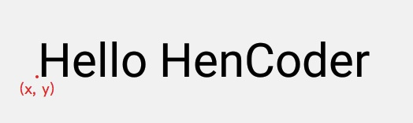
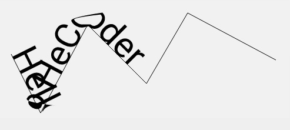
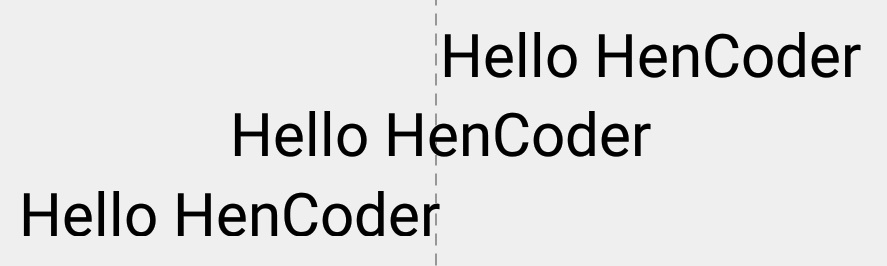
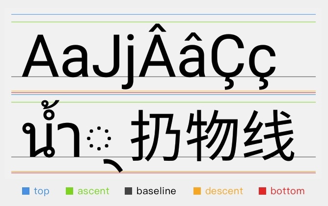

# 文字的绘制

<!-- TOC -->

- [文字的绘制](#文字的绘制)
    - [绘制文字的方式](#绘制文字的方式)
        - [文字的坐标位置](#文字的坐标位置)
        - [Canvas.drawText()](#canvasdrawtext)
        - [drawTextOnPath()](#drawtextonpath)
        - [StaticLayout](#staticlayout)
    - [Paint 对文字绘制的辅助](#paint-对文字绘制的辅助)
        - [显示效果类](#显示效果类)
            - [文字大小 TextSize](#文字大小-textsize)
            - [字体 Typeface](#字体-typeface)
            - [伪粗体开关 FakeBoldText](#伪粗体开关-fakeboldtext)
            - [删除线开关 StrikeThruText](#删除线开关-strikethrutext)
            - [下划线开关 UnderlineText](#下划线开关-underlinetext)
            - [文字横向错切 TextSkewX](#文字横向错切-textskewx)
            - [文字横向放缩 TextScaleX](#文字横向放缩-textscalex)
            - [字符间距 LetterSpacing](#字符间距-letterspacing)
            - [文字对齐方式 TextAlign](#文字对齐方式-textalign)
            - [文字语言 TextLocale](#文字语言-textlocale)
        - [测量文字尺寸类](#测量文字尺寸类)
            - [获取推荐的行距 getFontSpacing](#获取推荐的行距-getfontspacing)
            - [获取文字的参考线 getFontMetrics](#获取文字的参考线-getfontmetrics)
            - [获取文字的显示范围 getTextBounds](#获取文字的显示范围-gettextbounds)
            - [测量文字占用的宽度 measureText](#测量文字占用的宽度-measuretext)
            - [获取字符串中每个字符的宽度 getTextWidths](#获取字符串中每个字符的宽度-gettextwidths)
            - [文字的截断并测量 breakText](#文字的截断并测量-breaktext)
            - [字符串是否是一个字形 hasGlyph](#字符串是否是一个字形-hasglyph)
    - [技巧](#技巧)
        - [多个字符串精准地居中](#多个字符串精准地居中)
- [参考资料](#参考资料)

<!-- /TOC -->

## 绘制文字的方式

### 文字的坐标位置

文字的坐标并不在文字的左上角，而是一个与左下角比较接近的位置。



x 指的是字符左边所预留空隙的位置（绝大多数的字符，它们的宽度都是要略微大于实际显示的宽度的，用于字符之间的间隔）。

y 指的是文字的 **基线（ baseline ）** 的位置。

### Canvas.drawText()

Canvas.drawText(String text, float x, float y, Paint paint)

注：
- 不能在 View 的边缘自动换房，文字继续向后绘制到看不见的地方。
- 不能在换行符 \n 处换行
- 你必须自行把文字切断后分多次使用 drawText() 来绘制，或者使用 StaticLayout。

### drawTextOnPath()

drawTextOnPath(String text, Path path, float hOffset, float vOffset, Paint paint)

- hOffset - 相对于 Path 的水平偏移量。
- vOffset - 相对于 Path 的竖直偏移量。

沿着一条 Path 来绘制文字。



### StaticLayout

StaticLayout(CharSequence source, TextPaint paint, int width, Layout.Alignment align, float spacingmult, float spacingadd, boolean includepad)

- width - 文字区域的宽度，文字到达这个宽度后就会自动换行。
- align - 是文字的对齐方向。
- spacingmult - 行间距的倍数，通常情况下填 1 就好。
- spacingadd - 行间距的额外增加值，通常情况下填 0 就好。
- includeadd - 是否在文字上下添加额外的空间，来避免某些过高的字符的绘制出现越界。

## Paint 对文字绘制的辅助

### 显示效果类

#### 文字大小 TextSize

Paint.setTextSize(float textSize)

#### 字体 Typeface

Paint.setTypeface(Typeface typeface)

```java

paint.setTypeface(Typeface.DEFAULT);  
canvas.drawText(text, 100, 150, paint);  
paint.setTypeface(Typeface.SERIF);  
canvas.drawText(text, 100, 300, paint);  
// 应用导入的字体
paint.setTypeface(Typeface.createFromAsset(getContext().getAssets(), "Satisfy-Regular.ttf"));  
canvas.drawText(text, 100, 450, paint);  
```


#### 伪粗体开关 FakeBoldText

Paint.setFakeBoldText(boolean fakeBoldText)

之所以叫伪粗体（ fake bold ），因为它并不是通过选用更高 weight 的字体让文字变粗，而是通过程序在运行时把文字给「描粗」了。

#### 删除线开关 StrikeThruText

Paint.setStrikeThruText(boolean strikeThruText)

是否加删除线。

#### 下划线开关 UnderlineText

Paint.setUnderlineText(boolean underlineText)

是否加下划线。

#### 文字横向错切 TextSkewX

Paint.setTextSkewX(float skewX)

设置文字横向错切角度（倾斜度）。

#### 文字横向放缩 TextScaleX

Paint.setTextScaleX(float scaleX)

设置文字横向放缩（文字变胖变瘦）。

#### 字符间距 LetterSpacing

Paint.setLetterSpacing(float letterSpacing)

设置字符间距。默认值是 0。

#### 文字对齐方式 TextAlign

Paint.setTextAlign(Align align)

设置文字的对齐方式。一共有三个值：LEFT CETNER 和 RIGHT。默认值为 LEFT。

```java
paint.setTextAlign(Paint.Align.LEFT);  
canvas.drawText(text, 500, 150, paint);  
paint.setTextAlign(Paint.Align.CENTER);  
canvas.drawText(text, 500, 150 + textHeight, paint);  
paint.setTextAlign(Paint.Align.RIGHT);  
canvas.drawText(text, 500, 150 + textHeight * 2, paint);
```  

虚线为文字的 x 轴坐标。



#### 文字语言 TextLocale

Paint.setTextLocale(Locale locale)/Paint.setTextLocales(LocaleList locales)

Canvas 绘制的时候，默认使用的是系统设置里的 Locale。而通过 Paint.setTextLocale(Locale locale) 就可以在不改变系统设置的情况下，直接修改绘制时的 Locale。

### 测量文字尺寸类

#### 获取推荐的行距 getFontSpacing

float Paint.getFontSpacing()

即推荐的两行文字的 baseline 的距离。这个值是系统根据文字的字体和字号自动计算的。

```java
canvas.drawText(texts[0], 100, 150, paint);  
canvas.drawText(texts[1], 100, 150 + paint.getFontSpacing, paint);  
canvas.drawText(texts[2], 100, 150 + paint.getFontSpacing * 2, paint);  
```

#### 获取文字的参考线 getFontMetrics

FontMetrics Paint.getFontMetrics()

FontMetrics 是个相对专业的工具类，它根据 Paint 中的当前字体和字号，得到的几个文字排印方面的推荐值：ascent, descent, top, bottom, leading。



- baseline：文字显示的基准线。
- ascent / descent：限制普通字符的顶部和底部范围。
- top / bottom：限制所有 [字形 ](https://zh.wikipedia.org/wiki/%E5%AD%97%E5%BD%A2) 的顶部和底部范围。 
- leading：leading 指的是行的额外间距，即对于上下相邻的两行，上行的 bottom 线和下行的 top 线的距离。

FontMetrics 提供的就是 Paint 根据当前字体和字号，得出的这些值的推荐值。它把这些值以变量的形式存储，供开发者需要时使用。

#### 获取文字的显示范围 getTextBounds

Paint.getTextBounds(String text, int start, int end, Rect bounds)

- text - 文字串。
- start / end - 选择文字串的起始和结束位置。
- bounds - 用于存放测量数据。

获取的是文字绘制后 **显示** 的范围。

#### 测量文字占用的宽度 measureText

float Paint.measureText(String text)  

它测量的是字符串绘制后 **占用** 的宽度。

#### 获取字符串中每个字符的宽度 getTextWidths

Paint.getTextWidths(String text, float[] widths)

获取字符串中每个字符的宽度，并把结果填入参数 widths。相当于 measureText() 的一个快捷方法。

#### 文字的截断并测量 breakText

int Paint.breakText(String text, boolean measureForwards, float maxWidth, float[] measuredWidth)

- 返回值 - 截取的字符个数。
- measureForwards - 文字的测量方向，ture 为从左往右测量。
- maxWidth - 所允许的字符串宽度上限。
- measuredWidth - 截取的文字宽度赋值给 measuredWidth。

这个方法可以用于多行文字的折行计算。

#### 字符串是否是一个字形 hasGlyph

Paint.hasGlyph(String string)

检查指定的字符串中是否是一个单独的字形。

## 技巧

### 多个字符串精准地居中

```java
int top = 200;
int bottom = 400;
String text1 = "Â";
String text2 = "A";

paint2.getTextBounds(text1, 0, text1.length(), textBounds);
yOffsets[0] = - (textBounds.top + textBounds.bottom) / 2;

paint2.getTextBounds(text2, 0, text2.length(), textBounds);
yOffsets[1] = - (textBounds.top + textBounds.bottom) / 2;

canvas.drawText(text1, 100, middle+yOffsets[0], paint2);
canvas.drawText(text2, 200, middle+yOffsets[1], paint2);
```


# 参考资料

- [drawText() 文字的绘制 - HenCoder](https://hencoder.com/ui-1-3/)