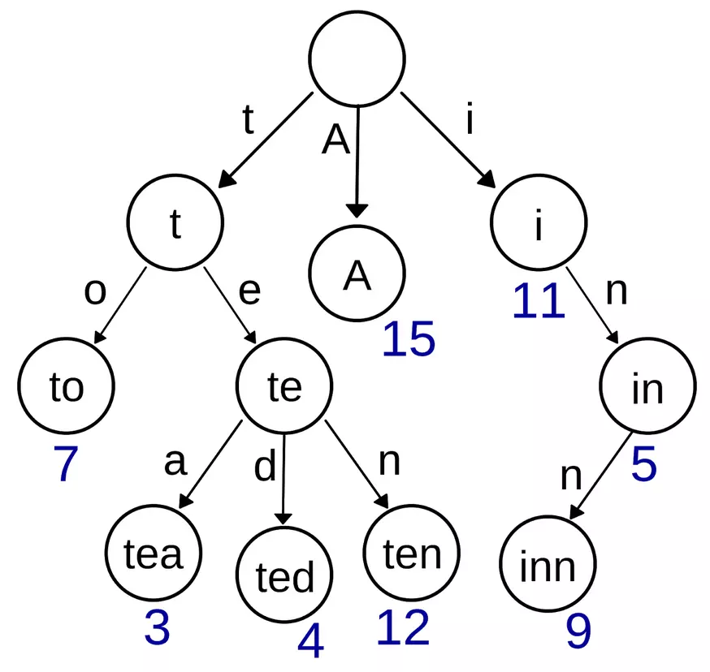

# 一、如何学算法

[六千字干货文：到底要怎么去学算法？](https://mp.weixin.qq.com/s/7cpixzxE2DLaEn7F615AqQ)

# 一、常用数据结构

- 数组、字符串
- 链表
- 栈
- 队列
- 双端队列
- 树

在解决算法问题时，应当根据数据结构的优缺点去选择合适的数据结构。一个数据结构的考量需要考虑到它的构建、获取、插入三方面的空间复杂度以及时间复杂度。

## 1.1 数组

优点：

1. 构建和使用简单。
2. 能在 O(1) 的时间里根据数组的下标（index）查询某个元素。  

缺点：

1. 必须分配一段连续的空间。
2. 查询某个元素是否存在时需要遍历整个数组，耗费 O(n) 的时间。
3. 删除和添加某个元素时，同样需要耗费 O(n) 的时间。

复习题：

[242. 有效的字母异位词](https://leetcode-cn.com/problems/valid-anagram/submissions/)

## 1.2 链表

链表是一种兼具递归和迭代性质的数据结构，递归性质是指对 **一段链表** 进行操作和对 **一段子链表** 进行操作，本质上是一致的。

单链表：链表中的每个元素实际上是一个单独的对象，而所有对象都通过每个元素中的引用字段链接在一起。

双链表：与单链表不同的是，双链表的每个结点中都含有两个引用字段，分别引用前后两个对象。

优点：

1. 灵活的分配内存空间。
2. 能在 O(1) 时间内删除或者添加元素。

缺点：

1. 不能像数组那样通过下标快速查询元素，只能遍历，因此查询元素需要 O(n) 时间。

解题技巧：

1. 利用布局变量指针 prev、curr、next。
2. 构建一个虚假的链表头（用于返回一个新链表）。

复习题：

[25. K 个一组翻转链表](https://leetcode-cn.com/problems/reverse-nodes-in-k-group/)

## 1.3 栈

栈的特点是：后进先出。对于栈中的数据来说，所有操作都是在栈的顶部完成的，只可以查看栈顶部的元素，只能够向栈的顶部压⼊数据，也只能从栈的顶部弹出数据。

栈推荐使用链表结构实现，它的思想是只关心上一次的操作，处理完上一次的操作后，能在 O(1) 的时候内查找到更前一次的操作。

复习题：

[20. 有效的括号](https://leetcode-cn.com/problems/valid-parentheses/)
[739. 每日温度](https://leetcode-cn.com/problems/daily-temperatures/submissions/)

## 1.4 队列

队列的特点是：先进先出。对于队列的数据来说，我们只允许在队尾查看和添加数据，在队头查看和删除数据。

队列推荐使用双端链表结构实现，这样的实现方式也叫双端队列，队列的头尾两端都能在 O(1) 的时间内进行查找、添加和删除。

复习题：

[239. 滑动窗口最大值](https://leetcode-cn.com/problems/sliding-window-maximum/)

## 1.5 树

树的结构十分直观，而树的很多概念定义都有一个相同的特点：递归，也就是说，一棵树要满足某种性质，往往要求每个节点都必须满足。一般通过树来考察 **递归算法**(https://mp.weixin.qq.com/s/rfORF6cT_e-2yKYoYQqpVA) 的掌握程度。

常见的树的形状有：

- 普通二叉树：除了叶子节点外，每个节点只有两个分支，左子树和右子树，每个节点的最大度数为2.
- 平衡二叉树：树的左右子树的高度差不超过1的数，空树也是平衡二叉树的一种。
- 完全二叉树：只有最下面的两层结点度小于2，并且最下面一层的结点都集中在该层最左边的若干位置的二叉树。
- 红黑树：自平衡二叉查找树。

除非特定领域需求，一般情况下不需要对树进行深入研究。

主要了解树的遍历即可：前序遍历（根左右）、中序遍历（左根右）、后序遍历（左右根）。

复习题：

[230. 二叉搜索树中第K小的元素](https://leetcode-cn.com/problems/kth-smallest-element-in-a-bst/)

# 二、高级数据结构

## 2.1 优先队列

优先队列的特点：保证每次取出的元素是队列中优先级最高（优先级可自定义）的。因此主要使用场景为：从无序的数据中按照一定顺序（或优先级）筛选数据。

它的实现本质是二叉堆（数组实现完全二叉树）的结构。特性如下：

1. 数组里的第一个元素 array[0] 拥有最高的优先级。
2. 给定一个下标 i，那么对于元素 array[i] 而言：

- **父节点** 对应的元素下标为 (i-1)/2；
- **左侧子节点** 对应的元素下标为 2*i+1；
- **右侧父节点** 对应的元素下标为 2*i+2；

3. 数组中每个元素的优先级都必须高于它的两侧节点。

复习题：

[347. 前 K 个高频元素](https://leetcode-cn.com/problems/top-k-frequent-elements/)

## 2.2 前缀树

前缀树被广泛地运用在字典查找当中，也被称为字典树。

前缀树的特性：

1. 每个节点至少包含两个基本属性。

- children：数组或者集合，罗列出每个分支当中包含的所有字符；
- isEnd：布尔值，表示该节点是否为某字符串的结尾。

2. 前缀树的根节点是空的。即只利用到这个节点的 children 属性。

3. 除了根节点，其他所有节点都有可能是单词的结尾，叶子节点一定都是单词的结尾。

举例：假如有一个字典，字典里面有如下词："A"，"to"，"tea"，"ted"，"ten"，"i"，"in"，"inn"，每个单词还能有自己的一些权重值，那么用前缀树来构建这个字典将会是如下的样子：

 </div>

前缀树每个节点至少包含两个基本属性：

- children：数组或者集合，罗列出每个分支当中包含的所有字符
- isEnd：布尔值，表示该节点是否为某字符串的结尾

前缀树的实现：

# 三、递归和回溯

## 3.1 递归

递归的基本性质就是函数调用，在处理问题的时候，递归往往是把一个大规模的问题不断地变小然后进行推导的过程。

递归写法结构总结：

```java
function fn(n) {
    // 第一步：判断输入或状态是否非法，如果非法就立即返回，也称为完整性检查。
    if (input/state is invalid) {
        return;
    }

    // 第二步：判断是否满足结束递归的条件。
    if (match condition) {
        return some value;
    }

    // 第三步：将问题的规模缩小，递归调用。
    result1 = fn(n1)
    result2 = fn(n2)
    ...

    // 第四步: 整合结果。
    return combine(result1, result2)
}
```

## 3.2 回溯

回溯实际上是一种试探算法，这种算法跟暴力搜索最大的不同在于，在回溯算法里，是一步一步地小心翼翼地进行向前试探，会对每一步探测到的情况进行评估，如果当前的情况已经无法满足要求，那么就没有必要继续进行下去，也就是说，它可以帮助我们避免走很多的弯路。

```java
function fn(n) {

    // 第一步：判断输入或者状态是否非法？
    if (input/state is invalid) {
        return;
  }

    // 第二步：判读递归是否应当结束?
    if (match condition) {
        return some value;
  }

    // 遍历所有可能出现的情况
    for (all possible cases) {
  
        // 第三步: 尝试下一步的可能性
        solution.push(case)
        // 递归
        result = fn(m)

        // 第四步：回溯到上一步
        solution.pop(case)
    
    }
    
}
```

回溯：

组合总和：考虑减少 target 的数量。 https://leetcode-cn.com/problems/combination-sum/submissions/

加入一个 boolean[] 标识哪个下标已在列表中。https://leetcode-cn.com/problems/permutations-ii/

# 参考资料

- [300分钟搞定数据结构与算法](https://kaiwu.lagou.com/course/courseInfo.htm?courseId=3#/)