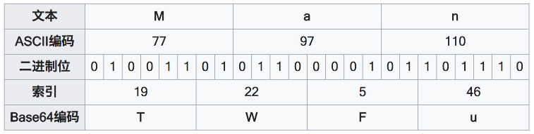

<!-- TOC -->

- [一、Base64](#%E4%B8%80base64)
  - [1.1 二进制数据](#11-%E4%BA%8C%E8%BF%9B%E5%88%B6%E6%95%B0%E6%8D%AE)
  - [1.2 用途](#12-%E7%94%A8%E9%80%94)
  - [1.3 类型](#13-%E7%B1%BB%E5%9E%8B)
  - [1.4 Base64 更高效吗](#14-base64-%E6%9B%B4%E9%AB%98%E6%95%88%E5%90%97)
  - [1.5 Base64 更安全吗](#15-base64-%E6%9B%B4%E5%AE%89%E5%85%A8%E5%90%97)
  - [1.6 Bsae58](#16-bsae58)
- [二、 序列化](#%E4%BA%8C-%E5%BA%8F%E5%88%97%E5%8C%96)
- [三、 Hash](#%E4%B8%89-hash)
  - [3.1 定义](#31-%E5%AE%9A%E4%B9%89)
  - [3.2 Hash 经典算法](#32-hash-%E7%BB%8F%E5%85%B8%E7%AE%97%E6%B3%95)
  - [3.3 用途](#33-%E7%94%A8%E9%80%94)
    - [3.3.1 提供容器支持（快速查找）](#331-%E6%8F%90%E4%BE%9B%E5%AE%B9%E5%99%A8%E6%94%AF%E6%8C%81%E5%BF%AB%E9%80%9F%E6%9F%A5%E6%89%BE)
    - [3.3.2 数据完整性验证](#332-%E6%95%B0%E6%8D%AE%E5%AE%8C%E6%95%B4%E6%80%A7%E9%AA%8C%E8%AF%81)
    - [3.3.3 隐私保护](#333-%E9%9A%90%E7%A7%81%E4%BF%9D%E6%8A%A4)
  - [3.4 MD5 是加密吗？](#34-md5-%E6%98%AF%E5%8A%A0%E5%AF%86%E5%90%97)
- [参考资料](#%E5%8F%82%E8%80%83%E8%B5%84%E6%96%99)

<!-- /TOC -->

# 一、Base64

将二进制数据转换成由 64 个字符（大小写字母+数字+'+'+'/'）组成的字符串的编码算法。

  
 

## 1.1 二进制数据

对于计算机而言（广义来说），所有数据皆是二进制数据，所有文件皆是二进制文件。而一般而言（狭义而言），二进制数据即为非文本的数据。例如后缀为 txt 的文件为文本文件。

## 1.2 用途

即将二进制数据转换为字符串数据，让原数据具有字符串的特性。例如放在 URL 中传输，写入文本文件等等。

## 1.3 类型

- DEFAULT：默认方式，当字符串过长(一般超过76)会在中间加一个换行符，字符串最后也会增加一个换行符
- NO_PADDING：转码时会对字符串长度余4的=部位，该类型就是省略加密字符串最后的=
- NO_WRAP：去掉所有的换行符，Android 通常建议使用该方式。
- CRLF：使用CR LF这一对作为一行的结尾而不是Lnuix风格的LF。
- URL_SAFE：转码时会生成+/=特殊字符，该类型就是不生成URL和文件名有特殊意识的字符来作为加密字符，具体以-_取代+/

## 1.4 Base64 更高效吗

  
 

从上图中，我们可以看到 Base64 算法将 3 个字节编码成了 4 个字节，并没有效率上的提升。

## 1.5 Base64 更安全吗

Base64 不是加密，也不安全，Base64 只是一种编码算法，它的编码以及解码的算法都是公开的，它的作用仅仅是对不同形式的数据进行转换。

## 1.6 Bsae58

Bsae64 的变种，去掉了难以区分的字符，方便于人工抄写。以及‘+’和‘/’方便双击选取。

# 二、 序列化

将数据对象（JVM 中的对象）转化成字节序列的过程。对象在内存中的存储形式一般都是散乱的，通过序列化可以将内存中的对象转化成一个字节序列，变成 byte[] 等形式进行本地储存或网络传输，在需要的时候进行反序列化使用。

# 三、 Hash

## 3.1 定义

把任意数据转换成指定范围大小的数据，将得到的值作为该数据的摘要或标识。
Hash 算法的设计应尽量减少不同数据之间的 Hash 碰撞。

## 3.2 Hash 经典算法

MD5、SHA1、SHA256 等。

## 3.3 用途

### 3.3.1 提供容器支持（快速查找）

重写 equals() 方法时，用于判断两对象是否相等的变量，都需要加入 hashCode() 进行计算，否则以 hash 作为基础的容器会失效。
从设计理念角度出发，相等的两个对象的 hashCode() 应当相等，反之不然。

### 3.3.2 数据完整性验证

从网络上下载文件后，通过对比网络文件和本地下载后的文件的 Hash 值是否一致，可以确认下载的文件是否损坏。

### 3.3.3 隐私保护

服务器数据库可不存储用户的实际密码，只存储用户的真实密码的 Hash 值。通过对比用户输入密码的 Hash 值和数据库存储的 Hash 值作比较作为登录依据，在数据库泄漏时，保障用户重要数据的安全。

## 3.4 MD5 是加密吗？

加密应当伴随着解密的过程，而 MD5（hash）是不可逆的，因此不是加密。

# 参考资料

- [MD5 到底是不是加密？ - HenCoder](https://mp.weixin.qq.com/s?__biz=MzIwNTczNTY0NA==&mid=2247483860&idx=1&sn=b901a8639b09043c690e5cdbc22eb264&chksm=972d1267a05a9b719dc61f3163b87c547cdc1114086287b75dc6b665ac40817fdbfd2da10ed2&mpshare=1&scene=23&srcid=0813zSOaH1bNwwVAhcq7iSkz#rd)