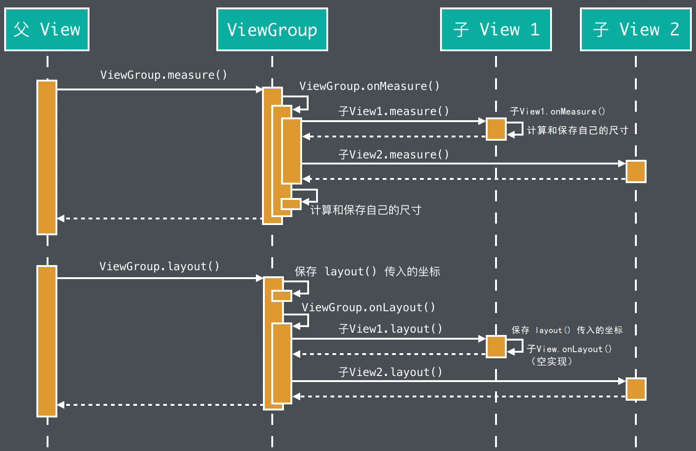

# 自定义 View 流程
<!-- TOC -->

- [自定义 View 流程](#自定义-view-流程)
    - [布局流程](#布局流程)
        - [布局基础](#布局基础)
            - [MeasureSpec](#measurespec)
            - [resolveSize()](#resolvesize)
        - [重写 onMeasure() 来修改已有的 View 的尺寸](#重写-onmeasure-来修改已有的-view-的尺寸)
        - [重写 onMeasure() 来全新计算自定义 View 的尺寸](#重写-onmeasure-来全新计算自定义-view-的尺寸)
        - [重写 onMeasure() 和 onLayout() 来全新计算自定义 ViewGroup 的内部布局](#重写-onmeasure-和-onlayout-来全新计算自定义-viewgroup-的内部布局)
    - [绘制流程](#绘制流程)
- [参考资料](#参考资料)

<!-- /TOC -->


## 布局流程



布局过程的自定义一般情况下分为 3 类：
- 重写 onMeasure() 来修改已有的 View 的尺寸。
- 重写 onMeasure() 来全新计算自定义 View 的尺寸。
- 重写 onMeasure() 和 onLayout() 来全新计算自定义 ViewGroup 的内部布局。

### 布局基础

#### MeasureSpec

MeasureSpec 用于决定 View 和 ViewGroup 之间的尺寸规则，因此我们先看一下 MeasureSpec 的常用方法及其原理。

结论：前 2 位标识 mode，后 24 位标识具体的 size，中间 6 位标识数据的 state（是否被父 View 限制等）

```java
public static class MeasureSpec {
    private static final int MODE_SHIFT = 30;
    // 32 位二进制数值为 11000000000000000000000000000000
    private static final int MODE_MASK  = 0x3 << MODE_SHIFT;

    // 不限制，32 位二进制数值为 00000000000000000000000000000000
    public static final int UNSPECIFIED = 0 << MODE_SHIFT;
    // 限制固定值，32 位二进制数值为 01000000000000000000000000000000
    public static final int EXACTLY     = 1 << MODE_SHIFT;
    // 限制上限， 32 位二进制数值为 10000000000000000000000000000000
    public static final int AT_MOST     = 2 << MODE_SHIFT;

    // 将 size 和 mode 打包成一个 32 位的 int 值，这样做可以就是为了减少内存的使用。
    public static int makeMeasureSpec(int size, @MeasureSpecMode int mode) {
        // 使用旧的方式进行测量（targetSdkVersion<=17 时直接相加） 
        if (sUseBrokenMakeMeasureSpec) {
            return size + mode;
        } else {
            // 按位与 ，取 2 位为 mode 后 30 位为 size。
            return (size & ~MODE_MASK) | (mode & MODE_MASK);
        }
    }

    public static int getMode(int measureSpec) {
        // 提取前 2 位的数值。
        return (measureSpec & MODE_MASK);
    }

    public static int getSize(int measureSpec) {
        // 提取后 30 位的数值。即获取大小和状态。
        // ~MODE_MASK 为对 MODE_MASK 按位取反。
        return (measureSpec & ~MODE_MASK);
    }
}
```

#### resolveSize()

- UNSPECIFIED：不限制
- EXACTLY：限制固定值
- AT_MOST：限制上限

```java

public static final int MEASURED_SIZE_MASK = 0x00ffffff;

public static final int MEASURED_STATE_TOO_SMALL = 0x01000000;

public static int resolveSize(int size, int measureSpec) {
    // MEASURED_SIZE_MASK 用于获取 View 的实际大小。
    return resolveSizeAndState(size, measureSpec, 0) &  ;
}

public static int resolveSizeAndState(int size, int measureSpec, int childMeasuredState) {
    // size 为想要的大小，measureSpec 为父 View 的限制。
    final int specMode = MeasureSpec.getMode(measureSpec);
    final int specSize = MeasureSpec.getSize(measureSpec);
    final int result;
    switch (specMode) {
        // 限制了上限
        case MeasureSpec.AT_MOST:
            // 超过了限制的大小,返回 specSize。
            if (specSize < size) {
                // MEASURED_STATE_TOO_SMALL 用于标识着测量的尺寸比视图所希望的尺寸小。
                result = specSize | MEASURED_STATE_TOO_SMALL;
            } else {
                // 没超过限制值，返回 size。
                result = size;
            }
            break;
        // 限制了固定值，直接返回限制的大小 specSize。
        case MeasureSpec.EXACTLY:
            result = specSize;
            break;
        // 不限制，直接返回 size。
        case MeasureSpec.UNSPECIFIED:
        default:
            result = size;
    }
    // 对 childMeasuredState 过滤掉 尺寸大小，并标识某个具体的 state。
    return result | (childMeasuredState & MEASURED_STATE_MASK);
}
```

### 重写 onMeasure() 来修改已有的 View 的尺寸

1. 重写 onMeasure() 方法，并在里面调用 super.onMeasure()，触发原有的自我测量；
2. 在 super.onMeasure() 的下面用 getMeasuredWidth() 和 getMeasuredHeight() 来获取到之前的测量结果，并使用自己的算法，根据测量结果计算出新的结果；
3. 调用 setMeasuredDimension() 来保存新的结果（子 View 的期望尺寸）。

### 重写 onMeasure() 来全新计算自定义 View 的尺寸

1. 重写 onMeasure()，并计算出 View 的尺寸；
2. 使用 resolveSize() 来让子 View 的计算结果符合父 View 的限制（onMeasure() 方法的两个参数），如果想用自己的方式来满足父 View 的限制也行。
3. 调用 setMeasuredDimension() 来保存新的结果。

子 View 也可以不遵守父 View 的限制，按自己方式进行绘制，但可能出现 BUG，例如开发者在 xml 布局文件中将父 View 的宽度为固定 100 dp，而子 View 的绘制宽度却为 120，会超出开发者的预期效果，会绘制出宽度为 120dp 的子 View。

父 View 对子 View 限制的数据来源：开发者对子 View 的要求（例如 xml 文件中子 View 中 layout 打头的方法）再根据父 View 自身可用宽高度的计算所得到的。

### 重写 onMeasure() 和 onLayout() 来全新计算自定义 ViewGroup 的内部布局

开发者的要求：xml 文件中子 View layout 打头的 API。

大多数情况下重写 onMeasure() 的三个步骤（或者说是思路）：
1. 调用每个子 View 的 measure() 来计算子 View 的尺寸;
2. 计算子 View 的位置并保存子 View 的位置和尺寸;
3. 计算自己的尺寸并用 setMeasuredDimension() 保存。

大多数情况下重写 onLayout() 的步骤：

- 在 onLayout() 里调用每个子 View 的 layout() ，让它们保存自己的位置和尺寸。

```java
public class DemoLayout extends ViewGroup {

    int selfwidthMode;
    // 自身总可用宽度
    int selfWidthSize;
    // 已使用的宽度
    int usedWidth;

    @Override
    protected void onMeasure(int widthMeasureSpec, int heightMeasureSpec) {
        // widthMeasureSpec 和 heightMeasureSpec 为 DemoLayout 的父 View 所给予的可用宽度和可用高度（也就是可用空间）

        selfwidthMode = MeasureSpec.getMode(widthMeasureSpec);
        selfWidthSize = MeasureSpec.getSize(widthMeasureSpec);

        for (int i = 0; i < getChildCount(); i++) {
            View chindView = getChildAt(i);
            LayoutParams lp = (LayoutParams) chindView.getLayoutParams();

            // 获取当前子 view 的 WidthSpec
            int childWidthSpec = 0;
            int heightWidthSpec = 0;

            // 根据开发者的要求和 ViewGroup 的可用空间去决定子 View 的大小。

            switch (lp.width) {
                case LayoutParams.WRAP_CONTENT:
                    // 尺寸上限为 MeasureSpec 中的 size，也就是 oddWidth
                    if (selfwidthMode == MeasureSpec.EXACTLY || selfwidthMode == MeasureSpec.AT_MOST) {
                        childWidthSpec = MeasureSpec.makeMeasureSpec(selfWidthSize - usedWidth, MeasureSpec.AT_MOST);
                    } else if (selfwidthMode == MeasureSpec.UNSPECIFIED) {
                        childWidthSpec = MeasureSpec.makeMeasureSpec(0, MeasureSpec.UNSPECIFIED);
                    }
                    break;
                case LayoutParams.MATCH_PARENT:
                    if (selfwidthMode == MeasureSpec.EXACTLY || selfwidthMode == MeasureSpec.AT_MOST) {
                        childWidthSpec = MeasureSpec.makeMeasureSpec(selfWidthSize - usedWidth, MeasureSpec.EXACTLY);
                    } else if (selfwidthMode == MeasureSpec.UNSPECIFIED) {
                        childWidthSpec = MeasureSpec.makeMeasureSpec(0, MeasureSpec.UNSPECIFIED);
                    }
                    break;
                default:
                    // 默认情况即设置了具体的像素，开发者的要求在地位上绝对高于可用空间。
                    childWidthSpec = MeasureSpec.makeMeasureSpec(lp.width, MeasureSpec.EXACTLY);
                    break;
            }
            chindView.measure(childWidthSpec,heightWidthSpec);
            // 上面这些思路可用 measureChildWithMargins(chindView, widthMeasureSpec, usedWidth, heightMeasureSpec, usedHeight) 代替，
            // 因为该方法对 padding、margin 进行了处理，注意的是需要使用 ViewGroup.MarginLayoutParams。

            // 调用上面这行代码后，可通过 chindView.getMeasuredHeight() 和 chindView.getMeasuredWidth() 去决定子 View 的实际尺寸和位置，
            // 并根据实际需求对子 View 的位置进行保存。
            // lp.setCoordinate(left,top,right,bottom);
        }

        // 计算自己的尺寸（包含所有子 View）并用 setMeasuredDimension() 保存
        int totalWidth = 0;
        int totalHeight = 0;
        // ……
        setMeasuredDimension(totalWidth,totalHeight);
    }

    @Override
    public ViewGroup.LayoutParams generateLayoutParams(AttributeSet p) {
        return new DemoLayout.LayoutParams(getContext(),  p);
    }

    @Override
    protected void onLayout(boolean changed, int l, int t, int r, int b) {
        for (int i = 0; i < getChildCount(); i++) {
            View chindView = getChildAt(i);
            // 提取测量的位置并进行自我布局，也可以使用 Rect[] 进行保存。
            DemoLayout.LayoutParams st =
                    (DemoLayout.LayoutParams) chindView.getLayoutParams();
            chindView.layout(st.mLeft, st.mTop, st.mRight, st.mBottom);
        }
    }

    private static class LayoutParams extends ViewGroup.LayoutParams{

        private int mLeft, mTop, mRight, mBottom;

        public LayoutParams(Context c, AttributeSet attrs) {
            super(c, attrs);
        }

        public void setCoordinate(int left,int top,int right,int bottom) {
            this.mLeft = left;
            this.mTop = top;
            this.mRight = right;
            this.mBottom = bottom;
        }
    }
}
```

关于保存子 View 位置的两点说明：

1. 不是所有的 Layout 都需要保存子 View 的位置，因为有的 Layout 可以在布局阶段实时推导出子 View 的位置，例如 LinearLayout。
2. 有时候对某些子 View 需要重复测量多次才能得到正确的尺寸和位置。

## 绘制流程

draw() 方法的调度顺序：


绘制顺序简述：


-   onDrawForeground() 是 API 23 才引入的，会依次绘制滑动边缘渐变、滑动条和前景
-   出于效率的考虑，ViewGroup 默认会绕过 draw() 方法，换而直接执行 dispatchDraw()，以此来简化绘制流程。所以如果你自定义了某个 ViewGroup 的子类（比如 LinearLayout）并且需要在它的除 dispatchDraw() 以外的任何一个绘制方法内绘制内容，你可能会需要调用 View.setWillNotDraw(false) 这行代码来切换到完整的绘制流程（是「可能」而不是「必须」的原因是，有些 ViewGroup 是已经调用过 setWillNotDraw(false) 了的，例如 ScrollView）。
-   如果绘制代码既可以写在 onDraw() 里，也可以写在其他绘制方法里，那么优先写在 onDraw() ，因为 Android 有相关的优化，可以在不需要重绘的时候自动跳过 onDraw() 的重复执行，以提升开发效率。


# 参考资料

- [绘制顺序 - HenCoder](https://hencoder.com/ui-1-5/)
- [布局基础 - HenCoder](https://hencoder.com/ui-2-1/)
- [全新定义 View 的尺寸 - HenCoder](https://hencoder.com/ui-2-2/)
- [定制 Layout 的内部布局 - HenCoder](https://hencoder.com/ui-2-3/)
