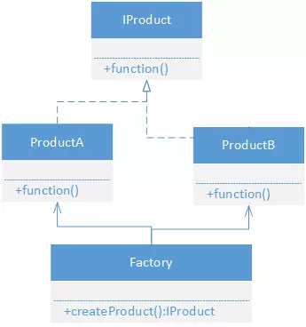

<!-- TOC -->

- [一、设计模式简述](#一设计模式简述)
    - [1.1 定义](#11-定义)
    - [1.2 作用](#12-作用)
    - [1.3 六大原则](#13-六大原则)
        - [1.3.1 单一职责原则](#131-单一职责原则)
        - [1.3.2 里氏替换原则](#132-里氏替换原则)
        - [1.3.3 依赖倒置原则](#133-依赖倒置原则)
        - [1.3.4 接口隔离原则](#134-接口隔离原则)
        - [1.3.5 最少知道原则](#135-最少知道原则)
        - [1.3.6 开放封闭原则](#136-开放封闭原则)
- [二、24 种设计模式](#二24-种设计模式)
    - [2.1 使用场景小结](#21-使用场景小结)
    - [2.2 创造型](#22-创造型)
        - [2.2.1 单例模式](#221-单例模式)
        - [2.2.2 简单工厂模式](#222-简单工厂模式)
        - [2.2.3 工厂方法模式](#223-工厂方法模式)
        - [2.2.4 抽象工厂模式](#224-抽象工厂模式)
        - [2.2.5 建造者模式](#225-建造者模式)
            - [2.2.5.1 传统的建造者模式](#2251-传统的建造者模式)
            - [2.2.5.2 笔者常用的建造者模式](#2252-笔者常用的建造者模式)
        - [2.2.6 原型模式](#226-原型模式)
    - [2.3 结构型](#23-结构型)
        - [2.3.1 代理模式](#231-代理模式)
            - [2.3.1.1 静态代理](#2311-静态代理)
            - [2.3.1.2 动态代理](#2312-动态代理)
        - [2.3.2 适配器模式](#232-适配器模式)
        - [2.3.3 装饰器模式](#233-装饰器模式)
        - [2.3.4 桥接模式](#234-桥接模式)
        - [2.3.5 组合模式](#235-组合模式)
        - [2.3.6 享元模式](#236-享元模式)
        - [2.3.7 外观模式](#237-外观模式)
    - [2.4 行为型](#24-行为型)
        - [2.4.1 观察者模式](#241-观察者模式)
        - [2.4.2 模板方法模式](#242-模板方法模式)
        - [2.4.3 命令模式](#243-命令模式)
        - [2.4.4 状态模式](#244-状态模式)
        - [2.4.5 责任链模式](#245-责任链模式)
        - [2.4.6 解释器模式](#246-解释器模式)
        - [2.4.7 中介者模式](#247-中介者模式)
        - [2.4.8 访问者模式](#248-访问者模式)
        - [2.4.9 策略模式](#249-策略模式)
        - [2.4.10 备忘录模式](#2410-备忘录模式)
        - [2.4.11 迭代器模式](#2411-迭代器模式)

<!-- /TOC -->

# 一、设计模式简述

## 1.1 定义

软件设计其实和算法是一样的，二者对抗的都是规模问题，只不过，算法对抗的是数据的规模，而软件设计对抗的是需求的规模。

设计模式本质上是前人针对某类特定场景所总结出来的代码设计经验，是软件设计中的一种手段。

## 1.2 作用

改善系统的设计，提高代码的复用率、可维护性、可拓展性、可读性。

通俗的讲，若开始便使用了合适的代码设计，随着需求的累加，可以依旧轻松的去维护和迭代项目代码。

设计模式只是前人对代码经验的单方面总结，不是用来限制我们敲代码的，不能为了用设计模式而写代码，需要根据实际的团队和需求去考量，因为所编写的代码最终都应该是给人来阅读和维护的，然后才是给机器运行。

## 1.3 六大原则

设计模式的设计一般需要遵循以下的原则：

- 单一职责原则；
- 里氏替换原则；
- 依赖倒置原则；
- 接口隔离原则；
- 最少知道原则（迪米特法则）；
- 开放封闭原则。

### 1.3.1 单一职责原则

职责要单一。

例如：一个网络请求包含了请求重试、报文拼接、缓存、I/O 读写等步骤，应当将不同的功能拆成不同的类去实现。若所有功能都写在一个类中，后期便会出现类过于庞大从而难以维护的情况，此外由于功能之间会耦合严重，想进行重构拆分时也难度递增。

该原则不仅仅在设计模式的创建上要遵守，在日常的开发过程中更应该遵守。

单一职责原则本质上主要包括以下几点：

- 小到一个函数，大到一个系统，我们都可以用它来衡量我们的设计。
- 从模块角度：一个模块应该对一类且仅对一类行为者负责。
- 从行为角度：要理解分离关注点，对行为（变化）进行评估，拆分到相应的行为管理者类中。

### 1.3.2 里氏替换原则

子类可以替换掉父类并且可以正常工作，而子类也可以在父类的基础上添加自己新的行为。

同时需要注意的是：继承需要满足 IS-A 的关系，但 IS-A 的关键在于行为上的一致性，而不能单纯凭日常的概念或直觉去理解。

```java
public class Demo {

    public static void main(String[] args) {
        runMethod(new Parent());
        runMethod(new SubClass());
    }

    public static class Parent {

        public void method() {
            System.out.println("parent method");
        }

    }

    public static class SubClass extends Parent {

        public void method() {
            // 按里式替换的原则就是：父类可以完成的地方，用子类替代也决定是没有问题的。
            throw new UnsupportedOperationException();
        }

    }

    public static void runMethod(Parent parent) {
        parent.method();
    }

}
```

里式替换原则在大部分情况是需要遵守的，即子类不能删除父类的实现，但规则是死的，有时可能出于各种原因，需要违背该原则，因此需要做到灵活使用。

### 1.3.3 依赖倒置原则

即“面向接口编程编程，而不是面向实现编程”。由于实现都是易变的，但抽象是稳定的，这样当调用方依赖于抽象时，实现的变化并不会影响到调用方。

依赖导致原则的好处除了可以隐藏实现的变化、易于拓展之外（切换不用实现类），还可以只暴露只想对外提供的 API。因此在设计模式的设计和日常开发中都经常使用到。

### 1.3.4 接口隔离原则

设计接口的时候功能要精简单一。不要让一个接口承担过多的职责，而应把每个职责分离到多个专门的接口中，进行接口分离。

实际开发时往往为了节省时间，可能会将多个功能的方法抽成一个接口，这样不仅会强制实现的人不得不实现本来不该实现的方法，更严重的是会给使用者造成假象，即认为实现类已经实现了所有行为，实际调用方法时却没得到想要的结果。

### 1.3.5 最少知道原则

一个模块或对象应尽量少的与其他类的实体之间有太多接触，使得系统功能模块相对独立，这样当一个模块修改时，影响的模块就会越少（高内聚、低耦合）。该原则的实现细节主要体现在：

1. 一个功能类应当尽可能的少提供 public 的方法以及不提供 public 的变量。两者是相辅相成的，将类的封装性做的很好，那么其它类的实体就无法依赖当中的细节。
2. 此外可以以只提供接口（实现类不对外公开）的方式暴露只想对外提供的 API。

### 1.3.6 开放封闭原则

一个实体（类、函数、模块等）应该对扩展开放，对修改关闭。主要体现在：

1. 需求发生改变时都不需要或不能修改原有的代码，而只需要加入一些新的实现。
2. 如果修改一个稳定的方法，可能对旧代码中引入 BUG 或修改了他原本的行为，因此需要通过添加新的方法增强现有类型的行为。

尽量对其它五大原则进行遵守，并使用合适的设计模式，这样最终设计出来的系统就比较符合开闭原则。

# 二、24 种设计模式

设计模式根据其作用可以分为三类：

- 创建型：对类的实例化进行抽象。
- 结构型：类结构型：使用继承机制组合接口实现，对象结构型：使用组合对象的方式拓展新功能。
- 行为型：在不同的对象之间划分责任和算法的抽象化。类的行为模式：使用继承关系在几个类之间分配行为；对象的行为模式：使用对象聚合的方式分配行为。

24 种设计模式分别为（常用的设计模式进行了加粗）：

- 创建型：**单例模式**、简单工厂模式、**工厂方法模式**、抽象工厂模式、**建造者模式**、**原型模式**。
- 结构型：**代理模式**、**适配器模式**、**装饰器模式**、桥接模式、组合模式、**享元模式**、**外观模式**。  
- 行为型：**观察者模式**、模板方法模式、命令模式、状态模式、**职责链模式**、解释器模式、中介者模式、访问者模式、**策略模式**、备忘录模式、**迭代器模式**。

## 2.1 使用场景小结

（1）创造型

- [单例模式](#221-单例模式)：希望对象在进程中全局单例。
- [简单工厂模式](#222-简单工厂模式)：产品需要拥有统一的产品接口（也可以是一个抽象类，甚至一个普通的父类，但通常来说接口是最稳定的），对调用方来说，可以屏蔽掉具体产品的入参并且不需要关心具体产品的实现，实现了解耦。
- [工厂方法模式](#223-工厂方法模式)：
  1. 核心关注点更在于是哪个工厂生产的，而不是工厂所生成的产品是什么，工厂在切换生产的产品时，对于客户端来说无需改动任何代码，可维护性更好。
  2. 给定限制条件（以方法参数的形式），遍历所有工厂直至得到一个可用的产品。工厂根据限制决定是否能生产出具体的产品，若不能，则返回 null。例如 Retrofit 的 CallAdapter.Factory，或 Gson 的 TypeAdapterFactory。
- [抽象工厂模式](#224-抽象工厂模式)：抽象工厂弥补了工厂方法只能创造一个系列的产品的缺陷，但使用的前提是每一个工厂都需要创建多个系列的产品。
- [建造者模式](#2252-笔者常用的建造者模式)：类的构造函数参数多或复杂，改造为链式调用变得简洁易读且更易维护（不需要大量重载构造方法）。
- [原型模式](#226-原型模式)：通过拷贝已有的原型对象，创建一个新的对象。

（2）结构型 

- [静态代理](#2311-静态代理)：
  1. 通过静态代理对象，在代理对象中执行客户端不需要关心的代码。例如需要对 Application 的生命周期进行代理，为应用架构底层提供支持。
  2. 通过静态代理对象，在代理对象中执行可复用的代码。例如 activity、fragment、dialog 都需要拥有 tip()、showProgress() 等通用方法，且它们的实现是可以复用的。
  3. 添加一个 type，对需要代理的方法按按照模块进行业务代码拆分。例如对 RecyclerView.Adapter 的数据处理针按 itemType 进行业务逻辑拆分。
- [动态代理](#2312-动态代理)：动态代理则更像是一种 AOP 的方式，在调用某个接口类的任意一个方法时，可回调到统一的方法进行处理，例如 [Retrofit](./Retrofit%20源码分析.md#%E4%B8%89retrofitcreate) 的实现。
- [适配器模式](#232-适配器模式)：
  1. 实现某个接口，从而使该类具备该接口的职能，从而满足其他类的方法入参。
  2. 需要将某种类型转换成另一种类型，且该转换需要复用。
- [装饰器模式](#233-装饰器模式)：
  1. 需要拓展第三方 final 类。
  2. 需要装饰的是一个接口、抽象类，并且所装饰的接口、抽象类需要 **动态去组装或叠加不同的功能**。
- [桥接模式](#234-桥接模式)：一个对象有多个维度的变化，可以使用聚合代替继承并将这些维度抽象化，从而可以方便的拓展新的维度以及对某个维度进行切换。
- [组合模式](#235-组合模式)：类与类之间的关系可以组合成树形结构，且需要向客户端提供一致的操作接口。
- [享元模式](#236-享元模式)：若所有对象内的部分变量在某个变量（或标签）确定的情况下值也都是确定的，则可以将这部分抽出来供所有对象重复使用，从而减少内存的使用。
- [外观模式](#237-外观模式)：
  1. 对客户端提供一个统一的对外功能接口（类），用户可以在不用太了解库内部代码的情况下，即可在入口类得知所拥有的大体功能。
  2. 解除客户端与部分内部代码（子系统）的直接联系，客户端只需要与外观接口进行交互。

（3）行为型

- [观察者模式](#241-观察者模式)：数据变化监听（LiveData），数据流传递（RxJava）、订阅系统。
- [模板方法模式](#242-模板方法模式)：父类需要控制代码的执行算法，只提供有必要的方法给子类进行重写拓展。
- [命令模式](#243-命令模式)：需要对任务的请求者与任务的执行者之间加入一系列调度代码，例如线程池的实现、Looper。
- [状态模式](#244-状态模式)：对象存在多种状态，需要运行时动态切换，且在不同的状态下所表现的行为、对象是大体相似的。
- [职责链模式](#245-责任链模式)：一个请求的处理包含的逻辑复杂且不固定，可以按单一职责原则拆分成多个类，按执行的先后顺序连成一条链。责任链中的每一个对象按先后顺序都有机会截断责任链的传递并直接返回处理结果。
- [解释器模式](#246-解释器模式)：针对某一类问题归纳成一种简单的语言或语法，再解析这些语法，例如对 AndroidManifest 文件的解释。
- [中介者模式](#247-中介者模式)：拥有共同基类的的对象互相之间存在复杂的耦合关系（往往是多对多的耦合关系），且不同对象的交互关系中有一定的共性。
- [访问者模式](#248-访问者模式)：将作用于某数据结构中各元素的操作分离出来封装成独立的类，并在新的类中对这些元素附加新的操作，但不改变原数据结构，例如 ASM 中的 classVisitor 对类、方法啊、变量、注解等元素的操作抽成相应的类以及方法。
- [策略模式](#249-策略模式)：
  1. 提供给用户自己决定策略的实现方式，例如图片加载的方式。
  2. 行为在不同的情况有不同的实现方式，需要根据实际情况进行动态切换。
- [备忘录模式](#2410-备忘录模式)：捕获一个对象的内部状态，并在该对象之外保存这个状态以备之后使用。具体的使用场景例如：回到当前的编辑位置的上一次或下一次的位置；Windows 里的撤销功能等。
- [迭代器模式](#2411-迭代器模式)：客户端可以在不需要了解不同容器内部结构的情况下，使用统一的迭代接口，去访问或操作容器中的元素。

## 2.2 创造型

### 2.2.1 单例模式

- 设计原则：无。
- 使用场景：希望对象在进程中全局单例。

这里主要说明 2 种最常用的单例实现方式：

**（1）静态内部类**

需要注意的是该种单例实现方式，不能在类静态实例化的构造方法中去引用一个未进行过类加载的静态变量，否则会抛出 ExceptionInInitializerError。

由于代码随时存在变动，因此若由于任何刚需原因需要在构造函数中引用类变量，则直接使用 **双重校验锁** 作为单例实现方式。

```java
public class Singleton {

    private Singleton() {
    }

    private static class Holder {
        // 由 JVM 中的类加载机制保证单例，只有第一次引用到 Holder 类时才实例化 INSTANCE 类变量。
        private static Singleton INSTANCE = new Singleton();
    }

    public static Singleton getInstance() {
        return Singleton.Holder.INSTANCE;
    }

}
```

**（2）双重校验锁**

```java
public class Singleton {

    private static volatile Singleton sInstance;

    private Singleton() {
    }

    public static Singleton getInstance() {
        if (sInstance == null) {
            // 加 volatile 的作用除了保证变量的可读性外，还禁止 Singleton 变量相关的指令重排序，
            // 因为代码读取到 instance 不为 null 时，instance 引用的对象有可能还没有完成初始化。
            synchronized (Singleton.class) {
                if (sInstance == null) {
                    sInstance = new Singleton();
                    // memory = allocate();　 1：分配对象的内存空间
                    // ctorInstance(memory);　2：初始化对象
                    // instance = memory;　　 3：sInstance 指向刚分配的内存地址
                }
            }
        }
        return sInstance;
    }

}
```

### 2.2.2 简单工厂模式

简单工厂模式又叫静态方法模式（因为工厂类定义了一个静态方法），但不属于 GOF（Gang of Four）23 种设计模式之一。简单工厂模式可以理解为负责生产对象的一个类，称为“工厂类”。

- 设计模式：遵循单一职责、违背开闭原则。
- 使用场景：产品需要拥有统一的产品接口（也可以是一个抽象类，甚至一个普通的父类，但通常来说接口是最稳定的），对调用方来说，可以屏蔽掉具体产品的入参并且不需要关心具体产品的实现，实现了解耦。
- 相关设计模式：
   - 工厂方法模式：这两者的选择主要看工厂是否有进一步抽象化的必要，如果工厂的作用仅仅是用来创建产品，则没必要使用工厂方法模式。

基本实现如下：

<div align="center">  </div><br>

（1）产品接口，定义具体产品的公共接口:

```java
public interface IProduct {

    public void function();
}
```

（2）两个具体的产品：

```java
public class ProductA implements IProduct {

    public void function() {
        System.out.println("产品 A 方法");
    }

}
```

```java
public class ProductB implements IProduct {

    public void function() {
        System.out.println("产品 B 方法");
    }

}
```

（3）工厂类：通过静态方法传入不同参数创建不同具体产品类的实例。

```java
public class Factory {

    private Factory() {
    }

    @Nullable
    public static IProduct createProduct(String productName) {
        switch (productName){
            case "A":
                return new ProductA();
            case "B":
                return new ProductB();
            default:
                // 可能没有该产品。
                return null;
        }
    }

}
```

（4）Client 调用：

```java
public class Client {

    public static void main(String[] args) {
        IProduct product1 = Factory.createProduct("A");
        product1.function();
        
        IProduct product2 = Factory.createProduct("B");
        product2.function();
    }
}
```

### 2.2.3 工厂方法模式

- 设计模式：遵循单一职责、依赖倒置、开闭原则。
- 使用场景：
  1. 核心关注点更在于是哪个工厂生产的，而不是工厂所生成的产品是什么，工厂在切换生产的产品时，对于客户端来说无需改动任何代码，可维护性更好。
  2. 给定限制条件（以方法参数的形式），遍历所有工厂直至得到一个可用的产品。工厂根据限制决定是否能生产出具体的产品，若不能，则返回 null。例如 Retrofit 的 CallAdapter.Factory，或 Gson 的 TypeAdapterFactory。
- 相关设计模式：
    - 抽象工厂模式：工厂方法模式中，工厂创造的是一个产品，而在抽象工厂模式中，工厂创造的是一个产品族。

uml 图如下所示：

<div align="center">  </div><br>

具体的 Demo 示例为第二种使用场景，以 Gson 的 TypeAdapterFactory 的为例。

（1）抽象工厂类（可以是接口也可以是抽象类），定义工厂的生产方法：
 
```java
public interface TypeAdapterFactory {

  // gson、type 方法参数为具体的限制条件，然后具体的工厂自己决定能否产出具体的产品（TypeAdapter）。
  <T> TypeAdapter<T> create(Gson gson, TypeToken<T> type);
}
```

（2）抽象产品类（可以是接口也可以是抽象类），定义产品的公共接口（抽象方法）:

```java
public abstract class TypeAdapter<T> {

  public abstract void write(JsonWriter out, T value) throws IOException;

  public abstract T read(JsonReader in) throws IOException;
  
  public final void toJson(Writer out, T value) throws IOException {
    JsonWriter writer = new JsonWriter(out);
    write(writer, value);
  }
```

（3）创建具体产品类：

```java
public static final TypeAdapter<String> STRING = new TypeAdapter<String>() {
    // 实现了相应的抽象方法
    @Override
    public String read(JsonReader in) throws IOException {
        JsonToken peek = in.peek();
        if (peek == JsonToken.NULL) {
            in.nextNull();
            return null;
        }
        /* coerce booleans to strings for backwards compatibility */
        if (peek == JsonToken.BOOLEAN) {
            return Boolean.toString(in.nextBoolean());
        }
        return in.nextString();
    }

    // 实现了相应的抽象方法
    @Override
    public void write(JsonWriter out, String value) throws IOException {
        out.value(value);
    }
};
```

（4）创建具体工厂类，Gson 有很多工厂，先看一下用于生产 STRING 产品所对应的工厂：

```java
public static final TypeAdapterFactory STRING_FACTORY = newFactory(String.class, STRING);

public static <TT> TypeAdapterFactory newFactory(
        final Class<TT> type, final TypeAdapter<TT> typeAdapter) {
    // 这里由于通用的缘故直接实例化了工厂接口的实现，一般情况下也可以选择继承。
    return new TypeAdapterFactory() {
        @SuppressWarnings("unchecked") // we use a runtime check to make sure the 'T's equal
        @Override
        public <T> TypeAdapter<T> create(Gson gson, TypeToken<T> typeToken) {
            // typeToken 为传入的限制，如果传入的类型不等于 String.class，则直接返回 null（也就是生成的产品为 null）。
            return typeToken.getRawType() == type ? (TypeAdapter<T>) typeAdapter : null;
        }

        @Override
        public String toString() {
            return "Factory[type=" + type.getName() + ",adapter=" + typeAdapter + "]";
        }
    };
}
```

（5）Client 调用：

```java
public <T> TypeAdapter<T> getAdapter(TypeToken<T> type) {
    // 忽略部分代码
    for (TypeAdapterFactory factory : factories) {
        // 给定限制 this、typeToken，遍历所有工厂直至得到一个可用的产品。
        TypeAdapter<T> candidate = factory.create(this, type);
        if (candidate != null) {
            call.setDelegate(candidate);
            typeTokenCache.put(type, candidate);
            return candidate;
        }
    }
    // 若没有一个可用的产品，则直接抛出异常。
    throw new IllegalArgumentException("GSON (" + GsonBuildConfig.VERSION + ") cannot handle " + type);
}
```

### 2.2.4 抽象工厂模式

- 设计原则：遵循单一职责、依赖倒置、开闭原则。
- 常用场景：抽象工厂弥补了工厂方法只能创造一个系列的产品的缺陷，但使用的前提是每一个工厂都需要创建多个系列的产品。

UML 类图直接以实际的应用场景举例，这样能更好的进行理解，场景取自： Java 1.8 中的 List、ArrayList、LinkedList，因此不再贴具体代码。

<div align="center">  </div><br>

### 2.2.5 建造者模式

笔者不是很推崇传统所说的建造者模式，由于限制极大导致使用极少，因此笔者只简述一下传统的建造者模式，再介绍笔者所常用的建造者模式。

#### 2.2.5.1 传统的建造者模式

- 设计原则：遵循单一职责、开闭原则。
- 常用场景：不同产品的构造过程相同且构造过程复杂。

（1）创建动物模型：

```java
public class Animal {

    private String name;

    private String body;

    private String head;

    private String leftHand;

    private String rightHand;

    private String leftLeg;

    private String rightLeg;

    public String getName() {
        return name;
    }

    public void setName(String name) {
        this.name = name;
    }

    public String getBody() {
        return body;
    }

    public void setBody(String body) {
        this.body = body;
    }

    public String getHead() {
        return head;
    }

    public void setHead(String head) {
        this.head = head;
    }

    public String getLeftHand() {
        return leftHand;
    }

    public void setLeftHand(String leftHand) {
        this.leftHand = leftHand;
    }

    public String getRightHand() {
        return rightHand;
    }

    public void setRightHand(String rightHand) {
        this.rightHand = rightHand;
    }

    public String getLeftLeg() {
        return leftLeg;
    }

    public void setLeftLeg(String leftLeg) {
        this.leftLeg = leftLeg;
    }

    public String getRightLeg() {
        return rightLeg;
    }

    public void setRightLeg(String rightLeg) {
        this.rightLeg = rightLeg;
    }

}
```

（2）构建 Animal 对象的规则接口：

```java
public interface AnimalBuilder {

    void buildName();

    void buildBody();

    void buildHead();

    void buildLeftHand();

    void buildRightHand();

    void buildLeftLeg();

    void buildRightLeg();

    Animal build();

}
```

（3）用于创建 Dog 实例的建造者：

```java
public class DogBuilder implements AnimalBuilder {

    private Animal mAnimal = new Animal();

    @Override
    public void buildName() {
        mAnimal.setName("dog");
    }

    @Override
    public void buildBody() {
        mAnimal.setBody("dog body");
    }

    @Override
    public void buildHead() {
        mAnimal.setHead("dog head");
    }

    @Override
    public void buildLeftHand() {
        mAnimal.setLeftHand("dog left hand");
    }

    @Override
    public void buildRightHand() {
        mAnimal.setRightHand("dog right hand");
    }

    @Override
    public void buildLeftLeg() {
        mAnimal.setLeftLeg("dog left leg");
    }

    @Override
    public void buildRightLeg() {
        mAnimal.setRightLeg("dog right leg");
    }

    @Override
    public Animal build() {
        buildName();
        buildBody();
        buildHead();
        buildLeftHand();
        buildRightHand();
        buildLeftLeg();
        buildRightLeg();
        return mAnimal;
    }

}
```

（4）Client 调用：

```java
public class Client {

    public static void main(String[] args) {
        Animal dog = new DogBuilder().build();
    }
}
```

#### 2.2.5.2 笔者常用的建造者模式

在实际开发过程中，极少出现实例化对象的传参都是固定个数和类型的情况，大部分情况都是对部分字段进行赋值，剩余字段都是直接使用默认值，因此笔者更推荐接下来所说的建造者模式，它具有以下优点：

1. 链式调用使得实例化的过程变得简洁易读。
2. 只需调用需要改变的字段的方法，其它字段使用默认值，最后建造出来的类的构造方法只需要一个。

该种方式的缺点就是多消耗额外的内存实例化了一个 Builder 对象，因此在经常需要实例化的环境下，可以用对象池的思想去复用 Builder 对象。

接下来以 OkHttp 的部分源码详细说明如何运用：

```java
public class OkHttpClient 
  final Dispatcher dispatcher;
  final Proxy proxy;
  final List<Protocol> protocols;
  final List<ConnectionSpec> connectionSpecs;
  final List<Interceptor> interceptors;
  final List<Interceptor> networkInterceptors;
  // 省略部分参数的配置
 public static final class Builder {
    Dispatcher dispatcher;
    Proxy proxy;
    List<Protocol> protocols;
    List<ConnectionSpec> connectionSpecs;
    final List<Interceptor> interceptors = new ArrayList<>();
    final List<Interceptor> networkInterceptors = new ArrayList<>();
    // 省略部分参数的配置

    public Builder() {
      // 可以在 Builder 对象实例化时或调用 build() 方法时对成员变量进行默认赋值。
      dispatcher = new Dispatcher();
      protocols = DEFAULT_PROTOCOLS;
      connectionSpecs = DEFAULT_CONNECTION_SPECS;
    }

    public OkHttpClient build() {
      return new OkHttpClient(this);
    }

    public Builder proxy(Proxy proxy) {
      this.proxy = proxy;
      return this;
    }

    public Builder dispatcher(Dispatcher dispatcher) {
      if (dispatcher == null) throw new IllegalArgumentException("dispatcher == null");
      this.dispatcher = dispatcher;
      return this;
    }

    public Builder connectionSpecs(List<ConnectionSpec> connectionSpecs) {
      this.connectionSpecs = Util.immutableList(connectionSpecs);
      return this;
    }

    public Builder addInterceptor(Interceptor interceptor) {
      interceptors.add(interceptor);
      return this;
    }

    public Builder addNetworkInterceptor(Interceptor interceptor) {
      networkInterceptors.add(interceptor);
      return this;
    }

```

Client 调用：

```java
OkHttpClient.Builder builder = new OkHttpClient.Builder();
builder.addInterceptor(new Interceptor1())     
       .addNetworkInterceptor(new Interceptor2());
OkHttpClient okHttpClient = builder.build();
```

### 2.2.6 原型模式

- 设计原则：无
- 使用场景：通过拷贝已有的原型对象，创建一个新的对象。

实现方式一：Java 中 Object 类中有一个方法 clone()，而 Java 中的任何类只要实现了 Cloneable 标识接口，就可以调用 clone() 来进行对象的拷贝，但需要注意浅拷贝和深拷贝的问题，更详细的解析可到 [Java 基础](./Java%20基础.md#54-clone) 中查看。 

实现方式二：通过序列化再反序列生成一个新的对象，例如 Serializable、Parcelable、Gson 等。

## 2.3 结构型

### 2.3.1 代理模式

代理模式可以分为两种，一种是静态代理，一种是动态代理。

#### 2.3.1.1 静态代理

对于静态代理，代理类一般都要持有一个被代理的对象的引用。主要从使用场景去理解静态代理模式。
   
- 设计原则：第一、二种使用场景符合依赖倒置原则；第三种场景符合最少知道原则。
- 使用场景：
  1. 通过静态代理对象，在代理对象中执行客户端不需要关心的代码。例如需要对 Application 的生命周期进行代理，为应用架构底层提供支持。
  2. 通过静态代理对象，在代理对象中执行可复用的代码。例如 activity、fragment、dialog 都需要拥有 tip()、showProgress() 等通用方法，且它们的实现是可以复用的。
  3. 添加一个 type，对需要代理的方法按按照模块进行业务代码拆分。例如对 RecyclerView.Adapter 的数据处理针按 itemType 进行业务逻辑拆分。

前两种使用场景比较容易理解，不再写详细的代码，这里主要看第三种场景的实现。

（1）定义代理对象和代理方法：

```java
public abstract class BaseItemDelegate {

    protected DemoAdapter mAdapter;

    public BaseItemDelegate(DemoAdapter adapter) {
        mAdapter = adapter;
    }

    abstract public int getLayoutId();

    abstract public void convert(BaseViewHolder helper, ChatMsg item);

    public void onItemChildClick(BaseQuickAdapter adapter, View view, int position) {
    }

}
```

（2）根据不同 type 调用不同代理对象的方法：

```java
public class DemoAdapter extends BaseMultiItemQuickAdapter<Bean> implements OnItemChildClickListener {

    public static final int TYPE_ONE = 0;
    public static final int TYPE_TWO = 1;
    public static final int TYPE_THREE = 2;

    private SparseArray<BaseItemDelegate> mItemDelegates = new SparseArray<>();

    public OnlineChatAdapter(OnlineChatPresenter onlineChatPresenter) {
        super(new ArrayList<ChatMsg>());
        addDelegate(TYPE_ONE, new OneDelegate(this));
        addDelegate(TYPE_TWO, new TwoDelegate(this));
        addDelegate(TYPE_THREE, new ThreeDelegate(this));
        setOnItemChildClickListener(this);
    }

    private void addDelegate(int type, BaseItemDelegate baseItemDelegate) {
        mItemDelegates.put(type, baseItemDelegate);
    }

    @Override
    protected void convert(BaseViewHolder helper, Bean item) {
        // 对 convert() 方法进行代理，根据 type 分发到不同的代理对象，更易维护。
        BaseItemDelegate baseItemDelegate = mItemDelegates.get(helper.getItemViewType());
        if (baseItemDelegate != null) {
            baseItemDelegate.convert(helper, item);
        }
    }

    @Override
    public void onItemChildClick(BaseQuickAdapter adapter, View view, int position) {
        BaseItemDelegate baseItemDelegate = mItemDelegates.get(adapter.getItemViewType(position));
        if (baseItemDelegate != null) {
            baseItemDelegate.onItemChildClick(adapter, view, position);
        }
    }

}
```

#### 2.3.1.2 动态代理

静态代理是对方法的实现进行手动替换，而动态代理则更像是一种 AOP 的方式，在调用某个接口类的任意一个方法时，会回调到统一的方法。具体的实战应用和分析可查看 [Retrofit 源码分析](./Retrofit%20源码分析.md#%E4%B8%89retrofitcreate)。

### 2.3.2 适配器模式

- 设计原则：遵循开闭原则。
- 使用场景：
  1. 实现某个接口，从而使该类具备该接口的职能，从而满足其他类的方法入参。
  2. 需要将某种类型转换成另一种类型，且该转换需要复用。

这里主要关注第二种使用场景，以 Retrofit 的 CallAdapter 使用为例：

（1）定义转换的格式：

```java
public interface CallAdapter<T> {

  Type responseType();

  <R> T adapt(Call<R> call);
}
```

（2）实现转换接口：

```java
final class RxJava2CallAdapter implements CallAdapter<Object> {
  private final Type responseType;
  private final Scheduler scheduler;
  private final boolean isResult;
  private final boolean isBody;
  private final boolean isFlowable;
  private final boolean isSingle;
  private final boolean isMaybe;
  private final boolean isCompletable;

  RxJava2CallAdapter(Type responseType, Scheduler scheduler, boolean isResult, boolean isBody,
      boolean isFlowable, boolean isSingle, boolean isMaybe, boolean isCompletable) {
    this.responseType = responseType;
    this.scheduler = scheduler;
    this.isResult = isResult;
    this.isBody = isBody;
    this.isFlowable = isFlowable;
    this.isSingle = isSingle;
    this.isMaybe = isMaybe;
    this.isCompletable = isCompletable;
  }

  @Override public Type responseType() {
    return responseType;
  }

  @Override public <R> Object adapt(Call<R> call) {
    Observable<Response<R>> responseObservable = new CallObservable<>(call);

    Observable<?> observable;
    if (isResult) {
      observable = new ResultObservable<>(responseObservable);
    } else if (isBody) {
      observable = new BodyObservable<>(responseObservable);
    } else {
      observable = responseObservable;
    }

    if (scheduler != null) {
      observable = observable.subscribeOn(scheduler);
    }

    if (isFlowable) {
      return observable.toFlowable(BackpressureStrategy.LATEST);
    }
    if (isSingle) {
      return observable.singleOrError();
    }
    if (isMaybe) {
      return observable.singleElement();
    }
    if (isCompletable) {
      return observable.ignoreElements();
    }
    return observable;
  }
}
```

再来看一个更直观的使用案例：

```java
public class MediaMeta {
    Uri contentUri;
    String path;
}

public interface PickerCallback {
    void onPickedComplete(ArrayList<MediaMeta> userPickedSet);
}
```

某第三方库返回的数据模型为 MediaMeta，但需求只需要 contentUri.toString() 的内容，为了减少不必要的重复代码，可以加一层数据适配器进行转换：

```java
public abstract class PickerCallbackAdapter implements PickerCallback {

    abstract public void onPickCompleted(ArrayList<String> uriPaths);

    public void onPickedComplete(ArrayList<MediaMeta> userPickedSet) {
        ArrayList<String> uris = new ArrayList<>(userPickedSet.size());
        for (MediaMeta mediaMeta : userPickedSet) {
            Uri contentUri = mediaMeta.getContentUri();
            uris.add(contentUri.toString());
        }
        onPickCompleted(uris);
    }
}
```

### 2.3.3 装饰器模式

装饰模式主要特点在于：在**不必改变原类文件**和**不使用继承**的情况下，**动态的扩展**一个对象的功能。

它是通过创建一个包装对象，也就是将真实的对象作为成员变量进行使用。

- 设计原则：遵循迪米特、单一职责、开闭原则，破坏里氏替换。
- 使用场景：
  1. 需要拓展第三方 final 类。
  2. 需要装饰的是一个接口、抽象类，并且所装饰的接口、抽象类需要 **动态去组装或叠加不同的功能**。

（1）第一种使用场景其实很好理解，代码如下：

```java
public final class Component {

    public void funtion() {
    }

    public static class Decorator {

        private Component mComponent;

        public Decorator(Component component) {
            // 由于 final 类无法继承，只能将其作为构造函数参数传入，进行拓展。
            mComponent = component;
        }

        public void funtion() {
            mComponent.funtion();
        }

        public void funtion1() {

        }
    }
}
```

（2）第二种使用场景以 Java 中的 IO 类的设计去进行理解，它采用组合的方式取代继承，使得各个功能的扩展更加独立和灵活。 

```java
public final class Demo {

    public static void main(String[] args) {
        // inputStream 是一个抽象类可以有多种实现。
        InputStream inputStream = new FileInputStream(filePath);
        // 通过装饰器模式，组装 BufferedInputStream 的功能。
        BufferedInputStream bufferedInputStream = new BufferedInputStream(inputStream);
        // 通过装饰器模式，可以继续加装 DataInputStream 的功能。
        DataInputStream dataInputStream = new DataInputStream(bufferedInputStream);
    }
}
```
 
### 2.3.4 桥接模式

- 设计原则：遵循单一职责、最少知道、依赖倒置原则。
- 使用场景：一个对象有多个维度的变化，可以使用聚合代替继承并将这些维度抽象化，从而可以方便的拓展新的维度以及对某个维度进行切换。

（1）定义对象的多个维度：

```java
// 抽象化可以是一个接口也可以是一个抽象类。
public interface DimensionsA {

    void runA();

}

public abstract class DimensionsB {

    abstract void funB();

}
```

（3）定义对象：

```java
public class Abstraction {

    private DimensionsA mDimensionsA;

    private DimensionsB mDimensionsB;

    public void function() {
        if (mDimensionsA != null) {
            mDimensionsA.runA();
        }
        if (mDimensionsB != null) {
            mDimensionsB.funB();
        }
    }

    public void setDimensionsA(DimensionsA dimensionsA) {
        mDimensionsA = dimensionsA;
    }

    public void setDimensionsB(DimensionsB dimensionsB) {
        mDimensionsB = dimensionsB;
    }

}
```

### 2.3.5 组合模式

- 设计原则：遵循依赖倒置、开闭原则，破坏接口隔离原则。
- 使用场景：类与类之间的关系可以组合成树形结构，且需要向客户端提供一致的操作接口。

以文件系统为例，看一下组合模式的 UML 图：

<div align="center">  </div><br>

类图当中有三个类：

- Operation：统一文件和目录（节点）的操作方法；
- Leaf：文件，它会被迫实现接口中的 createNewFile() 方法，但该方法实际是不能调用的。
- Composite：目录，它可以拥有子节点。

具体的运行效果以 delete() 为例，文件的实现仅仅是删掉自己本身，而对于目录则是递归遍历自身对所有子文件节点进行删除。

### 2.3.6 享元模式

- 设计原则：无。
- 使用场景：若所有对象内的部分变量在某个变量（或标签）确定的情况下值也都是确定的，则可以将这部分抽出来供所有对象重复使用，从而减少内存的使用。

享元模式需要分离出内部状态和外部状态：内部状态是可以共享的状态，这些状态是不可修改的，否则会存在并发问题；外部状态则是随外部环境而变化的状态，是无法共享的状态。

这里以英雄联盟游戏中的角色设计举例，每一个玩家都是一个角色对象，而所有英雄对于所有玩家来说每个给定的英雄的名字、技能应该都是相同的，因此英雄对象可以作为内部状态进行共用，从而避免每一个玩家选择一个英雄，都需要创建一个新的英雄对象，从而减少内存的使用。

（1）定义抽象的英雄基类：

```java
public abstract class AbstractHero {

    protected final String name;

    protected final String[] skills = new String[4];

    public AbstractHero(String name, String[] skills) {
        this.name = name;
        for (int i = 0; i < 4; i++) {
            this.skills[i] = skills[i];
        }
    }

    public void releaseSkill(int index){
        if (index < 0 || index > 3) {
            return;
        }
        System.out.println(name + "释放" + skills[index]);
    }

}
```

（2）定义一个具体英雄类：

```java
public class HeroA extends AbstractHero {

    public HeroA() {
        super("奈德丽", new String[]{"标枪投掷", "丛林伏击", "野性奔腾", "美洲狮"});
    }

}
```

（3）定义角色类：

```java
public class Role {

    /**
     * 玩家所选择的英雄
     */
    private AbstractHero hero;

    /**
     * 当前血量
     */
    private long hp;

    /**
     * 当前蓝量
     */
    private long mp;

    public Role(AbstractHero hero) {
        super();
        this.hero = hero;
    }

    //释放技能
    public void release(int index) {
        hero.releaseSkill(index);
    }

    public long getHp() {
        return hp;
    }

    public void setHp(long hp) {
        this.hp = hp;
    }

    public long getMp() {
        return mp;
    }

    public void setMp(long mp) {
        this.mp = mp;
    }

}
```

（4）最后一个是享元模式最重要的类，提供英雄对象的全局单例进行复用：

```java
public class HeroManager {

    private static class Holder {

        private static HeroManager INSTANCE = new HeroManager();

    }

    public static HeroManager getInstance() {
        return HeroManager.Holder.INSTANCE;
    }

    private final Map<String, AbstractHero> heroMap = new HashMap<>();

    private HeroManager() {
    }

    //该方法提供共享功能
    public AbstractHero getHero(String name) {
        AbstractHero hero = heroMap.get(name);
        if (hero == null) {
            switch (name) {
                case "奈德丽":
                    hero = new HeroA();
                default:
                    break;
            }
            heroMap.put(name, hero);
        }
        return hero;
    }

}
```

### 2.3.7 外观模式

- 设计原则：遵循最少知道、单一职责、依赖倒置原则。
- 使用场景：对客户端提供一个统一的对外功能接口（类），解除客户端与部分内部代码（子系统）的直接联系。

先看一下外观模式的 UML 图：

<div align="center">  </div><br>

它主要由两部分组成，一部分是子系统（包括接口，实现类，等等），一部分是外观接口和实现类，外观接口负责提供客户端定制的服务，外观实现则负责组合子系统中服务。

外观模式在笔者看来，更是一种思想的应用，而不局限于上图的 UML 图结构：

1. 外观接口或子系统接口并不是必须的，虽说根据依赖倒置原则，依赖于抽象而不依赖于实现，但这样会增加代码的复杂性。
2. 外观模式的核心更在于提供一个对外的功能接口（类）给客户端使用，用户可以在不用太了解库内部代码的情况下，即可在入口类得知所拥有的大体功能，并且可以解除客户端与部分内部代码的直接联系。
3. 外观接口如果需要暴露给客户端较多的功能的话，可以将接口功能进行分类拆分成若干个外观接口。

## 2.4 行为型

### 2.4.1 观察者模式

- 设计原则：遵循最少知道、开闭职责。
- 使用场景：数据变化监听（LiveData），数据流传递（RxJava）、订阅系统。

对观察者模式的学习和使用可以直接查看 LiveData 或 RxJava 的源码，它们是两种不同方向上的应用，但本质上都是观察者模式。这里简单看一下观察者模式的基本实现：

（1）定义被观察者抽象类：

```java
public abstract class Observable<T> {

    protected final ArrayList<T> mObservers = new ArrayList<T>();

    public void addObserver(T observer) {
        if (observer == null) {
            throw new IllegalArgumentException("The observer is null.");
        }
        synchronized(mObservers) {
            if (mObservers.contains(observer)) {
                throw new IllegalStateException("Observer " + observer + " is already registered.");
            }
            mObservers.add(observer);
        }
    }

    public void removeObserver(T observer) {
        if (observer == null) {
            throw new IllegalArgumentException("The observer is null.");
        }
        synchronized(mObservers) {
            int index = mObservers.indexOf(observer);
            if (index == -1) {
                throw new IllegalStateException("Observer " + observer + " was not registered.");
            }
            mObservers.remove(index);
        }
    }

    public void unregisterAll() {
        synchronized(mObservers) {
            mObservers.clear();
        }
    }
}
```

（2）定义具体的观察者：

```java
public interface DataObserver<T> {

    void onChanged(T t);

}
```

（3）定义具体的被观察者：
```java
public class DataObservable<T> extends Observable<DataObserver<T>> {

    public void setValue(T t) {
        synchronized(mObservers) {
            for (int i = mObservers.size() - 1; i >= 0; i--) {
                mObservers.get(i).onChanged(t);
            }
        }
    }
    
}
```

### 2.4.2 模板方法模式

- 设计原则：破坏里氏替换原则，体现功能复用。
- 使用场景：父类需要控制代码的执行算法，只提供有必要的方法给子类进行重写拓展。

Java 中的类加载器便是采用了模板方式模式：

```java
public abstract class ClassLoader {

    public Class<?> loadClass(String name) throws ClassNotFoundException {
        return loadClass(name, false);
    }
    
    // 对于一般的模板方法模式，该方法应该是 final 的，即不应该被重写。此处没有设置成 final，是由于在 Tomcat 中有所需求。
    protected Class<?> loadClass(String name, boolean resolve)
        throws ClassNotFoundException
    {
            // 父类已经写死算法。
            // 1、先检查类是否已经加载过。
            Class<?> c = findLoadedClass(name);
            if (c == null) {
                try {
                    // 2、如果没有则让父类加载器去加载。
                    if (parent != null) {
                        c = parent.loadClass(name, false);
                    } else {
                        c = findBootstrapClassOrNull(name);
                    }
                } catch (ClassNotFoundException e) {
                    // 父类加载器加载失败时抛出 ClassNotFoundException。
                }

                if (c == null) {
                    // 若类未由父类加载器加载成功，则尝试自己去加载。
                    c = findClass(name);
                }
            }
            return c;
    }
    protected Class<?> findClass(String name) throws ClassNotFoundException {
        // 提供给子类选择性重写。
        throw new ClassNotFoundException(name);
    }

```

### 2.4.3 命令模式

- 设计原则：遵循最少知道、开闭原则。
- 使用场景：需要对任务的请求者与任务的执行者之间加入一系列调度代码，例如线程池的实现。

任务一般情况是一个接口，但其实也可以是一个命令类，命令类中包含命令的类型和数据交付给调度类分配给具体的执行者。

ThreadPoolExecutor 的实现在命名模式下的职责：

- Runnable：具体的任务；
- Thread：任务执行者；
- ThreadPoolExecutor：任务调度类。

### 2.4.4 状态模式

- 设计原则：遵循单一职责、依赖倒置原则。
- 常用场景：对象存在多种状态，需要运行时动态切换，且在不同的状态下所表现的行为、对象是大体相似的。

以 Android 在不同状态下的视图展示为例：

（1）定义状态类型：

```java
public interface OrderStatus {

    /**
     * 已预约
     */
    int RESERVATION = 1;
    /**
     * 支付成功
     */
    int PAY_SUCCESS = 2;
    /**
     * 租赁中
     */
    int LEASING = 3;
    /**
     * 异常待处理
     */
    int ERROR_PENDING = 4;
    /**
     * 待评价
     */
    int WAIT_EVALUATION = 5;
    /**
     * 已完成
     */
    int COMPLETE = 6;
    /**
     * 已取消
     */
    int CANCEL = 7;

}
```

（2）定义视图状态接口：

```java
public interface ViewStatus {

    boolean btnOneIsEnable();

    boolean btnTwoIsEnable();

    int textOneVisibility();

    int textTwoVisibility();
    
    // ……更多视图状态
}
```

（3）针对不同的状态类型去决定视图状态：

```java
public class ReservationStatus implements ViewStatus{

    @Override
    public boolean btnOneIsEnable() {
        return true;
    }

    @Override
    public boolean btnTwoIsEnable() {
        return false;
    }

    @Override
    public int textOneVisibility() {
        return View.VISIBLE;
    }

    @Override
    public int textTwoVisibility() {
        return View.GONE;
    }

}
```

（3）通过状态上下文类去管理所有状态，若该类不需要复用，可直接是相应的业务类：

```java
public class StatusContext {

    private SparseArray<ViewStatus> mStatusMap = new SparseArray<>();
    private ViewStatus mCurrentStatus;

    public StatusContext() {
        mStatusMap.put(OrderStatus.RESERVATION, new ReservationStatus());
        mStatusMap.put(OrderStatus.PAY_SUCCESS, new PaySuccessStatus());
        mStatusMap.put(OrderStatus.LEASING, new LeasingStatus());
        mStatusMap.put(OrderStatus.ERROR_PENDING, new ErrorPendingStatus());
        mStatusMap.put(OrderStatus.WAIT_EVALUATION, new WaitEvaluationStatus());
        mStatusMap.put(OrderStatus.COMPLETE, new CompleteStatus());
        mStatusMap.put(OrderStatus.CANCEL, new CancelStatus());
        mCurrentStatus = new ErrorStatus();
    }

    public void setCurrentStatus(int orderStatus) {
        mCurrentStatus = mStatusMap.get(orderStatus, new ErrorStatus());
    }

    public ViewStatus getViewStatus() {
        return mCurrentStatus;
    }
}
```

（4）具体的使用方式：

```java
public void showData(OrderDetails orderDetails) {
    // 设置当前状态描述
    mTvStatusDesc.setText(orderDetails.getStatusDesc());
    // ……
    statusContext.changeStatus(status.getStatus());
    mBtnOne.setEnabled(viewStatus.btnOneIsEnable());
    mBtnTwo.setEnabled(viewStatus.btnTwoIsEnable());
    mTvOne.setVisibility(viewStatus.textOneVisibility());
    mTvTwo.setVisibility(viewStatus.textTwoVisibility());
}
```

### 2.4.5 责任链模式

- 设计原则：遵循单一职责、最少知道、开闭原则。
- 常用场景：一个请求的处理包含的逻辑复杂且不固定，可以按单一职责原则拆分成多个类，按执行的先后顺序连成一条链。责任链中的每一个对象按先后顺序都有机会截断责任链的传递并直接返回处理结果。

责任链模式在 Android 领域使用有很多，例如 [Android 事件分发事件](./触摸反馈#%E4%BA%8C%E4%BA%8B%E4%BB%B6%E5%88%86%E5%8F%91%E6%9C%BA%E5%88%B6)、[OkHttp 中的拦截器机制](./OkHttp%20源码分析#%E5%85%ADinterceptor)，Android 模块化通信方案中添加拦截器机制等。

责任链的实现思路一般有 2 种：
- 一种是异步的，也就是 OkHttp 拦截器的写法，通过调对象的方式去控制下一个拦截器的执行（也可以写成同步的，取决于调用时机）；
- 一种是同步的，通过方法返回值去决定是否执行下一个拦截器。

```java
public interface UriInterceptor {

    @MainThread
    boolean intercept(Context context, Uri uri) throws Exception;

}

public class UriRouterManager {

    private final static List<UriInterceptor> mUriInterceptors = new ArrayList<>();

    public static synchronized void addUriInterceptor(UriInterceptor uriInterceptor) {
        mUriInterceptors.add(uriInterceptor);
    }

   public synchronized static void handle(Context context, String uriString, Runnable runnable) {
        for (UriInterceptor uriInterceptor : mUriInterceptors) {
            try {
                // 分发逻辑可变，例如对于 Android 事件分发就有需求更细致的分发规则。
                if (uriInterceptor.intercept(context, uri, runnable)) {
                    return;
                }
            } catch (Exception ignore) {
                // ignore
            }
        }
    }

}
```

### 2.4.6 解释器模式

- 设计原则：遵循单一职责。
- 常用场景：针对某一类问题归纳成一种简单的语言或语法，再解析这些语法，例如 AndroidManifest 文件的解释。

### 2.4.7 中介者模式

- 设计原则：遵循最少知道原则，破坏单一职责。
- 常用场景：拥有共同基类的的对象互相之间存在复杂的耦合关系（往往是多对多的耦合关系），且不同对象的交互关系中有一定的共性。

（1）定义对象基类：

```java
public abstract class People {

    // 应该依赖于抽象更方便拓展，但在此处只是为了说明中介者模式所以直接是一个类。
    protected PeopleManager mPeopleManager;

    public People(PeopleManager peopleManager) {
        mPeopleManager = peopleManager;
    }

    public abstract String getName();

    public void say(String content) {
        System.out.println(getName() + "说：" + content);
    }

    public void sayByPeopleManager(String context) {
        mPeopleManager.say(this, context);
    }

}
```

（2）定义两个对象，只与中介类联系，解除对象之间的耦合：

```java
public class Student extends People {

    public Student(PeopleManager peopleManager) {
        super(peopleManager);
    }

    @Override
    public String getName() {
        return "学生";
    }

}

public class Techer extends People {

    public Techer(PeopleManager peopleManager) {
        super(peopleManager);
    }

    @Override
    public String getName() {
        return "老师";
    }

}
```

（3）定义中介类，用于处理对象之间的逻辑：

```java
public class PeopleManager {

    private List<People> mPeople = new ArrayList<>();

    public void add(People school){
        mPeople.add(school);
    }

    public void say(People people, String context) {
        if (people instanceof Student) {
            for (People person : mPeople) {
                // 如果 mPeople 列表中有老师，则不允许学生说话。
                if (person instanceof Techer) {
                    return;
                }
            }
            people.say(context);
        }
    }
}
```

### 2.4.8 访问者模式

- 常用场景：将作用于某数据结构中各元素的操作分离出来封装成独立的类，并在新的类中对这些元素附加新的操作，但不改变原数据结构，例如 ASM 中的 classVisitor 对类、方法、变量、注解等元素的操作抽成相应的类以及方法。

### 2.4.9 策略模式

- 设计原则：遵循最少知道、依赖倒置、开闭原则。
- 常用场景：
  1. 提供给用户自己实现具体的行为方式，例如图片加载的方式。
  2. 行为在不同的情况有不同的实现方式，需要根据实际情况进行动态切换。

两种使用场景在实现思路上是基本一致的，需要注意的是一般第一种场景的应用一般是全局的（即静态变量），而第二种一般是类变量期间进行切换，否则会有并发问题。

由于不同的项目拥有不同的图片加载方式，以图片选择器的相关库为例，会将图片的加载提供给使用方实现。

（1）定义图片加载的行为：

```java
public interface IPictureLoader {

    void load(Context context, Uri uri, ImageView imageView);
}
```

（2）提供策略的切换方法以及行为方法：

```java
public class PictureLoader {

    private static IPictureLoader mPictureLoader;

    public static void setPictureLoader(@NonNull IPictureLoader loader) {
        mPictureLoader = loader;
    }

    public static IPictureLoader getPictureLoader() {
        return mPictureLoader;
    }

    public static void load(Context context, Uri uri, ImageView imageView) {
        if (mPictureLoader == null) {
            Log.e(TAG, "Cannot find Picture Loader, Please set setPictureLoader() first");
            return;
        }
        mPictureLoader.load(context, uri, imageView);
    }
}
```

### 2.4.10 备忘录模式

- 设计原则：遵循最少知道、开闭原则。
- 常用场景：捕获一个对象的内部状态，并在该对象之外保存这个状态以备之后使用。具体的使用场景例如：回到当前的编辑位置的上一次或下一次的位置；Windows 里的撤销功能等。

备忘录模式的核心就是保存对象发生过的状态，然后根据实际的需求去回到某一个状态。

由于需要保存的状态可能占用内存过大或状态过多，在实际的开发的过程中可以考虑将状态存入数据库或其它文件存储中，减少内存的占用。

（1）定义一个状态包装类，目的是方便拓展：

```java
public class Memento {

    private String state;

    public Memento(String state) {
        this.state = state;
    }

    public String getState() {
        return state;
    }

}
```

（2）定义状态管理类，包括状态的存储、提取等：

```java
public class CareTaker {
    // 如果要做撤销功能的本质是用一个栈保存不断变化的状态再进行出栈回退。
    private List<Memento> mementoList = new ArrayList<Memento>();

    public void add(Memento state) {
        mementoList.add(state);
    }

    public Memento get(int index) {
        return mementoList.get(index);
    }

}
```

（3）定义对象，提供还原状态和提取状态包装类的方法：

```java
public class Originator {

    private String state;

    public void setState(String state) {
        this.state = state;
    }

    public void setState(Memento memento) {
        state = memento.getState();
    }

    public String getState() {
        return state;
    }

    public Memento saveCurrentStateToMemento() {
        return new Memento(state);
    }

}
```

### 2.4.11 迭代器模式

- 设计原则：遵循最少知道原则。
- 常用场景：客户端可以在不需要了解不同容器内部结构的情况下，使用统一的迭代接口，去访问或操作容器中的元素。

迭代器模式在 Java 容器中有着广泛的应用：

（1）抽取容器操作的共性，定义迭代接口：

```java
public interface Iterator<E> {
  // 
  public boolean hasNext();
  public @libcore.util.NullFromTypeParam E next();
  public default void remove() { throw new RuntimeException("Stub!"); }
  public default void forEachRemaining(@libcore.util.NonNull Consumer<? super @libcore.util.NullFromTypeParam E> action) { throw new RuntimeException("Stub!"); }
}
```

（2）提供迭代接口的实现和实例化方法（以 ArrayList 为例）：

```java
public class ArrayList{
    
    public Iterator<E> iterator() {
        return new Itr();
    }
    
    private class Itr implements Iterator<E> {
        
        protected int limit = ArrayList.this.size;

        int cursor;       // index of next element to return
        int lastRet = -1; // index of last element returned; -1 if no such
        int expectedModCount = modCount;

        public boolean hasNext() {
            return cursor < limit;
        }

        @SuppressWarnings("unchecked")
        public E next() {
            if (modCount != expectedModCount)
                throw new ConcurrentModificationException();
            int i = cursor;
            if (i >= limit)
                throw new NoSuchElementException();
            Object[] elementData = ArrayList.this.elementData;
            if (i >= elementData.length)
                throw new ConcurrentModificationException();
            cursor = i + 1;
            return (E) elementData[lastRet = i];
        }

        public void remove() {
            if (lastRet < 0)
                throw new IllegalStateException();
            if (modCount != expectedModCount)
                throw new ConcurrentModificationException();

            try {
                ArrayList.this.remove(lastRet);
                cursor = lastRet;
                lastRet = -1;
                expectedModCount = modCount;
                limit--;
            } catch (IndexOutOfBoundsException ex) {
                throw new ConcurrentModificationException();
            }
        }

        @Override
        @SuppressWarnings("unchecked")
        public void forEachRemaining(Consumer<? super E> consumer) {
            Objects.requireNonNull(consumer);
            final int size = ArrayList.this.size;
            int i = cursor;
            if (i >= size) {
                return;
            }
            final Object[] elementData = ArrayList.this.elementData;
            if (i >= elementData.length) {
                throw new ConcurrentModificationException();
            }
            while (i != size && modCount == expectedModCount) {
                consumer.accept((E) elementData[i++]);
            }
            // update once at end of iteration to reduce heap write traffic
            cursor = i;
            lastRet = i - 1;

            if (modCount != expectedModCount)
                throw new ConcurrentModificationException();
        }
    }
}
```
